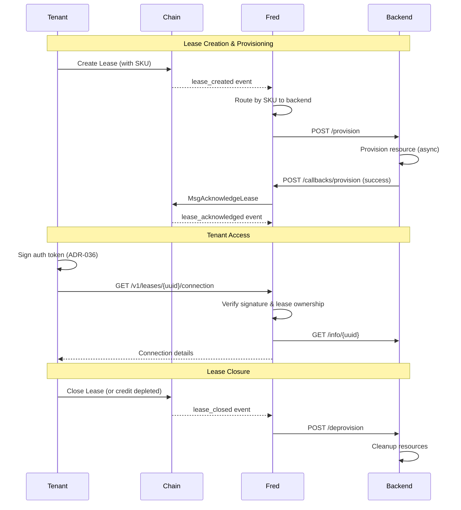

# fred - Manifest Provider Daemon

A Go daemon for Manifest Network providers that manages the complete lease lifecycle with pluggable backend integration, event-driven provisioning, and automatic resource management.

## Features

- **Lease Lifecycle Management**: Watches chain events and orchestrates provisioning through backends
- **Multi-Backend Support**: Route leases to different backends based on SKU prefix
- **Event-Driven Architecture**: Uses Watermill for internal event routing with retries and middleware
- **Tenant Authentication API**: HTTP/HTTPS API with ADR-036 signature verification for tenant access
- **Periodic Withdrawals**: Configurable scheduled withdrawal of accumulated fees from active leases
- **Credit Monitoring**: Tracks tenant credit balances and auto-closes leases when credit is depleted
- **Cross-Provider Credit Detection**: Responds to credit depletion events from other providers
- **Security**: Rate limiting, request size limits, input validation, and optional TLS

## Architecture Overview

```
                              MANIFEST CHAIN
                                    |
                                    | WebSocket (events)
                                    v
+------------------------------------------------------------------+
|                              FRED                                 |
|                                                                   |
|  +------------------+                                             |
|  | Event Subscriber |  (fan-out: each consumer gets all events)  |
|  | (WebSocket)      |-----+------------------+                    |
|  +------------------+     |                  |                    |
|                           v                  v                    |
|  +------------------+  +------------------+  +------------------+ |
|  | Event Bridge     |  | Watcher          |  | (other future    | |
|  | -> Watermill     |  | (cross-provider) |  |  consumers)      | |
|  +------------------+  +------------------+  +------------------+ |
|           |                                                       |
|           v                                                       |
|  +------------------+     +------------------+                    |
|  | Watermill Router |---->| Provision        |                    |
|  | (event routing)  |     | Manager          |                    |
|  +------------------+     +------------------+                    |
|                                   |                               |
|  +------------------+             |                               |
|  | API Server       |<------------+                               |
|  | (tenant access)  |             |                               |
|  +------------------+             v                               |
|                           +------------------+                    |
|                           | Backend Router   |                    |
|                           | (SKU routing)    |                    |
|                           +------------------+                    |
|                                   |                               |
+------------------------------------------------------------------+
                                    |
              +---------------------+---------------------+
              v                     v                     v
      +---------------+     +---------------+     +---------------+
      |  Kubernetes   |     |     GPU       |     |      VM       |
      |   Backend     |     |   Backend     |     |   Backend     |
      | (sku: k8s-*)  |     | (sku: gpu-*)  |     | (sku: vm-*)   |
      +---------------+     +---------------+     +---------------+
```

### Event Fan-Out

The Event Subscriber uses a fan-out pattern where each consumer (Event Bridge, Watcher, etc.) gets its own channel and receives **all** events independently. This ensures that:
- The provisioner never misses lease events
- The watcher always sees cross-provider credit depletion events
- New consumers can be added without affecting existing ones

## Lease Lifecycle



## Building

```bash
# Build all binaries (providerd and mock-backend)
make build

# Build only providerd
go build -o build/providerd ./cmd/providerd

# Build only mock-backend
go build -o build/mock-backend ./cmd/mock-backend
```

## Configuration

Copy the example configuration and customize:

```bash
cp config.example.yaml config.yaml
```

### Required Configuration

All required fields are validated at startup. The daemon will fail to start with a clear error message if any required configuration is missing or invalid.

| Option | Description |
|--------|-------------|
| `provider_uuid` | Your registered provider UUID (must be valid UUID format) |
| `provider_address` | Provider management address |
| `keyring_dir` | Directory containing keyring |
| `key_name` | Key name for signing transactions |
| `backends` | At least one backend must be configured |
| `callback_base_url` | URL where backends send callbacks (must be absolute http/https URL) |
| `callback_secret` | Shared secret for HMAC callback authentication (minimum 32 characters) |

### Backend Configuration

Backends are services that handle the actual resource provisioning. Each backend URL must be an absolute URL with `http://` or `https://` scheme.

```yaml
backends:
  - name: kubernetes
    url: "http://k8s-backend:9000"
    timeout: 30s
    sku_prefix: "k8s-"
    default: true  # Fallback for unmatched SKUs

  - name: gpu
    url: "http://gpu-backend:9000"
    timeout: 60s
    sku_prefix: "gpu-"

callback_base_url: "http://fred.provider.example.com:8080"
callback_secret: "your-32-character-or-longer-secret-here"
```

**Validation rules:**
- Backend names must be unique
- Backend URLs must be absolute `http://` or `https://` URLs with a host
- `callback_base_url` must be an absolute `http://` or `https://` URL
- Trailing slashes on `callback_base_url` are automatically stripped

### Full Configuration Reference

| Option | Description | Default |
|--------|-------------|---------|
| `chain_id` | Chain identifier | `manifest-1` |
| `grpc_endpoint` | Chain gRPC endpoint | `localhost:9090` |
| `websocket_url` | CometBFT WebSocket URL | `ws://localhost:26657/websocket` |
| `provider_uuid` | Your registered provider UUID | (required) |
| `provider_address` | Provider management address | (required) |
| `keyring_backend` | Keyring backend (file, os, test) | `file` |
| `keyring_dir` | Directory containing keyring | (required) |
| `key_name` | Key name for signing transactions | (required) |
| `api_listen_addr` | API server listen address | `:8080` |
| `withdraw_interval` | How often to withdraw funds | `1h` |
| `bech32_prefix` | Address prefix for validation | `manifest` |
| `rate_limit_rps` | Global API rate limit (requests/second) | `10` |
| `rate_limit_burst` | Global rate limit burst size | `20` |
| `tenant_rate_limit_rps` | Per-tenant rate limit (requests/second) | `5` |
| `tenant_rate_limit_burst` | Per-tenant burst size | `10` |
| `trusted_proxies` | CIDR blocks of trusted proxies for X-Forwarded-For | `[]` |
| `backends` | List of backend configurations | (required) |
| `callback_base_url` | Base URL for backend callbacks | (required) |
| `callback_secret` | HMAC secret for callback authentication (min 32 chars) | (required) |
| `reconciliation_interval` | How often to run reconciliation | `5m` |
| `token_tracker_db_path` | Path to bbolt database for token replay protection | (optional) |
| `payload_store_db_path` | Path to bbolt database for payload storage | (optional) |
| `payload_store_ttl` | TTL for stored payloads | `1h` |
| `payload_store_cleanup_freq` | How often to clean up expired payloads | `10m` |
| `max_request_body_size` | Maximum request body size in bytes | `1048576` (1MB) |

### Advanced Configuration

These options have sensible defaults but can be tuned for specific environments:

| Option | Description | Default |
|--------|-------------|---------|
| `http_read_timeout` | HTTP server read timeout | `15s` |
| `http_write_timeout` | HTTP server write timeout | `15s` |
| `http_idle_timeout` | HTTP server idle timeout | `60s` |
| `websocket_ping_interval` | WebSocket ping interval | `30s` |
| `websocket_reconnect_initial` | Initial WebSocket reconnect delay | `1s` |
| `websocket_reconnect_max` | Maximum WebSocket reconnect delay | `60s` |
| `tx_poll_interval` | Transaction confirmation poll interval | `500ms` |
| `tx_timeout` | Transaction confirmation timeout | `30s` |
| `query_page_limit` | Page size for chain queries | `100` |
| `max_withdraw_iterations` | Max iterations for withdrawal batching | `100` |
| `gas_limit` | Gas limit for transactions | `500000` |
| `gas_price` | Gas price (in smallest denom) | `25` |
| `fee_denom` | Fee denomination | `umfx` |
| `credit_check_error_threshold` | Errors before disabling credit monitoring | `3` |
| `credit_check_retry_interval` | Retry interval after credit check errors | `30s` |

### TLS Configuration

**API Server TLS:**
```yaml
tls_cert_file: "/path/to/cert.pem"
tls_key_file: "/path/to/key.pem"
```

**gRPC to Chain TLS:**
```yaml
grpc_tls_enabled: true
grpc_tls_ca_file: "/path/to/ca.pem"  # Optional, uses system CAs if empty
grpc_tls_skip_verify: false          # For testing only
```

### Environment Variables

All options can be set via environment variables with the `PROVIDER_` prefix:

```bash
export PROVIDER_CHAIN_ID=manifest-1
export PROVIDER_PROVIDER_UUID=01234567-89ab-cdef-0123-456789abcdef
export PROVIDER_CALLBACK_BASE_URL=http://fred.example.com:8080
```

## Usage

```bash
# Run with config file
./build/providerd -c config.yaml

# Or use environment variables
./build/providerd
```

## API Endpoints

### Health Check

```
GET /health
```

Returns server health status including chain connectivity.

**Response:**
```json
{
  "status": "healthy",
  "provider_uuid": "01234567-89ab-cdef-0123-456789abcdef",
  "checks": {
    "chain": {"status": "healthy"}
  }
}
```

### Get Lease Connection

```
GET /v1/leases/{lease_uuid}/connection
Authorization: Bearer <token>
```

Returns connection details for an active lease from the backend. Requires ADR-036 signed authentication token.

**Token Format** (base64-encoded JSON):
```json
{
  "tenant": "manifest1...",
  "lease_uuid": "...",
  "timestamp": 1234567890,
  "pub_key": "<base64-encoded-pubkey>",
  "signature": "<base64-encoded-signature>"
}
```

**Response:**
```json
{
  "lease_uuid": "...",
  "tenant": "manifest1...",
  "provider_uuid": "...",
  "connection": {
    "host": "compute-alpha.example.com",
    "port": 8443,
    "protocol": "https",
    "metadata": {
      "region": "us-east-1",
      "backend": "kubernetes"
    }
  }
}
```

### Get Lease Status

```
GET /v1/leases/{lease_uuid}/status
Authorization: Bearer <token>
```

Returns the current provisioning status of a lease. Useful for checking if provisioning is in progress or complete.

**Response:**
```json
{
  "lease_uuid": "550e8400-e29b-41d4-a716-446655440000",
  "state": "PENDING",
  "requires_payload": true,
  "payload_received": false,
  "provisioning_started": false
}
```

**Fields:**
- `state` - Chain lease state (PENDING, ACTIVE, CLOSED, EXPIRED)
- `requires_payload` - True if lease has meta_hash (expects payload upload)
- `payload_received` - True if payload has been uploaded
- `provisioning_started` - True if provisioning is in progress

### Upload Payload

```
POST /v1/leases/{lease_uuid}/data
Authorization: Bearer <token>
Content-Type: application/octet-stream

<raw payload bytes>
```

Upload deployment configuration for a lease that was created with a `meta_hash`. The payload is validated against the on-chain hash before provisioning starts.

**Token Format** (base64-encoded JSON):
```json
{
  "tenant": "manifest1...",
  "lease_uuid": "...",
  "meta_hash": "abc123...",
  "timestamp": 1234567890,
  "pub_key": "<base64-encoded-pubkey>",
  "signature": "<base64-encoded-signature>"
}
```

The signed message format is: `manifest lease data {lease_uuid} {meta_hash_hex} {unix_timestamp}`

**Response Codes:**
- `202 Accepted` - Payload received, provisioning started
- `400 Bad Request` - Invalid payload or hash mismatch
- `401 Unauthorized` - Invalid signature or token
- `404 Not Found` - Lease not found or not PENDING
- `409 Conflict` - Payload already received

### Provision Callback (Backend -> Fred)

```
POST /callbacks/provision
Content-Type: application/json
X-Fred-Signature: sha256=<hmac-sha256-hex>
```

Called by backends to report provisioning status. Requires HMAC-SHA256 authentication.

**Authentication:**
The `X-Fred-Signature` header must contain an HMAC-SHA256 signature of the request body, using the shared `callback_secret`. Format: `sha256=<hex-encoded-signature>`.

**Request:**
```json
{
  "lease_uuid": "...",
  "status": "success",
  "error": ""
}
```

Status must be either `"success"` or `"failed"`.

**Response Codes:**
- `200 OK` - Callback processed successfully
- `401 Unauthorized` - Missing or invalid signature

## Backend API Specification

Any backend must implement these HTTP endpoints:

### POST /provision

Start provisioning a resource (async).

**Request:**
```json
{
  "lease_uuid": "550e8400-e29b-41d4-a716-446655440000",
  "tenant": "manifest1abc...",
  "provider_uuid": "01234567-89ab-cdef-0123-456789abcdef",
  "sku": "k8s-small",
  "callback_url": "http://fred.example.com:8080/callbacks/provision",
  "payload": "<base64-encoded-bytes>",
  "payload_hash": "abc123..."
}
```

**Response:** `202 Accepted`
```json
{
  "provision_id": "..."
}
```

### GET /info/{lease_uuid}

Get lease information for a provisioned resource.

**Response:** `200 OK`
```json
{
  "host": "10.0.0.1",
  "port": 8080,
  "protocol": "https",
  "credentials": {"token": "..."},
  "metadata": {"region": "us-east-1"},
  "custom_field": "any additional backend-specific data"
}
```

The response can contain any JSON fields the backend wants to return.

**Response:** `404 Not Found` if not provisioned.

### POST /deprovision

Deprovision a resource (idempotent).

**Request:**
```json
{
  "lease_uuid": "550e8400-e29b-41d4-a716-446655440000"
}
```

**Response:** `200 OK`

### GET /provisions

List all provisions (for reconciliation).

**Response:**
```json
{
  "provisions": [
    {
      "lease_uuid": "...",
      "status": "ready",
      "created_at": "2024-01-15T10:30:00Z"
    }
  ]
}
```

## Running E2E Tests with Mock Backend

The mock backend allows you to test fred's provisioning flow without a real backend. It supports concurrent provisions with per-lease callback routing.

### 1. Start the Mock Backend

```bash
# Build mock-backend
make build-mock

# Run with required callback secret
MOCK_BACKEND_CALLBACK_SECRET="test-secret-at-least-32-characters-long" ./build/mock-backend

# Or with custom settings
MOCK_BACKEND_ADDR=:9001 \
MOCK_BACKEND_NAME=test-backend \
MOCK_BACKEND_DELAY=2s \
MOCK_BACKEND_CALLBACK_SECRET="test-secret-at-least-32-characters-long" \
./build/mock-backend
```

**Environment Variables:**

| Variable | Description | Default |
|----------|-------------|---------|
| `MOCK_BACKEND_ADDR` | Listen address | `:9000` |
| `MOCK_BACKEND_NAME` | Backend name (in responses) | `mock-backend` |
| `MOCK_BACKEND_DELAY` | Simulated provisioning delay | `0s` |
| `MOCK_BACKEND_TLS_SKIP_VERIFY` | Skip TLS verification for callbacks (use `true` for self-signed certs) | `false` |
| `MOCK_BACKEND_CALLBACK_SECRET` | HMAC secret for signing callbacks (required, min 32 chars) | (required) |

**Note:** The mock backend stores callback URLs per lease UUID, so concurrent provisions with different callback URLs are handled correctly without race conditions.

**Security Warning:** The mock backend accepts arbitrary `callback_url` values and issues HTTP requests to them, which is an SSRF risk if exposed to untrusted networks. Only run the mock backend on trusted interfaces (e.g., localhost) for local testing. Do not expose it to the internet or untrusted users.

### 2. Configure Fred

Create a config file that points to the mock backend:

```yaml
# config-test.yaml
provider_uuid: "01234567-89ab-cdef-0123-456789abcdef"
provider_address: "manifest1test..."
keyring_backend: "test"
keyring_dir: "/tmp/test-keyring"
key_name: "test"

chain_id: "test-chain"
grpc_endpoint: "localhost:9090"
websocket_url: "ws://localhost:26657/websocket"

api_listen_addr: ":8080"

backends:
  - name: mock
    url: "http://localhost:9000"
    timeout: 30s
    default: true

callback_base_url: "http://localhost:8080"
callback_secret: "test-secret-at-least-32-characters-long"
```

### 3. Run Fred

```bash
./build/providerd -c config-test.yaml
```

### 4. Test the Flow

**Check mock backend health:**
```bash
curl http://localhost:9000/health
```

**Simulate a provision request (directly to mock backend):**
```bash
curl -X POST http://localhost:9000/provision \
  -H "Content-Type: application/json" \
  -d '{
    "lease_uuid": "550e8400-e29b-41d4-a716-446655440000",
    "tenant": "manifest1abc",
    "provider_uuid": "01234567-89ab-cdef-0123-456789abcdef",
    "callback_url": "http://localhost:8080/callbacks/provision"
  }'
```

**Check provisioned resources:**
```bash
curl http://localhost:9000/provisions
```

**Get lease info:**
```bash
curl http://localhost:9000/info/550e8400-e29b-41d4-a716-446655440000
```

**Deprovision:**
```bash
curl -X POST http://localhost:9000/deprovision \
  -H "Content-Type: application/json" \
  -d '{"lease_uuid": "550e8400-e29b-41d4-a716-446655440000"}'
```

### 5. Using Docker Compose (Optional)

Create a `docker-compose.yaml` for integrated testing:

```yaml
version: '3.8'

services:
  mock-backend:
    build:
      context: .
      dockerfile: Dockerfile.mock
    environment:
      - MOCK_BACKEND_ADDR=:9000
      - MOCK_BACKEND_DELAY=1s
      - MOCK_BACKEND_CALLBACK_SECRET=shared-secret-at-least-32-characters
    ports:
      - "9000:9000"

  fred:
    build:
      context: .
      dockerfile: Dockerfile
    environment:
      - PROVIDER_PROVIDER_UUID=01234567-89ab-cdef-0123-456789abcdef
      - PROVIDER_API_LISTEN_ADDR=:8080
      - PROVIDER_CALLBACK_BASE_URL=http://fred:8080
      - PROVIDER_CALLBACK_SECRET=shared-secret-at-least-32-characters
    ports:
      - "8080:8080"
    depends_on:
      - mock-backend
```

## Project Structure

```
cmd/
├── providerd/          # Main daemon entry point
└── mock-backend/       # Mock backend for testing

internal/
├── adr036/             # ADR-036 signature verification
├── api/                # HTTP server, handlers, rate limiting
├── auth/               # Shared authentication utilities
├── backend/            # Backend client and router
│   ├── client.go       # HTTP client for backends
│   ├── router.go       # SKU-based routing
│   └── mock.go         # In-memory mock for unit tests
├── chain/              # gRPC client, WebSocket subscriber, signer
├── config/             # Configuration loading and validation
├── metrics/            # Prometheus metrics definitions
├── provisioner/        # Provision lifecycle management
│   ├── manager.go      # Watermill handlers
│   └── bridge.go       # Chain events -> Watermill
├── scheduler/          # Periodic withdrawal and credit monitoring
├── testutil/           # Test fixtures and helpers
├── util/               # Shared utility functions
└── watcher/            # Cross-provider event detection
```

## Reconciliation

Fred uses **level-triggered reconciliation** to ensure consistency between chain state and backend state. This provides crash recovery without requiring durable event queues.

### How It Works

Instead of replaying missed events (edge-triggered), reconciliation queries current state:

```
Chain State (leases)     Backend State (provisions)
        │                          │
        └──────────┬───────────────┘
                   │
                   ▼
            Reconciler compares
                   │
        ┌──────────┼──────────┐
        ▼          ▼          ▼
    PENDING     ACTIVE      CLOSED
    + not      + not       + still
    provisioned provisioned provisioned
        │          │          │
        ▼          ▼          ▼
     Start      Anomaly:   Deprovision
   provisioning  log &      (orphan
                provision   cleanup)
```

### Reconciliation Triggers

1. **Startup**: Full reconciliation runs immediately on startup
2. **Periodic**: Runs every `reconciliation_interval` (default: 5 minutes)
3. **Cross-provider credit depletion**: Triggers withdrawal which may close leases

### State Matrix

| Chain State | Backend State | Action |
|-------------|---------------|--------|
| PENDING + meta_hash | Not provisioned | Await payload upload |
| PENDING (no hash) | Not provisioned | Start provisioning |
| PENDING | Provisioned + ready | Acknowledge lease |
| ACTIVE | Provisioned | Healthy - no action |
| ACTIVE | Not provisioned | Anomaly: provision |
| CLOSED/EXPIRED | Provisioned | Orphan: deprovision |
| Not found | Provisioned | Orphan: deprovision |

## Security Features

- **Rate Limiting**: Per-IP and per-tenant token bucket rate limiting (configurable RPS and burst)
- **Request Size Limits**: Configurable max request body size (default 1MB)
- **Input Validation**: UUID format validation on all inputs
- **Error Sanitization**: Generic error messages to clients, detailed logs server-side
- **TLS Support**: Optional HTTPS for API and TLS for gRPC
- **ADR-036 Authentication**: Cryptographic signature verification for tenant access
- **Token Expiry**: 30-second validity window on authentication tokens
- **Token Replay Protection**: Used tokens tracked in persistent database to prevent replay attacks
- **Callback Authentication**: HMAC-SHA256 signature verification for backend callbacks
- **Constant-Time Comparisons**: Hash comparisons use constant-time algorithms to prevent timing attacks
- **Security Headers**: X-Content-Type-Options, X-Frame-Options, Cache-Control headers on all responses

## Dependencies

- Go 1.24+ (uses `sync.WaitGroup.Go()`, `range` over integers)
- Watermill (event routing)
- Cosmos SDK v0.50.14
- CometBFT v0.38.x
- manifest-ledger (for billing/sku types)

## License

[Add your license here]
