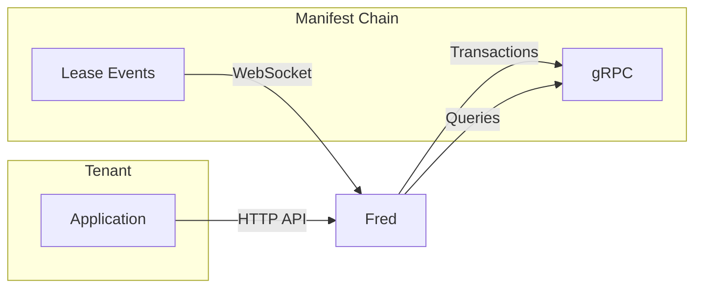
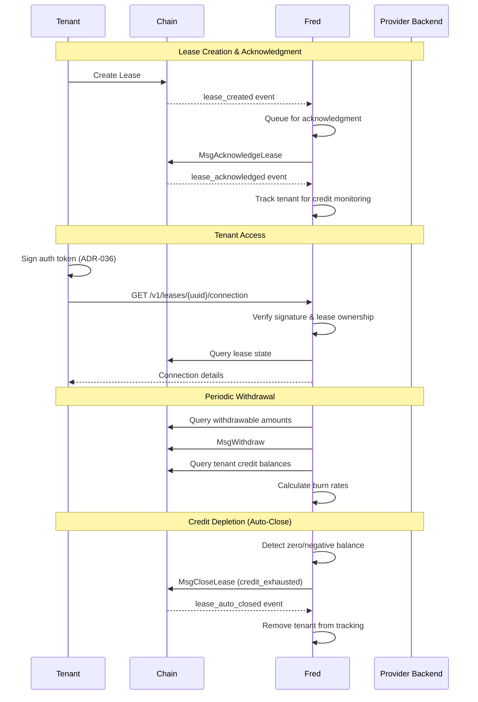
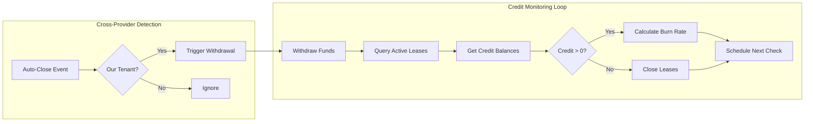

# fred - Manifest Provider Daemon

A Go daemon for Manifest Network providers that watches for lease events, auto-acknowledges them, serves a tenant authentication API, and periodically withdraws accumulated funds.

## Features

- **Lease Event Watching**: Subscribes to CometBFT WebSocket events to monitor lease creation and state changes
- **Auto-Acknowledgment**: Automatically acknowledges pending leases on startup and as they arrive
- **Tenant Authentication API**: HTTP/HTTPS API with ADR-036 signature verification for tenant access
- **Periodic Withdrawals**: Configurable scheduled withdrawal of accumulated fees from active leases
- **Credit Monitoring**: Tracks tenant credit balances and auto-closes leases when credit is depleted
- **Cross-Provider Credit Detection**: Responds to credit depletion events from other providers
- **Security**: Rate limiting, request size limits, input validation, and optional TLS for both API and gRPC

## How It Works



## Lease Lifecycle



## Credit Monitoring & Auto-Close



The burn rate calculator estimates when a tenant's credit will be depleted based on the observed spending rate between checks. This allows fred to schedule more frequent checks as depletion approaches.

> **Note**: The current implementation assumes a single denomination for credit. Multi-denom support with proportional burn rates is not yet implemented.

## Building

```bash
# Build the binary
make build

# Or directly with Go
go build -o build/providerd ./cmd/providerd
```

## Configuration

Copy the example configuration and customize:

```bash
cp config.example.yaml config.yaml
```

### Configuration Options

| Option | Description | Default |
|--------|-------------|---------|
| `chain_id` | Chain identifier | `manifest-1` |
| `grpc_endpoint` | Chain gRPC endpoint | `localhost:9090` |
| `websocket_url` | CometBFT WebSocket URL | `ws://localhost:26657/websocket` |
| `provider_uuid` | Your registered provider UUID | (required) |
| `provider_address` | Provider management address | (required) |
| `keyring_backend` | Keyring backend (file, os, test) | `file` |
| `keyring_dir` | Directory containing keyring | (required) |
| `key_name` | Key name for signing transactions | (required) |
| `api_listen_addr` | API server listen address | `:8080` |
| `withdraw_interval` | How often to withdraw funds | `1h` |
| `auto_acknowledge` | Auto-acknowledge pending leases | `true` |
| `bech32_prefix` | Address prefix for validation | `manifest` |
| `rate_limit_rps` | API rate limit (requests/second) | `10` |
| `rate_limit_burst` | Rate limit burst size | `20` |

### TLS Configuration (API)

```yaml
tls_cert_file: "/path/to/cert.pem"
tls_key_file: "/path/to/key.pem"
```

### TLS Configuration (gRPC to Chain)

```yaml
grpc_tls_enabled: true
grpc_tls_ca_file: "/path/to/ca.pem"  # Optional, uses system CAs if empty
grpc_tls_skip_verify: false          # For testing only
```

### Environment Variables

All options can be set via environment variables with the `PROVIDER_` prefix:

```bash
export PROVIDER_CHAIN_ID=manifest-1
export PROVIDER_PROVIDER_UUID=01234567-89ab-cdef-0123-456789abcdef
export PROVIDER_GRPC_TLS_ENABLED=true
```

## Usage

```bash
# Run with config file
./build/providerd -c config.yaml

# Or use environment variables
./build/providerd
```

## API Endpoints

### Health Check

```
GET /health
```

Returns server health status.

**Response:**
```json
{
  "status": "healthy",
  "provider_uuid": "01234567-89ab-cdef-0123-456789abcdef"
}
```

### Get Lease Connection

```
GET /v1/leases/{lease_uuid}/connection
Authorization: Bearer <token>
```

Returns connection details for an active lease. Requires ADR-036 signed authentication token.

**Token Format** (base64-encoded JSON):
```json
{
  "tenant": "manifest1...",
  "lease_uuid": "...",
  "timestamp": 1234567890,
  "pub_key": "<base64-encoded-pubkey>",
  "signature": "<base64-encoded-signature>"
}
```

**Response:**
```json
{
  "lease_uuid": "...",
  "tenant": "manifest1...",
  "provider_uuid": "...",
  "connection": {
    "host": "compute-alpha.example.com",
    "port": 8443,
    "protocol": "https",
    "metadata": {
      "region": "us-east-1",
      "tier": "standard",
      "instance_id": "i-1234",
      "status": "connected"
    }
  }
}
```

### Authentication

The API uses ADR-036 off-chain message signing for authentication:

1. Create message: `{tenant}:{lease_uuid}:{timestamp}`
2. Sign using ADR-036 format with your wallet
3. Base64-encode the token JSON
4. Pass as `Authorization: Bearer <token>`

Example using `manifestd`:
```bash
MESSAGE="${TENANT}:${LEASE_UUID}:$(date +%s)"
SIGNATURE=$(echo -n "$MESSAGE" | manifestd tx sign-arbitrary - --from $TENANT)
```

## Architecture

```
cmd/providerd/          # Entry point, CLI
internal/
├── adr036/             # ADR-036 signature verification
├── api/                # HTTP server, handlers, rate limiting
├── auth/               # Shared authentication utilities
├── chain/              # gRPC client, WebSocket subscriber, signer
├── config/             # Configuration loading and validation
├── scheduler/          # Periodic withdrawal and credit monitoring
├── testutil/           # Test fixtures and helpers
└── watcher/            # Lease event watcher and acknowledgment
```

## Security Features

- **Rate Limiting**: Per-IP token bucket rate limiting (configurable RPS and burst)
- **Request Size Limits**: 1MB max request body
- **Input Validation**: UUID format validation on all inputs
- **Error Sanitization**: Generic error messages to clients, detailed logs server-side
- **TLS Support**: Optional HTTPS for API and TLS for gRPC
- **ADR-036 Authentication**: Cryptographic signature verification for tenant access
- **Token Expiry**: 5-minute validity window on authentication tokens

## Dependencies

- Go 1.25+ (uses `sync.WaitGroup.Go()`, `range` over integers, iterators)
- Cosmos SDK v0.50.14
- CometBFT v0.38.x
- manifest-ledger (for billing/sku types)

## License

[Add your license here]
