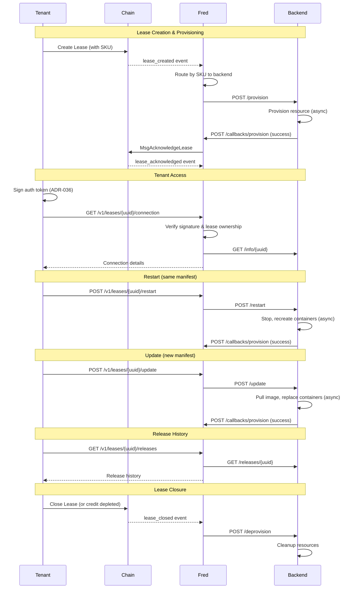

# FRED - Flexible Resource Execution Daemon

A Go daemon for Manifest Network providers that manages the complete lease lifecycle with pluggable backend integration, event-driven provisioning, and automatic resource management.

## Features

- **Lease Lifecycle Management**: Watches chain events and orchestrates provisioning through backends
- **Multi-Backend Support**: Route leases to different backends based on exact SKU UUID list, with round-robin distribution across backends sharing the same match criteria
- **Event-Driven Architecture**: Uses Watermill for internal event routing with retries and middleware
- **Tenant Authentication API**: HTTP/HTTPS API with ADR-036 signature verification for tenant access
- **Periodic Withdrawals**: Configurable scheduled withdrawal of accumulated fees from active leases
- **Credit Monitoring**: Tracks tenant credit balances and auto-closes leases when credit is depleted
- **Cross-Provider Credit Detection**: Responds to credit depletion events from other providers
- **Live Operations**: Restart containers or deploy new manifests (update) on active leases with full release history tracking
- **Security**: Rate limiting, request size limits, input validation, and optional TLS

## Architecture Overview

```
                              MANIFEST CHAIN
                                    |
                                    | WebSocket (events)
                                    v
+------------------------------------------------------------------+
|                              FRED                                 |
|                                                                   |
|  +------------------+                                             |
|  | Event Subscriber |  (fan-out: each consumer gets all events)  |
|  | (WebSocket)      |-----+------------------+                    |
|  +------------------+     |                  |                    |
|                           v                  v                    |
|  +------------------+  +------------------+  +------------------+ |
|  | Event Bridge     |  | Watcher          |  | (other future    | |
|  | -> Watermill     |  | (cross-provider) |  |  consumers)      | |
|  +------------------+  +------------------+  +------------------+ |
|           |                                                       |
|           v                                                       |
|  +------------------+     +------------------+                    |
|  | Watermill Router |---->| Provision        |                    |
|  | (event routing)  |     | Manager          |                    |
|  +------------------+     +------------------+                    |
|                                   |                               |
|  +------------------+             |                               |
|  | API Server       |<------------+                               |
|  | (tenant access)  |             |                               |
|  +------------------+             v                               |
|                           +------------------+                    |
|                           | Backend Router   |                    |
|                           | (SKU routing +   |                    |
|                           |  round-robin)    |                    |
|                           +------------------+                    |
|                                   |                               |
+------------------------------------------------------------------+
                                    |
              +---------------------+---------------------+
              v                     v                     v
      +---------------+     +---------------+     +---------------+
      |   Docker-1    |     |   Docker-2    |     |   Docker-3    |
      |   Backend     |     |   Backend     |     |   Backend     |
      | (skus: [uuid])|     | (skus: [uuid])|     | (skus: [uuid])|
      +---------------+     +---------------+     +---------------+
```

### Event Fan-Out

The Event Subscriber uses a fan-out pattern where each consumer (Event Bridge, Watcher, etc.) gets its own channel and receives **all** events independently. This ensures that:
- The provisioner never misses lease events
- The watcher always sees cross-provider credit depletion events
- New consumers can be added without affecting existing ones

## Lease Lifecycle



## Building

```bash
# Build all binaries (providerd, mock-backend, docker-backend)
make build

# Build only providerd
go build -o build/providerd ./cmd/providerd

# Build only mock-backend
go build -o build/mock-backend ./cmd/mock-backend

# Build only docker-backend
go build -o build/docker-backend ./cmd/docker-backend
```

## Configuration

Copy the example configuration and customize:

```bash
cp config.example.yaml config.yaml
```

### Required Configuration

All required fields are validated at startup. The daemon will fail to start with a clear error message if any required configuration is missing or invalid.

| Option | Description |
|--------|-------------|
| `provider_uuid` | Your registered provider UUID (must be valid UUID format) |
| `provider_address` | Provider management address |
| `keyring_dir` | Directory containing keyring |
| `key_name` | Key name for signing transactions |
| `backends` | At least one backend must be configured (multiple backends may share `skus` for round-robin) |
| `callback_base_url` | URL where backends send callbacks (must be absolute http/https URL) |
| `callback_secret` | Shared secret for HMAC callback authentication (minimum 32 characters) |

### Backend Configuration

Backends are services that handle the actual resource provisioning. Each backend URL must be an absolute URL with `http://` or `https://` scheme.

Leases are routed to backends using the **`skus`** field — an exact list of on-chain SKU UUIDs. A backend with no `skus` matches nothing (use `default: true` for fallback). When multiple backends match the same SKU, provisions are distributed across them using round-robin.

```yaml
backends:
  # Give every backend the same skus list so they all match,
  # then round-robin distributes evenly across them.
  - name: docker-1
    url: "http://10.0.0.1:9000"
    skus:
      - "a1b2c3d4-e5f6-7890-abcd-1234567890ab"
      - "b2c3d4e5-f6a7-8901-bcde-2345678901bc"
    default: true

  - name: docker-2
    url: "http://10.0.0.2:9000"
    skus:
      - "a1b2c3d4-e5f6-7890-abcd-1234567890ab"
      - "b2c3d4e5-f6a7-8901-bcde-2345678901bc"

callback_base_url: "http://fred.provider.example.com:8080"
callback_secret: "your-32-character-or-longer-secret-here"

# Required for round-robin setups (multiple backends sharing match criteria).
# Records which backend serves each lease so reads hit the right machine.
# placement_store_db_path: "/var/lib/fred/placements.db"
```

**Validation rules:**
- Backend names must be unique
- Backend URLs must be absolute `http://` or `https://` URLs with a host
- `callback_base_url` must be an absolute `http://` or `https://` URL
- Trailing slashes on `callback_base_url` are automatically stripped

### Full Configuration Reference

| Option | Description | Default |
|--------|-------------|---------|
| `log_level` | Log verbosity (debug, info, warn, error) | `info` |
| `production_mode` | Enforce security requirements at startup (TLS, replay protection, SSRF) | `false` |
| `chain_id` | Chain identifier | `manifest-1` |
| `grpc_endpoint` | Chain gRPC endpoint | `localhost:9090` |
| `websocket_url` | CometBFT WebSocket URL | `ws://localhost:26657/websocket` |
| `provider_uuid` | Your registered provider UUID | (required) |
| `provider_address` | Provider management address | (required) |
| `keyring_backend` | Keyring backend (file, os, test) | `file` |
| `keyring_dir` | Directory containing keyring | (required) |
| `key_name` | Key name for signing transactions | (required) |
| `api_listen_addr` | API server listen address | `:8080` |
| `withdraw_interval` | How often to withdraw funds | `1h` |
| `bech32_prefix` | Address prefix for validation | `manifest` |
| `rate_limit_rps` | Global API rate limit (requests/second) | `10` |
| `rate_limit_burst` | Global rate limit burst size | `20` |
| `tenant_rate_limit_rps` | Per-tenant rate limit (requests/second) | `5` |
| `tenant_rate_limit_burst` | Per-tenant burst size | `10` |
| `trusted_proxies` | CIDR blocks of trusted proxies for X-Forwarded-For | `[]` |
| `backends` | List of backend configurations | (required) |
| `callback_base_url` | Base URL for backend callbacks | (required) |
| `callback_secret` | HMAC secret for callback authentication (min 32 chars) | (required) |
| `reconciliation_interval` | How often to run reconciliation | `5m` |
| `token_tracker_db_path` | Path to bbolt database for token replay protection | (optional; required if `production_mode`) |
| `payload_store_db_path` | Path to bbolt database for payload storage | (optional) |
| `placement_store_db_path` | Path to bbolt database for lease→backend placement tracking (required for round-robin) | (optional) |
| `max_request_body_size` | Maximum request body size in bytes | `1048576` (1MB) |

> **Note:** The Docker backend has additional configuration (`releases_db_path`, `releases_max_age`, `container_stop_timeout`, etc.) documented in `docker-backend.example.yaml`.

### Advanced Configuration

These options have sensible defaults but can be tuned for specific environments:

| Option | Description | Default |
|--------|-------------|---------|
| `http_read_timeout` | HTTP server read timeout | `15s` |
| `http_write_timeout` | HTTP server write timeout | `15s` |
| `http_idle_timeout` | HTTP server idle timeout | `60s` |
| `websocket_ping_interval` | WebSocket ping interval | `30s` |
| `websocket_reconnect_initial` | Initial WebSocket reconnect delay | `1s` |
| `websocket_reconnect_max` | Maximum WebSocket reconnect delay | `60s` |
| `tx_poll_interval` | Transaction confirmation poll interval | `500ms` |
| `tx_timeout` | Transaction confirmation timeout | `30s` |
| `query_page_limit` | Page size for chain queries | `100` |
| `max_withdraw_iterations` | Max iterations for withdrawal batching | `100` |
| `gas_limit` | Gas limit for transactions | `1500000` |
| `gas_price` | Gas price (in smallest denom) | `25` |
| `fee_denom` | Fee denomination | `umfx` |
| `credit_check_error_threshold` | Errors before disabling credit monitoring | `3` |
| `credit_check_retry_interval` | Retry interval after credit check errors | `30s` |
| `shutdown_timeout` | Maximum time for graceful shutdown (drain + cleanup) | `30s` |

### TLS Configuration

See [SECURITY.md](SECURITY.md#transport-security) for TLS configuration details (API server HTTPS, gRPC to chain).

### Environment Variables

All options can be set via environment variables with the `PROVIDER_` prefix:

```bash
export PROVIDER_CHAIN_ID=manifest-1
export PROVIDER_PROVIDER_UUID=01234567-89ab-cdef-0123-456789abcdef
export PROVIDER_CALLBACK_BASE_URL=http://fred.example.com:8080
```

## Usage

```bash
# Run with config file
./build/providerd -c config.yaml

# Or use environment variables
./build/providerd

# Print version
./build/providerd --version
```

## API Endpoints

### Endpoint Reference

#### Tenant API

| Method | Path | Auth | Replay | Lease State | Notes |
|--------|------|------|--------|-------------|-------|
| `GET` | `/v1/leases/{uuid}/connection` | ADR-036 | Yes | Active | Returns sensitive connection details |
| `GET` | `/v1/leases/{uuid}/status` | ADR-036 | No | Any | Idempotent read |
| `GET` | `/v1/leases/{uuid}/provision` | ADR-036 | No | Any | Idempotent read |
| `GET` | `/v1/leases/{uuid}/logs` | ADR-036 | No | Any | Idempotent read |
| `GET` | `/v1/leases/{uuid}/releases` | ADR-036 | No | Any | Idempotent read |
| `POST` | `/v1/leases/{uuid}/data` | ADR-036 | No | Pending | Has own idempotency (409 on duplicate) |
| `POST` | `/v1/leases/{uuid}/restart` | ADR-036 | Yes | Active | Mutating — replaying would restart again |
| `POST` | `/v1/leases/{uuid}/update` | ADR-036 | Yes | Active | Mutating — replaying would redeploy again |
| `GET` | `/v1/leases/{uuid}/events` | ADR-036 | No | Any | WebSocket stream of lease status events |

#### Operational

| Method | Path | Auth | Notes |
|--------|------|------|-------|
| `GET` | `/health` | None | Chain connectivity, backend health, DB health |
| `GET` | `/metrics` | None | Prometheus metrics |
| `POST` | `/callbacks/provision` | HMAC-SHA256 | Backend → Fred callback (5-min replay window) |

See [SECURITY.md](SECURITY.md) for replay protection rationale per endpoint.

### Health Check

```
GET /health
```

Returns server health status including chain connectivity.

**Response:**
```json
{
  "status": "healthy",
  "provider_uuid": "01234567-89ab-cdef-0123-456789abcdef",
  "checks": {
    "chain": {"status": "healthy"}
  }
}
```

### Get Lease Connection

```
GET /v1/leases/{lease_uuid}/connection
Authorization: Bearer <token>
```

Returns connection details for an active lease from the backend. Requires ADR-036 signed bearer token. See [SECURITY.md](SECURITY.md#tenant-authentication-adr-036) for token format and signing details.

**Response (single instance):**
```json
{
  "lease_uuid": "...",
  "tenant": "manifest1...",
  "provider_uuid": "...",
  "connection": {
    "host": "compute-alpha.example.com",
    "ports": {
      "8080/tcp": {"host_ip": "0.0.0.0", "host_port": 32768},
      "443/tcp": {"host_ip": "0.0.0.0", "host_port": 32769}
    },
    "protocol": "https",
    "metadata": {
      "region": "us-east-1",
      "backend": "kubernetes"
    }
  }
}
```

**Response (multi-instance lease):**
```json
{
  "lease_uuid": "...",
  "tenant": "manifest1...",
  "provider_uuid": "...",
  "connection": {
    "host": "compute-alpha.example.com",
    "instances": [
      {
        "instance_index": 0,
        "container_id": "abc123",
        "image": "nginx:latest",
        "status": "running",
        "ports": {"80/tcp": {"host_ip": "0.0.0.0", "host_port": 32768}}
      },
      {
        "instance_index": 1,
        "container_id": "def456",
        "image": "redis:alpine",
        "status": "running",
        "ports": {"6379/tcp": {"host_ip": "0.0.0.0", "host_port": 32769}}
      }
    ],
    "metadata": {"backend": "docker"}
  }
}
```

**Fields:**
- `ports` - Map of container port to host binding (e.g., "8080/tcp" → host_port 32768)
- `instances` - Array of per-instance details for multi-container leases (each with its own ports)
- `metadata` - Additional backend-specific data

### Get Lease Status

```
GET /v1/leases/{lease_uuid}/status
Authorization: Bearer <token>
```

Returns the current provisioning status of a lease. Useful for checking if provisioning is in progress or complete.

**Response:**
```json
{
  "lease_uuid": "550e8400-e29b-41d4-a716-446655440000",
  "state": "PENDING",
  "requires_payload": true,
  "payload_received": false,
  "provisioning_started": false
}
```

**Fields:**
- `state` - Chain lease state (PENDING, ACTIVE, CLOSED, EXPIRED)
- `requires_payload` - True if lease has meta_hash (expects payload upload)
- `payload_received` - True if payload has been uploaded
- `provisioning_started` - True if provisioning is in progress

### Get Provision Diagnostics

```
GET /v1/leases/{lease_uuid}/provision
Authorization: Bearer <token>
```

Returns provision diagnostics for a lease, including status, error details, and failure count. Works for both active and non-active leases (e.g., after rejection or closure), falling back to persisted diagnostics when the provision is no longer in memory.

**Response:**
```json
{
  "lease_uuid": "550e8400-e29b-41d4-a716-446655440000",
  "tenant": "manifest1abc...",
  "provider_uuid": "01234567-89ab-cdef-0123-456789abcdef",
  "status": "failed",
  "fail_count": 3,
  "last_error": "container exited with code 1 (OOM killed)"
}
```

**Fields:**
- `status` - Provision status: `provisioning`, `ready`, `failed`, `restarting`, `updating`, or `unknown`
- `fail_count` - Number of provision attempts that failed
- `last_error` - Detailed error message (only present on failure)

**Response Codes:**
- `200 OK` - Provision found
- `401 Unauthorized` - Invalid signature or token
- `403 Forbidden` - Lease does not belong to this tenant
- `404 Not Found` - Provision not found (never provisioned or diagnostics expired)

### Get Container Logs

```
GET /v1/leases/{lease_uuid}/logs?tail=100
Authorization: Bearer <token>
```

Returns container logs for a lease. Works for both active and non-active leases, falling back to persisted logs when the provision is no longer in memory.

**Query Parameters:**
- `tail` - Number of log lines to return per container (default: 100, max: 10000)

**Response:**
```json
{
  "lease_uuid": "550e8400-e29b-41d4-a716-446655440000",
  "tenant": "manifest1abc...",
  "provider_uuid": "01234567-89ab-cdef-0123-456789abcdef",
  "logs": {
    "0": "2024-01-15 Starting nginx...\nListening on port 80\n",
    "1": "2024-01-15 Redis ready\n"
  }
}
```

**Fields:**
- `logs` - Map of container instance index to log output

**Response Codes:**
- `200 OK` - Logs found
- `400 Bad Request` - Invalid tail parameter (negative, zero, or exceeds max)
- `401 Unauthorized` - Invalid signature or token
- `403 Forbidden` - Lease does not belong to this tenant
- `404 Not Found` - Provision not found (never provisioned or logs expired)

### Upload Payload

```
POST /v1/leases/{lease_uuid}/data
Authorization: Bearer <token>
Content-Type: application/octet-stream

<raw payload bytes>
```

Upload deployment configuration for a lease that was created with a `meta_hash`. The payload is validated against the on-chain hash before provisioning starts. Requires a payload-specific ADR-036 token that includes the `meta_hash` field. See [SECURITY.md](SECURITY.md#tenant-authentication-adr-036) for token details.

**Response Codes:**
- `202 Accepted` - Payload received, provisioning started
- `400 Bad Request` - Invalid payload or hash mismatch
- `401 Unauthorized` - Invalid signature or token
- `404 Not Found` - Lease not found or not PENDING
- `409 Conflict` - Payload already received

### Restart Lease

```
POST /v1/leases/{lease_uuid}/restart
Authorization: Bearer <token>
```

Restart containers for a lease without changing the manifest. Containers are stopped, removed, and recreated with the same configuration. Volumes are preserved. Allowed from `ready` or `failed` state.

**Response:** `202 Accepted`
```json
{
  "status": "restarting"
}
```

**Response Codes:**
- `202 Accepted` - Restart initiated
- `401 Unauthorized` - Invalid signature or token
- `403 Forbidden` - Lease does not belong to this tenant
- `404 Not Found` - Lease not provisioned
- `409 Conflict` - Lease is in a state that cannot be restarted (e.g., already restarting or updating)

### Update Lease

```
POST /v1/leases/{lease_uuid}/update
Authorization: Bearer <token>
Content-Type: application/json

{
  "payload": "<base64-encoded-manifest>"
}
```

Deploy a new manifest for a lease, replacing containers with a new image/configuration. The old containers are stopped, new ones are created from the updated manifest, and old containers are cleaned up after verification. On failure, the operation rolls back to the previous containers. Volumes are preserved.

**Response:** `202 Accepted`
```json
{
  "status": "updating"
}
```

**Response Codes:**
- `202 Accepted` - Update initiated
- `400 Bad Request` - Invalid payload or manifest validation error
- `401 Unauthorized` - Invalid signature or token
- `403 Forbidden` - Lease does not belong to this tenant
- `404 Not Found` - Lease not provisioned
- `409 Conflict` - Lease is in a state that cannot be updated (e.g., currently restarting)

### Get Release History

```
GET /v1/leases/{lease_uuid}/releases
Authorization: Bearer <token>
```

Returns the release (deployment) history for a lease, showing each version that was deployed.

**Response:**
```json
{
  "lease_uuid": "550e8400-e29b-41d4-a716-446655440000",
  "tenant": "manifest1abc...",
  "provider_uuid": "01234567-89ab-cdef-0123-456789abcdef",
  "releases": [
    {
      "version": 1,
      "image": "nginx:1.24",
      "status": "superseded",
      "created_at": "2024-01-15T10:30:00Z",
      "manifest": "<base64-encoded-manifest>"
    },
    {
      "version": 2,
      "image": "nginx:1.25",
      "status": "active",
      "created_at": "2024-01-16T14:00:00Z",
      "manifest": "<base64-encoded-manifest>"
    }
  ]
}
```

**Fields:**
- `version` - Monotonically increasing version number
- `image` - Container image used in this release
- `status` - Release status: `deploying`, `active`, `superseded`, or `failed`
- `created_at` - When this release was created
- `error` - Error message (only present on failed releases)
- `manifest` - The manifest payload used for this release

**Response Codes:**
- `200 OK` - Releases found (may be an empty array)
- `401 Unauthorized` - Invalid signature or token
- `403 Forbidden` - Lease does not belong to this tenant
- `404 Not Found` - Lease not provisioned

### Stream Lease Events (WebSocket)

```
GET /v1/leases/{lease_uuid}/events
Authorization: Bearer <token>
```

Opens a WebSocket connection for real-time lease status updates. Events are pushed as JSON frames when the lease transitions between provisioning states (e.g., `provisioning`, `ready`, `failed`, `restarting`, `updating`).

**Authentication:** Bearer token via the `Authorization` header or the `?token=` query parameter (since the WebSocket API cannot set custom headers during upgrade). Auth is verified before the WebSocket upgrade, so failures return standard HTTP error responses.

**Response:** `101 Switching Protocols` on successful upgrade

```json
{"lease_uuid":"...","status":"ready","timestamp":"2024-01-15T10:30:00Z"}
{"lease_uuid":"...","status":"restarting","timestamp":"2024-01-15T10:31:00Z"}
{"lease_uuid":"...","status":"ready","timestamp":"2024-01-15T10:31:30Z"}
```

**Behavior:**
- Events are delivered as WebSocket JSON frames
- The server sends WebSocket ping frames every 30 seconds; the client must respond with pong within 40 seconds or the connection is closed
- Slow clients that fall behind have events dropped — use the REST endpoints (`/status`, `/releases`) to catch up
- The stream ends when the client disconnects or the server shuts down (clean close frame)

**Response Codes (before upgrade):**
- `101 Switching Protocols` - WebSocket connection established
- `401 Unauthorized` - Invalid signature or token
- `403 Forbidden` - Lease does not belong to this tenant
- `501 Not Implemented` - Events not enabled on this deployment

### Provision Callback (Backend -> Fred)

```
POST /callbacks/provision
Content-Type: application/json
X-Fred-Signature: t=<unix-timestamp>,sha256=<hmac-sha256-hex>
```

Called by backends to report provisioning status. Requires HMAC-SHA256 authentication via the `X-Fred-Signature` header. See [SECURITY.md](SECURITY.md#callback-authentication-hmac-sha256) for signing details and replay protection.

**Request:**
```json
{
  "lease_uuid": "...",
  "status": "success",
  "error": ""
}
```

Status must be either `"success"` or `"failed"`.

**Response Codes:**
- `200 OK` - Callback processed successfully (or already processed)
- `401 Unauthorized` - Missing or invalid signature

**Idempotency:**
If a callback is received for a lease that has already been processed (no longer in-flight),
the server returns `200 OK` with a body indicating the duplicate status:

```json
{
  "status": "already_processed",
  "message": "callback for this lease was already handled"
}
```

This allows backends to distinguish between successful processing and duplicate callbacks
for debugging purposes, while maintaining idempotent semantics.

## Backend API Specification

Any backend must implement these HTTP endpoints. For a comprehensive implementation guide including SKU handling, callback signing, state management, and reconciliation, see [BACKEND_GUIDE.md](BACKEND_GUIDE.md).

### Endpoint Reference

All endpoints except `/health`, `/stats`, and `/metrics` require HMAC-SHA256 signature authentication via the `X-Fred-Signature` header.

#### Required

| Method | Path | Auth | Description |
|--------|------|------|-------------|
| `POST` | `/provision` | HMAC | Create resource (async, callback on completion) |
| `POST` | `/deprovision` | HMAC | Remove resource (idempotent) |
| `GET` | `/info/{uuid}` | HMAC | Connection details (host, ports) |
| `GET` | `/provisions` | HMAC | List all provisions (reconciliation) |
| `GET` | `/provisions/{uuid}` | HMAC | Provision diagnostics (status, errors) |
| `GET` | `/logs/{uuid}` | HMAC | Container logs |
| `GET` | `/health` | None | Health check |

#### Optional

| Method | Path | Auth | Description |
|--------|------|------|-------------|
| `POST` | `/restart` | HMAC | Restart containers (async, callback on completion) |
| `POST` | `/update` | HMAC | Deploy new manifest (async, callback on completion) |
| `GET` | `/releases/{uuid}` | HMAC | Release history |
| `GET` | `/stats` | None | Resource capacity and usage |
| `GET` | `/metrics` | None | Prometheus metrics |

### POST /provision

Start provisioning a resource (async).

**Request:**
```json
{
  "lease_uuid": "550e8400-e29b-41d4-a716-446655440000",
  "tenant": "manifest1abc...",
  "provider_uuid": "01234567-89ab-cdef-0123-456789abcdef",
  "items": [
    {"sku": "k8s-small", "quantity": 2},
    {"sku": "k8s-large", "quantity": 1}
  ],
  "callback_url": "http://fred.example.com:8080/callbacks/provision",
  "payload": "<base64-encoded-bytes>",
  "payload_hash": "abc123..."
}
```

**Fields:**
- `items` - Array of lease items with SKU and quantity. All items belong to the same provider.
- `payload` - Optional base64-encoded deployment payload (only present if lease has meta_hash)
- `payload_hash` - Optional hex-encoded SHA-256 hash of payload (only present with payload)

**Response:** `202 Accepted`
```json
{
  "provision_id": "..."
}
```

### GET /info/{lease_uuid}

Get lease information for a provisioned resource.

**Response:** `200 OK`
```json
{
  "host": "10.0.0.1",
  "ports": {
    "8080/tcp": {"host_ip": "0.0.0.0", "host_port": "32768"},
    "443/tcp": {"host_ip": "0.0.0.0", "host_port": "32769"}
  },
  "protocol": "https",
  "metadata": {"region": "us-east-1"},
  "custom_field": "any additional backend-specific data"
}
```

**Known Fields** (extracted by fred into structured response):
- `host` - Hostname or IP for connecting to the resource
- `ports` - Map of container ports to host bindings
- `protocol` - Connection protocol (e.g., "https", "ssh")
- `metadata` - Additional key-value metadata

Any additional fields are passed through to the tenant in the `metadata` section.

**Response:** `404 Not Found` if not provisioned.

### POST /deprovision

Deprovision a resource (idempotent).

**Request:**
```json
{
  "lease_uuid": "550e8400-e29b-41d4-a716-446655440000"
}
```

**Response:** `200 OK`

### GET /provisions/{lease_uuid}

Get provision diagnostics for a specific lease.

**Response:** `200 OK`
```json
{
  "lease_uuid": "550e8400-e29b-41d4-a716-446655440000",
  "provider_uuid": "01234567-89ab-cdef-0123-456789abcdef",
  "status": "failed",
  "fail_count": 3,
  "last_error": "container exited with code 1 (OOM killed)",
  "created_at": "2024-01-15T10:30:00Z"
}
```

**Response:** `404 Not Found` if not provisioned.

### GET /logs/{lease_uuid}

Get container logs for a specific lease.

**Query Parameters:**
- `tail` - Number of log lines per container (default: 100)

**Response:** `200 OK`
```json
{
  "0": "2024-01-15 Starting nginx...\nListening on port 80\n",
  "1": "2024-01-15 Redis ready\n"
}
```

**Response:** `404 Not Found` if not provisioned.

### GET /provisions

List all provisions (for reconciliation).

**Response:**
```json
{
  "provisions": [
    {
      "lease_uuid": "...",
      "status": "ready",
      "created_at": "2024-01-15T10:30:00Z"
    }
  ]
}
```

### POST /restart

Restart containers for a lease without changing the manifest (async).

**Request:**
```json
{
  "lease_uuid": "550e8400-e29b-41d4-a716-446655440000",
  "callback_url": "http://fred.example.com:8080/callbacks/provision"
}
```

**Response:** `202 Accepted`
```json
{
  "status": "restarting"
}
```

**Error Responses:**
- `404 Not Found` - Lease not provisioned
- `409 Conflict` - Invalid state for restart (e.g., already restarting or updating)

### POST /update

Deploy a new manifest for a lease, replacing containers (async).

**Request:**
```json
{
  "lease_uuid": "550e8400-e29b-41d4-a716-446655440000",
  "callback_url": "http://fred.example.com:8080/callbacks/provision",
  "payload": "<base64-encoded-manifest>",
  "payload_hash": "sha256-hex-string"
}
```

**Response:** `202 Accepted`
```json
{
  "status": "updating"
}
```

**Error Responses:**
- `400 Bad Request` - Invalid manifest or validation error
- `404 Not Found` - Lease not provisioned
- `409 Conflict` - Invalid state for update

### GET /releases/{lease_uuid}

Get release (deployment) history for a lease.

**Response:** `200 OK`
```json
[
  {
    "version": 1,
    "image": "nginx:1.24",
    "status": "superseded",
    "created_at": "2024-01-15T10:30:00Z",
    "manifest": "<base64-encoded-manifest>"
  },
  {
    "version": 2,
    "image": "nginx:1.25",
    "status": "active",
    "created_at": "2024-01-16T14:00:00Z",
    "manifest": "<base64-encoded-manifest>"
  }
]
```

**Response:** `404 Not Found` if not provisioned.

## Running E2E Tests with Mock Backend

The mock backend allows you to test fred's provisioning flow without a real backend. It supports concurrent provisions with per-lease callback routing.

**Note:** The mock backend ignores the SKU field entirely - all provisions create identical fake resources regardless of SKU. Connection details are deterministically generated from the lease UUID. For implementing a real backend that interprets SKUs, see [BACKEND_GUIDE.md](BACKEND_GUIDE.md).

### 1. Start the Mock Backend

```bash
# Build mock-backend
make build-mock

# Run with required callback secret
MOCK_BACKEND_CALLBACK_SECRET="test-secret-at-least-32-characters-long" ./build/mock-backend

# Or with custom settings
MOCK_BACKEND_ADDR=:9001 \
MOCK_BACKEND_NAME=test-backend \
MOCK_BACKEND_DELAY=2s \
MOCK_BACKEND_CALLBACK_SECRET="test-secret-at-least-32-characters-long" \
./build/mock-backend
```

**Environment Variables:**

| Variable | Description | Default |
|----------|-------------|---------|
| `MOCK_BACKEND_ADDR` | Listen address | `:9000` |
| `MOCK_BACKEND_NAME` | Backend name (in responses) | `mock-backend` |
| `MOCK_BACKEND_DELAY` | Simulated provisioning delay | `0s` |
| `MOCK_BACKEND_TLS_SKIP_VERIFY` | Skip TLS verification for callbacks (use `true` for self-signed certs) | `false` |
| `MOCK_BACKEND_CALLBACK_SECRET` | HMAC secret for signing callbacks (required, min 32 chars) | (required) |

**Note:** The mock backend stores callback URLs per lease UUID, so concurrent provisions with different callback URLs are handled correctly without race conditions.

**Security Warning:** The mock backend accepts arbitrary `callback_url` values and issues HTTP requests to them, which is an SSRF risk if exposed to untrusted networks. Only run the mock backend on trusted interfaces (e.g., localhost) for local testing. Do not expose it to the internet or untrusted users.

### 2. Configure Fred

Create a config file that points to the mock backend:

```yaml
# config-test.yaml
provider_uuid: "01234567-89ab-cdef-0123-456789abcdef"
provider_address: "manifest1test..."
keyring_backend: "test"
keyring_dir: "/tmp/test-keyring"
key_name: "test"

chain_id: "test-chain"
grpc_endpoint: "localhost:9090"
websocket_url: "ws://localhost:26657/websocket"

api_listen_addr: ":8080"

backends:
  - name: mock
    url: "http://localhost:9000"
    timeout: 30s
    default: true

callback_base_url: "http://localhost:8080"
callback_secret: "test-secret-at-least-32-characters-long"
```

### 3. Run Fred

```bash
./build/providerd -c config-test.yaml
```

### 4. Test the Flow

**Check mock backend health:**
```bash
curl http://localhost:9000/health
```

**Simulate a provision request (directly to mock backend):**
```bash
curl -X POST http://localhost:9000/provision \
  -H "Content-Type: application/json" \
  -d '{
    "lease_uuid": "550e8400-e29b-41d4-a716-446655440000",
    "tenant": "manifest1abc",
    "provider_uuid": "01234567-89ab-cdef-0123-456789abcdef",
    "items": [{"sku": "mock-resource", "quantity": 1}],
    "callback_url": "http://localhost:8080/callbacks/provision"
  }'
```

**Check provisioned resources:**
```bash
curl http://localhost:9000/provisions
```

**Get lease info:**
```bash
curl http://localhost:9000/info/550e8400-e29b-41d4-a716-446655440000
```

**Deprovision:**
```bash
curl -X POST http://localhost:9000/deprovision \
  -H "Content-Type: application/json" \
  -d '{"lease_uuid": "550e8400-e29b-41d4-a716-446655440000"}'
```

### 5. Using Docker Compose (Optional)

Create a `docker-compose.yaml` for integrated testing:

```yaml
version: '3.8'

services:
  mock-backend:
    build:
      context: .
      dockerfile: Dockerfile.mock
    environment:
      - MOCK_BACKEND_ADDR=:9000
      - MOCK_BACKEND_DELAY=1s
      - MOCK_BACKEND_CALLBACK_SECRET=shared-secret-at-least-32-characters
    ports:
      - "9000:9000"

  fred:
    build:
      context: .
      dockerfile: Dockerfile
    environment:
      - PROVIDER_PROVIDER_UUID=01234567-89ab-cdef-0123-456789abcdef
      - PROVIDER_API_LISTEN_ADDR=:8080
      - PROVIDER_CALLBACK_BASE_URL=http://fred:8080
      - PROVIDER_CALLBACK_SECRET=shared-secret-at-least-32-characters
    ports:
      - "8080:8080"
    depends_on:
      - mock-backend
```

## Project Structure

```
cmd/
├── providerd/          # Main daemon entry point
├── mock-backend/       # Mock backend for testing
├── docker-backend/     # Docker container backend
└── loadtest/           # Load testing tool

internal/
├── adr036/             # ADR-036 signature verification
├── api/                # HTTP server, handlers, rate limiting
├── auth/               # Shared authentication utilities
├── hmacauth/           # HMAC-SHA256 signing and verification
├── backend/            # Backend client and router
│   ├── client.go       # HTTP client for backends (with circuit breaker)
│   ├── router.go       # SKU-based routing
│   ├── mock.go         # In-memory mock for unit tests
│   └── docker/         # Docker container backend implementation
├── chain/              # gRPC client, WebSocket subscriber, signer
├── config/             # Configuration loading and validation
├── metrics/            # Prometheus metrics definitions
├── provisioner/        # Provision lifecycle management
│   ├── manager.go      # Coordinator (wires components together)
│   ├── orchestrator.go # Routes to backends, starts provisioning
│   ├── handlers.go     # Shared handler logic and lease item extraction
│   ├── handler_set.go  # Watermill message handlers
│   ├── reconciler.go   # Level-triggered state reconciliation
│   ├── tracker.go      # InFlightTracker interface definitions
│   ├── inflight.go     # In-flight tracking implementation
│   ├── ack_batcher.go  # Batches lease acknowledgments
│   ├── timeout_checker.go # Detects callback timeouts
│   ├── payload/        # Temporary payload storage (bbolt)
│   ├── placement/      # Lease→backend placement store (bbolt)
│   ├── bridge.go       # Chain events -> Watermill
│   └── interfaces.go   # BackendRouter, LeaseRejecter, PlacementStore interfaces
├── scheduler/          # Periodic withdrawal and credit monitoring
├── testutil/           # Test fixtures and helpers
├── util/               # Shared utility functions
└── watcher/            # Cross-provider event detection
```

## Reconciliation

Fred uses **level-triggered reconciliation** to ensure consistency between chain state and backend state. This provides crash recovery without requiring durable event queues.

### How It Works

Instead of replaying missed events (edge-triggered), reconciliation queries current state. Before reading provisions, the reconciler calls `RefreshState` on each backend to ensure in-memory state is synchronized with the actual infrastructure (e.g., Docker container status).

```
Chain State (leases)     Backend State (provisions)
        │                          │
        └──────────┬───────────────┘
                   │
                   ▼
         RefreshState (each backend)
                   │
                   ▼
            Reconciler compares
                   │
        ┌──────────┼──────────┬──────────┐
        ▼          ▼          ▼          ▼
    PENDING     ACTIVE      ACTIVE     CLOSED
    + not      + not       + failed   + still
    provisioned provisioned provision  provisioned
        │          │          │          │
        ▼          ▼          ▼          ▼
     Start      Anomaly:  Re-provision Deprovision
   provisioning  log &    (with limit)  (orphan
                provision               cleanup)
```

### Reconciliation Triggers

1. **Startup**: Full reconciliation runs immediately on startup
2. **Periodic**: Runs every `reconciliation_interval` (default: 5 minutes)
3. **Cross-provider credit depletion**: Triggers withdrawal which may close leases

### State Matrix

| Chain State | Backend State | Action |
|-------------|---------------|--------|
| PENDING + meta_hash | Not provisioned | Await payload upload |
| PENDING (no hash) | Not provisioned | Start provisioning |
| PENDING | Provisioned + ready | Acknowledge lease |
| ACTIVE | Provisioned + ready | Healthy - no action |
| ACTIVE | Provisioned + restarting | In-flight restart - no action |
| ACTIVE | Provisioned + updating | In-flight update - no action |
| ACTIVE | Provisioned + failed | Anomaly: re-provision (with attempt limit) |
| ACTIVE | Not provisioned | Anomaly: provision |
| CLOSED/EXPIRED | Provisioned | Orphan: deprovision |
| Not found | Provisioned | Orphan: deprovision |

## Security

- **Tenant Authentication**: ADR-036 secp256k1 signatures with 30-second token expiry and low-S normalization
- **Replay Protection**: Persistent token tracking (bbolt) with fail-closed semantics on mutating endpoints
- **Callback Authentication**: HMAC-SHA256 with timestamp-based replay protection (5-minute window)
- **Rate Limiting**: Dual-layer token bucket — global per-IP (10 RPS) and per-tenant (5 RPS)
- **Container Hardening**: Drop all capabilities, no-new-privileges, read-only rootfs, PID limits, network isolation
- **Input Validation**: UUID format checks, URL scheme/host validation, manifest parsing, image allowlisting
- **Production Mode**: Enforces replay protection, blocks TLS skip-verify, SSRF checks on all URLs
- **Constant-Time Comparisons**: `hmac.Equal` and `subtle.ConstantTimeCompare` for all secret comparisons

See [SECURITY.md](SECURITY.md) for the full security architecture, authentication flows, replay protection rationale, and known limitations.

## Performance

Fred's event processing pipeline has been extensively benchmarked:

| Metric | Result |
|--------|--------|
| Publishing rate | 147,000 events/sec |
| End-to-end throughput | 56,000+ events/sec |
| Sustained load | 5,000 events/sec (30s, 100% success) |
| 1M event test | 17.7 seconds, 100% processed |

See [PERFORMANCE.md](PERFORMANCE.md) for detailed benchmarks, stress test results, and comparison with other solutions.

## Dependencies

- Go 1.25+ (uses `sync.WaitGroup.Go()`, `testing.B.Loop()`, `range` over integers)
- Watermill (event routing)
- Cosmos SDK v0.50.14
- CometBFT v0.38.x
- manifest-ledger (for billing/sku types)

## License

[Add your license here]
