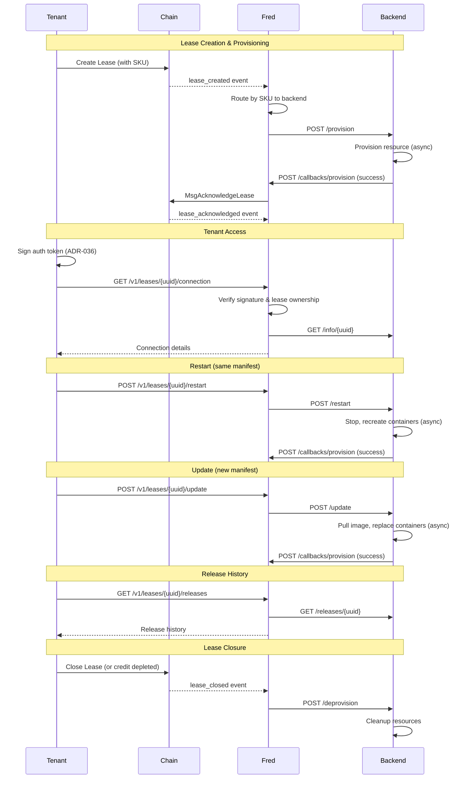

# FRED - Flexible Resource Execution Daemon

A Go daemon for Manifest Network providers that manages the complete lease lifecycle with pluggable backend integration, event-driven provisioning, and automatic resource management.

## Features

- **Lease Lifecycle Management**: Watches chain events and orchestrates provisioning through backends
- **Multi-Backend Support**: Route leases to different backends based on exact SKU UUID list, distributing new provisions to the least-loaded matching backend (lowest allocated-CPU ratio)
- **Event-Driven Architecture**: Uses Watermill for internal event routing with retries and middleware
- **Tenant Authentication API**: HTTP/HTTPS API with ADR-036 signature verification for tenant access
- **Periodic Withdrawals**: Configurable scheduled withdrawal of accumulated fees from active leases
- **Credit Monitoring**: Tracks tenant credit balances and auto-closes leases when credit is depleted
- **Cross-Provider Credit Detection**: Responds to credit depletion events from other providers
- **Live Operations**: Restart containers or deploy new manifests (update) on active leases with full release history tracking
- **Data Retention & Restore**: Soft-delete a lease's volumes on close and restore them into a new lease within a grace window, optionally onto a different SKU tier
- **Security**: Rate limiting, request size limits, input validation, and optional TLS

## Architecture Overview

```
                              MANIFEST CHAIN
                                    |
                                    | WebSocket (events)
                                    v
+------------------------------------------------------------------+
|                              FRED                                 |
|                                                                   |
|  +------------------+                                             |
|  | Event Subscriber |  (fan-out: each consumer gets all events)  |
|  | (WebSocket)      |-----+------------------+                    |
|  +------------------+     |                  |                    |
|                           v                  v                    |
|  +------------------+  +------------------+  +------------------+ |
|  | Event Bridge     |  | Watcher          |  | (other future    | |
|  | -> Watermill     |  | (cross-provider) |  |  consumers)      | |
|  +------------------+  +------------------+  +------------------+ |
|           |                                                       |
|           v                                                       |
|  +------------------+     +------------------+                    |
|  | Watermill Router |---->| Provision        |                    |
|  | (event routing)  |     | Manager          |                    |
|  +------------------+     +------------------+                    |
|                                   |                               |
|  +------------------+             |                               |
|  | API Server       |<------------+                               |
|  | (tenant access)  |             |                               |
|  +------------------+             v                               |
|                           +------------------+                    |
|                           | Backend Router   |                    |
|                           | (SKU routing +   |                    |
|                           |  least-loaded)   |                    |
|                           +------------------+                    |
|                                   |                               |
+------------------------------------------------------------------+
                                    |
              +---------------------+---------------------+
              v                     v                     v
      +---------------+     +---------------+     +---------------+
      |   Docker-1    |     |   Docker-2    |     |   Docker-3    |
      |   Backend     |     |   Backend     |     |   Backend     |
      | (skus: [uuid])|     | (skus: [uuid])|     | (skus: [uuid])|
      +---------------+     +---------------+     +---------------+
```

### Event Fan-Out

The Event Subscriber uses a fan-out pattern where each consumer (Event Bridge, Watcher, etc.) gets its own channel and receives **all** events independently. This ensures that:
- The provisioner never misses lease events
- The watcher always sees cross-provider credit depletion events
- New consumers can be added without affecting existing ones

## Lease Lifecycle


```mermaid
sequenceDiagram
    participant T as Tenant
    participant C as Chain
    participant F as Fred
    participant B as Backend

    Note over T,B: Lease Creation & Provisioning
    T->>C: Create Lease (with SKU)
    C-->>F: lease_created event
    F->>F: Route by SKU to backend
    F->>B: POST /provision
    B->>B: Provision resource (async)
    B->>F: POST /callbacks/provision (success)
    F->>C: MsgAcknowledgeLease
    C-->>F: lease_acknowledged event

    Note over T,B: Tenant Access
    T->>T: Sign auth token (ADR-036)
    T->>F: GET /v1/leases/{uuid}/connection
    F->>F: Verify signature & lease ownership
    F->>B: GET /info/{uuid}
    F-->>T: Connection details

    Note over T,B: Restart (same manifest)
    T->>F: POST /v1/leases/{uuid}/restart
    F->>B: POST /restart
    B->>B: Stop, recreate containers (async)
    B->>F: POST /callbacks/provision (success)

    Note over T,B: Update (new manifest)
    T->>F: POST /v1/leases/{uuid}/update
    F->>B: POST /update
    B->>B: Pull image, replace containers (async)
    B->>F: POST /callbacks/provision (success)

    Note over T,B: Release History
    T->>F: GET /v1/leases/{uuid}/releases
    F->>B: GET /releases/{uuid}
    F-->>T: Release history

    Note over T,B: Lease Closure
    T->>C: Close Lease (or credit depleted)
    C-->>F: lease_closed event
    F->>B: POST /deprovision
    B->>B: Cleanup resources
```

## Building

```bash
# Build all binaries (including placement-preflight and placement-repair)
make all

# Build only providerd
go build -o build/providerd ./cmd/providerd

# Build only mock-backend
go build -o build/mock-backend ./cmd/mock-backend

# Build only docker-backend
go build -o build/docker-backend ./cmd/docker-backend

# Build only k3s-backend
go build -o build/k3s-backend ./cmd/k3s-backend

# Build the offline placement tools
go build -o build/placement-preflight ./cmd/placement-preflight
go build -o build/placement-repair ./cmd/placement-repair
```

> **k3s-backend is currently an experimental, non-functional scaffold (ENG-133):** the binary boots, serves the backend HTTP contract, and signs/verifies callbacks, but its provisioner returns `status=failed, error="not implemented"` for every provision. It is **not usable in production**; real Kubernetes provisioning lands in ENG-134+.

## Local Development Setup

For a one-shot dev environment against a running local chain, use:

```bash
bash scripts/dev-init.sh
```

This registers a provider and SKUs on-chain, generates `config.docker.yaml` (the `providerd` config) and `docker-backend.yaml`, and writes a callback secret. Its final output gives the required fresh-start order: seal the empty backend, start it, drain mutation/callback work while leaving its inventory endpoints live, run `placement-preflight -initialize-fresh` with `providerd` plus tenant/chain mutation ingress fenced, and only then start `providerd`. Normal startup deliberately does not create `placements.db`. The script is intentionally one-shot and refuses to overwrite generated configuration or existing authority. All settings are overridable via environment variables — see the script header for the full list. Requires `manifestd`, `jq`, `curl`, `openssl`, and `findmnt` (from util-linux) on `PATH` plus a running local chain.

## Configuration

Copy the example configuration and customize:

```bash
cp config.example.yaml config.yaml
```

### Required Configuration

All required fields are validated at startup. The daemon will fail to start with a clear error message if any required configuration is missing or invalid.

| Option | Description |
|--------|-------------|
| `provider_uuid` | Your registered provider UUID (must be valid UUID format) |
| `provider_address` | Provider management address |
| `keyring_dir` | Directory containing keyring |
| `key_name` | Key name for signing transactions |
| `backends` | At least one backend must be configured (multiple backends may share `skus` for load-based routing); production requires a distinct `hmac_secret` on every entry |
| `callback_base_url` | URL where backends send callbacks (absolute HTTP(S); HTTPS is required in production mode) |
| `placement_store_db_path` | Critical provider-bound lease-to-backend authority. It must be an existing prepared database at startup and is not hot-swappable |

### Backend Configuration

Backends are services that handle the actual resource provisioning. Backend and callback URLs must be absolute HTTP(S) URLs. Provider `production_mode: true` requires HTTPS in both directions and verifies backend peers using the configured private CA (or system roots); bundled backends must also enable production mode so callback peer verification cannot be disabled. HTTP is development-only because request HMAC does not authenticate backend responses and callback HMAC does not provide transport confidentiality.

Leases are routed to backends using the **`skus`** field — an exact list of on-chain SKU UUIDs. A backend with no `skus` matches nothing (use `default: true` for fallback). When multiple backends match the same SKU, Fred routes each new provision to the least-loaded matching backend — the SKU-matching backend reporting the lowest allocated-CPU ratio from its `/stats` endpoint (ENG-318). Ties break by fewest in-flight provisions, then by a round-robin counter; round-robin is also the fallback when no matching backend exposes usable load stats.

```yaml
backends:
  # Give every backend the same skus list so they all match,
  # then Fred routes each provision to the least-loaded one.
  - name: docker-1
    url: "http://10.0.0.1:9001"
    # Must equal docker-1's own callback_secret; never reuse on another backend.
    hmac_secret: "docker-1-unique-32-byte-minimum-secret"
    skus:
      - "a1b2c3d4-e5f6-7890-abcd-1234567890ab"
      - "b2c3d4e5-f6a7-8901-bcde-2345678901bc"
    default: true

  - name: docker-2
    url: "http://10.0.0.2:9001"
    # Must equal docker-2's own callback_secret.
    hmac_secret: "docker-2-unique-32-byte-minimum-secret"
    skus:
      - "a1b2c3d4-e5f6-7890-abcd-1234567890ab"
      - "b2c3d4e5-f6a7-8901-bcde-2345678901bc"

callback_base_url: "http://fred.provider.example.com:8080"

# Required. Records durable attempts and confirmed ownership so reads,
# reconciliation, restore, and deprovision reach the right backend.
placement_store_db_path: "/var/lib/fred/placements.db"
```

**Per-backend fields:**

| Field | Description | Default |
|-------|-------------|---------|
| `name` | Stable, case-sensitive durable backend identity; must be non-blank and unique | (required) |
| `url` | Absolute `http://` or `https://` origin with a usable ASCII hostname (punycode for IDNs); an explicit port must be 1–65535 | (required) |
| `hmac_secret` | Bidirectional HMAC key for this backend; set the backend process's `callback_secret` to the same value. Production requires at least 32 bytes and pairwise uniqueness. | (required in production) |
| `skus` | Exact list of on-chain SKU UUIDs this backend serves | `[]` |
| `default` | Use as fallback when no SKU match | `false` |
| `timeout` | HTTP request timeout for calls to this backend | `30s` |

**Validation rules:**
- Backend names must be valid printable UTF-8 with no leading/trailing
  whitespace and exactly unique (comparison is case-sensitive)
- Treat a backend name as an immutable storage identity: removing or renaming it
  while a durable placement refers to it is rejected. A drained name may leave
  the active topology and later return only for the same storage identity;
  replacement storage must use a new unique name. Removal also requires the
  latest complete, topology-bound raw provision and retention inventories to
  prove that backend empty; silence is not a drain proof
- Backend URLs must be absolute `http://` or `https://` origins with a
  non-empty, non-dot ASCII hostname (use punycode for internationalized
  names), no path/query/fragment/user info, and any
  explicit port in the range 1–65535. Empty `?` and `#` markers are rejected
  rather than silently normalized away; production mode requires peer-verified
  `https://` (a configured private CA is supported)
- `callback_base_url` must be an absolute `http://` or `https://` URL without
  user info, a fragment, malformed query syntax, or reserved `operation_id` /
  `lifecycle_id` query keys. Its authority follows the same hostname and port
  rules as backend origins. Its path must contain no internal
  empty/dot/parent segments, backslashes, or percent-encoded separators
- Trailing path slashes on `callback_base_url` are automatically stripped;
  its path escaping is canonicalized. Unrelated query bytes are preserved for
  callback HMAC signing, so spaces, non-ASCII bytes, and other unsafe raw bytes
  must be percent-encoded before configuration
- `callback_canonical_path_prefix` must exactly equal the normalized escaped
  path of `callback_base_url` (both are empty for a root/direct URL). This
  fail-fast check prevents a path-stripping proxy configuration from making
  every HMAC callback fail at runtime
- Complete callback destinations are accepted and persisted only when their
  canonical path ends in `/callbacks/provision`; dot segments, encoded path
  separators, fragments, user info, empty query markers, and unstable raw
  query bytes fail closed

### Full Configuration Reference

| Option | Description | Default |
|--------|-------------|---------|
| `log_level` | Log verbosity (debug, info, warn, error) | `info` |
| `production_mode` | Enforce security requirements at startup (TLS, replay protection, SSRF) | `false` |
| `chain_id` | Chain identifier | `manifest-1` |
| `grpc_endpoint` | Chain gRPC endpoint | `localhost:9090` |
| `websocket_url` | CometBFT WebSocket URL | `ws://localhost:26657/websocket` |
| `grpc_tls_enabled` | Enable TLS for gRPC to the chain | `false` |
| `grpc_tls_ca_file` | Custom CA certificate file for gRPC TLS | `""` (system CAs) |
| `grpc_tls_skip_verify` | Skip gRPC TLS certificate verification (development only) | `false` |
| `provider_uuid` | Your registered provider UUID | (required) |
| `provider_address` | Provider management address | (required) |
| `keyring_backend` | Keyring backend (file, os, test) | `file` |
| `keyring_dir` | Directory containing keyring | (required) |
| `key_name` | Key name for signing transactions | (required) |
| `api_listen_addr` | API server listen address | `:8080` |
| `tls_cert_file` | TLS certificate file (PEM). Must be set with `tls_key_file` or neither. | `""` |
| `tls_key_file` | TLS private key file (PEM). | `""` |
| `withdraw_interval` | How often to withdraw funds | `1h` |
| `bech32_prefix` | Address prefix for validation | `manifest` |
| `rate_limit_rps` | Per-IP API rate limit (req/s); one bucket shared across all routes | `10` |
| `rate_limit_burst` | Per-IP rate limit burst size | `20` |
| `tenant_rate_limit_rps` | Per-tenant rate limit (requests/second) | `5` |
| `tenant_rate_limit_burst` | Per-tenant burst size | `10` |
| `trusted_proxies` | CIDR blocks of trusted proxies for X-Forwarded-For | `[]` |
| `cors_origins` | Allowed CORS origins for browser clients. `["*"]` allows all; `[]` disables CORS. | `["*"]` |
| `backends` | List of backend configurations | (required) |
| `callback_base_url` | Base URL for backend callbacks | (required) |
| `callback_secret` | Legacy fleet-wide HMAC key accepted only outside production; do not combine with `backends[].hmac_secret` | `""` |
| `callback_canonical_path_prefix` | Path prefix prepended to inbound callback URIs before HMAC verification. It must exactly equal the normalized escaped path in `callback_base_url` and the prefix stripped by the trusted proxy (e.g., `/api/fred`). Both values are empty for a root/direct URL. See [SECURITY.md](SECURITY.md) and [docs/security-callback-auth.md](docs/security-callback-auth.md). | `""` |
| `reconciliation_interval` | How often to run reconciliation | `5m` |
| `token_tracker_db_path` | Path to bbolt database for token replay protection | (optional; required if `production_mode`) |
| `payload_store_db_path` | Path to bbolt database for payload storage | (optional) |
| `placement_store_db_path` | Path to the critical provider-bound durable lease→backend placement authority used for write-ahead placement, routing, restore, and restart recovery. Normal startup opens only an existing prepared, unsymlinked, single-link regular file with exact mode `0600` and never creates or migrates it. Never replace, unlink, rename, or restore the path while `providerd` is running | (required) |
| `max_request_body_size` | Maximum request body size in bytes | `1048576` (1MB) |

> **Note:** The Docker backend has additional configuration (`releases_db_path`, `releases_max_age`, `container_stop_timeout`, etc.) documented in `docker-backend.example.yaml`.

Bundled backends also require a one-shot storage-lineage initialization before
their first normal start. For a genuinely new empty Docker backend, run
`docker-backend -config docker-backend.yaml -initialize-storage-identity new`;
the k3s scaffold uses the corresponding `k3s-backend` command. Normal startup is
verification-only and will not create or repair markers or authoritative
journals. Existing v0.13 Docker storage instead uses the stopped-and-drained
`adopt` cutover in [Deployment](DEPLOYMENT.md#upgrading-from-v0130).

Bundled Docker and k3s backends require a positive `callback_max_age` (default
`24h`). The age applies to legacy callbacks and typed lifecycle observations;
exact operation and maintenance completions never expire because they may be the
only evidence that can settle Fred's durable write-ahead attempt or an exact
replacement. Operation/maintenance intents and Docker close intents likewise do
not age out. Strict per-lease FIFO means an undeliverable exact completion remains
a permanent ordering barrier until it is delivered or repaired. Zero or negative
values are rejected at startup.

### Advanced Configuration

These options have sensible defaults but can be tuned for specific environments:

| Option | Description | Default |
|--------|-------------|---------|
| `http_read_timeout` | HTTP server read timeout | `15s` |
| `http_write_timeout` | HTTP server write timeout | `15s` |
| `http_idle_timeout` | HTTP server idle timeout | `60s` |
| `websocket_ping_interval` | WebSocket ping interval | `30s` |
| `websocket_reconnect_initial` | Initial WebSocket reconnect delay | `1s` |
| `websocket_reconnect_max` | Maximum WebSocket reconnect delay | `60s` |
| `tx_poll_interval` | Transaction confirmation poll interval | `500ms` |
| `tx_timeout` | Transaction confirmation timeout | `30s` |
| `query_page_limit` | Page size for chain queries | `100` |
| `max_withdraw_iterations` | Max pages per provider-wide withdrawal cycle (cursor pagination) | `100` |
| `withdraw_limit` | Leases settled per provider-wide withdrawal tx (`MsgWithdraw.Limit`); trades tx count vs per-tx gas. Must be 1..the chain's max batch size (currently 100) | `100` |
| `gas_limit` | Fallback gas used only when a per-tx gas simulation fails or is unavailable; every tx is otherwise gas-simulated per-tx. | `1500000` |
| `gas_adjustment` | Multiplier applied to the simulated gas estimate (Cosmos `--gas-adjustment` convention), giving headroom above the estimate. Matches the Cosmos CLI flag. Range: 1.0–3.0. | `1.2` |
| `max_gas_limit` | Absolute reject-cap: a tx whose adjusted simulated estimate exceeds it is terminally rejected before broadcast (never sent); it also clamps the out-of-gas retry ladder. `0` = uncapped. Must be ≥ `gas_limit` when set. | `0` |
| `gas_price` | Gas price (micro-units of `fee_denom` per gas unit; fee = ceil(gas_limit × gas_price / 1_000_000)) | `25` |
| `fee_denom` | Fee denomination | `umfx` |
| `sub_signer_count` | Number of authz sub-signers for parallel tx signing. `0` = single-signer mode. | `0` |
| `sub_signer_min_balance` | Minimum balance before a sub-signer is topped up. | `10000000umfx` |
| `sub_signer_top_up_amount` | Amount transferred per top-up. | `50000000umfx` |
| `sub_signer_fund_check_interval` | How often balances are checked. | `1h` |
| `credit_check_interval` | How often the scheduler wakes to run the credit check, independent of `withdraw_interval`. `0s` couples it to `withdraw_interval`; when set >0 it must be ≤ `withdraw_interval`. A smaller value polls credit faster while the paid withdrawal stays rate-limited to `withdraw_interval` (the ENG-524 withdraw-cadence guard). | `0s` |
| `credit_check_error_threshold` | Errors before disabling credit monitoring | `3` |
| `credit_check_retry_interval` | Delay before an earlier follow-up credit check. Applies in two cases: after credit-check errors exceed `credit_check_error_threshold`, and while a zero-balance closure is being deferred inside its `credit_check_zero_grace_period` window (so the empty balance is re-confirmed promptly rather than at the next full `credit_check_interval`). | `30s` |
| `credit_check_zero_grace_period` | How long a tenant's credit must stay empty before its leases are auto-closed. A single stale zero read (e.g. the chain node briefly lagging a top-up) is absorbed: closure only fires once the empty balance persists for this whole window, and any non-zero read clears it. Lower = faster reclaim of unpaid leases; higher = more tolerance for transient chain-node lag before soft-deleting tenant data. `0s` uses the 5m default. | `5m` |
| `shutdown_timeout` | Maximum time for graceful shutdown (drain + cleanup) | `30s` |

The callback route has a separate two-minute application budget because a
terminal result may include chain settlement. It extends the connection write
deadline for that request only; `http_write_timeout` and the generic 30-second
request middleware continue to govern the other HTTP routes. Bundled backends
give the complete delivery retry chain an additional 15 seconds. A fresh first
attempt therefore normally leaves time for providerd to return its retryable
503 after the application budget expires. Quick retries and their 0/1s/5s
backoffs share that one two-minute-fifteen-second deadline rather than resetting
it; after an earlier failure consumes part of the budget, a later attempt may
reach the sender's remaining deadline before providerd's per-request timer.
Either result keeps the durable FIFO head for a later replay instead of holding
the same lease for another full application budget. Bundled backends commit
operation, maintenance, and lifecycle callback facts before sending a
non-blocking wake to their tracked replay loop. Only that loop performs HTTP, so
the retry chain never extends a lease actor, API handler, or startup-recovery
critical section. A slow callback can occupy one replay worker and its per-lease
FIFO lock, without stalling another lease or backend node. This callback budget
is deliberately independent of providerd's `backends[].timeout`, which governs
Fred-to-backend requests.

### TLS Configuration

See [SECURITY.md](SECURITY.md#transport-security) for TLS configuration details (API server HTTPS, gRPC to chain).

### Environment Variables

All options can be set via environment variables with the `PROVIDER_` prefix:

```bash
export PROVIDER_CHAIN_ID=manifest-1
export PROVIDER_PROVIDER_UUID=01234567-89ab-cdef-0123-456789abcdef
export PROVIDER_CALLBACK_BASE_URL=http://fred.example.com:8080
```

## Usage

```bash
# Run with config file
./build/providerd -c config.yaml

# Or use environment variables
./build/providerd

# Print version (providerd, backend binaries, and placement tools support --version)
./build/providerd --version
./build/docker-backend --version
./build/k3s-backend --version
```

> **k3s-backend is currently an experimental, non-functional scaffold (ENG-133):** the binary boots, serves the backend HTTP contract, and signs/verifies callbacks, but its provisioner returns `status=failed, error="not implemented"` for every provision. It is **not usable in production**; real Kubernetes provisioning lands in ENG-134+.

## API Endpoints

### Endpoint Reference

#### Tenant API

| Method | Path | Auth | Replay | Lease State | Notes |
|--------|------|------|--------|-------------|-------|
| `GET` | `/v1/leases/{uuid}/connection` | ADR-036 | Yes | Active | Returns sensitive connection details |
| `GET` | `/v1/leases/{uuid}/status` | ADR-036 | No | Any | Idempotent read |
| `GET` | `/v1/leases/{uuid}/provision` | ADR-036 | No | Any | Idempotent read |
| `GET` | `/v1/leases/{uuid}/logs` | ADR-036 | No | Any | Idempotent read |
| `GET` | `/v1/leases/{uuid}/releases` | ADR-036 | No | Any | Idempotent read |
| `POST` | `/v1/leases/{uuid}/data` | ADR-036 | No | Pending | Has own idempotency (409 on duplicate) |
| `POST` | `/v1/leases/{uuid}/restart` | ADR-036 | Yes | Active | Mutating — replaying would restart again |
| `POST` | `/v1/leases/{uuid}/update` | ADR-036 | Yes | Active | Mutating — replaying would redeploy again |
| `POST` | `/v1/leases/{uuid}/restore` | ADR-036 | Yes | Pending | Restore a soft-deleted lease's data into this fresh lease |
| `GET` | `/v1/leases/{uuid}/events` | ADR-036 | No | Any | WebSocket stream of lease status events |

#### Operational

| Method | Path | Auth | Notes |
|--------|------|------|-------|
| `GET` | `/health` | None | Liveness. Probes chain, backends and DBs, but **no verdict ever makes it 503** — poll this from a load balancer |
| `GET` | `/readyz` | None | Deep readiness. Same body; 503 when local bbolt authority is unreadable/withdrawn or no durable inventory baseline matches the configured backend topology. **Not** for load balancers |
| `GET` | `/metrics` | None | Prometheus metrics |
| `GET` | `/workloads?lease_uuid=<u1>&lease_uuid=<u2>...` | None | Bulk workload metadata lookup by lease UUID (1..MaxLookupUUIDs). Used by the manifest-admin SPA. |
| `POST` | `/callbacks/provision` | HMAC-SHA256 | Backend → Fred callback (5-min replay window) |

See [SECURITY.md](SECURITY.md) for replay protection rationale per endpoint.

### Health Check

```
GET /health     # liveness — no verdict returns 503
GET /readyz     # deep readiness — also 503 until placement inventory bootstraps
```

Both probe the same things — chain connectivity, every registered backend, and
the token-tracker, placement-store and payload-store bbolt DBs — and return the
same body. They differ only in how the verdict maps onto the status code:

| `status` | Meaning | `/health` | `/readyz` |
|---|---|---|---|
| `healthy` | Every configured probe passed | 200 | 200 |
| `degraded` | A remote, shared dependency is impaired (chain, or one or more backends). Existing workloads keep serving and exact callbacks plus safely evidenced reconciliation work continue. After inventory bootstrap, the reconciler may place genuinely new recordless `PENDING` work only on backends that answered both inventories; work pinned to a silent owner, `ACTIVE` recordless work, unresolved attempts, and conflicts remain deferred. A chain outage halts reconciliation and lease-resolving calls. Both conditions still accept backend callbacks | 200 | 200 |
| `unhealthy` | A local, process-owned bbolt store is unreadable, placement authority was permanently withdrawn after a path/inode or outcome-unknown commit failure, or no durable inventory baseline matches the configured backend topology | 200 | 503 |

`checks.placement_inventory` reports a durable baseline bound to the exact set of
configured backend storage identities. A complete `/provisions` plus
`/retentions` projection establishes it; it survives process restarts and
transient incomplete sweeps while that topology is unchanged. A topology
membership change requires identity-bearing responses from the complete
proposed fleet and another complete projection; one temporarily down node does
not revoke an already-established unchanged-topology baseline.

`fred_reconciler_sweep_complete` is 0 while a sweep is in progress or after an
incomplete/error sweep, and becomes 1 only after the most recently completed
full-fleet inventory was durably projected. It is not a fleet-wide admission
gate. With a valid baseline, a partial sweep issues a typed scope containing
only the backends that answered both inventories. That scope can authorize
genuinely recordless `PENDING` work on those nodes. It cannot move or retry work
tied to a silent owner, clear an attempt or conflict from silence, or authorize
recordless `ACTIVE` recovery.

Tenant event dispatch has no per-sweep inventory witness. It instead requires
the durable topology baseline, live-routes by backend stats within that topology,
and durably records the exact attempted backend before making the call. A later
ambiguous result remains pinned regardless of an empty inventory response.

The placement database is bound to the exact configured `provider_uuid` and is
backup-critical, not a derived inventory cache. Restore it after loss. Only a
genuinely new provider with zero total chain lease history can create its first
authority, using the explicit
[`placement-preflight -initialize-fresh`](DEPLOYMENT.md#initializing-a-genuinely-fresh-placement-authority)
workflow after an all-state chain query proves no lease history, an independently
supplied exact backend roster matches configuration, and every configured
backend returns complete, identity-consistent empty inventories. Fresh
initialization is never recovery for a lost placement database. The printed
operator acknowledgement includes the target parent's physical device/inode;
the initializer rejects a rename/recreation between print and initialize and
publishes descriptor-relatively with `renameat2(RENAME_NOREPLACE)`.

It is also bound at runtime to the exact regular-file inode opened at
`placement_store_db_path`. Never copy over, unlink, rename, rotate, or restore
that pathname while `providerd` is running. A mismatch or outcome-unknown bbolt
commit permanently withdraws authority from that process; putting the old name
back does not heal it. Preserve the evidence and follow the
[runtime-authority runbook](OPERATIONS.md#placement-runtime-authority-was-withdrawn).
Live backups must use atomic filesystem snapshots, and restores happen only
while stopped.

The mutating offline placement tools likewise bind the mandatory backup
parent's physical identity before remote proof, publish with descriptor-relative
no-replace rename, and retain the exact published inode through mutation and the
final verdict. Re-attestation also binds its SHA-256 bytes, exact length, `0600`
mode, and single-link status. Treat `BACKUP PUBLISHED`, `PREPARED:`/`COMMITTED:`, and
`OUTCOME UNKNOWN` as distinct evidence-preservation outcomes; see the
[deployment procedure](DEPLOYMENT.md#upgrades).

`/health` is a **liveness** contract: no dependency verdict makes it 503, because
providerd runs as the single server of its load-balancer pool and the backends'
completion callbacks arrive on the same listener — so removing it from rotation
takes down the tenant API *and* the callback path that lets a recovering backend
report what it finished (ENG-522). Point load balancers here. Alert on
`fred_health_check_healthy` and `fred_backend_healthy`, not on the status code.

Slowness cannot get around that: the whole dependency sweep is bounded (3s) and
backends are probed concurrently, so a backend that accepts a connection and never
answers cannot outlast the prober's own timeout, the server's write timeout, or the
request timeout — the last of which would otherwise answer 503 from
`http.TimeoutHandler` with no verdict involved.

Being unauthenticated, both endpoints do still sit behind the global IP rate limiter
and can return `429`; the default budget is far above any sane probe interval.

A check absent from `checks` means an optional dependency is not configured, not
that it passed. `placement_store` and `placement_inventory` are mandatory in
`providerd` and are therefore always present.

**Response:**
```json
{
  "status": "degraded",
  "provider_uuid": "01234567-89ab-cdef-0123-456789abcdef",
  "checks": {
    "chain": {"status": "healthy"},
    "backend:docker-1": {"status": "healthy"},
    "backend:docker-2": {"status": "unhealthy", "message": "backend health check failed"},
    "token_tracker": {"status": "healthy"},
    "placement_store": {"status": "healthy"},
    "placement_inventory": {"status": "healthy"},
    "payload_store": {"status": "healthy"}
  }
}
```

### Get Lease Connection

```
GET /v1/leases/{lease_uuid}/connection
Authorization: Bearer <token>
```

Returns connection details for an active lease from the backend. Requires ADR-036 signed bearer token. See [SECURITY.md](SECURITY.md#tenant-authentication-adr-036) for token format and signing details.

**Response (single instance):**
```json
{
  "lease_uuid": "...",
  "tenant": "manifest1...",
  "provider_uuid": "...",
  "connection": {
    "host": "compute-alpha.example.com",
    "fqdn": "a1b2c3d.example.com",
    "ports": {
      "8080/tcp": {"host_ip": "0.0.0.0", "host_port": 32768},
      "443/tcp": {"host_ip": "0.0.0.0", "host_port": 32769}
    },
    "protocol": "https",
    "metadata": {
      "region": "us-east-1",
      "backend": "kubernetes"
    }
  }
}
```

**Response (multi-instance lease):**
```json
{
  "lease_uuid": "...",
  "tenant": "manifest1...",
  "provider_uuid": "...",
  "connection": {
    "host": "compute-alpha.example.com",
    "fqdn": "0-a1b2c3d.example.com",
    "instances": [
      {
        "instance_index": 0,
        "container_id": "abc123",
        "image": "nginx:latest",
        "status": "running",
        "fqdn": "0-a1b2c3d.example.com",
        "ports": {"80/tcp": {"host_ip": "0.0.0.0", "host_port": 32768}}
      },
      {
        "instance_index": 1,
        "container_id": "def456",
        "image": "redis:alpine",
        "status": "running",
        "fqdn": "1-e5f6789.example.com",
        "ports": {"6379/tcp": {"host_ip": "0.0.0.0", "host_port": 32769}}
      }
    ],
    "metadata": {"backend": "docker"}
  }
}
```

**Fields:**
- `fqdn` - Fully qualified domain name for ingress routing (omitted when ingress is not enabled). At the top level (`connection.fqdn`), this is set directly from the backend or propagated from the first instance's FQDN when no top-level value is provided. Each instance and service may also have its own `fqdn`. A top-level or service-level explicit FQDN takes precedence over instance propagation.
- `ports` - Map of container port to host binding (e.g., "8080/tcp" → host_port 32768)
- `instances` - Array of per-instance details for multi-container leases (each with its own ports and optional `fqdn`)
- `services` - Map of service name to connection details for stack (multi-service) leases. Each service contains its own `instances` array and optional `fqdn` (propagated from its first instance when not set explicitly).
- `metadata` - Additional backend-specific data

**Response Codes:**
- `200 OK` - Connection details found
- `401 Unauthorized` - Invalid signature or token
- `403 Forbidden` - Lease does not belong to this tenant
- `404 Not Found` - Lease not provisioned
- `500 Internal Server Error` - The backend failed while reading connection details
- `503 Service Unavailable` - A required authentication or routing service is unavailable, or durable placement is unusable or unresolved

### Get Lease Status

```
GET /v1/leases/{lease_uuid}/status
Authorization: Bearer <token>
```

Returns the current provisioning status of a lease. Useful for checking if provisioning is in progress or complete.

**Response:**
```json
{
  "lease_uuid": "550e8400-e29b-41d4-a716-446655440000",
  "tenant": "manifest1abc...",
  "provider_uuid": "01234567-89ab-cdef-0123-456789abcdef",
  "state": "PENDING",
  "requires_payload": true,
  "meta_hash_hex": "a1b2c3...",
  "payload_received": false,
  "provisioning_started": false
}
```

**Fields:**
- `tenant` - Tenant address from the authenticated token
- `provider_uuid` - Provider UUID
- `state` - Chain lease state (PENDING, ACTIVE, CLOSED, EXPIRED)
- `requires_payload` - True if lease has meta_hash (expects payload upload)
- `meta_hash_hex` - Expected payload hash in hex (omitted if no meta_hash)
- `payload_received` - True if payload has been uploaded
- `provisioning_started` - True if provisioning is in progress
- `provision_status` - Backend provision status (omitted if not provisioned). May be `retained` for a closed/expired lease whose data was soft-deleted and is restorable (see [retention](internal/backend/docker/README.md#soft-delete--restore))
- `fail_count` - Number of provisioning failures (omitted if zero)
- `reason` - Stable, machine-readable failure category; present whenever a failure has been recorded — including a `ready` lease whose last update failed and rolled back to the previous version — and omitted (`omitempty`) when empty; see [Failure Reason Codes](#failure-reason-codes)
- `message` - Curated, human-readable failure summary (omitted if empty); no host paths or raw command output
- `retained_until` - RFC3339 grace-window deadline; present only when `provision_status` is `retained`
- `items` - Restore shape (`service_name`, `sku`, `quantity`) to request when opening the fresh lease to restore into; present only when `retained`
- `restore_hint` - Short human-readable next step for restoring; present only when `retained`

> **Chain-pruned leases:** after a lease is auto-closed and pruned from the chain, this endpoint still answers from the retained record. In that case authorization is by the retained record's tenant (the signed caller must own it); a cross-tenant caller or an absent record gets `404`.

### Get Provision Diagnostics

```
GET /v1/leases/{lease_uuid}/provision
Authorization: Bearer <token>
```

Returns provision diagnostics for a lease, including status, failure reason, and failure count. Works for both active and non-active leases (e.g., after rejection or closure), falling back to persisted diagnostics when the provision is no longer in memory.

**Response:**
```json
{
  "lease_uuid": "550e8400-e29b-41d4-a716-446655440000",
  "tenant": "manifest1abc...",
  "provider_uuid": "01234567-89ab-cdef-0123-456789abcdef",
  "status": "failed",
  "fail_count": 3,
  "reason": "ContainerExited",
  "message": "container exited unexpectedly"
}
```

**Fields:**
- `status` - Provision status: `provisioning`, `ready`, `failing`, `failed`, `restarting`, `updating`, `deprovisioning`, `retained`, or `unknown`. `failing` is a transient state between container-death detection and the Failed callback; `deprovisioning` covers the container-removal window; `retained` marks a closed/expired lease whose data was soft-deleted and is restorable
- `fail_count` - Number of provision attempts that failed
- `reason` - Stable, machine-readable failure category, always present when `status` is `failed` (defaults to `Unknown` if no specific cause was recorded); see [Failure Reason Codes](#failure-reason-codes)
- `message` - Curated, human-readable failure summary; may be empty
- `retained_until`, `items`, `restore_hint` - Present only when `status` is `retained` (grace-window deadline, restore shape, and next-step hint); see [Get Lease Status](#get-lease-status)

**Response Codes:**
- `200 OK` - Provision found
- `401 Unauthorized` - Invalid signature or token
- `403 Forbidden` - Lease does not belong to this tenant
- `404 Not Found` - Provision not found (never provisioned or diagnostics expired)
- `503 Service Unavailable` - Durable placement is unresolved, so absence cannot be reported safely

#### Failure Reason Codes

`reason` is an **open, add-only** enum (Kubernetes `Condition.Reason`-shaped): new values may be
added in future releases without notice. Clients **must** treat any value they don't recognize as
a generic failure and fall back to displaying the human-readable `message` — never match/branch on
`reason` with an exhaustive switch that errors on the default case. Adding a new `reason` is
considered a backward-compatible change.

The set defined today:

| Reason | Meaning |
|---|---|
| `ContainerExited` | A container exited unexpectedly (crash, non-zero exit, OOM kill) |
| `ImagePullFailed` | The container image could not be pulled |
| `Internal` | An internal fred/backend error occurred (not attributable to the tenant's workload) |
| `RestartFailed` | A tenant-initiated restart failed |
| `UpdateFailed` | A tenant-initiated manifest update failed (and was rolled back) |
| `RestoreFailed` | A tenant-initiated restore (redeploy from retained data) failed |
| `VolumeCleanupExhausted` | Volume cleanup on deprovision failed after exhausting all retry attempts |
| `CleanupFailed` | Cleanup on deprovision failed (containers or volumes) |
| `Unknown` | Read-boundary default: the lease is `failed` but no specific reason was recorded |

`message` is a short, human-readable string for display; it contains no host filesystem paths or
raw command/daemon output (that detail is retained operator-side, correlated by `lease_uuid`, for
support/debugging).

### Get Container Logs

```
GET /v1/leases/{lease_uuid}/logs?tail=100
Authorization: Bearer <token>
```

Returns container logs for a lease. Works for both active and non-active leases, falling back to persisted logs when the provision is no longer in memory.

**Query Parameters:**
- `tail` - Number of log lines to return per container (default: 100, max: 10000)

**Response:**
```json
{
  "lease_uuid": "550e8400-e29b-41d4-a716-446655440000",
  "tenant": "manifest1abc...",
  "provider_uuid": "01234567-89ab-cdef-0123-456789abcdef",
  "logs": {
    "0": "2024-01-15 Starting nginx...\nListening on port 80\n",
    "1": "2024-01-15 Redis ready\n"
  }
}
```

**Fields:**
- `logs` - Map of container instance index to log output

**Response Codes:**
- `200 OK` - Logs found
- `400 Bad Request` - Invalid tail parameter (negative, zero, or exceeds max)
- `401 Unauthorized` - Invalid signature or token
- `403 Forbidden` - Lease does not belong to this tenant
- `404 Not Found` - Provision not found (never provisioned or logs expired)
- `503 Service Unavailable` - Backend routing is unavailable, or durable placement is unusable or unresolved

### Upload Payload

The payload is a deployment manifest in JSON format. See the [Manifest Guide](docs/manifest-guide.md) for the full schema (single-service and stack formats, validation rules, examples). A formal [JSON Schema](docs/manifest-schema.json) is available for client-side validation.

```
POST /v1/leases/{lease_uuid}/data
Authorization: Bearer <token>
Content-Type: application/octet-stream

<raw payload bytes>
```

Upload deployment configuration for a lease that was created with a `meta_hash`. The payload is validated against the on-chain hash before provisioning starts. Requires a payload-specific ADR-036 token that includes the `meta_hash` field. See [SECURITY.md](SECURITY.md#tenant-authentication-adr-036) for token details.

**Response Codes:**
- `202 Accepted` - Payload received, provisioning started
- `400 Bad Request` - Invalid payload or hash mismatch
- `401 Unauthorized` - Invalid signature or token
- `404 Not Found` - Lease not found or not PENDING
- `409 Conflict` - Payload already received

### Restart Lease

```
POST /v1/leases/{lease_uuid}/restart
Authorization: Bearer <token>
```

Restart containers for a lease without changing the manifest. Containers are stopped, removed, and recreated with the same configuration. Volumes are preserved. Allowed from `ready` or `failed` state.

**Response:** `202 Accepted`
```json
{
  "status": "restarting"
}
```

**Response Codes:**
- `202 Accepted` - Restart initiated
- `401 Unauthorized` - Invalid signature or token
- `403 Forbidden` - Lease does not belong to this tenant
- `404 Not Found` - Lease not provisioned
- `409 Conflict` - Lease is in a state that cannot be restarted (e.g., already restarting or updating)
- `503 Service Unavailable` - A required authentication or routing service is unavailable, or durable placement is unusable or unresolved

### Update Lease

```
POST /v1/leases/{lease_uuid}/update
Authorization: Bearer <token>
Content-Type: application/json

{
  "payload": "<base64-encoded-manifest>"
}
```

Deploy a new manifest for a lease, replacing containers with a new image/configuration. The old containers are stopped, new ones are created from the updated manifest, and old containers are cleaned up after verification. On failure, the operation rolls back to the previous containers. Volumes are preserved.

A successful update is also **persisted** to the payload store, replacing the manifest the lease was created with. This is what makes an update survive a reprovision: the reconciler replays whatever is stored, so an update applied only to the running containers would be silently undone by the next reboot, crash-restart or host failure (ENG-619). The payload is written *after* the backend accepts it, so a rejected update never enters the store; if that write fails the endpoint answers `500` rather than `202`, because a `202` would promise a durability fred does not have. Retrying re-applies and re-persists.

Because the on-chain `meta_hash` is set once at lease creation and cannot currently be updated, an updated payload no longer matches it. Fred records each stored payload's own SHA-256 and verifies against that on reprovision; `meta_hash` is still used for payloads stored before this behavior existed. See ENG-643 for the on-chain update handshake that restores `meta_hash` as the authoritative reference.

**Response:** `202 Accepted`
```json
{
  "status": "updating"
}
```

**Response Codes:**
- `202 Accepted` - Update initiated and persisted
- `400 Bad Request` - Invalid payload or manifest validation error
- `401 Unauthorized` - Invalid signature or token
- `403 Forbidden` - Lease does not belong to this tenant
- `404 Not Found` - Lease not provisioned
- `409 Conflict` - Lease is in a state that cannot be updated (e.g., currently restarting)
- `500 Internal Server Error` - The backend update failed (including an open circuit), no payload store is configured, or the accepted update could not be persisted
- `502 Bad Gateway` - The backend rejected the update with an unusable or off-contract error response
- `503 Service Unavailable` - A required authentication or routing service is unavailable, or durable placement is unusable or unresolved

### Restore Lease

```
POST /v1/leases/{lease_uuid}/restore
Authorization: Bearer <token>
Content-Type: application/json

{
  "from_lease_uuid": "<original-closed-lease-uuid>"
}
```

Restore a soft-deleted lease's retained data into a **new** lease. The path `lease_uuid` is the new, fresh `PENDING` lease the data is adopted into; `from_lease_uuid` in the body names the original closed/expired lease whose volumes were retained (see [retention](internal/backend/docker/README.md#soft-delete--restore)). Fred resolves the backend that holds the source lease's retained data (restore is same-backend, ENG-333), then re-deploys the retained manifest onto the adopted volumes. Only the item **shape** must match: the new lease's requested service names and quantities must equal the original's, but its SKU/disk tier MAY differ. A promote (same-or-larger disk tier) is always allowed and the new `disk_mb` cap is applied; a demote (smaller disk tier) is allowed only if the retained volume's measured data still fits the new tier's `disk_mb` cap (the backend runs `checkDemoteFit` before adopting). A refused demote returns `422 Unprocessable Entity`; the JSON body's `error` message begins `retained data exceeds the requested smaller tier` (the body's `code` field is the numeric HTTP status, not a string discriminator).

Admission is safe by construction. Fred acquires ordered lifecycle claims for the
source and target, re-reads the target while those claims are held, and atomically
reserves the exact confirmed source placement while durably writing the absent
target's operation-scoped attempt before it contacts the backend. Concurrent
lifecycle work sharing either lease is rejected before dispatch. The source
reservation is process-local and lasts only through the synchronous backend call;
the target attempt is durable and is later settled only by its exact operation ID.

Backend acceptance confirms the target, while a contract-conforming synchronous
domain refusal clears it. A bare `already_provisioned` response does not prove
which callback generation the backend persisted, so Fred retains the new target
attempt until upgraded inventory reports that exact typed generation or its
authenticated callback arrives. A
timeout, transport error,
panic, generic 5xx, malformed error envelope, or unvalidated 503 is ambiguous: Fred
releases the short-lived source reservation but retains the target attempt because
the backend may have accepted the request. An immediate retry of that target will
normally return 409. A positive report confirms it only when the backend also
reports the exact paired typed lifecycle generation; an older typed or legacy
generation remains current while the newer attempt stays recoverable;
a positive report from another backend creates a durable conflict containing
every candidate. Inventory silence never disproves or clears an ambiguous
attempt because the original request could commit after the list response.
Retrying requires such a contract-conforming synchronous refusal or explicit
operator proof and repair. Backend response bodies are not HMAC-authenticated:
their codes establish protocol conformance under the deployment's transport
trust, not cryptographic authorship. Use TLS or an equivalently trusted network
between Fred and its configured backends when an on-path attacker is in scope.

On the Docker backend, the source retention row remains a durable finalizer for
the destination after adoption. While it exists, Provision and Restore of that
destination are rejected. A pre-commit failure hands the source back only after
teardown/re-quarantine, source-quota proof, and exact
failed-operation settlement; an accepted worker failure may therefore stay
`restoring` until the actor's Failed callback is durable. Conversely, an exact
active destination Release is proof the restore committed even if containers
later fail or disappear. With zero survivors, recovery keeps that Release,
reconstructs a conservative Failed destination plus its capacity, and retains
the source finalizer as tenant/provider identity rather than rolling data back.
Once the exact restore intent settles, a plain, identity-preserving Restart may
repair it; Update and custom-domain redeploys remain fenced until that Restart
reaches Ready and reconciliation consumes the finalizer. Close instead hands it
off to a complete durable close intent before teardown.

**Response:** `202 Accepted`
```json
{
  "status": "provisioning"
}
```

**Response Codes:**
- `202 Accepted` - Restore initiated (the lease then transitions through `restarting` to `ready`/`failed`)
- `400 Bad Request` - Missing/invalid `from_lease_uuid`, source and target UUIDs are equal, or items don't match the retained set
- `401 Unauthorized` - Invalid signature or token
- `403 Forbidden` - Lease does not belong to this tenant
- `404 Not Found` - No retained data found for `from_lease_uuid` (the source is absent, expired, cross-tenant, or its configured backend reports that it is not retained)
- `409 Conflict` - Source or target lifecycle work is already in progress, or the target is not `PENDING`, is already provisioned, has an unresolved durable provision/restore attempt, or is not in a restorable state
- `422 Unprocessable Entity` - The retained data exceeds a requested smaller tier's `disk_mb` cap, or the backend otherwise refuses the restore with a well-formed error envelope; the response relays the backend's bounded `error` message
- `500 Internal Server Error` - The restore returned an unexpected or ambiguous backend result, such as a transport error, timeout, or generic 5xx; the durable target attempt is retained until positive evidence confirms it or an operator safely repairs it
- `502 Bad Gateway` - The backend rejected the restore with an unusable or off-contract error response
- `503 Service Unavailable` - Insufficient resources, an open backend circuit, unavailable placement routing/recording/tracking, or a source placement that is unusable, unresolved, or names a backend Fred no longer knows

### Get Release History

```
GET /v1/leases/{lease_uuid}/releases
Authorization: Bearer <token>
```

Returns the release (deployment) history for a lease, showing each version that was deployed.

**Response:**
```json
{
  "lease_uuid": "550e8400-e29b-41d4-a716-446655440000",
  "tenant": "manifest1abc...",
  "provider_uuid": "01234567-89ab-cdef-0123-456789abcdef",
  "releases": [
    {
      "version": 1,
      "image": "nginx:1.24",
      "status": "superseded",
      "created_at": "2024-01-15T10:30:00Z",
      "manifest": "<base64-encoded-manifest>"
    },
    {
      "version": 2,
      "image": "nginx:1.25",
      "status": "active",
      "created_at": "2024-01-16T14:00:00Z",
      "manifest": "<base64-encoded-manifest>"
    }
  ]
}
```

**Fields:**
- `version` - Monotonically increasing version number
- `image` - Container image used in this release
- `status` - Release status: `deploying`, `active`, `superseded`, or `failed`
- `created_at` - When this release was created
- `reason` - Stable, machine-readable failure category (only present on failed releases); see [Failure Reason Codes](#failure-reason-codes)
- `message` - Curated, human-readable failure summary (only present on failed releases; may be empty)
- `manifest` - The manifest payload used for this release

**Response Codes:**
- `200 OK` - Releases found (may be an empty array)
- `401 Unauthorized` - Invalid signature or token
- `403 Forbidden` - Lease does not belong to this tenant
- `404 Not Found` - Lease not provisioned
- `503 Service Unavailable` - Backend routing is unavailable, or durable placement is unusable or unresolved

### Stream Lease Events (WebSocket)

```
GET /v1/leases/{lease_uuid}/events
Authorization: Bearer <token>
```

Opens a WebSocket connection for real-time lease status updates. Events are pushed as JSON frames when the lease transitions between provisioning states (e.g., `provisioning`, `ready`, `failed`, `restarting`, `updating`). A `retained` event is pushed when a closed/expired lease's data is soft-deleted (best-effort, only to currently-connected clients), signalling that the data may be restorable within the grace window. For that event the `status` field is the enum `retained`, and the human-readable restore instruction is carried in the `error` field.

**Authentication:** Bearer token via the `Authorization` header or the `?token=` query parameter (since the WebSocket API cannot set custom headers during upgrade). Auth is verified before the WebSocket upgrade, so failures return standard HTTP error responses.

**Response:** `101 Switching Protocols` on successful upgrade

```json
{"lease_uuid":"...","status":"ready","timestamp":"2024-01-15T10:30:00Z"}
{"lease_uuid":"...","status":"restarting","timestamp":"2024-01-15T10:31:00Z"}
{"lease_uuid":"...","status":"ready","timestamp":"2024-01-15T10:31:30Z"}
```

**Behavior:**
- Events are delivered as WebSocket JSON frames
- Events are best-effort notifications, not a globally ordered state log. An
  exact operation-ID callback remains recoverable after a provider restart only
  while the same durable placement Attempt or confirmed lifecycle generation
  exists; a nonmatching or replaced ID is ignored, so it cannot publish stale
  status. Bundled backends serialize each
  lease's durable callback queue: exact provision/restore and maintenance
  completions remain FIFO, autonomous lifecycle observations are latest-only,
  and synchronous provider application preserves that relative order. A bundled
  Docker backend also returns retryable `409 Conflict` for a newer maintenance
  command while that lease's prior exact maintenance completion is still
  queued; successful delivery reopens only that lease. Other event sources and custom/v0.13 backends do not
  carry a global sequence; use the REST status endpoints for current state.
- The server sends WebSocket ping frames every 30 seconds; the client must respond with pong within 40 seconds or the connection is closed
- Slow clients that fall behind have events dropped — use the REST endpoints (`/status`, `/releases`) to catch up
- The stream ends when the client disconnects or the server shuts down (clean close frame)

**Response Codes (before upgrade):**
- `101 Switching Protocols` - WebSocket connection established
- `401 Unauthorized` - Invalid signature or token
- `403 Forbidden` - Lease does not belong to this tenant
- `501 Not Implemented` - Events not enabled on this deployment

### Provision Callback (Backend -> Fred)

```
POST /callbacks/provision?operation_id=<uuid>
POST /callbacks/provision?lifecycle_id=<uuid>
Content-Type: application/json
X-Fred-Signature: t=<unix-timestamp>,sha256=<hmac-sha256-hex>
```

Called by backends to report operation results and later lease-lifecycle
observations. Provision and restore completion URLs carry exactly one
`operation_id`; their separately persisted lifecycle URLs carry exactly one
`lifecycle_id`. Both are lowercase, hyphenated, canonical RFC-4122 UUIDv4
values. Preserve the selected URL byte-for-byte: the HMAC covers the complete
request URI, including its query. Requires HMAC-SHA256 authentication via the
`X-Fred-Signature` header. See [SECURITY.md](SECURITY.md#callback-authentication-hmac-sha256) for signing details and replay protection.

**Request:**
```json
{
  "lease_uuid": "...",
  "status": "success",
  "error": "",
  "backend_storage_id": "canonical-uuidv4-for-this-backend-storage",
  "backend": "optional-sender-label",
  "retained": false
}
```

Status must be one of `"success"`, `"failed"`, or `"deprovisioned"` (the third is used by backends that perform autonomous deprovisioning, e.g. after a failed provision rollback).

- `backend` (optional string) — legacy sender metadata used only for bounded metrics when no current operation exists. It need not equal Fred's configured router name and cannot authorize or redirect a typed callback; the HMAC-covered callback URL plus Fred's exact-operation registry or durable lifecycle record select the authoritative backend.
- `retained` (optional bool) — set `true` on a `deprovisioned` callback when the backend soft-deleted (retained) the lease's volumes instead of destroying them. Fred uses this to push the optimistic `retained` notice to the tenant; the queryable retained status (`GET /v1/leases/{uuid}/status`) is the durable backstop. Omitted/`false` means the volumes were destroyed.
- `operation_id` in the JSON body, if sent by an older or custom backend, is untrusted metadata and is overwritten at ingress. Only the HMAC-authenticated URL query grants exact-operation authority.
- `lifecycle_id` in the JSON body is likewise overwritten. Fred authorizes the authenticated query only when it matches the current durable per-lease lifecycle capability and backend.

**Response Codes:**
- `200 OK` - Callback synchronously reached a terminal application result, or
  was terminally ignored as a duplicate/stale exact-operation callback; the
  backend may advance this lease's durable callback queue
- `400 Bad Request` - Malformed JSON, lease UUID, status, or callback capability query. `operation_id` and `lifecycle_id` are mutually exclusive; a present empty, nil, non-v4, non-RFC-variant, uppercase, compact, braced, URN, malformed, or duplicate value is rejected
- `401 Unauthorized` - Missing or invalid signature
- `429 Too Many Requests` - Global callback rate limit exceeded
- `503 Service Unavailable` - Callback application is unavailable, not yet
  started, shutting down, failed, or timed out; keep the delivery durable and
  retry with backoff

Callback application has a dedicated two-minute deadline. Bundled backends give
the complete delivery retry chain two minutes fifteen seconds, so a fresh first
attempt normally leaves response time after the provider's application timer
returns 503. Quick retries and backoff consume that same deadline; a later
attempt may instead be canceled when the sender's remaining budget expires.
A backend must retain the FIFO head until a 2xx response; a 503, transport
timeout, or lost response is not delivery success. When the shared budget
expires, bundled backends defer to their 30-second durable replay loop instead
of holding that lease's FIFO lock for consecutive application budgets.

The v0.13.0 upgrade is a stopped cutover, not a rolling upgrade. Drain every old
callback outbox, stop providerd and all backends, install the upgraded binaries
without starting them, and run each Docker backend's mandatory read-only
`-preflight-storage-identity-adoption` proof before taking the cutover backup or
sealing storage identity. Then rotate to unique per-backend keys and restart
every upgraded backend before the new providerd. Stack-form v0.13 Docker
workloads stay in place; older service-name-less cohorts incur bounded
per-lease downtime while startup stops/renames the original generation and
recreates its `app` service through Compose. New backends recover the old operationless callback shape already
embedded in migrated workloads, preserve its tokenless lifecycle route, and
report a non-secret `legacy` generation in internal inventory. Mandatory offline
preparation migrates the corresponding owner as legacy before the new provider
opens it. A pre-identity callback row prevents current callback-store startup;
it is not carried across the cutover. An absent or rebuilt placement database is
never a recovery path for those workloads. The reverse binary order is not
lifecycle-compatible:
an old backend ignores `lifecycle_callback_url` and reuses the expired
operation-scoped URL for later observations, which the new provider safely
ignores.

The seal covers more than the substrate marker. Docker always binds
`callbacks.db`, `releases.db`, and `retention.db` to the same storage UUID and
to distinct store kinds; `retention.db` remains required when
`retain_on_close: false`. K3s binds `callbacks.db` and `releases.db`.
Every authoritative database must be an unsymlinked, single-link regular file
with exact mode `0600`; initialization and normal startup reject an insecure
restore, and runtime re-attestation withdraws the whole backend lineage on
path/inode, link-count, or permission drift.
Initialization accepts only an all-absent fresh set or a complete, valid,
stopped and drained v0.13 set, records that choice in a crash-resumable pending
anchor, and never completes a mixed set. Before evidence inspection it binds the
physical parent of both markers and every authoritative journal; subsequent I/O
is descriptor-relative, so a parent rename, unmount, or same-path recreation
cannot redirect initialization. Normal startup is verification-only: it will
not create, rebind, or repair any authoritative store. A missing, foreign,
cross-kind, or replaced file fails closed, including during periodic cleanup.
The first terminal journal/substrate failure is sticky backend-wide: every
sibling journal and callback delivery refuses with that cause until restart.
`diagnostics.db` is not authority and may be recreated while stopped. Its
generic opener still refuses symlinks, hard links, non-regular files, and modes
other than exact `0600`, but it is not storage-UUID-bound or continuously
re-attested. Back up and restore the marker pair, complete authoritative-store
set, and substrate together; a
matching complete snapshot retains the same lineage, so fence the original
before starting its restored copy. The preflight's only successful stdout is
`ready_for_v0_13_storage_identity_adoption`; it fails closed on unresolved
v0.13 restore/deprovision crash windows instead of inventing missing authority.
If it reports `ErrV013OrphanRollbackRemnant`, preserve its sorted
`immutable_container_ids`; mutable names are never cleanup authority. The
separate read-only terminal-orphan mode of `placement-preflight`, invoked with
`-prove-terminal-orphan <lease-uuid>` and `-expected-backend <name>`, must
positively prove that the same lease is present and terminal in that same
provider's complete height-pinned snapshot and absent from a pristine stopped
v0.13 placement database. Require its printed provider UUID to equal the Docker
diagnostic. That verdict is necessary but not sufficient: follow the exact-ID
inspection/removal procedure, then rerun both proofs and require the Docker
adoption preflight itself to pass before backing up or sealing.
See [Deployment](DEPLOYMENT.md#upgrading-from-v0130) for the complete cutover,
repair, and rollback procedure.

**Idempotency:**
If a callback is received for a lease that has already been processed (no longer in-flight),
the server still returns `200 OK`. A callback carrying an
`operation_id` that is no longer current is ignored completely: it cannot publish
status, acknowledge or reject the lease, retire teardown state, or mutate placement.
The current `lifecycle_id` is observation-only: it may publish successful
maintenance (`ready`), runtime failure (`failed`), or retained teardown status,
but cannot settle an exact operation or mutate chain/placement state. A
deprovisioned observation atomically retires that capability. If no matching
confirmed placement owner remains, the capability is teardown-only:
success/failure is a 200 no-op, it cannot be reissued for maintenance, and only
the exact deprovisioned observation may retire it and publish retained status.
Retirement is durable before that best-effort push, so a process crash can lose
the event but cannot resurrect authority; retention status remains queryable.
A stale, missing,
or retired ID is a 200 no-op. Tokenless callbacks are accepted only for durable
owners migrated from v0.13.0 and retain the same observation-only limits.
Response bodies are not guaranteed for this path, so callers should treat the HTTP status
code as the source of truth.

## Backend API Specification

Any backend must implement these HTTP endpoints. For a comprehensive implementation guide including SKU handling, callback signing, state management, and reconciliation, see [BACKEND_GUIDE.md](BACKEND_GUIDE.md).

### Endpoint Reference

All endpoints except `/health`, `/stats`, and `/metrics` require HMAC-SHA256 signature authentication via the `X-Fred-Signature` header.

That HMAC authenticates requests sent *to* a backend. Backend response bodies
are not signed; machine-readable response codes are contract signals trusted
under the configured transport. TLS or an equivalently trusted private network
is required if response forgery by an on-path actor is in scope.

#### Required

| Method | Path | Auth | Description |
|--------|------|------|-------------|
| `POST` | `/provision` | HMAC | Create resource (async, callback on completion) |
| `POST` | `/deprovision` | HMAC | Remove resource (idempotent) |
| `GET` | `/info/{uuid}` | HMAC | Connection details (host, ports) |
| `GET` | `/provisions` | HMAC | List all provisions (reconciliation) |
| `GET` | `/provisions/{uuid}` | HMAC | Provision diagnostics (status, errors) |
| `GET` | `/logs/{uuid}` | HMAC | Container logs |
| `GET` | `/health` | None | Health check |

#### Optional

| Method | Path | Auth | Description |
|--------|------|------|-------------|
| `POST` | `/restart` | HMAC | Restart containers (async, callback on completion) |
| `POST` | `/update` | HMAC | Deploy new manifest (async, callback on completion) |
| `POST` | `/restore` | HMAC | Restore a retained lease's data into a new lease (async, callback on completion) |
| `GET` | `/retentions` | HMAC | List leases whose data this backend currently retains (restore affinity) |
| `GET` | `/releases/{uuid}` | HMAC | Release history |
| `GET` | `/stats` | None | Resource capacity and usage |
| `GET` | `/metrics` | None | Prometheus metrics |

Backends without soft-delete/retention support still serve `/restore` and `/retentions`: `/restore` returns `422` (no retained data) and `/retentions` returns an empty list.

### POST /provision

Start provisioning a resource (async).

**Request:**
```json
{
  "lease_uuid": "550e8400-e29b-41d4-a716-446655440000",
  "tenant": "manifest1abc...",
  "provider_uuid": "01234567-89ab-cdef-0123-456789abcdef",
  "items": [
    {"sku": "k8s-small", "quantity": 2},
    {"sku": "k8s-large", "quantity": 1}
  ],
  "callback_url": "http://fred.example.com:8080/callbacks/provision?operation_id=550e8400-e29b-41d4-a716-446655440000",
  "lifecycle_callback_url": "http://fred.example.com:8080/callbacks/provision?lifecycle_id=550e8400-e29b-41d4-a716-446655440000",
  "payload": "<base64-encoded-bytes>",
  "payload_hash": "abc123..."
}
```

**Fields:**
- `items` - Array of lease items with SKU and quantity. All items belong to the same provider.
- `callback_url` - Exact operation-completion URL; preserve it byte-for-byte and use it only for this provision result.
- `lifecycle_callback_url` - Typed URL for exact restart/update/custom-domain completion plus autonomous failure and deprovision observations. Bundled backends keep maintenance completion non-coalescible even though it uses this lifecycle route.
- `payload` - Optional base64-encoded deployment payload (only present if lease has meta_hash)
- `payload_hash` - Optional hex-encoded SHA-256 hash of payload (only present with payload)

**Response:** `202 Accepted`
```json
{
  "provision_id": "..."
}
```

### GET /info/{lease_uuid}

Get lease information for a provisioned resource.

**Response:** `200 OK`
```json
{
  "host": "10.0.0.1",
  "ports": {
    "8080/tcp": {"host_ip": "0.0.0.0", "host_port": "32768"},
    "443/tcp": {"host_ip": "0.0.0.0", "host_port": "32769"}
  },
  "protocol": "https",
  "metadata": {"region": "us-east-1"},
  "custom_field": "any additional backend-specific data"
}
```

**Known Fields** (extracted by fred into structured response):
- `host` - Hostname or IP for connecting to the resource
- `fqdn` - Fully qualified domain name for ingress routing (omitted when not set)
- `ports` - Map of container ports to host bindings
- `instances` - Array of per-instance details (each may include its own `fqdn`)
- `services` - Map of service name to per-service details (each may include its own `fqdn`)
- `protocol` - Connection protocol (e.g., "https", "ssh")
- `metadata` - Additional key-value metadata

Backends should use the `metadata` field for any custom key-value data to surface to tenants.

**Response:** `404 Not Found` if not provisioned.

### POST /deprovision

Deprovision a resource (idempotent).

**Request:**
```json
{
  "lease_uuid": "550e8400-e29b-41d4-a716-446655440000"
}
```

**Response:** `200 OK`

### GET /provisions/{lease_uuid}

Get provision diagnostics for a specific lease.

**Response:** `200 OK`
```json
{
  "lease_uuid": "550e8400-e29b-41d4-a716-446655440000",
  "provider_uuid": "01234567-89ab-cdef-0123-456789abcdef",
  "status": "failed",
  "fail_count": 3,
  "reason": "ContainerExited",
  "message": "container exited unexpectedly",
  "created_at": "2024-01-15T10:30:00Z"
}
```

**Response:** `404 Not Found` if not provisioned.

### GET /logs/{lease_uuid}

Get container logs for a specific lease.

**Query Parameters:**
- `tail` - Number of log lines per container (default: 100)

**Response:** `200 OK`
```json
{
  "0": "2024-01-15 Starting nginx...\nListening on port 80\n",
  "1": "2024-01-15 Redis ready\n"
}
```

**Response:** `404 Not Found` if not provisioned.

### GET /provisions

List all provisions (for reconciliation).

`GET /provisions` is keyset-paginated. Query params: `limit` (max page size) and `continue` (a lease UUID — the `continue` cursor returned by the previous page). The JSON response carries a top-level `continue` field set to the last record's lease UUID, omitted once the list is exhausted. An invalid `limit` or a non-UUID `continue` returns 400, as does a `continue` cursor supplied without a positive `limit`. A `limit` above the server maximum (5000) is coerced down to it rather than rejected. With no params it returns the full list unpaginated (back-compat). One or more `lease_uuid` query params return just those records. (ENG-380)

**Response:**
```json
{
  "provisions": [
    {
      "lease_uuid": "...",
      "status": "ready",
      "lifecycle_generation": {"kind": "typed", "id": "550e8400-e29b-41d4-a716-446655440000"},
      "created_at": "2024-01-15T10:30:00Z"
    }
  ],
  "continue": "..."
}
```

`lifecycle_generation` is an internal reconciliation field, not part of tenant
lease responses. Bundled backends derive it from the exact callback pair they
persisted and report only `unknown`, tokenless `legacy`, canonical `typed` plus
its UUID, or `unusable`; they never expose either callback URL. Older and
third-party backends may omit it, which providerd treats as `unknown`.

### POST /restart

Restart containers for a lease without changing the manifest (async).

**Request:**
```json
{
  "lease_uuid": "550e8400-e29b-41d4-a716-446655440000",
  "callback_url": "http://fred.example.com:8080/callbacks/provision?lifecycle_id=550e8400-e29b-41d4-a716-446655440000"
}
```

**Response:** `202 Accepted`
```json
{
  "status": "restarting"
}
```

**Error Responses:**
- `404 Not Found` - Lease not provisioned
- `409 Conflict` - Invalid state for restart (e.g., already restarting or updating)

### POST /update

Deploy a new manifest for a lease, replacing containers (async).

**Request:**
```json
{
  "lease_uuid": "550e8400-e29b-41d4-a716-446655440000",
  "callback_url": "http://fred.example.com:8080/callbacks/provision?lifecycle_id=550e8400-e29b-41d4-a716-446655440000",
  "payload": "<base64-encoded-manifest>",
  "payload_hash": "sha256-hex-string"
}
```

**Response:** `202 Accepted`
```json
{
  "status": "updating"
}
```

**Error Responses:**
- `400 Bad Request` - Invalid manifest or validation error
- `404 Not Found` - Lease not provisioned
- `409 Conflict` - Invalid state for update

### POST /restore

Adopt a soft-deleted lease's retained volumes into a new lease and re-deploy its retained manifest (async). `lease_uuid` is the new lease; `from_lease_uuid` is the original retained lease. `items` must shape-match the retained set.

**Request:**
```json
{
  "lease_uuid": "<new-lease-uuid>",
  "from_lease_uuid": "<original-retained-lease-uuid>",
  "tenant": "manifest1abc...",
  "provider_uuid": "01234567-89ab-cdef-0123-456789abcdef",
  "items": [{"sku": "docker-redis", "quantity": 1, "service_name": "app"}],
  "callback_url": "http://fred.example.com:8080/callbacks/provision?operation_id=550e8400-e29b-41d4-a716-446655440000",
  "lifecycle_callback_url": "http://fred.example.com:8080/callbacks/provision?lifecycle_id=550e8400-e29b-41d4-a716-446655440000"
}
```

**Response:** `202 Accepted`
```json
{
  "status": "restoring"
}
```

**Error Responses:**
- `400 Bad Request` - Missing `lease_uuid`/`from_lease_uuid`/`callback_url`, equal source and target UUIDs, or items/manifest validation error
- `409 Conflict` - Invalid state for restore, or already provisioned. Both return a JSON `{"error": "..."}` body; the already-provisioned case additionally sets `code: "already_provisioned"`, so the two are distinguished by the presence of that discriminator
- `422 Unprocessable Entity` - No retained data for the source lease (also returned by backends that don't support retention)
- `503 Service Unavailable` - Insufficient resources. A synchronous refusal returns `{"error":"...","code":"insufficient_resources"}` so Fred can classify the exact attempt as clearable under the configured transport's trust boundary. A code-less or unknown-code 503 remains ambiguous `ErrInsufficientResources`; a malformed/non-envelope 503 becomes `ErrMalformedErrorBody`. Neither ambiguous class authorizes substitution.

> Fred maps only the backend's **bare** `422` (`ErrNotRetained` — no retained data, no `code`) to a tenant-facing `404` on `POST /v1/leases/{uuid}/restore`. A `422` carrying `code: "demote_exceeds_tier"` (`ErrDemoteDataExceedsTier` — retained data exceeds the requested smaller tier) is forwarded to the tenant as `422`, not remapped.

### GET /retentions

List the leases whose data this backend currently retains (soft-deleted, awaiting restore or grace-reap). Fred's reconciler polls this on every backend to keep restore routing affinity (a restore is routed to the backend that holds the source data). Backends without retention return an empty list.

**Response:** `200 OK`
```json
{
  "retentions": [
    {"lease_uuid": "550e8400-e29b-41d4-a716-446655440000"}
  ]
}
```

The `retentions` array is always present (`[]` when empty, never `null`).

### GET /releases/{lease_uuid}

Get release (deployment) history for a lease.

**Response:** `200 OK`
```json
[
  {
    "version": 1,
    "image": "nginx:1.24",
    "status": "superseded",
    "created_at": "2024-01-15T10:30:00Z",
    "manifest": "<base64-encoded-manifest>"
  },
  {
    "version": 2,
    "image": "nginx:1.25",
    "status": "active",
    "created_at": "2024-01-16T14:00:00Z",
    "manifest": "<base64-encoded-manifest>"
  }
]
```

**Response:** `404 Not Found` if not provisioned.

## Local Fred Development with the Mock Backend

The mock backend can stand in for a compute backend while testing Fred against
a real local chain. It supports concurrent provisions with per-lease callback
routing, but it is not itself an end-to-end harness and direct calls to its
mutation endpoints bypass Fred's placement and chain invariants.

**Note:** The mock backend ignores the SKU field entirely - all provisions create identical fake resources regardless of SKU. Connection details are deterministically generated from the lease UUID. For implementing a real backend that interprets SKUs, see [BACKEND_GUIDE.md](BACKEND_GUIDE.md).

### 1. Start the Mock Backend

```bash
# Build mock-backend
make build-mock

# Run with a persisted development storage identity and callback secret.
# Generate the UUID once and keep it with this mock deployment's configuration.
install -d -m 700 .fred-dev
mock_storage_id_file="$PWD/.fred-dev/mock-storage-id"
if [[ ! -e "$mock_storage_id_file" ]]; then
  (umask 077; set -o noclobber; uuidgen --random | tr '[:upper:]' '[:lower:]' > "$mock_storage_id_file")
fi
MOCK_BACKEND_STORAGE_ID="$(<"$mock_storage_id_file")" \
MOCK_BACKEND_NAME=mock \
MOCK_BACKEND_CALLBACK_SECRET="test-secret-at-least-32-characters-long" \
./build/mock-backend

# Or with custom loopback settings. MOCK_BACKEND_NAME must exactly match the
# corresponding providerd backends[].name.
MOCK_BACKEND_ADDR=127.0.0.1:9001 \
MOCK_BACKEND_NAME=test-backend \
MOCK_BACKEND_STORAGE_ID="$(<"$mock_storage_id_file")" \
MOCK_BACKEND_DELAY=2s \
MOCK_BACKEND_CALLBACK_SECRET="test-secret-at-least-32-characters-long" \
./build/mock-backend
```

**Environment Variables:**

| Variable | Description | Default |
|----------|-------------|---------|
| `MOCK_BACKEND_ADDR` | Listen address; explicitly choosing a non-loopback address exposes the development server to that network | `127.0.0.1:9000` |
| `MOCK_BACKEND_NAME` | Backend name (in responses) | `mock-backend` |
| `MOCK_BACKEND_STORAGE_ID` | Persisted canonical UUIDv4 identifying this mock deployment's in-memory storage lineage | (required) |
| `MOCK_BACKEND_DELAY` | Simulated provisioning delay | `0s` |
| `MOCK_BACKEND_TLS_SKIP_VERIFY` | Skip TLS verification for callbacks (use `true` for self-signed certs) | `false` |
| `MOCK_BACKEND_CALLBACK_SECRET` | Per-backend HMAC secret for authenticating inbound provider requests and signing callbacks; must match the providerd backend entry (required, min 32 bytes) | (required) |
| `MOCK_BACKEND_CLIENT_TIMEOUT` | HTTP client timeout for outbound callbacks | `10s` |
| `MOCK_BACKEND_READ_TIMEOUT` | HTTP server read timeout | `15s` |
| `MOCK_BACKEND_WRITE_TIMEOUT` | HTTP server write timeout | `15s` |
| `MOCK_BACKEND_IDLE_TIMEOUT` | HTTP server idle timeout | `60s` |

**Important:** the mock backend stores resources only in process memory. Do not
restart it while Fred has live placements: a stable storage UUID cannot prove
continuity for state the process discarded. Stop Fred first and create a fresh
development provider/placement authority (or use a new backend name and storage
UUID) after such a reset. Reusing the same UUID is safe only while the mock is
empty.

**Security Warning:** Contract routes require the configured HMAC, and the server
binds to loopback by default. The mock still accepts callback destinations from
authenticated requests and performs outbound HTTP, keeps authority only in
memory, and is not production-hardened. Do not bind it to an untrusted network;
rotate the development secret if it is disclosed.

### 2. Configure Fred

Create a config file that points to the mock backend:

```yaml
# config-test.yaml
provider_uuid: "550e8400-e29b-41d4-a716-446655440000"
provider_address: "manifest1replace-with-registered-address"
keyring_backend: "test"
keyring_dir: "/absolute/path/to/manifest-home"
key_name: "replace-with-provider-key-name"

chain_id: "replace-with-local-chain-id"
grpc_endpoint: "localhost:9090"
websocket_url: "ws://localhost:26657/websocket"

api_listen_addr: ":8080"

backends:
  - name: mock
    url: "http://localhost:9000"
    timeout: 30s
    default: true
    hmac_secret: "test-secret-at-least-32-characters-long"

callback_base_url: "http://localhost:8080"
placement_store_db_path: "/absolute/path/to/fred/.fred-dev/placements.db"
```

Every identity and endpoint above is deployment-specific. Use the UUID and
address of the same newly registered provider, its signer keyring/name, the
actual local chain ID and endpoints, and this checkout's physical absolute
path. Replace the provider UUID again in the exact confirmation below. The
provider must have zero lease history, the parent directory must exist, and the
placement database itself must not already exist. Keep that exact physical
parent directory in place: its device/inode is included in the printed
confirmation and re-attested before descriptor-relative publication.

### 3. Initialize the Fresh Placement Authority

Keep `providerd` stopped and tenant/chain lease-mutation ingress fenced. Leave
the empty mock backend running so its inventory endpoints answer, with no
in-flight mutation or callback delivery. Then run:

```bash
fresh_confirmation="$(./build/placement-preflight \
  -config config-test.yaml \
  -print-fresh-confirmation \
  -expected-backends '["mock"]')"

./build/placement-preflight \
  -config config-test.yaml \
  -initialize-fresh \
  -expected-backends '["mock"]' \
  -confirm-insecure-chain 'I ACCEPT UNAUTHENTICATED CHAIN EVIDENCE FOR LOCAL DEVELOPMENT' \
  -confirm-quiesced "$fresh_confirmation"
```

Start Fred only if the final output line begins with
`INITIALIZED_FOR_CUTOVER:`. This local plaintext-chain attestation is never
appropriate for a production deployment.

### 4. Run Fred

```bash
./build/providerd -c config-test.yaml
```

### 5. Test the Flow

Check the mock backend health without mutating it:

```bash
curl http://localhost:9000/health
```

For a real Fred flow, create a `PENDING` lease on the local chain for this exact
provider and one of its registered SKUs, then use Fred's tenant endpoints with
a valid ADR-036 token. Fred will write the placement attempt before dispatching
to the mock and will settle it from the signed callback. Do not simulate this
by posting directly to `/provision`; that creates foreign inventory outside
Fred's authority. The repository's integration harnesses are the repeatable
automated E2E path.

## Project Structure

```
cmd/
├── providerd/          # Main daemon entry point
├── mock-backend/       # Mock backend for testing
├── docker-backend/     # Docker container backend
├── k3s-backend/        # K3s container backend
├── placement-preflight/ # Offline placement inspector, v0.13 preparer, and fresh initializer
├── placement-repair/    # Offline placement inspector and exact repair tool
├── lease-token/        # Mints ADR-036 tenant bearer tokens for lease endpoints
└── loadtest/           # Load testing tool (not built by `make all`; `go build ./cmd/loadtest`)

internal/
├── adr036/             # ADR-036 signature verification
├── api/                # HTTP server, handlers, rate limiting
├── auth/               # Shared authentication utilities
├── hmacauth/           # HMAC-SHA256 signing and verification
├── backend/            # Backend client and router
│   ├── client.go       # HTTP client for backends (with circuit breaker)
│   ├── router.go       # SKU-based routing
│   ├── mock.go         # In-memory mock for unit tests
│   ├── shared/         # Cross-backend primitives (callback sender, bbolt store, registry, diagnostics)
│   ├── docker/         # Docker container backend implementation (actor-per-lease)
│   └── k3s/            # K3s container backend implementation
├── chain/              # gRPC client, WebSocket subscriber, signer
│   └── chaintest/      # Test-only mock chain client (not imported by providerd)
├── config/             # Configuration loading and validation
├── metrics/            # Prometheus metrics definitions
├── provisioner/        # Provision lifecycle application and runtime composition
│   ├── manager.go      # Composition root, callback admission, and runtime ownership
│   ├── handler_set.go  # Internal message adapters to application services
│   ├── orchestrator.go # Provision admission and backend dispatch
│   ├── callback_service.go # Exact-operation callback authorization and settlement policy
│   ├── restore/        # Atomic source/target restore application service
│   ├── operation/      # Typed operation IDs, opaque capabilities, and process-local registry
│   ├── reconciler.go   # Level-triggered reconciliation runtime
│   ├── reconcile_inventory.go # Read-only chain/backend inventory collection
│   ├── reconcile_plan.go # Pure evidence-to-action decision table
│   ├── reconcile_projection.go # Atomic durable inventory projection
│   ├── inflight.go     # Manager status/drain facade over operation.Registry
│   ├── handlers.go     # Shared transport helpers and lease item extraction
│   ├── ack_batcher.go  # Batches lease acknowledgments
│   ├── timeout_checker.go # Detects callback timeouts
│   ├── leaseutil.go    # Lease helper utilities
│   ├── topics.go       # Internal event topics and stable metric labels
│   ├── payload/        # Lease-lifetime deployment payload storage (bbolt)
│   ├── placement/      # Durable attempts, ownership, conflicts, and inventory authority
│   ├── bridge.go       # Chain events -> Watermill
│   └── interfaces.go   # Narrow consumer-owned routing, chain, and placement ports
├── scheduler/          # Periodic withdrawal and credit monitoring
├── testutil/           # Test fixtures and helpers
├── tlsconfig/          # TLS config builders for the providerd<->backend hop (mTLS, identity pinning)
├── util/               # Shared utility functions
└── watcher/            # Cross-provider event detection
```

## Reconciliation

Fred uses **level-triggered reconciliation** to ensure consistency between chain state and backend state. This provides crash recovery without requiring durable event queues.

### How It Works

Instead of replaying missed events (edge-triggered), reconciliation queries current state. Before reading provisions, the reconciler calls `RefreshState` on each backend. That call synchronizes an in-process backend; the standard HTTP client deliberately implements it as a no-op because a remote backend owns its own projection. In the normal separate-process deployment, Docker substrate/WAL recovery runs at docker-backend startup and on its own `reconcile_interval` (default `5m`), independently of providerd's `reconciliation_interval`.

```
Chain State (leases)     Backend State (provisions)
        │                          │
        └──────────┬───────────────┘
                   │
                   ▼
         RefreshState interface call
       (remote HTTP backends: no-op)
                   │
                   ▼
            Reconciler compares
                   │
        ┌──────────┼──────────┬──────────┐
        ▼          ▼          ▼          ▼
    PENDING     ACTIVE      ACTIVE     CLOSED
    + not      + not       + failed   + still
    provisioned provisioned provision  provisioned
        │          │          │          │
        ▼          ▼          ▼          ▼
     Start      Anomaly:  Re-provision Deprovision
   provisioning  log &    (with limit)  (orphan
                provision               cleanup)
```

### Reconciliation Triggers

1. **Startup**: Full reconciliation runs immediately on startup
2. **Periodic**: Runs every `reconciliation_interval` (default: 5 minutes)
3. **Cross-provider credit depletion**: Triggers withdrawal which may close leases

### State Matrix

| Chain State | Backend State | Action |
|-------------|---------------|--------|
| PENDING + meta_hash | Not provisioned | Await payload upload |
| PENDING (no hash) | Not provisioned | Start provisioning |
| PENDING | Provisioned + ready | Acknowledge lease |
| ACTIVE | Provisioned + ready | Healthy - no action |
| ACTIVE | Provisioned + restarting | In-flight restart - no action |
| ACTIVE | Provisioned + updating | In-flight update - no action |
| ACTIVE | Provisioned + failed | Anomaly: re-provision (with attempt limit) |
| ACTIVE | Not provisioned | Anomaly: provision |
| CLOSED/EXPIRED | Provisioned | Orphan: deprovision |
| Not found | Provisioned | Orphan: deprovision |
| PENDING/ACTIVE | Placement conflict/unusable, or unresolved attempt | **Defer — no action this sweep** |
| PENDING/ACTIVE | Positive membership from a rejected inventory endpoint (`untrusted_positive`) | **Durably quarantine — do not treat the rejected payload as ownership or its removal as absence** |
| PENDING/ACTIVE | Positive report disagrees with confirmed placement | **Defer — no action this sweep** |
| PENDING/ACTIVE | Confirmed owner is not configured | **Defer and emit an operator-visible lease error** |
| PENDING/ACTIVE | Owning backend did not answer | **Defer — no action this sweep** |

For live (`PENDING`/`ACTIVE`) chain leases, the placement-safety rows take
precedence over every normal state row. A positive backend report is not
sufficient when the durable record remains unusable, still has an unresolved
attempt, or names a different confirmed owner.
A confirmed owner must remain configured and must answer the sweep. Anything
else is deferred and retried, because acting on a lease Fred cannot place
unambiguously risks re-provisioning it onto a healthy peer and laying an empty
volume over live data. Terminal and not-found provisions are handled by the
separately gated destructive passes below.

When both the placement record and positive backend report are absent, a durable
baseline for the configured topology proves only that Fred completed its initial
inventory bootstrap; it does not turn silence in the current sweep into a
lease-specific fact. On a later partial sweep, the reconciler may dispatch a
genuinely recordless `PENDING` lease only through a typed admission scope
containing backends that answered both `/provisions` and `/retentions`. A
recordless `ACTIVE` lease is deferred until a complete current view, and any
confirmed owner, attempt, or conflict stays pinned or quarantined when one of
its candidates is silent.

Exact callbacks, chain acknowledgements, status observation, and the safely
evidenced cleanup passes below can continue. A positive observation from the
attempted backend can confirm an attempt. A contradictory positive observation
is unioned with all durable candidates into conflict quarantine. Inventory
absence never clears an attempt or conflict. Incomplete sweeps report
`fred_reconciler_sweep_complete` as 0 and increment
`fred_reconciler_runs_total{outcome="degraded"}`; that gauge is an observation,
not a global write-authority switch.

If Fred rejects an endpoint because provision/retention membership contradicts,
its two inventory identities are missing or inconsistent, or its identity
conflicts with a durable storage pin, the payload cannot establish an owner.
Its raw positive lease membership is nevertheless persisted across restart as
`untrusted_positive` quarantine. A sole candidate of that exact kind can
self-resolve only when a later complete, identity-valid inventory reports the
same lease from the same backend. Partial inventory, silence, a different or
second reporter, unknown ownership, and ordinary conflicts remain quarantined
for explicit operator repair.

The three passes that **delete durable state** — orphan deprovision, payload
cleanup, placement pruning — keep running on a degraded sweep, scoped to what
that sweep can positively account for:

| Pass | What must hold before it deletes |
|---|---|
| Orphan deprovision | The chain, re-read per candidate, reports the lease **terminal** (`CLOSED`/`REJECTED`/`EXPIRED`) |
| Payload cleanup | The same chain confirmation, for any payload whose lease is absent from the snapshot; the pass reads no backend state at all |
| Placement pruning | The record's **own** backend answered both `/provisions` and `/retentions`, plus the existing on-backend, in-flight, chain-terminal and grace-window gates |

Absence is never evidence. The two lease-list queries are filtered to
`PENDING`/`ACTIVE` and are not atomic, so "missing from the sweep" means terminal
*or* never-known *or* created seconds ago; and because the ledger never deletes a
lease, a chain with no record of one means a phantom provision, a wrong or reset
chain, or a lagging RPC node. A failed re-read is likewise not absence. Every
such case keeps the state and increments
`fred_reconciler_cleanup_skips_total{pass,reason}`.

## Security

- **Tenant Authentication**: ADR-036 secp256k1 signatures with 30-second token expiry and low-S normalization
- **Replay Protection**: Persistent token tracking (bbolt) with fail-closed semantics on mutating endpoints
- **Callback Authentication**: Per-backend HMAC-SHA256 keys; timestamps bound same-endpoint replay to a 5-minute window, while method/URI binding prevents cross-endpoint replay
- **Rate Limiting**: Dual-layer token bucket — one per-IP limiter shared across all routes (10 RPS) and a per-tenant limiter (5 RPS); behind a proxy, set `trusted_proxies` so it keys on the real client IP
- **Container Hardening**: Drop all capabilities, no-new-privileges, read-only rootfs, PID limits, network isolation
- **Input Validation**: UUID format checks, URL scheme/host validation, manifest parsing, image allowlisting
- **Production Mode**: Enforces replay protection, blocks TLS skip-verify, SSRF checks on all URLs
- **Constant-Time Comparisons**: `hmac.Equal` and `subtle.ConstantTimeCompare` for all secret comparisons

See [SECURITY.md](SECURITY.md) for the full security architecture, authentication flows, replay protection rationale, and known limitations.

## Performance

Fred's event processing pipeline has been extensively benchmarked:

| Metric | Result |
|--------|--------|
| Publishing rate | 147,000 events/sec |
| End-to-end throughput | 56,000+ events/sec |
| Sustained load | 5,000 events/sec (30s, 100% success) |
| 1M event test | 17.7 seconds, 100% processed |

See [PERFORMANCE.md](PERFORMANCE.md) for detailed benchmarks, stress test results, and comparison with other solutions.

## Documentation

| Audience | Doc |
|---|---|
| Operators | [DEPLOYMENT.md](DEPLOYMENT.md) — host requirements, filesystem setup, TLS, multi-host, backups, upgrades |
| Operators | [OPERATIONS.md](OPERATIONS.md) — runbook, alert interpretation, tuning, recovery |
| Operators | [SECURITY.md](SECURITY.md) — auth, replay protection, hardening |
| Operators | [PERFORMANCE.md](PERFORMANCE.md) — benchmarks and capacity planning |
| Tenants | [docs/tenant-quickstart.md](docs/tenant-quickstart.md) — end-to-end API walkthrough |
| Tenants | [docs/manifest-guide.md](docs/manifest-guide.md) — manifest schema and validation rules |
| Tenants | [docs/manifest-schema.json](docs/manifest-schema.json) — formal JSON Schema |
| Backend developers | [BACKEND_GUIDE.md](BACKEND_GUIDE.md) — implementing a third-party backend |
| Fred developers | [ARCHITECTURE.md](ARCHITECTURE.md) — design decisions, event flow, observability |
| Fred developers | [CONTRIBUTING.md](CONTRIBUTING.md) — dev setup, tests, code style, PRs |
| Fred developers | [internal/backend/docker/README.md](internal/backend/docker/README.md) — Docker backend internals |

## Dependencies

- Go 1.26.6+ (per the `go 1.26.6` directive in `go.mod`; also uses `sync.WaitGroup.Go()`, `testing.B.Loop()`, `range` over integers)
- Watermill (event routing)
- Cosmos SDK v0.50.14
- CometBFT v0.38.x
- manifest-ledger (for billing/sku types)

## License

Licensed under the Apache License, Version 2.0. See [LICENSE](LICENSE) for the full text.
