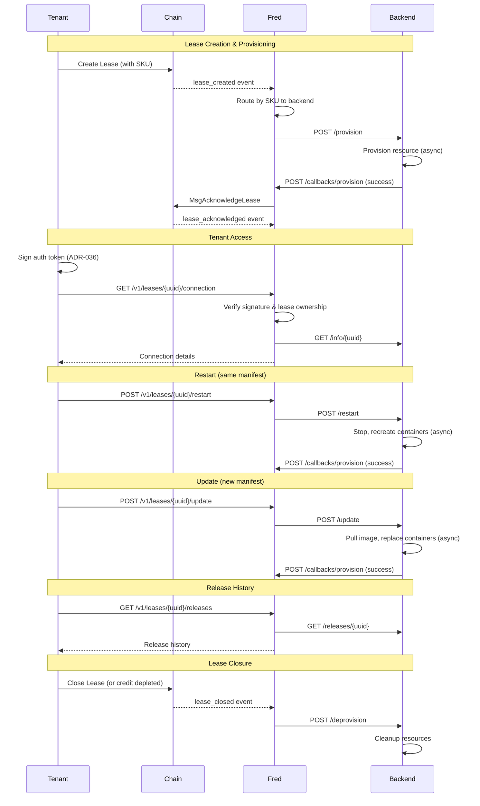

# FRED - Flexible Resource Execution Daemon

A Go daemon for Manifest Network providers that manages the complete lease lifecycle with pluggable backend integration, event-driven provisioning, and automatic resource management.

## Features

- **Lease Lifecycle Management**: Watches chain events and orchestrates provisioning through backends
- **Multi-Backend Support**: Route leases to different backends based on exact SKU UUID list, distributing new provisions to the least-loaded matching backend (lowest allocated-CPU ratio)
- **Event-Driven Architecture**: Uses Watermill for internal event routing with retries and middleware
- **Tenant Authentication API**: HTTP/HTTPS API with ADR-036 signature verification for tenant access
- **Periodic Withdrawals**: Configurable scheduled withdrawal of accumulated fees from active leases
- **Credit Monitoring**: Tracks tenant credit balances and auto-closes leases when credit is depleted
- **Cross-Provider Credit Detection**: Responds to credit depletion events from other providers
- **Live Operations**: Restart containers or deploy new manifests (update) on active leases with full release history tracking
- **Data Retention & Restore**: Soft-delete a lease's volumes on close and restore them into a new lease within a grace window, optionally onto a different SKU tier
- **Security**: Rate limiting, request size limits, input validation, and optional TLS

## Architecture Overview

```
                              MANIFEST CHAIN
                                    |
                                    | WebSocket (events)
                                    v
+------------------------------------------------------------------+
|                              FRED                                 |
|                                                                   |
|  +------------------+                                             |
|  | Event Subscriber |  (fan-out: each consumer gets all events)  |
|  | (WebSocket)      |-----+------------------+                    |
|  +------------------+     |                  |                    |
|                           v                  v                    |
|  +------------------+  +------------------+  +------------------+ |
|  | Event Bridge     |  | Watcher          |  | (other future    | |
|  | -> Watermill     |  | (cross-provider) |  |  consumers)      | |
|  +------------------+  +------------------+  +------------------+ |
|           |                                                       |
|           v                                                       |
|  +------------------+     +------------------+                    |
|  | Watermill Router |---->| Provision        |                    |
|  | (event routing)  |     | Manager          |                    |
|  +------------------+     +------------------+                    |
|                                   |                               |
|  +------------------+             |                               |
|  | API Server       |<------------+                               |
|  | (tenant access)  |             |                               |
|  +------------------+             v                               |
|                           +------------------+                    |
|                           | Backend Router   |                    |
|                           | (SKU routing +   |                    |
|                           |  least-loaded)   |                    |
|                           +------------------+                    |
|                                   |                               |
+------------------------------------------------------------------+
                                    |
              +---------------------+---------------------+
              v                     v                     v
      +---------------+     +---------------+     +---------------+
      |   Docker-1    |     |   Docker-2    |     |   Docker-3    |
      |   Backend     |     |   Backend     |     |   Backend     |
      | (skus: [uuid])|     | (skus: [uuid])|     | (skus: [uuid])|
      +---------------+     +---------------+     +---------------+
```

Inside the provider, construction binds the durable placement Store, the
process-local operation Registry, one backend router, and one validated callback
factory exactly once. Purpose-specific placement applications own complete
provision, restore, maintenance, callback, timeout, deprovision, and
reconciliation sequences; Watermill and HTTP handlers supply opaque intents and
consume closed results rather than assembling claims or selecting outcomes.
The Registry exposes only its one-shot settlement-authority binder; after
composition, `Manager` retains an `operation.RuntimeController` for status and
graceful drain, not Registry mutation authority.

### Event Fan-Out

The Event Subscriber uses a fan-out pattern where each consumer (Event Bridge, Watcher, etc.) gets its own channel and receives **all** events independently. This ensures that:
- The provisioner never misses lease events
- The watcher always sees cross-provider credit depletion events
- New consumers can be added without affecting existing ones

## Lease Lifecycle


```mermaid
sequenceDiagram
    participant T as Tenant
    participant C as Chain
    participant F as Fred
    participant B as Backend

    Note over T,B: Lease Creation & Provisioning
    T->>C: Create Lease (with SKU)
    C-->>F: lease_created event
    F->>F: Route by SKU to backend
    F->>B: POST /provision
    B->>B: Provision resource (async)
    B->>F: POST /callbacks/provision (success)
    F->>C: MsgAcknowledgeLease
    C-->>F: lease_acknowledged event

    Note over T,B: Tenant Access
    T->>T: Sign auth token (ADR-036)
    T->>F: GET /v1/leases/{uuid}/connection
    F->>F: Verify signature & lease ownership
    F->>B: GET /info/{uuid}
    F-->>T: Connection details

    Note over T,B: Restart (same manifest)
    T->>F: POST /v1/leases/{uuid}/restart
    F->>B: POST /restart
    B->>B: Stop, recreate containers (async)
    B->>F: POST /callbacks/provision (success)

    Note over T,B: Update (new manifest)
    T->>F: POST /v1/leases/{uuid}/update
    F->>B: POST /update
    B->>B: Pull image, replace containers (async)
    B->>F: POST /callbacks/provision (success)

    Note over T,B: Release History
    T->>F: GET /v1/leases/{uuid}/releases
    F->>B: GET /releases/{uuid}
    F-->>T: Release history

    Note over T,B: Lease Closure
    T->>C: Close Lease (or credit depleted)
    C-->>F: lease_closed event
    F->>B: POST /deprovision
    B->>B: Cleanup resources
```

## Building

```bash
# Build all binaries (including placement-preflight and placement-repair)
make all

# Build only providerd
go build -o build/providerd ./cmd/providerd

# Build only mock-backend
go build -o build/mock-backend ./cmd/mock-backend

# Build only docker-backend
go build -o build/docker-backend ./cmd/docker-backend

# Build only k3s-backend
go build -o build/k3s-backend ./cmd/k3s-backend

# Build the offline placement tools
go build -o build/placement-preflight ./cmd/placement-preflight
go build -o build/placement-repair ./cmd/placement-repair
```

> **k3s-backend is currently an experimental, non-functional scaffold (ENG-133):** the binary boots, serves the backend HTTP contract, and signs/verifies callbacks, but its provisioner returns `status=failed, error="not implemented"` for every provision. It is **not usable in production**; real Kubernetes provisioning lands in ENG-134+.

## Local Development Setup

For a one-shot dev environment against a running local chain, use:

```bash
bash scripts/dev-init.sh
```

This registers a provider and SKUs on-chain, generates `config.docker.yaml` (the `providerd` config) and `docker-backend.yaml`, and writes a callback secret. Its final output gives the required fresh-start order: seal the empty backend, start it, drain mutation/callback work while leaving its inventory endpoints live, run `placement-preflight -initialize-fresh` with `providerd` plus tenant/chain mutation ingress fenced, and only then start `providerd`. Normal startup deliberately does not create `placements.db`. The script is intentionally one-shot and refuses to overwrite generated configuration or existing authority. All settings are overridable via environment variables — see the script header for the full list. Requires `manifestd`, `jq`, `curl`, `openssl`, and `findmnt` (from util-linux) on `PATH` plus a running local chain.

## Configuration

Copy the example configuration and customize:

```bash
cp config.example.yaml config.yaml
```

### Required Configuration

All required fields are validated at startup. The daemon will fail to start with a clear error message if any required configuration is missing or invalid. Provider, Docker and K3s YAML configuration files must contain exactly one document; unknown keys, including nested keys, are rejected. Provider YAML and JSON configuration also reject case-insensitive key collisions, so aliases cannot silently override a security setting.

| Option | Description |
|--------|-------------|
| `provider_uuid` | Your registered provider UUID (must be valid UUID format) |
| `provider_address` | Provider management address |
| `keyring_dir` | Directory containing keyring |
| `key_name` | Key name for signing transactions |
| `backends` | At least one backend must be configured (multiple backends may share `skus` for load-based routing); production requires a distinct `hmac_secret` on every entry |
| `callback_base_url` | URL where backends send callbacks (absolute HTTP(S); HTTPS is required in production mode) |
| `placement_store_db_path` | Critical provider-bound lease-to-backend authority. It must be an existing prepared database at startup and is not hot-swappable |

### Backend Configuration

Backends are services that handle the actual resource provisioning. Backend and callback URLs must be absolute HTTP(S) URLs. Provider `production_mode: true` requires HTTPS in both directions and verifies backend peers using the configured private CA (or system roots); bundled backends must also enable production mode so callback peer verification cannot be disabled. HTTP is development-only because request HMAC does not authenticate backend responses and callback HMAC does not provide transport confidentiality.

The currently deployed and production-validated execution envelope is
`docker-backend` on XFS. K3s is a non-functional scaffold, and Docker's Btrfs
and ZFS volume implementations have automated coverage but are experimental and
not deployed; use XFS for production. See [Deployment](DEPLOYMENT.md#filesystem-setup).

Leases are routed to backends using the **`skus`** field — an exact list of on-chain SKU UUIDs. A backend with no `skus` matches nothing. A SKU that no backend lists goes to the fallback backend: the one with `default: true` (at most one may set it), or the first configured backend when none does. A fenced fallback receives no new provisions. When multiple backends match the same SKU, Fred routes each new provision to the least-loaded matching backend — the SKU-matching backend reporting the lowest allocated-CPU ratio from its `/stats` endpoint (ENG-318), preferring backends that do not report `disk_withheld`. Ties break by fewest in-flight provisions, then by a round-robin counter; round-robin is also the fallback when no matching backend exposes usable load stats.

```yaml
backends:
  # Give every backend the same skus list so they all match,
  # then Fred routes each provision to the least-loaded one.
  - name: docker-1
    url: "http://10.0.0.1:9001"
    # Must equal docker-1's own callback_secret; never reuse on another backend.
    hmac_secret: "docker-1-unique-32-byte-minimum-secret"
    skus:
      - "a1b2c3d4-e5f6-7890-abcd-1234567890ab"
      - "b2c3d4e5-f6a7-8901-bcde-2345678901bc"
    default: true

  - name: docker-2
    url: "http://10.0.0.2:9001"
    # Must equal docker-2's own callback_secret.
    hmac_secret: "docker-2-unique-32-byte-minimum-secret"
    skus:
      - "a1b2c3d4-e5f6-7890-abcd-1234567890ab"
      - "b2c3d4e5-f6a7-8901-bcde-2345678901bc"

callback_base_url: "http://fred.provider.example.com:8080"

# Required. Records durable attempts and confirmed ownership so reads,
# reconciliation, restore, and deprovision reach the right backend.
placement_store_db_path: "/var/lib/fred/placements.db"
```

**Per-backend fields:**

| Field | Description | Default |
|-------|-------------|---------|
| `name` | Stable, case-sensitive durable backend identity; must be non-blank and unique | (required) |
| `url` | Absolute `http://` or `https://` origin with a usable ASCII hostname (punycode for IDNs); an explicit port must be 1–65535 | (required) |
| `hmac_secret` | Bidirectional HMAC key for this backend; set the backend process's `callback_secret` to the same value. Selecting per-backend authentication requires at least 32 bytes per key and pairwise uniqueness in every mode. | (required in production; all backends or none in development) |
| `hmac_secret_previous` | Verify-only key accepted on this backend's callbacks during a key rotation; providerd never signs with it. Requires `hmac_secret` on the same backend and at least 32 bytes, and must not duplicate any other configured key. See [Rotating a backend's HMAC key](DEPLOYMENT.md#rotating-a-backends-hmac-key) | `""` |
| `skus` | Exact list of on-chain SKU UUIDs this backend serves | `[]` |
| `default` | Fallback for SKUs no backend lists. At most one backend may set it; without one, the first configured backend is the fallback | `false` |
| `timeout` | HTTP request timeout for calls to this backend | `30s` |
| `tls_ca_file` | PEM CA that signed the backend's server certificate; empty uses the system roots. Requires an `https://` `url` | `""` |
| `tls_skip_verify` | Skip backend certificate verification (development only; rejected when `production_mode: true`). Requires an `https://` `url` | `false` |
| `tls_client_cert_file`, `tls_client_key_file` | Client certificate and key for mTLS to the backend; set both or neither. Require an `https://` `url` | `""` |
| `fenced` | Keep a backend you no longer trust in the topology: providerd sends it nothing, refuses its callbacks, routes no new lease to it, and ignores its inventory, while its leases keep their placement and wait. Requires `hmac_secret` on every backend and at least one unfenced backend. See [Containing a compromised backend](SECURITY.md#containing-a-compromised-backend) | `false` |

**Validation rules:**
- Backend names must be valid printable UTF-8 with no leading/trailing
  whitespace and exactly unique (comparison is case-sensitive)
- Treat a backend name as an immutable storage identity: removing or renaming it
  while a durable placement refers to it is rejected. A drained name may leave
  the active topology and later return only for the same storage identity;
  replacement storage must use a new unique name. Removal also requires the
  latest complete, topology-bound raw provision and retention inventories to
  prove that backend empty; silence is not a drain proof
- Backend URLs must be absolute `http://` or `https://` origins with a
  non-empty, non-dot ASCII hostname (use punycode for internationalized
  names), no path/query/fragment/user info, and any
  explicit port in the range 1–65535. Empty `?` and `#` markers are rejected
  rather than silently normalized away; production mode requires peer-verified
  `https://` (a configured private CA is supported)
- `callback_base_url` must be an absolute `http://` or `https://` URL without
  user info, a fragment, malformed query syntax, or reserved `operation_id` /
  `lifecycle_id` query keys. Its authority follows the same hostname and port
  rules as backend origins. Its path must contain no internal
  empty/dot/parent segments, backslashes, or percent-encoded separators
- Trailing path slashes on `callback_base_url` are automatically stripped;
  its path escaping is canonicalized. Unrelated query bytes are preserved for
  callback HMAC signing, so spaces, non-ASCII bytes, and other unsafe raw bytes
  must be percent-encoded before configuration
- `callback_canonical_path_prefix` must exactly equal the normalized escaped
  path of `callback_base_url` (both are empty for a root/direct URL). This
  fail-fast check prevents a path-stripping proxy configuration from making
  every HMAC callback fail at runtime
- Complete callback destinations are accepted and persisted only when their
  canonical path ends in `/callbacks/provision`; dot segments, encoded path
  separators, fragments, user info, empty query markers, and unstable raw
  query bytes fail closed

### Full Configuration Reference

| Option | Description | Default |
|--------|-------------|---------|
| `log_level` | Log verbosity (debug, info, warn, error) | `info` |
| `production_mode` | Enforce security requirements at startup (TLS, replay protection, SSRF) | `false` |
| `chain_id` | Chain identifier | `manifest-1` |
| `grpc_endpoint` | Chain gRPC endpoint | `localhost:9090` |
| `websocket_url` | CometBFT WebSocket URL | `ws://localhost:26657/websocket` |
| `grpc_tls_enabled` | Enable TLS for gRPC to the chain | `false` |
| `grpc_tls_ca_file` | Custom CA certificate file for gRPC TLS | `""` (system CAs) |
| `grpc_tls_skip_verify` | Skip gRPC TLS certificate verification (development only) | `false` |
| `provider_uuid` | Your registered provider UUID | (required) |
| `provider_address` | Provider management address | (required) |
| `keyring_backend` | Keyring backend (file, os, test) | `file` |
| `keyring_dir` | Directory containing keyring | (required) |
| `key_name` | Key name for signing transactions | (required) |
| `api_listen_addr` | API server listen address | `:8080` |
| `tls_cert_file` | TLS certificate file (PEM). Must be set with `tls_key_file` or neither. | `""` |
| `tls_key_file` | TLS private key file (PEM). | `""` |
| `withdraw_interval` | How often to withdraw funds | `1h` |
| `bech32_prefix` | Address prefix for validation | `manifest` |
| `rate_limit_rps` | Per-IP tenant API rate limit (req/s); callbacks use separate buckets | `10` |
| `rate_limit_burst` | Per-IP rate limit burst size | `20` |
| `tenant_rate_limit_rps` | Per-tenant rate limit (requests/second). `0` disables per-tenant limiting | `5` |
| `tenant_rate_limit_burst` | Per-tenant burst size. While per-tenant limiting is enabled, `0` passes validation but rejects every authenticated tenant request with `429` | `10` |
| `trusted_proxies` | CIDR blocks of trusted proxies for X-Forwarded-For | `[]` |
| `cors_origins` | Allowed CORS origins for browser clients. `["*"]` allows all; `[]` disables CORS. | `["*"]` |
| `backends` | List of backend configurations | (required) |
| `callback_base_url` | Base URL for backend callbacks | (required) |
| `callback_secret` | Legacy fleet-wide HMAC key accepted only outside production; do not combine with `backends[].hmac_secret` | `""` |
| `callback_canonical_path_prefix` | Path prefix prepended to inbound callback URIs before HMAC verification. It must exactly equal the normalized escaped path in `callback_base_url` and the prefix stripped by the trusted proxy (e.g., `/api/fred`). Both values are empty for a root/direct URL. See [SECURITY.md](SECURITY.md) and [docs/security-callback-auth.md](docs/security-callback-auth.md). | `""` |
| `reconciliation_interval` | How often to run reconciliation | `5m` |
| `token_tracker_db_path` | Path to bbolt database for token replay protection | (optional; required if `production_mode`) |
| `payload_store_db_path` | Path to bbolt database for payload storage. Without it, `/data` uploads are refused with `409` and updates with `503` | (optional) |
| `placement_store_db_path` | Path to the critical provider-bound durable lease→backend placement authority used for write-ahead placement, routing, restore, and restart recovery. Normal startup opens only an existing prepared, unsymlinked, single-link regular file with exact mode `0600` and never creates or migrates it. Never replace, unlink, rename, or restore the path while `providerd` is running | (required) |
| `placement_snapshot_dir` | Directory for online snapshots of `placements.db` and `payloads.db`; empty disables them. Must be an absolute, clean path that is not the directory of either live database, and requires `payload_store_db_path`. See [Online snapshots](DEPLOYMENT.md#online-snapshots) | `""` |
| `placement_snapshot_interval` | How often to snapshot; at least `5m`. Validated only when `placement_snapshot_dir` is set | `1h` |
| `placement_snapshot_retain` | Number of complete snapshot sets to keep, `1`–`1000`. Validated only when `placement_snapshot_dir` is set | `24` |
| `maintenance_legacy_idempotency_tenants` | Tenant addresses whose restart/update requests may omit `Idempotency-Key` (see [Restart Lease](#restart-lease)). Entries must be distinct canonical bech32 account addresses with `bech32_prefix` | `[]` |
| `max_request_body_size` | Maximum request body size in bytes | `1048576` (1MB) |

> **Note:** The Docker backend has additional configuration (`releases_db_path`, `releases_max_age`, `container_stop_timeout`, etc.) documented in `docker-backend.example.yaml`.

Bundled backends also require a one-shot storage-lineage initialization before
their first normal start. For a genuinely new empty Docker backend, run
`docker-backend -config docker-backend.yaml -initialize-storage-identity new`;
the k3s scaffold uses the corresponding `k3s-backend` command. Normal startup is
verification-only and will not create or repair markers or authoritative
journals. Existing v0.13 Docker storage instead uses the stopped-and-drained
`adopt` cutover in [Deployment](DEPLOYMENT.md#upgrading-from-v0130).

Bundled Docker and k3s backends require a positive `callback_max_age` (default
`24h`). The age applies to typed lifecycle observations;
exact operation and maintenance completions never expire because they may be the
only evidence that can settle Fred's durable write-ahead attempt or an exact
replacement. Operation/maintenance intents and Docker close intents likewise do
not age out. An operation row transitions atomically from Pending to Succeeded or
Failed when its callback is enqueued and remains after that delivery succeeds;
the outbox row and durable terminal decision have deliberately separate
lifetimes. A later authorized lease transition may atomically supersede or
retire the terminal history. Strict per-lease FIFO means an undeliverable exact completion remains
a permanent ordering barrier until it is delivered or repaired. Zero or negative
values are rejected at startup.

### Advanced Configuration

These options have sensible defaults but can be tuned for specific environments:

| Option | Description | Default |
|--------|-------------|---------|
| `http_read_timeout` | HTTP server read timeout | `15s` |
| `http_write_timeout` | HTTP server write timeout | `15s` |
| `http_idle_timeout` | HTTP server idle timeout | `60s` |
| `websocket_ping_interval` | WebSocket ping interval | `30s` |
| `websocket_reconnect_initial` | Initial WebSocket reconnect delay | `1s` |
| `websocket_reconnect_max` | Maximum WebSocket reconnect delay | `60s` |
| `tx_poll_interval` | Transaction confirmation poll interval | `500ms` |
| `tx_timeout` | Deadline for the entire public chain write: signer permit queue, all sub-batches/retries, confirmation, and withdrawal response lookup. Also bounds each acknowledgement flush, including its initial query and fallback attempts | `30s` |
| `query_page_limit` | Page size for chain queries | `100` |
| `max_withdraw_iterations` | Max pages per provider-wide withdrawal cycle (cursor pagination) | `100` |
| `withdraw_limit` | Leases settled per provider-wide withdrawal tx (`MsgWithdraw.Limit`); trades tx count vs per-tx gas. Must be 1..the chain's max batch size (currently 100) | `100` |
| `gas_limit` | Fallback gas used only when a per-tx gas simulation fails or is unavailable; every tx is otherwise gas-simulated per-tx. | `1500000` |
| `gas_adjustment` | Multiplier applied to the simulated gas estimate (Cosmos `--gas-adjustment` convention), giving headroom above the estimate, and to `gas_limit` on the fallback path. Matches the Cosmos CLI flag. Range: 1.0–3.0. | `1.2` |
| `max_gas_limit` | Absolute reject-cap: a tx whose adjusted simulated estimate exceeds it is terminally rejected before broadcast (never sent); it also clamps the out-of-gas retry ladder. `0` = uncapped. Must be ≥ `gas_limit` when set. | `0` |
| `gas_price` | Gas price (micro-units of `fee_denom` per gas unit). Each tx pays fee = ceil(gas × gas_price / 1_000_000), at least 1, where gas is the limit declared on that tx: normally the simulated estimate × `gas_adjustment`, otherwise the adjusted `gas_limit` fallback or an out-of-gas retry value | `25` |
| `fee_denom` | Fee denomination | `umfx` |
| `sub_signer_count` | Number of authz sub-signers for parallel tx signing. `0` = single-signer mode. | `0` |
| `sub_signer_min_balance` | Minimum balance before a sub-signer is topped up. | `10000000umfx` |
| `sub_signer_top_up_amount` | Amount transferred per top-up. | `50000000umfx` |
| `sub_signer_fund_check_interval` | How often balances are checked. | `1h` |
| `credit_check_interval` | How often the scheduler wakes to run the credit check, independent of `withdraw_interval`. `0s` couples it to `withdraw_interval`; when set >0 it must be ≤ `withdraw_interval`. A smaller value polls credit faster while the paid withdrawal stays rate-limited to `withdraw_interval` (the ENG-524 withdraw-cadence guard). | `0s` |
| `credit_check_error_threshold` | Consecutive failed credit reads for one tenant after which the scheduler schedules an earlier re-check (after `credit_check_retry_interval`). Read errors never close leases or disable monitoring | `3` |
| `credit_check_retry_interval` | Delay before an earlier follow-up credit check. Applies in two cases: once a tenant's consecutive credit-check errors reach `credit_check_error_threshold`, and while a zero-balance closure is being deferred inside its `credit_check_zero_grace_period` window (so the empty balance is re-confirmed promptly rather than at the next full `credit_check_interval`). | `30s` |
| `credit_check_zero_grace_period` | How long a tenant's credit must stay empty before its leases are auto-closed. A single stale zero read (e.g. the chain node briefly lagging a top-up) is absorbed: closure only fires once the empty balance persists for this whole window, and any non-zero read clears it. Lower = faster reclaim of unpaid leases; higher = more tolerance for transient chain-node lag before soft-deleting tenant data. `0s` uses the 5m default. | `5m` |
| `shutdown_timeout` | Maximum time for graceful shutdown (drain + cleanup) | `30s` |

The callback route has a separate two-minute application budget because a
terminal result may include chain settlement. It extends the connection write
deadline for that request only; `http_write_timeout` and the generic 30-second
request middleware continue to govern the other HTTP routes. Bundled backends
give the complete delivery retry chain an additional 15 seconds. A fresh first
attempt therefore normally leaves time for providerd to return its retryable
503 after the application budget expires. Quick retries and their 0/1s/5s
backoffs share that one two-minute-fifteen-second deadline rather than resetting
it; after an earlier failure consumes part of the budget, a later attempt may
reach the sender's remaining deadline before providerd's per-request timer.
Either result keeps the durable FIFO head for a later replay instead of holding
the same lease for another full application budget. Bundled backends commit
operation, maintenance, and lifecycle callback facts before sending a
non-blocking wake to their tracked replay loop. Only that loop performs HTTP, so
the retry chain never extends a lease actor, API handler, or startup-recovery
critical section. A slow callback can occupy one replay worker and its per-lease
FIFO lock, without stalling another lease or backend node. This callback budget
is deliberately independent of providerd's `backends[].timeout`, which governs
Fred-to-backend requests.

### TLS Configuration

See [SECURITY.md](SECURITY.md#transport-security) for TLS configuration details (API server HTTPS, gRPC to chain).

### Environment Variables

An environment variable named `PROVIDER_` plus the upper-cased key overrides that key, but only when the key has a built-in default or appears in the config file. These keys have no default and must therefore appear in the config file: `provider_uuid`, `provider_address`, `keyring_dir`, `key_name`, `tls_cert_file`, `tls_key_file`, `trusted_proxies`, `backends`, `callback_base_url`, `callback_secret`, `callback_canonical_path_prefix`, `maintenance_legacy_idempotency_tenants`, `token_tracker_db_path`, `payload_store_db_path`, and `placement_store_db_path`. providerd cannot start from environment variables alone.

```bash
export PROVIDER_CHAIN_ID=manifest-1                            # has a default
export PROVIDER_CALLBACK_BASE_URL=http://fred.example.com:8080 # only if the config file sets callback_base_url
```

`FRED_KEYRING_PASSPHRASE` and `FRED_MNEMONIC` are separate secrets, not config keys; see [Deployment](DEPLOYMENT.md#required-field-checklist).

## Usage

```bash
# Run with config file
./build/providerd -c config.yaml

# Print version (providerd, backend binaries, and placement tools support --version)
./build/providerd --version
./build/docker-backend --version
./build/k3s-backend --version
```

> **k3s-backend is currently an experimental, non-functional scaffold (ENG-133):** the binary boots, serves the backend HTTP contract, and signs/verifies callbacks, but its provisioner returns `status=failed, error="not implemented"` for every provision. It is **not usable in production**; real Kubernetes provisioning lands in ENG-134+.

## API Endpoints

### Endpoint Reference

#### Tenant API

| Method | Path | Auth | Replay | Lease State | Notes |
|--------|------|------|--------|-------------|-------|
| `GET` | `/v1/leases/{uuid}/connection` | ADR-036 | Yes | Active | Returns sensitive connection details |
| `GET` | `/v1/leases/{uuid}/status` | ADR-036 | No | Any | Idempotent read |
| `GET` | `/v1/leases/{uuid}/provision` | ADR-036 | No | Any | Idempotent read |
| `GET` | `/v1/leases/{uuid}/logs` | ADR-036 | No | Any | Idempotent read |
| `GET` | `/v1/leases/{uuid}/releases` | ADR-036 | No | Any | Idempotent read |
| `POST` | `/v1/leases/{uuid}/data` | ADR-036 | No | Pending | Has own idempotency (409 on duplicate) |
| `POST` | `/v1/leases/{uuid}/restart` | ADR-036 + `Idempotency-Key` | Yes | Active | Durable, lease-scoped idempotent maintenance command |
| `POST` | `/v1/leases/{uuid}/update` | ADR-036 + `Idempotency-Key` | Yes | Active | Durable, lease-scoped idempotent maintenance command |
| `POST` | `/v1/leases/{uuid}/restore` | ADR-036 | Yes | Pending | Restore a soft-deleted lease's data into this fresh lease |
| `GET` | `/v1/leases/{uuid}/events` | ADR-036 | No | Any | WebSocket stream of lease status events |

#### Operational

| Method | Path | Auth | Notes |
|--------|------|------|-------|
| `GET` | `/health` | None | Liveness. Probes chain, backends and DBs, but **no verdict ever makes it 503** — poll this from a load balancer |
| `GET` | `/readyz` | None | Deep readiness. Same body; 503 when local bbolt authority is unreadable/withdrawn, no durable inventory baseline matches the configured backend topology, an interrupted inventory sweep still awaits its reporters, or a fenced backend may hold a lease with no placement row. **Not** for load balancers |
| `GET` | `/metrics` | None | Prometheus metrics |
| `GET` | `/workloads?lease_uuid=<u1>&lease_uuid=<u2>...` | None | Bulk workload metadata lookup by lease UUID (1..MaxLookupUUIDs). Confirmed leases without an unresolved attempt query only their recorded owner; unresolved leases use fleet discovery. Unavailable relevant backends produce warnings. Used by the manifest-admin SPA. |
| `POST` | `/callbacks/provision` | HMAC-SHA256 | Backend → Fred callback (5-min replay window) |

See [SECURITY.md](SECURITY.md) for replay protection rationale per endpoint.

### Health Check

```
GET /health     # liveness — no verdict returns 503
GET /readyz     # deep readiness — also 503 while placement inventory is not ready
```

Both probe the same things — chain connectivity, every registered backend, and
the token-tracker, placement-store and payload-store bbolt DBs — and return the
same body. They differ only in how the verdict maps onto the status code:

| `status` | Meaning | `/health` | `/readyz` |
|---|---|---|---|
| `healthy` | Every configured probe passed | 200 | 200 |
| `degraded` | A remote, shared dependency is impaired (chain, or one or more backends). Existing workloads keep serving and exact callbacks plus safely evidenced reconciliation work continue. After inventory bootstrap, the reconciler may place genuinely new recordless `PENDING` work only on backends that answered both inventories; work pinned to a silent owner, `ACTIVE` recordless work, and conflicts remain deferred, and an unresolved attempt is only redelivered to its attempted backend. A chain outage halts reconciliation and lease-resolving calls. Both conditions still accept backend callbacks | 200 | 200 |
| `unhealthy` | A local, process-owned bbolt store is unreadable, placement authority was permanently withdrawn after a path/inode or outcome-unknown commit failure, or `placement_inventory` is not ready: no durable inventory baseline matches the configured backend topology, an interrupted sweep still awaits both inventories from every backend that could have reported a lost positive, or a fenced backend may hold a lease with no placement row | 200 | 503 |

`checks.placement_inventory` reports a durable baseline bound to the exact set of
configured backend storage identities. A complete `/provisions` plus
`/retentions` projection establishes it; it survives process restarts and
transient incomplete sweeps while that topology is unchanged. A topology
membership change requires identity-bearing responses from the complete
proposed fleet and another complete projection; one temporarily down node does
not revoke an already-established unchanged-topology baseline.

`fred_reconciler_sweep_complete` is 0 while a sweep is in progress or after an
incomplete/error sweep, and becomes 1 only after the most recently completed
full-fleet inventory was durably projected. It is not a fleet-wide admission
gate. With a valid baseline, a partial sweep issues a typed scope containing
only the backends that answered both inventories. That scope can authorize
genuinely recordless `PENDING` work on those nodes. It cannot move or retry work
tied to a silent owner, clear an attempt or conflict from silence, or authorize
recordless `ACTIVE` recovery.

Tenant event dispatch has no per-sweep inventory witness. It instead requires
the durable topology baseline, live-routes by backend stats within that topology,
and durably records the exact attempted backend before making the call. A later
ambiguous result remains pinned regardless of an empty inventory response.

The placement database is bound to the exact configured `provider_uuid` and is
backup-critical, not a derived inventory cache. Restore it after loss. Only a
genuinely new provider with zero total chain lease history can create its first
authority, using the explicit
[`placement-preflight -initialize-fresh`](DEPLOYMENT.md#initializing-a-genuinely-fresh-placement-authority)
workflow after an all-state chain query proves no lease history, an independently
supplied exact backend roster matches configuration, and every configured
backend returns complete, identity-consistent empty inventories. Fresh
initialization is never recovery for a lost placement database. The printed
operator acknowledgement includes the target parent's physical device/inode;
the initializer rejects a rename/recreation between print and initialize and
publishes descriptor-relatively with `renameat2(RENAME_NOREPLACE)`.

Mutation modes that read backend inventory (`placement-preflight --prepare` / `--initialize-fresh`, and `placement-repair --apply`, including conflict repair) require certificate-verified HTTPS for every configured backend, independently of `production_mode`, and refuse to run while any configured backend is fenced. `placement-repair --apply` with `-attest-restored-backup` or `-retire-lost-backend` reads no backend inventory and has neither requirement. Use `tls_ca_file` for a private CA or system roots; existing mTLS credentials remain supported. HTTP and `tls_skip_verify` cannot authorize durable changes because request HMAC does not authenticate inventory responses. Read-only inspection and repair dry-runs may observe development HTTP endpoints; there is no insecure-backend-evidence override.

It is also bound at runtime to the exact regular-file inode opened at
`placement_store_db_path`. Never copy over, unlink, rename, rotate, or restore
that pathname while `providerd` is running. A mismatch or outcome-unknown bbolt
commit permanently withdraws authority from that process; putting the old name
back does not heal it. Preserve the evidence and follow the
[runtime-authority runbook](OPERATIONS.md#placement-runtime-authority-was-withdrawn).
Live backups must use atomic filesystem snapshots, and restores happen only
while stopped.

The mutating offline placement tools likewise bind the mandatory backup
parent's physical identity before remote proof, publish with descriptor-relative
no-replace rename, and retain the exact published inode through mutation and the
final verdict. Re-attestation also binds its SHA-256 bytes, exact length, `0600`
mode, and single-link status. Treat `BACKUP PUBLISHED`, `PREPARED:`/`COMMITTED:`, and
`OUTCOME UNKNOWN` as distinct evidence-preservation outcomes; see the
[deployment procedure](DEPLOYMENT.md#upgrades).

`/health` is a **liveness** contract: no dependency verdict makes it 503, because
providerd runs as the single server of its load-balancer pool and the backends'
completion callbacks arrive on the same listener — so removing it from rotation
takes down the tenant API *and* the callback path that lets a recovering backend
report what it finished (ENG-522). Point load balancers here. Alert on
`fred_health_check_healthy` and `fred_backend_healthy`, not on the status code.

Chain and backend probes start together within a shared three-second remote
budget, so a slow chain cannot consume the backends' opportunity to answer.
Local store validation remains synchronous: the remote deadline cannot interrupt
filesystem or database-lock waits. Health stage histograms distinguish these
costs; investigate latency separately from the dependency verdict before
changing probe timeouts. See the [health runbook](OPERATIONS.md#why-health-never-503s).

Being unauthenticated, both endpoints do still sit behind the global IP rate limiter
and can return `429`; the default budget is far above any sane probe interval.

A check absent from `checks` means an optional dependency is not configured, not
that it passed. `placement_store` and `placement_inventory` are mandatory in
`providerd` and are therefore always present.

**Response:**
```json
{
  "status": "degraded",
  "provider_uuid": "01234567-89ab-cdef-0123-456789abcdef",
  "checks": {
    "chain": {"status": "healthy"},
    "backend:docker-1": {"status": "healthy"},
    "backend:docker-2": {"status": "unhealthy", "message": "backend health check failed"},
    "backend:docker-3": {"status": "unhealthy", "message": "backend is fenced"},
    "token_tracker": {"status": "healthy"},
    "placement_store": {"status": "healthy"},
    "placement_inventory": {"status": "healthy"},
    "payload_store": {"status": "healthy"}
  },
  "stats": {"in_flight_provisions": 2}
}
```

`stats.in_flight_provisions` is the number of provision and restore operations
this process is currently tracking.

### Get Lease Connection

```
GET /v1/leases/{lease_uuid}/connection
Authorization: Bearer <token>
```

Returns connection details for an active lease from the backend. Requires ADR-036 signed bearer token. See [SECURITY.md](SECURITY.md#tenant-authentication-adr-036) for token format and signing details.

**Response (single instance):**
```json
{
  "lease_uuid": "...",
  "tenant": "manifest1...",
  "provider_uuid": "...",
  "connection": {
    "host": "compute-alpha.example.com",
    "fqdn": "a1b2c3d.example.com",
    "ports": {
      "8080/tcp": {"host_ip": "0.0.0.0", "host_port": 32768},
      "443/tcp": {"host_ip": "0.0.0.0", "host_port": 32769}
    },
    "protocol": "https",
    "metadata": {
      "region": "us-east-1",
      "backend": "kubernetes"
    }
  }
}
```

**Response (multi-instance lease):**
```json
{
  "lease_uuid": "...",
  "tenant": "manifest1...",
  "provider_uuid": "...",
  "connection": {
    "host": "compute-alpha.example.com",
    "fqdn": "0-a1b2c3d.example.com",
    "instances": [
      {
        "instance_index": 0,
        "container_id": "abc123",
        "image": "nginx:latest",
        "status": "running",
        "fqdn": "0-a1b2c3d.example.com",
        "ports": {"80/tcp": {"host_ip": "0.0.0.0", "host_port": 32768}}
      },
      {
        "instance_index": 1,
        "container_id": "def456",
        "image": "redis:alpine",
        "status": "running",
        "fqdn": "1-e5f6789.example.com",
        "ports": {"6379/tcp": {"host_ip": "0.0.0.0", "host_port": 32769}}
      }
    ],
    "metadata": {"backend": "docker"}
  }
}
```

**Fields:**
- `fqdn` - Fully qualified domain name for ingress routing (omitted when ingress is not enabled). At the top level (`connection.fqdn`), this is set directly from the backend or propagated from the first instance's FQDN when no top-level value is provided. Each instance and service may also have its own `fqdn`. A top-level or service-level explicit FQDN takes precedence over instance propagation.
- `ports` - Map of container port to host binding (e.g., "8080/tcp" → host_port 32768)
- `instances` - Array of per-instance details for multi-container leases (each with its own ports and optional `fqdn`)
- `services` - Map of service name to connection details for stack (multi-service) leases. Each service contains its own `instances` array and optional `fqdn` (propagated from its first instance when not set explicitly).
- `metadata` - Additional backend-specific data

**Response Codes:**
- `200 OK` - Connection details found
- `401 Unauthorized` - Invalid signature or token
- `403 Forbidden` - Lease does not belong to this tenant
- `404 Not Found` - Lease not found or not `ACTIVE` on chain, or not provisioned
  on its backend
- `500 Internal Server Error` - The chain query failed, or the backend returned
  any error other than not-provisioned while reading connection details
- `503 Service Unavailable` - The replay-protection store is unavailable, or
  durable placement is unusable or unresolved or names a backend Fred no longer
  knows

### Get Lease Status

```
GET /v1/leases/{lease_uuid}/status
Authorization: Bearer <token>
```

Returns the current provisioning status of a lease. Useful for checking if provisioning is in progress or complete.

**Response:**
```json
{
  "lease_uuid": "550e8400-e29b-41d4-a716-446655440000",
  "tenant": "manifest1abc...",
  "provider_uuid": "01234567-89ab-cdef-0123-456789abcdef",
  "state": "LEASE_STATE_PENDING",
  "requires_payload": true,
  "meta_hash_hex": "a1b2c3...",
  "payload_received": false,
  "provisioning_started": false
}
```

**Fields:**
- `tenant` - Tenant address from the authenticated token
- `provider_uuid` - Provider UUID
- `state` - Chain lease state as its protobuf enum name: `LEASE_STATE_PENDING`, `LEASE_STATE_ACTIVE`, `LEASE_STATE_CLOSED`, `LEASE_STATE_REJECTED`, or `LEASE_STATE_EXPIRED`. A value this build does not recognize is reported as its number, and an answer from the retained record (see below) reports `LEASE_STATE_UNSPECIFIED`. `UNSPECIFIED` and unrecognized future values are non-actionable safety states: reconciliation preserves backend state and retries rather than inferring cleanup authority.
- `requires_payload` - True if lease has meta_hash (expects payload upload)
- `meta_hash_hex` - Expected payload hash in hex (omitted if no meta_hash)
- `payload_received` - True if payload has been uploaded
- `provisioning_started` - True if provisioning is in progress
- `provision_status` - Backend provision status (omitted if not provisioned). May be `retained` for a closed/expired lease whose data was soft-deleted and is restorable (see [retention](internal/backend/docker/README.md#soft-delete--restore))
- `fail_count` - Lifetime count of recorded failures, whoever caused them (omitted if zero). A diagnostic only: it never decides whether the lease is closed
- `terminal_budget` - The backend's consecutive-failure budget (omitted when the backend reports none): `consecutive_failures` is the recorded count of consecutive failures of your own workload, and `verdict` is `exhausted` when the provider will close the lease for repeated failure, otherwise `retry`. It is exhausted only by a third or later consecutive failure that comes at least 30 minutes after the first failure of the streak, so a quick burst of failures (an outage) never closes the lease by itself. Restarts, updates and platform failures never count, and a restart or update you request resets the count. Once the lease has stayed ready for ten minutes, its next failure, restart or update starts a fresh streak. The count and verdict shown are the recorded ones and do not change with time, so a lease that has been healthy for a long time can still show its old count until then. See [Repeated failures](#state-matrix)
- `reason` - Stable, machine-readable failure category; present whenever a failure has been recorded — including a `ready` lease whose last update failed and rolled back to the previous version — and omitted (`omitempty`) when empty; see [Failure Reason Codes](#failure-reason-codes)
- `message` - Curated, human-readable failure summary (omitted if empty); no host paths or raw command output
- `retained_until` - RFC3339 retention deadline; present only for retained data with a configured age limit. Omitted when age-based expiry is disabled; other retention policy and capacity limits still apply.
- `items` - Restore shape (`service_name`, `sku`, `quantity`) to request when opening the fresh lease to restore into; present only when `retained`
- `restore_hint` - Short human-readable next step for restoring; present only when `retained`
- `partition` - The [retention partition](docs/manifest-guide.md#retention-partitioning-aggregator-platforms) key recorded with the retained data; present only when `retained` and a partition was recorded

> **Leases the chain cannot find:** `x/billing` never deletes a lease, so a closed lease normally answers through the chain path above, with its chain `state`. If the chain query returns not-found (a lagging or reset RPC node, or a provider pointed at the wrong chain), this endpoint still answers from the retained record, with `state` set to `LEASE_STATE_UNSPECIFIED`. Authorization is then by the retained record's tenant (the signed caller must own it); a cross-tenant caller, or a record that is absent or not retained, gets `404`.

**Response Codes:**
- `200 OK` - Status returned
- `401 Unauthorized` - Invalid signature or token
- `403 Forbidden` - Lease does not belong to this tenant or provider
- `404 Not Found` - The chain has no record of the lease, and no backend returned
  a retained record owned by the caller
- `500 Internal Server Error` - The chain query failed

### Get Provision Diagnostics

```
GET /v1/leases/{lease_uuid}/provision
Authorization: Bearer <token>
```

Returns provision diagnostics for a lease, including status, failure reason, and failure count. Works for both active and non-active leases (e.g., after rejection or closure), falling back to persisted diagnostics when the provision is no longer in memory.

**Response:**
```json
{
  "lease_uuid": "550e8400-e29b-41d4-a716-446655440000",
  "tenant": "manifest1abc...",
  "provider_uuid": "01234567-89ab-cdef-0123-456789abcdef",
  "status": "failed",
  "fail_count": 3,
  "terminal_budget": {"verdict": "retry", "consecutive_failures": 1},
  "reason": "ContainerExited",
  "message": "container exited unexpectedly"
}
```

**Fields:**
- `status` - Provision status: `provisioning`, `ready`, `failing`, `failed`, `restarting`, `updating`, `deprovisioning`, `retained`, or `unknown`. `failing` is a transient state between container-death detection and the Failed callback; `deprovisioning` covers the container-removal window; `retained` marks a closed/expired lease whose data was soft-deleted and is restorable
- `fail_count` - Lifetime count of recorded failures (diagnostic only; it never decides a close)
- `terminal_budget` - The consecutive-failure budget, as in [Get Lease Status](#get-lease-status); omitted when the backend reports none or the answer comes from persisted diagnostics
- `reason` - Stable, machine-readable failure category, always present when `status` is `failed` (defaults to `Unknown` if no specific cause was recorded); see [Failure Reason Codes](#failure-reason-codes)
- `message` - Curated, human-readable failure summary; may be empty
- `items`, `restore_hint`, `partition` - Present only when `status` is `retained` (restore shape, next-step hint, and recorded retention partition); see [Get Lease Status](#get-lease-status)
- `retained_until` - RFC3339 retention deadline for retained data with a configured age limit. Omitted when age-based expiry is disabled; other retention policy and capacity limits still apply.

**Response Codes:**
- `200 OK` - Provision found
- `401 Unauthorized` - Invalid signature or token
- `403 Forbidden` - Lease does not belong to this tenant
- `404 Not Found` - Provision not found (never provisioned or diagnostics expired)
- `500 Internal Server Error` - The chain query failed, or a backend returned an
  error other than not-provisioned and no backend reported the provision
- `503 Service Unavailable` - Durable placement is unresolved, so absence cannot be reported safely

#### Failure Reason Codes

`reason` is an **open, add-only** enum (Kubernetes `Condition.Reason`-shaped): new values may be
added in future releases without notice. Clients **must** treat any value they don't recognize as
a generic failure and fall back to displaying the human-readable `message` — never match/branch on
`reason` with an exhaustive switch that errors on the default case. Adding a new `reason` is
considered a backward-compatible change.

A `ready` lease can retain `reason` and `message` from a failed maintenance
attempt while its original runtime remains available. Periodic Docker recovery
preserves that cause while the same release and operation remain `ready`,
including transient healthcheck observations. An actual recovery from `failed`
to `ready`, or a successful replacement, can clear the previous cause. Use
`status` to determine the current runtime state.

The set defined today:

| Reason | Meaning |
|---|---|
| `ContainerExited` | A container exited unexpectedly (crash, non-zero exit, OOM kill) |
| `HealthCheckFailed` | A container's health check never passed during startup: it reported unhealthy, or was still not healthy at the startup deadline |
| `ContainerStartFailed` | The container runtime refused to start a container, which never ran (for example, its entrypoint does not exist in the image) |
| `ImagePullFailed` | The container image could not be pulled |
| `Internal` | An internal fred/backend error occurred (not attributable to the tenant's workload) |
| `RestartFailed` | A tenant-initiated restart failed |
| `UpdateFailed` | A tenant-initiated manifest update failed (and was rolled back) |
| `RestoreFailed` | A tenant-initiated restore (redeploy from retained data) failed |
| `VolumeCleanupExhausted` | Volume cleanup on deprovision failed after exhausting all retry attempts |
| `CleanupFailed` | Cleanup on deprovision failed (containers or volumes) |
| `BackendStorageLost` | An operator retired the lease's backend because its storage was irrecoverably lost; the lease is closed (or, if pending, rejected) on chain |
| `VolumeDeletePending` | A provision was refused because an earlier deletion of the lease's own volume is still finishing on the provider |
| `VolumeDeletionInProgress` | The lease is closing and its volume is still being deleted by the provider; the close completes when the deletion does |
| `Unknown` | Read-boundary default: the lease is `failed` but no specific reason was recorded |

`message` is a short, human-readable string for display; it contains no host filesystem paths or
raw command/daemon output (that detail is retained operator-side, correlated by `lease_uuid`, for
support/debugging).

A lease whose backend an operator retired as lost (see DEPLOYMENT.md, "Retiring
a backend whose storage is lost") is answered from its placement record and no
backend is asked. Its status reports `provision_status: failed` with
`reason: BackendStorageLost`. Provision, connection, logs, releases, restart,
and update, and a restore that names it as the source, answer:

```json
{"error":"the backend storage holding this lease was irrecoverably lost","code":410,"reason":"backend_storage_lost"}
```

The data on the lost storage cannot be recovered; do not retry. These answers
hold until the lease has ended on chain and a later sweep prunes its placement
row; from then on it is answered like any other ended lease.

### Get Container Logs

```
GET /v1/leases/{lease_uuid}/logs?tail=100
Authorization: Bearer <token>
```

Returns live container logs under `<service>/<instance>` keys, falling back to
persisted failure logs after removal. When compensation restores the previous
Ready deployment after a failed update or restart, its live keys remain unchanged
and the failed attempt appears under `failed/<service>/<instance>` keys. A later
deployment removes those older failure entries from the active view. Logs share
a 32 MiB aggregate content budget, with bounded marker and encoding overhead.
Each daemon admits one materialized log response at a time across tenants and
backends, with at most nine admitted requests total. The provider prepares small
authorization and routing results concurrently within those nine slots, then
queues authorized reads in FIFO order for the single response slot. A slow chain
lookup therefore does not hold response memory needed by another authorized read.
Preparation, queueing and retrieval share the original configured request
deadline. A full request queue returns `503 Service Unavailable` with
`Retry-After: 1`; expiry while waiting for the provider response slot returns the
numeric `503` request timeout envelope without a retry header. Requests already
canceled at entry receive the capacity envelope. Backend admission expiry retains its
capacity envelope and retry header.
Admission remains held until both the worker and the final response write finish,
including timeout cleanup; retrying a read does not consume a replay token.
The final response transfer has a separate deadline using the daemon's configured
HTTP write timeout, falling back to the request timeout when no positive write
timeout is configured. A client that does not read, or reads too slowly, can
receive an incomplete response even after `200 OK`. Treat the response as
complete only after reading the entire HTTP body without a transport error and
parsing it as the expected JSON response below; otherwise, retry with a smaller
`tail`. The 32 MiB content budget is unchanged, but it does not guarantee
delivery of a fully escaped response over an arbitrarily slow link.

**Query Parameters:**
- `tail` - Number of log lines to return per container (default: 100, max: 10000)

**Response:**
```json
{
  "lease_uuid": "550e8400-e29b-41d4-a716-446655440000",
  "tenant": "manifest1abc...",
  "provider_uuid": "01234567-89ab-cdef-0123-456789abcdef",
  "logs": {
    "web/0": "2024-01-15 Starting nginx...\nListening on port 80\n",
    "db/0": "2024-01-15 Redis ready\n"
  }
}
```

**Fields:**
- `logs` - Map of service/instance keys to log output; `failed/` keys identify the compensated attempt

**Response Codes:**
- `200 OK` - Logs found
- `400 Bad Request` - Invalid tail parameter (negative, zero, or exceeds max)
- `401 Unauthorized` - Invalid signature or token
- `403 Forbidden` - Lease does not belong to this tenant
- `404 Not Found` - Provision not found (never provisioned or logs expired)
- `500 Internal Server Error` - The chain query failed, or the backend returned
  another error or an invalid log response
- `503 Service Unavailable` - The log queue is full, the admission wait expires,
  or read capacity is exhausted (`Retry-After: 1`); backend routing is unavailable,
  or durable placement is unusable or unresolved

### Upload Payload

The payload is a deployment manifest in JSON format. See the [Manifest Guide](docs/manifest-guide.md) for the full schema (single-service and stack formats, validation rules, examples). A formal [JSON Schema](docs/manifest-schema.json) is available for client-side validation.

```
POST /v1/leases/{lease_uuid}/data
Authorization: Bearer <token>
Content-Type: application/octet-stream

<raw payload bytes>
```

Upload deployment configuration for a lease that was created with a `meta_hash`. The payload's SHA-256 is checked against the on-chain hash before provisioning starts. Fred does not parse the manifest at upload: a malformed manifest whose hash matches is accepted and fails later, when the backend validates it during provisioning. Requires a payload-specific ADR-036 token that includes the `meta_hash` field. See [SECURITY.md](SECURITY.md#tenant-authentication-adr-036) for token details.

**Response Codes:**
- `202 Accepted` - Payload received, provisioning started
- `400 Bad Request` - Invalid lease UUID, the lease has no `meta_hash`, the body
  could not be read (including a body over `max_request_body_size`), the body is
  empty, or its SHA-256 does not match `meta_hash`
- `401 Unauthorized` - Invalid signature or token, or the token's lease UUID or
  `meta_hash` does not match the lease
- `403 Forbidden` - Lease does not belong to this tenant or provider
- `404 Not Found` - Lease not found or not PENDING
- `409 Conflict` - The payload was not stored: a payload is already stored for
  this lease, or the payload store is not configured, is closed, or failed the
  write. A store failure is therefore also reported as `409`
- `500 Internal Server Error` - The chain query failed, or publishing the
  payload event failed; the stored payload is removed so the upload can be
  retried
- `503 Service Unavailable` (rarely `504 Gateway Timeout`) - The request,
  including the body upload, did not complete within the provider's request
  timeout

### Restart Lease

```
POST /v1/leases/{lease_uuid}/restart
Authorization: Bearer <token>
Idempotency-Key: <canonical UUIDv4>
```

Restart containers for a lease without changing the manifest. Containers are stopped, removed, and recreated with the same configuration. Volumes are preserved. Allowed from `ready` or `failed` state.

The idempotency key is scoped to this lease. Once a command is definitively
settled, retrying the exact same key and command returns its durable result
without starting another replacement; reusing the key for a different command
or update payload returns `409`. A
different key also returns `409` while an earlier command is unresolved. Fred
keeps the receipts of the lease's 1,024 most recent restarts and updates, and
pending commands until they are definitively settled; admitting a newer command
evicts the oldest settled receipt, and closing the lease reclaims the rest.
Clients must generate a fresh UUIDv4 for each new logical command and reuse it
only for retries, so a retry within the last 1,024 commands always replays its
result. Never reuse a key for a new command: a key Fred has forgotten may still
name an earlier release on the backend, and is then refused with `409`.

Each command carries the time Fred admitted it, and Fred stamps a lease's
commands in strictly increasing order. A backend refuses any restart or update
it no longer has a receipt for and that is not newer than the newest command it
has accepted for the lease, so an arbitrarily late or replayed command can
never run again, restart work twice, or move the provider's desired payload
backward. Such a command settles as `410 Gone` with
`reason: maintenance_expired`; it did not run. Send a new command with a new
key.

For clients written before `Idempotency-Key` existed, an operator can list
tenant addresses in `maintenance_legacy_idempotency_tenants`. A restart or update
from a listed tenant may then omit the header: Fred authenticates the request
first, which consumes its single-use signed token, and keys the command by that
token. Each accepted token is one command, as before keys existed, and a
replayed token is refused with `401`; a retry therefore needs a new token and is
a new command. Every such request logs a WARN and increments
`fred_api_maintenance_legacy_key_total`. A malformed or repeated header is still
refused with `400`, after the token's signature is validated but before the
token is consumed, and an unlisted tenant that omits the header receives `400`.

The provider shares a separate budget of 1,024 pending commands and 64 MiB of
journal content, including 512 bytes of phase-growth allowance per command.
There is no fixed per-tenant concurrency cap. A tenant that already has pending
work can borrow the shared pool while leaving one command and 2 MiB available
for a tenant without pending work. Reaching that reserve returns `429` with
`reason: maintenance_capacity_reserved` and `Retry-After: 1` before recording a
new command. Retry that request after your pending work completes. Exact replay
and settlement of admitted commands remain available. Global exhaustion returns
`503`; this finite reserve does not guarantee admission for unlimited new tenant
addresses.

For both restart and update, a `503` response can leave a durably admitted
command pending. Even when an open backend circuit blocks its first attempt,
the command remains pending. Fred retries work at startup and every `reconciliation_interval`
(default `5m`), so the operation can execute later without another tenant request.
A different key receives `409` while the command is pending. Retrying the same
key and exact command safely joins recovery and may continue returning `503`
while progress is blocked. After the lease closes, a positive chain observation
allows recovery to settle the pending command without starting a replacement.

Fred derives tenant, provider, backend/storage, and callback authority from its
prepared placement store; the request supplies none of those routing facts.
For an upgraded v0.13 owner, the first complete identity-bearing fleet inventory
must establish that durable runtime principal before restart/update is enabled.
Once established, an unrelated backend outage does not revoke it.

**Response:** `202 Accepted`
```json
{
  "status": "restarting"
}
```

**Response Codes:**
- `202 Accepted` - Restart initiated
- `400 Bad Request` - Missing, repeated, or non-canonical UUIDv4 `Idempotency-Key`,
  or a backend validation refusal with a curated diagnostic preserved for exact
  retries
- `401 Unauthorized` - Invalid signature or token
- `403 Forbidden` - Lease does not belong to this tenant
- `404 Not Found` - The backend reports that the lease is not provisioned
- `409 Conflict` - The key conflicts with a prior command, another command or
  lifecycle operation is in progress for the lease, the lease is not `ACTIVE` on
  chain, or the backend reports a state that cannot be restarted
- `410 Gone` with `reason: backend_storage_lost` - The lease's backend was
  retired because its storage was lost; the lease is being ended on chain
- `410 Gone` with `reason: maintenance_expired` - The command is older than the
  lease's retained maintenance history and was not run; send a new command with
  a new key
- `429 Too Many Requests` with `reason: maintenance_capacity_reserved` - Shared
  capacity is reserved for a tenant without pending work; this new command was
  not recorded. Retry after your pending work completes (`Retry-After: 1`)
- `500 Internal Server Error` - The backend accepted the command but Fred could
  not yet durably record that acceptance (the pending command remains
  recoverable), or Fred hit an internal error
- `503 Service Unavailable` - Backend dispatch is blocked (for example by an
  open circuit) or its outcome is uncertain, the backend refused it for
  capacity, the chain lease could not be read or was not found, the lease has
  no usable confirmed placement here or its backend is fenced,
  authentication/routing authority is temporarily unavailable, or a bounded
  idempotency journal refused admission before side effects.
  An admitted command can remain pending for automatic recovery as described above

### Update Lease

```
POST /v1/leases/{lease_uuid}/update
Authorization: Bearer <token>
Idempotency-Key: <canonical UUIDv4>
Content-Type: application/json

{
  "payload": "<base64-encoded-manifest>"
}
```

Deploy a new manifest for a lease, replacing containers with a new image/configuration. Fred captures the exact source before replacing it. If replacement fails and Docker effects are settled, bounded compensation can preserve or recreate that source. Unknown effects remain pending; lease close or backend shutdown cancels compensation while retaining completion ownership. Volumes are preserved, but compensation does not undo application writes or database migrations.

The accepted manifest is persisted as **pending desired state** in the maintenance
journal. HTTP `202` confirms that durable acceptance, while the replay payload
remains the last successfully deployed manifest. Only an authenticated completion
for the exact maintenance ID, lifecycle and storage identity can authorize
promotion. A failed or rolled-back update leaves the previous replay payload
unchanged. The durable journal represents waiting-for-completion and
confirmed-for-payload-write as separate states and in-memory capabilities.

Recovery retries an ambiguous backend delivery using the same command. Once
acceptance is recorded, it waits for the exact completion; after success it
retries only the local payload commit. Repeating the same `Idempotency-Key`
joins this work. Until the local commit or terminal failure settles, the lease
remains excluded from conflicting maintenance and reprovision. An HTTP `202`
is therefore not a promise that asynchronous deployment has succeeded.

If an exact chain observation confirms that the lease has since ended, recovery
can settle the accepted command without writing its payload. This lets teardown
proceed despite a payload-store failure; the settlement must still be committed
to placement storage.

The [restart retry contract](#restart-lease) also applies to updates: an admitted
command returning `503` may execute during automatic recovery, and a different
key receives `409` until the pending command settles.

Because the on-chain `meta_hash` is set once at lease creation and cannot currently be updated, an updated payload no longer matches it. Fred records each stored payload's own SHA-256 and verifies against that on reprovision; `meta_hash` is still used for payloads stored before this behavior existed. See ENG-643 for the on-chain update handshake that restores `meta_hash` as the authoritative reference.

**Response:** `202 Accepted`
```json
{
  "status": "updating"
}
```

**Response Codes:**
- `202 Accepted` - Update accepted with pending desired state persisted
- `400 Bad Request` - Missing/invalid `Idempotency-Key`, payload, or manifest;
  curated backend validation diagnostics are preserved for exact retries
- `401 Unauthorized` - Invalid signature or token
- `403 Forbidden` - Lease does not belong to this tenant
- `404 Not Found` - The backend reports that the lease is not provisioned
- `409 Conflict` - The key conflicts with a prior command, another command or
  lifecycle operation is in progress for the lease, the lease is not `ACTIVE` on
  chain, or the backend reports a state that cannot be updated. An exact retry
  of an update whose deployment failed also returns `409`
- `410 Gone` with `reason: backend_storage_lost` - The lease's backend was
  retired because its storage was lost; the lease is being ended on chain
- `410 Gone` with `reason: maintenance_expired` - The command is older than the
  lease's retained maintenance history and was not run; send a new command with
  a new key
- `429 Too Many Requests` with `reason: maintenance_capacity_reserved` - Shared
  capacity is reserved for a tenant without pending work; this new command was
  not recorded. Retry after your pending work completes (`Retry-After: 1`)
- `500 Internal Server Error` - The backend accepted the update but Fred could
  not yet durably record that acceptance or write the confirmed manifest to the
  provider payload store (the durable pending command remains recoverable), or
  Fred hit an internal error
- `503 Service Unavailable` - Backend dispatch is blocked (for example by an
  open circuit) or its outcome is uncertain, the backend refused it for
  capacity, no payload store is configured, the chain lease could not be read or
  was not found, the lease has no usable confirmed placement here or its backend
  is fenced, routing/authority is temporarily unavailable, or the bounded
  provider/backend idempotency journal refused admission before side effects. An
  admitted command can remain pending for automatic recovery

### Restore Lease

```
POST /v1/leases/{lease_uuid}/restore
Authorization: Bearer <token>
Content-Type: application/json

{
  "from_lease_uuid": "<original-closed-lease-uuid>"
}
```

Restore a soft-deleted lease's retained data into a **new** lease. The path `lease_uuid` is the new, fresh `PENDING` lease the data is adopted into; `from_lease_uuid` in the body names the original closed/expired lease whose volumes were retained (see [retention](internal/backend/docker/README.md#soft-delete--restore)). Fred resolves the backend that holds the source lease's retained data (restore is same-backend, ENG-333), then re-deploys the retained manifest onto the adopted volumes. Only the item **shape** must match: the new lease's requested service names and quantities must equal the original's, but its SKU/disk tier MAY differ. A promote (same-or-larger disk tier) satisfies the tier-size check but still requires sufficient backend capacity and the other admission checks; on success, the new `disk_mb` cap is applied; a demote (smaller disk tier) is allowed only if the retained volume's measured data still fits the new tier's `disk_mb` cap (the backend runs `checkDemoteFit` before adopting). A refused demote returns `422 Unprocessable Entity`; the JSON body's `error` message begins `retained data exceeds the requested smaller tier` (the body's `code` field is the numeric HTTP status, not a string discriminator).

Admission is safe by construction. Fred acquires ordered lifecycle claims for the
source and target, then obtains a store-issued reservation of the exact confirmed
source before re-reading and authorizing the target. That reservation fences even
inventory captured before the lifecycle claims. Durable target admission
atomically transfers the same reservation into the full restore claim while
writing the absent target's operation-scoped attempt, before contacting the
backend. Failure before transfer releases only the early reservation. Concurrent
lifecycle work sharing either lease is rejected before dispatch. The source
reservation is process-local and lasts only through the synchronous backend call;
the target attempt is durable and is later settled only by its exact operation ID.

Backend acceptance confirms the target, while a contract-conforming synchronous
domain refusal clears it. A bare `already_provisioned` response does not prove
which callback generation the backend persisted, so Fred retains the new target
attempt until upgraded inventory reports that exact typed generation or its
authenticated callback arrives. A
timeout, transport error,
panic, generic 5xx, malformed error envelope, or unvalidated 503 is ambiguous: Fred
releases the short-lived source reservation but retains the target attempt because
the backend may have accepted the request. An immediate retry of that target will
normally return 409. A positive report confirms it only when the backend also
reports the exact paired typed lifecycle generation; an older typed or legacy
generation remains current while the newer attempt stays recoverable;
a positive report from another backend creates a durable conflict containing
every candidate. Inventory silence never disproves or clears an ambiguous
attempt because the original request could commit after the list response.
Retrying requires such a contract-conforming synchronous refusal or explicit
operator proof and repair. Backend response bodies are not HMAC-authenticated:
their codes establish protocol conformance under the deployment's transport
trust, not cryptographic authorship. Use TLS or an equivalently trusted network
between Fred and its configured backends when an on-path attacker is in scope.

On the Docker backend, the source retention row remains a durable finalizer for
the destination after adoption. While it exists, Provision and Restore of that
destination are rejected. A pre-commit failure hands the source back only after
teardown/re-quarantine, source-quota proof, and exact
failed-operation settlement; an accepted worker failure may therefore stay
`restoring` until the actor's Failed operation outcome and callback are durable.
If the later source handback must retry, that exact terminal row—not absence—owns
the rollback decision; a missing row fails closed. Reconciliation also holds a
typed exclusive quiescence capability from the exact lease actor across its
decision and substrate work, so queued messages, handlers, workers, terminal
handoff, and actor replacement cannot race rollback. Conversely, an exact
active destination Release is proof the restore committed even if containers
later fail or disappear. With zero survivors, recovery keeps that Release,
reconstructs a conservative Failed destination plus its capacity, and retains
the source finalizer as tenant/provider identity rather than rolling data back.
An exact Succeeded operation plus that immutable finalizer also reconstructs a
missing active Release; Failed plus an exact committed Release is contradictory
authority and fails closed.
Once no Pending or contradictory Failed restore operation remains (an
authorized successor may already have retired Succeeded history), a plain,
identity-preserving Restart may
repair it; Update and custom-domain redeploys remain fenced until that Restart
reaches Ready and reconciliation consumes the finalizer. Close instead hands it
off to a complete durable close intent before teardown.

**Response:** `202 Accepted`
```json
{
  "status": "provisioning"
}
```

**Response Codes:**
- `202 Accepted` - Restore initiated (the lease then transitions through `restarting` to `ready`/`failed`)
- `400 Bad Request` - Missing/invalid `from_lease_uuid`, source and target UUIDs are equal, or items don't match the retained set
- `401 Unauthorized` - Invalid signature or token
- `403 Forbidden` - Lease does not belong to this tenant
- `404 Not Found` - The source has no placement record, is not `CLOSED` or `EXPIRED`, belongs to another tenant/provider, or its configured backend reports no retained data (including retention that has expired)
- `409 Conflict` - Source or target lifecycle work is already in progress, or the target is not `PENDING`, has an unresolved durable provision/restore attempt, or is not in a restorable state
- `410 Gone` with `reason: backend_storage_lost` - The source's backend was retired because its storage was lost; its data cannot be restored
- `422 Unprocessable Entity` - The retained data exceeds a requested smaller tier's `disk_mb` cap; the response relays the backend's bounded, recognized refusal detail
- `500 Internal Server Error` - The restore returned an unexpected or ambiguous backend result, such as a transport error, timeout, generic 5xx, coded already-provisioned response, or unknown refusal code; the durable target attempt is retained until positive evidence confirms it or an operator safely repairs it
- `502 Bad Gateway` - The backend rejected the restore with an unusable or off-contract error response
- `503 Service Unavailable` - Insufficient resources, an open backend circuit, an unavailable source lease observation, unavailable placement routing/recording/tracking, or a source placement that is unusable, unresolved, or names a backend Fred no longer knows

Restore admission conflicts add an optional `reason` while preserving the public
API's numeric HTTP-status `code` and human-readable `error`:

```json
{"error":"lease is already being provisioned or restored","code":409,"reason":"source_busy"}
```

| `reason` | Meaning | Client action |
|---|---|---|
| `source_busy` | The source is owned by lifecycle work, such as close, or another restore dispatch | Keep the target lease and retry later with a fresh bearer token |
| `target_busy` | The target has lifecycle work, a tracked operation, or existing durable placement/attempt evidence | Preserve the target and inspect its status; pending recovery may need to finish before another restore can be admitted |
| `target_not_pending` | An authoritative target chain read found a state other than `PENDING` | Do not retry restore into this target; restore requires a fresh `PENDING` lease |

A generic backend `409` still omits `reason`: its refusal does not identify
whether the source or target state caused the conflict. Missing or unrecognized
reasons are not evidence that it is safe to cancel the target. Preserve its UUID
and inspect its status. Backend protocol string codes, including
`demote_exceeds_tier`, are separate from the public API's numeric `code` field.

### Get Release History

```
GET /v1/leases/{lease_uuid}/releases
Authorization: Bearer <token>
```

Returns the release (deployment) history for a lease, showing each version that was deployed.

**Response:**
```json
{
  "lease_uuid": "550e8400-e29b-41d4-a716-446655440000",
  "tenant": "manifest1abc...",
  "provider_uuid": "01234567-89ab-cdef-0123-456789abcdef",
  "releases": [
    {
      "version": 1,
      "image": "nginx:1.24",
      "status": "superseded",
      "created_at": "2024-01-15T10:30:00Z",
      "manifest": "<base64-encoded-manifest>"
    },
    {
      "version": 2,
      "image": "nginx:1.25",
      "status": "active",
      "created_at": "2024-01-16T14:00:00Z",
      "manifest": "<base64-encoded-manifest>"
    }
  ]
}
```

**Fields:**
- `version` - Monotonically increasing version number
- `image` - Container image used in this release
- `status` - Release status: `deploying`, `active`, `superseded`, or `failed`
- `created_at` - When this release was created
- `reason` - Stable, machine-readable failure category (only present on failed releases); see [Failure Reason Codes](#failure-reason-codes)
- `message` - Curated, human-readable failure summary (only present on failed releases; may be empty)
- `manifest` - The manifest payload used for this release

**Response Codes:**
- `200 OK` - Releases found (may be an empty array)
- `401 Unauthorized` - Invalid signature or token
- `403 Forbidden` - Lease does not belong to this tenant
- `404 Not Found` - Lease not found on chain, or not provisioned on its backend
- `500 Internal Server Error` - The chain query failed, or the backend returned
  an error other than not-provisioned
- `503 Service Unavailable` - Backend routing is unavailable, or durable placement is unusable or unresolved

### Stream Lease Events (WebSocket)

```
GET /v1/leases/{lease_uuid}/events
Authorization: Bearer <token>
```

Opens a WebSocket connection for real-time lease status updates. Events are pushed as JSON frames when the lease transitions between provisioning states (e.g., `provisioning`, `ready`, `failed`, `restarting`, `updating`). A `retained` event is pushed when a closed/expired lease's data is soft-deleted (best-effort, only to currently-connected clients), signalling that the data may be restorable within the grace window. For that event the `status` field is the enum `retained`, and the human-readable restore instruction is carried in the `error` field. A `failed` event can also carry a failure description in `error`; other events omit the field.

**Authentication:** Bearer token via the `Authorization` header or the `?token=` query parameter (since the WebSocket API cannot set custom headers during upgrade). Auth is verified before the WebSocket upgrade, so failures return standard HTTP error responses.

**Response:** `101 Switching Protocols` on successful upgrade

```json
{"lease_uuid":"...","status":"ready","timestamp":"2024-01-15T10:30:00Z"}
{"lease_uuid":"...","status":"restarting","timestamp":"2024-01-15T10:31:00Z"}
{"lease_uuid":"...","status":"ready","timestamp":"2024-01-15T10:31:30Z"}
```

**Behavior:**
- Events are delivered as WebSocket JSON frames
- Events are best-effort notifications, not a globally ordered state log. An
  exact operation-ID callback remains recoverable after a provider restart only
  while the same durable placement Attempt or confirmed lifecycle generation
  exists; a nonmatching or replaced ID is ignored, so it cannot publish stale
  status. Bundled backends serialize each
  lease's durable callback queue: exact provision/restore and maintenance
  completions remain FIFO, autonomous lifecycle observations are latest-only,
  and synchronous provider application preserves that relative order. A bundled
  Docker backend also returns retryable `409 Conflict` for a newer maintenance
  command while that lease's prior exact maintenance completion is still
  queued; successful delivery reopens only that lease. Other event sources and custom/v0.13 backends do not
  carry a global sequence; use the REST status endpoints for current state.
- The server sends WebSocket ping frames every 30 seconds; the client must respond with pong within 40 seconds or the connection is closed
- Slow clients that fall behind have events dropped — use the REST endpoints (`/status`, `/releases`) to catch up
- The stream is push-only. The server reads at most 512 bytes per client message; any client data message closes the connection with `1008`, and a larger message closes it with `1009`
- The token is checked only at the handshake. Each connection lasts at most one hour, then closes with `1013` ("max connection lifetime reached"); reconnect with a fresh token
- A lease accepts at most 10 concurrent subscriptions and the server 1,000 in total. Past either limit the upgrade still succeeds (`101`), then the connection closes at once with `1013` ("too many connections")
- The stream also ends when the client disconnects or the server shuts down (`1001`)

**Response Codes (before upgrade):**
- `101 Switching Protocols` - WebSocket connection established
- `400 Bad Request` - Invalid lease UUID, or the request is not a valid
  WebSocket handshake
- `401 Unauthorized` - Invalid signature or token
- `403 Forbidden` - Lease does not belong to this tenant or provider
- `404 Not Found` - Lease not found on chain
- `429 Too Many Requests` - Rate limit exceeded
- `500 Internal Server Error` - The chain query failed

### Provision Callback (Backend -> Fred)

```
POST /callbacks/provision?operation_id=<uuid>
POST /callbacks/provision?lifecycle_id=<uuid>
Content-Type: application/json
X-Fred-Signature: t=<unix-timestamp>,sha256=<hmac-sha256-hex>
```

Called by backends to report operation results and later lease-lifecycle
observations. Provision and restore completion URLs carry exactly one
`operation_id`; their separately persisted lifecycle URLs carry exactly one
`lifecycle_id`. Both are lowercase, hyphenated, canonical RFC-4122 UUIDv4
values. Preserve the selected URL byte-for-byte: the HMAC covers the complete
request URI, including its query. Requires HMAC-SHA256 authentication via the
`X-Fred-Signature` header. See [SECURITY.md](SECURITY.md#callback-authentication-hmac-sha256) for signing details and replay protection.

**Request:**
```json
{
  "lease_uuid": "...",
  "status": "success",
  "error": "",
  "backend_storage_id": "canonical-uuidv4-for-this-backend-storage",
  "backend": "optional-sender-label",
  "retained": false
}
```

Status must be one of `"success"`, `"failed"`, or `"deprovisioned"`. `deprovisioned` reports a completed teardown and is accepted only on a `lifecycle_id` URL or the tokenless v0.13 route; on an `operation_id` URL it is rejected with `400`. The bundled backends send it when a lease's close completes.

- `backend` (optional string) — legacy sender metadata used only for bounded metrics when no current operation exists. It need not equal Fred's configured router name and cannot authorize or redirect a typed callback; the HMAC-covered callback URL plus Fred's exact-operation registry or durable lifecycle record select the authoritative backend.
- `maintenance_id` (optional canonical UUIDv4 string) — included on the exact durable restart/update completion. The docker-backend also sends one on a custom-domain completion; it names no Fred command, so it settles nothing. Successful update completion authorizes promotion of that command's pending manifest; failed completion discards its promotion. Later runtime-failure observations omit this field. It is HMAC-covered and must match the command under the authorized lifecycle and storage identity. Sending it on an `operation_id` URL or with `deprovisioned` status is rejected with `400`.
- `maintenance_admitted_at` (optional RFC 3339 timestamp in UTC, written with `Z`; a `+00:00` offset is rejected with `400`) — echoes the `admitted_at` Fred sent with that restart/update; Fred compares the instant. Sending it without `maintenance_id` is rejected with `400`. A stamp that differs from the command Fred admitted under that `maintenance_id` cannot settle the command.
- `retained` (optional bool) — set `true` on a `deprovisioned` callback when the backend soft-deleted (retained) the lease's volumes instead of destroying them; with any other status it is rejected with `400`. Fred uses this to push the optimistic `retained` notice to the tenant; the queryable retained status (`GET /v1/leases/{uuid}/status`) is the durable backstop. Omitted/`false` means the volumes were destroyed.
- `operation_id` in the JSON body, if sent by an older or custom backend, is untrusted metadata and is overwritten at ingress. Only the HMAC-authenticated URL query grants exact-operation authority.
- `lifecycle_id` in the JSON body is likewise overwritten. Fred authorizes the authenticated query only when it matches the current durable per-lease lifecycle capability and backend.

**Response Codes:**
- `200 OK` - Callback synchronously reached a terminal application result, or
  was terminally ignored as a duplicate/stale exact-operation callback; the
  backend may advance this lease's durable callback queue
- `400 Bad Request` - Malformed JSON, lease UUID, status, or callback capability query, or a field combination rejected above. `operation_id` and `lifecycle_id` are mutually exclusive; a present empty, nil, non-v4, non-RFC-variant, uppercase, compact, braced, URN, malformed, or duplicate value is rejected
- `401 Unauthorized` - Missing or invalid signature
- `429 Too Many Requests` - Callback ingress or verified-storage rate limit exceeded
- `503 Service Unavailable` - Callback application is unavailable, not yet
  started, shutting down, failed, or timed out; keep the delivery durable and
  retry with backoff

Callbacks have a separate pre-authentication IP budget (100 requests/s, burst
200), independent of tenant routes, plus a post-HMAC budget with the same limits
per verified backend storage identity. Unverified payload identity fields never
spend another backend's authenticated allowance. When the pre-authentication
bucket is exhausted, valid HMAC callbacks can still reach their own storage
bucket, so junk sent directly to the callback route cannot starve a backend
sharing that IP. The legacy single-key mode
shares one authenticated callback bucket. Both limits return `Retry-After`.

Callback application has a dedicated two-minute deadline. Bundled backends give
the complete delivery retry chain two minutes fifteen seconds, so a fresh first
attempt normally leaves response time after the provider's application timer
returns 503. Quick retries and backoff consume that same deadline; a later
attempt may instead be canceled when the sender's remaining budget expires.
A backend must retain the FIFO head until a 2xx response; a 503, transport
timeout, or lost response is not delivery success. When the shared budget
expires, bundled backends defer to their 30-second durable replay loop instead
of holding that lease's FIFO lock for consecutive application budgets.

The v0.13.0 upgrade is a stopped cutover, not a rolling upgrade. Drain every old
callback outbox, stop providerd and all backends, install the upgraded binaries
without starting them, rotate to unique per-backend keys, and run each Docker
backend's mandatory read-only `-preflight-storage-identity-adoption` proof
before taking the cutover backup or sealing storage identity. Then restart
every upgraded backend before the new providerd. Stack-form v0.13 Docker
workloads stay in place; service-name-less pre-stack cohorts are unsupported and
must be resolved before sealing. New backends recover the old operationless callback shape already
embedded in migrated workloads, preserve its tokenless lifecycle route, and
report a non-secret `legacy` generation in internal inventory. Mandatory offline
preparation migrates the corresponding owner as legacy before the new provider
opens it. A pre-identity callback row prevents current callback-store startup;
it is not carried across the cutover. An absent or rebuilt placement database is
never a recovery path for those workloads. The reverse binary order is not
lifecycle-compatible:
an old backend ignores `lifecycle_callback_url` and reuses the expired
operation-scoped URL for later observations. The new provider refuses those
with `400` (or `429` once the pre-authentication budget is exhausted), because
they carry no `backend_storage_id` to select the HMAC key.

The seal covers more than the substrate marker. Docker always binds
`callbacks.db`, `releases.db`, and `retention.db` to the same storage UUID and
to distinct store kinds; `retention.db` remains required when
`retain_on_close: false`. K3s binds `callbacks.db` and `releases.db`.
Every authoritative database must be an unsymlinked, single-link regular file
with exact mode `0600`; initialization and normal startup reject an insecure
restore, and runtime re-attestation withdraws the whole backend lineage on
path/inode, link-count, or permission drift.
Initialization accepts only an all-absent fresh set or a complete, valid,
stopped and drained v0.13 set, records that choice in a crash-resumable pending
anchor, and never completes a mixed set. Before evidence inspection it binds the
physical parent of both markers and every authoritative journal; subsequent I/O
is descriptor-relative, so a parent rename, unmount, or same-path recreation
cannot redirect initialization. Normal startup is verification-only: it will
not create, rebind, or repair any authoritative store. A missing, foreign,
cross-kind, or replaced file fails closed, including during periodic cleanup.
The first terminal journal/substrate failure is sticky backend-wide: every
sibling journal and callback delivery refuses with that cause until restart.
`diagnostics.db` is not authority and may be recreated while stopped. Its
generic opener still refuses symlinks, hard links, non-regular files, and modes
other than exact `0600`, but it is not storage-UUID-bound or continuously
re-attested. Back up and restore the marker pair, complete authoritative-store
set, and substrate together; a
matching complete snapshot retains the same lineage, so fence the original
before starting its restored copy. The preflight's only successful stdout is
`ready_for_v0_13_storage_identity_adoption`; it fails closed on unresolved
v0.13 restore/deprovision crash windows instead of inventing missing authority.
Only complete stack-form v0.13 cohorts are supported. A service-name-less
pre-stack container, `-prev` remnant, authorityless migration generation, or
partial topology is rejected before mutation; the upgraded backend has no
in-place converter for those shapes.
See [Deployment](DEPLOYMENT.md#upgrading-from-v0130) for the complete cutover,
repair, and rollback procedure.

**Idempotency:**
If a callback is received for a lease that has already been processed (no longer in-flight),
the server still returns `200 OK`. A callback carrying an
`operation_id` that is no longer current is ignored completely: it cannot publish
status, acknowledge or reject the lease, retire teardown state, or mutate placement.
The current `lifecycle_id` may publish successful maintenance (`ready`),
runtime failure (`failed`), or retained teardown status. It cannot settle a
provision or restore operation or touch chain state, and its placement effects
are limited to two: an exact update completion settles that update command, and
a deprovisioned observation atomically retires the capability. If no matching
confirmed placement owner remains, the capability is teardown-only:
success/failure is a 200 no-op, it cannot be reissued for maintenance, and only
the exact deprovisioned observation may retire it and publish retained status.
Retirement is durable before that best-effort push, so a process crash can lose
the event but cannot resurrect authority; retention status remains queryable.
A stale, missing,
or retired ID is a 200 no-op. Tokenless callbacks are accepted only for durable
owners migrated from v0.13.0 and keep the same limits.
This is an explicit compatibility boundary: the stopped placement preparation
records the old route as a legacy lifecycle capability with no ID, callback
ingress matches a tokenless callback to that owner (the backend keeps its side
as a `LegacyRuntimeAuthority` in `releases.db`), and no current provision, restore, maintenance, or reconciliation path
can mint a tokenless operation or lifecycle authority.
Response bodies are not guaranteed for this path, so callers should treat the HTTP status
code as the source of truth.

## Backend API Specification

Any backend must implement these HTTP endpoints. This section summarizes the contract; [BACKEND_GUIDE.md](BACKEND_GUIDE.md) is the complete implementation guide, including SKU handling, callback signing, storage identity, state management, and reconciliation.

### Endpoint Reference

All endpoints except `/health`, `/stats`, and `/metrics` require HMAC-SHA256 signature authentication via the `X-Fred-Signature` header.

That HMAC authenticates requests sent *to* a backend. Backend response bodies
are not signed; machine-readable response codes are contract signals trusted
under the configured transport. TLS or an equivalently trusted private network
is required if response forgery by an on-path actor is in scope.

Requests and responses are bound to the backend's sealed storage identity (see
[Durable Backend Storage Identity](BACKEND_GUIDE.md#durable-backend-storage-identity)):

- Mutating `POST`s go to `/_fred/storage/{storage-id}/{operation}`; the paths
  below are their short operation names. Reads and inventories keep the paths
  below.
- Once Fred has pinned the identity, every request also carries it as the
  HMAC-covered `backend_storage_id` query parameter.
- Every response must carry exactly one `X-Fred-Backend-Storage-ID` header
  naming that storage UUID. Fred rejects a response whose header is missing,
  duplicated, or different from the pinned identity.

#### Required

| Method | Path | Auth | Description |
|--------|------|------|-------------|
| `POST` | `/provision` | HMAC | Create resource (async, callback on completion) |
| `POST` | `/deprovision` | HMAC | Remove resource (idempotent) |
| `POST` | `/restart` | HMAC | Restart containers (async, callback on completion) |
| `POST` | `/update` | HMAC | Deploy new manifest (async, callback on completion) |
| `POST` | `/reconcile_custom_domain` | HMAC | Apply a lease's custom domains (idempotent; called every reconciliation sweep) |
| `GET` | `/info/{uuid}` | HMAC | Connection details (host, ports) |
| `GET` | `/provisions` | HMAC | List all provisions (reconciliation) |
| `GET` | `/provisions/{uuid}` | HMAC | Provision diagnostics (status, errors) |
| `GET` | `/retentions` | HMAC | List leases whose data this backend currently retains (reconciliation, restore affinity) |
| `GET` | `/logs/{uuid}` | HMAC | Container logs |
| `GET` | `/releases/{uuid}` | HMAC | Release history |
| `GET` | `/health` | None | Health check |

#### Optional

| Method | Path | Auth | Description |
|--------|------|------|-------------|
| `POST` | `/restore` | HMAC | Restore a retained lease's data into a new lease (async, callback on completion; retention support) |
| `GET` | `/stats` | None | Resource capacity and usage (least-loaded routing) |
| `GET` | `/metrics` | None | Prometheus metrics |

A backend without soft-delete/retention support returns an empty list from `/retentions` and, if it serves `/restore`, `422` (no retained data). A backend that does not answer `/retentions` is treated as not having answered the sweep.

### POST /provision

Start provisioning a resource (async).

**Request:**
```json
{
  "lease_uuid": "550e8400-e29b-41d4-a716-446655440000",
  "tenant": "manifest1abc...",
  "provider_uuid": "01234567-89ab-cdef-0123-456789abcdef",
  "items": [
    {"sku": "a1b2c3d4-e5f6-7890-abcd-1234567890ab", "quantity": 2, "service_name": "web"},
    {"sku": "b2c3d4e5-f6a7-8901-bcde-2345678901bc", "quantity": 1, "service_name": "db"}
  ],
  "callback_url": "http://fred.example.com:8080/callbacks/provision?operation_id=550e8400-e29b-41d4-a716-446655440000",
  "lifecycle_callback_url": "http://fred.example.com:8080/callbacks/provision?lifecycle_id=550e8400-e29b-41d4-a716-446655440000",
  "payload": "<base64-encoded-bytes>",
  "payload_hash": "abc123..."
}
```

**Fields:**
- `items` - Array of lease items: the on-chain SKU UUID (`sku`), `quantity`, and the optional `service_name` and `custom_domain`, as recorded on chain. All items belong to the same provider.
- `callback_url` - Exact operation-completion URL containing one canonical UUIDv4 `operation_id`; preserve it byte-for-byte and use it only for this provision result. New tokenless provision and restore operations are rejected before durable admission.
- `lifecycle_callback_url` - Typed URL for exact restart/update/custom-domain completion plus autonomous failure and deprovision observations. If omitted, bundled backends derive it from the typed operation URL; if supplied, it must match that derivation exactly. Bundled backends keep maintenance completion non-coalescible even though it uses this lifecycle route.
- `payload` - Optional base64-encoded deployment payload: the payload Fred stores for the lease (uploaded for its `meta_hash`, or written by a later confirmed update). Absent for a lease without one
- `payload_hash` - Optional hex-encoded SHA-256 hash of `payload` (only present with payload)

**Response:** `202 Accepted`
```json
{
  "provision_id": "..."
}
```

### GET /info/{lease_uuid}

Get lease information for a provisioned resource.

**Response:** `200 OK`
```json
{
  "host": "10.0.0.1",
  "ports": {
    "8080/tcp": {"host_ip": "0.0.0.0", "host_port": "32768"},
    "443/tcp": {"host_ip": "0.0.0.0", "host_port": "32769"}
  },
  "protocol": "https",
  "metadata": {"region": "us-east-1"}
}
```

**Fields** (Fred decodes only these and drops any other field):
- `host` - Hostname or IP for connecting to the resource
- `fqdn` - Fully qualified domain name for ingress routing (omitted when not set)
- `ports` - Map of container ports to host bindings
- `instances` - Array of per-instance details (each may include its own `fqdn`)
- `services` - Map of service name to per-service details (each may include its own `fqdn`)
- `protocol` - Connection protocol (e.g., "https", "ssh")
- `metadata` - Additional key-value metadata

Put any custom key-value data for tenants in `metadata` (string values).

**Response:** `404 Not Found` if not provisioned.

### POST /deprovision

Deprovision a resource (idempotent).

**Request:**
```json
{
  "lease_uuid": "550e8400-e29b-41d4-a716-446655440000"
}
```

**Response:** `200 OK`

### GET /provisions/{lease_uuid}

Get provision diagnostics for a specific lease.

**Response:** `200 OK`
```json
{
  "lease_uuid": "550e8400-e29b-41d4-a716-446655440000",
  "provider_uuid": "01234567-89ab-cdef-0123-456789abcdef",
  "status": "failed",
  "fail_count": 3,
  "terminal_budget": {"verdict": "retry", "consecutive_failures": 1},
  "reason": "ContainerExited",
  "message": "container exited unexpectedly",
  "created_at": "2024-01-15T10:30:00Z"
}
```

`terminal_budget` is the backend's consecutive-failure verdict; see [BACKEND_GUIDE.md](BACKEND_GUIDE.md#terminal-failure-budget-eng-799).

**Response:** `404 Not Found` if not provisioned.

### GET /logs/{lease_uuid}

Get logs for a specific lease. Live entries use `<service>/<instance>` keys;
failed replacement logs use `failed/<service>/<instance>` after compensation.

**Query Parameters:**
- `tail` - Number of log lines per container (default: 100)

**Response:** `200 OK`
```json
{
  "web/0": "2024-01-15 Starting nginx...\nListening on port 80\n",
  "db/0": "2024-01-15 Redis ready\n"
}
```

**Response:** `404 Not Found` if not provisioned.

### GET /provisions

List all provisions (for reconciliation).

`GET /provisions` is keyset-paginated. Query params: `limit` (max page size) and `continue` (a lease UUID — the `continue` cursor returned by the previous page). The JSON response carries a top-level `continue` field set to the last record's lease UUID, omitted once the list is exhausted. An invalid `limit` or a non-UUID `continue` returns 400, as does a `continue` cursor supplied without a positive `limit`. A `limit` above the server maximum (5000) is coerced down to it rather than rejected. With no params it returns the full list unpaginated (back-compat). One or more `lease_uuid` query params return just those records. (ENG-380)

**Response:**
```json
{
  "provisions": [
    {
      "lease_uuid": "...",
      "status": "ready",
      "lifecycle_generation": {"kind": "typed", "id": "550e8400-e29b-41d4-a716-446655440000"},
      "created_at": "2024-01-15T10:30:00Z"
    }
  ],
  "continue": "..."
}
```

`lifecycle_generation` is an internal reconciliation field, not part of tenant
lease responses. Bundled backends derive it from the exact callback pair they
persisted and report only `unknown`, tokenless `legacy`, canonical `typed` plus
its UUID, or `unusable`; they never expose either callback URL. Older and
third-party backends may omit it, which providerd treats as `unknown`.

### POST /restart

Restart containers for a lease without changing the manifest (async).

**Request:**
```json
{
  "lease_uuid": "550e8400-e29b-41d4-a716-446655440000",
  "maintenance_id": "6ba7b811-9dad-41d1-80b4-00c04fd430c8",
  "callback_url": "http://fred.example.com:8080/callbacks/provision?lifecycle_id=550e8400-e29b-41d4-a716-446655440000",
  "admitted_at": "2024-01-16T14:00:00.000001Z"
}
```

`admitted_at` is Fred's admission time for the command (RFC 3339, UTC); every
replay of the command sends the same value. Echo it as
`maintenance_admitted_at` on the completion callback.

**Response:** `202 Accepted`
```json
{
  "status": "restarting"
}
```

**Error Responses:**
- `400 Bad Request` - Invalid request or validation refusal (`validation_code` identifies a validation refusal; `error` carries its detail)
- `404 Not Found` - Lease not provisioned
- `409 Conflict` - Invalid state for restart (e.g., already restarting or updating)
- `409 Conflict` with `code: "maintenance_expired"` - The command is older than the lease's retained maintenance history and was not run; Fred settles it as expired
- `503 Service Unavailable` - Capacity refusal (`code: "insufficient_resources"`); any other 503 is an availability failure and does not prove refusal

### POST /update

Deploy a new manifest for a lease, replacing containers (async).

**Request:**
```json
{
  "lease_uuid": "550e8400-e29b-41d4-a716-446655440000",
  "maintenance_id": "6ba7b811-9dad-41d1-80b4-00c04fd430c8",
  "callback_url": "http://fred.example.com:8080/callbacks/provision?lifecycle_id=550e8400-e29b-41d4-a716-446655440000",
  "payload": "<base64-encoded-manifest>",
  "admitted_at": "2024-01-16T14:00:00.000001Z"
}
```

`admitted_at` is as for [`/restart`](#post-restart).

**Response:** `202 Accepted`
```json
{
  "status": "updating"
}
```

**Error Responses:**
- `400 Bad Request` - Invalid request/manifest or validation refusal (`validation_code` identifies a validation refusal; `error` carries its detail)
- `404 Not Found` - Lease not provisioned
- `409 Conflict` - Invalid state for update
- `409 Conflict` with `code: "maintenance_expired"` - The command is older than the lease's retained maintenance history and was not run; Fred settles it as expired
- `503 Service Unavailable` - Capacity refusal (`code: "insufficient_resources"`); any other 503 does not prove refusal

### POST /restore

Adopt a soft-deleted lease's retained volumes into a new lease and re-deploy its retained manifest (async). `lease_uuid` is the new lease; `from_lease_uuid` is the original retained lease. `items` must shape-match the retained set.

**Request:**
```json
{
  "lease_uuid": "<new-lease-uuid>",
  "from_lease_uuid": "<original-retained-lease-uuid>",
  "tenant": "manifest1abc...",
  "provider_uuid": "01234567-89ab-cdef-0123-456789abcdef",
  "items": [{"sku": "a1b2c3d4-e5f6-7890-abcd-1234567890ab", "quantity": 1, "service_name": "app"}],
  "callback_url": "http://fred.example.com:8080/callbacks/provision?operation_id=550e8400-e29b-41d4-a716-446655440000",
  "lifecycle_callback_url": "http://fred.example.com:8080/callbacks/provision?lifecycle_id=550e8400-e29b-41d4-a716-446655440000"
}
```

**Response:** `202 Accepted`
```json
{
  "status": "restoring"
}
```

**Error Responses:**
- `400 Bad Request` - Missing `lease_uuid`/`from_lease_uuid`/`callback_url`, missing or invalid operation UUID/callback pair, equal source and target UUIDs, or items/manifest validation error
- `409 Conflict` - Invalid state for restore, or already provisioned. Both return a JSON `{"error": "..."}` body; the already-provisioned case additionally sets `code: "already_provisioned"`, so the two are distinguished by the presence of that discriminator
- `422 Unprocessable Entity` - No retained data for the source lease (also returned by backends that don't support retention)
- `503 Service Unavailable` - Insufficient resources. A synchronous refusal returns `{"error":"...","code":"insufficient_resources"}` so Fred can classify the exact attempt as clearable under the configured transport's trust boundary. A code-less or unknown-code 503 remains ambiguous `ErrInsufficientResources`; a malformed/non-envelope 503 becomes `ErrMalformedErrorBody`. Neither ambiguous class authorizes substitution.

> Fred maps only the backend's **bare** `422` (`ErrNotRetained` — no retained data, no `code`) to a tenant-facing `404` on `POST /v1/leases/{uuid}/restore`. A `422` carrying `code: "demote_exceeds_tier"` (`ErrDemoteDataExceedsTier` — retained data exceeds the requested smaller tier) is forwarded to the tenant as `422`, not remapped.

### GET /retentions

List the leases whose data this backend currently retains (soft-deleted, awaiting restore or grace-reap). Fred's reconciler polls this on every backend to keep restore routing affinity (a restore is routed to the backend that holds the source data). Backends without retention return an empty list.

**Response:** `200 OK`
```json
{
  "retentions": [
    {"lease_uuid": "550e8400-e29b-41d4-a716-446655440000"}
  ]
}
```

The `retentions` array is always present (`[]` when empty, never `null`).

### POST /reconcile_custom_domain

Apply the custom domains currently set on a lease's items (idempotent). Fred
calls it on every reconciliation sweep for each `ACTIVE` lease whose provision
is not `failed`, so a backend with nothing to change, or without custom-domain
support, must still return success rather than `404`. See
[BACKEND_GUIDE.md](BACKEND_GUIDE.md#post-reconcile_custom_domain).

**Request:**
```json
{
  "lease_uuid": "550e8400-e29b-41d4-a716-446655440000",
  "items": [{"sku": "a1b2c3d4-e5f6-7890-abcd-1234567890ab", "quantity": 1, "service_name": "web", "custom_domain": "app.example.com"}]
}
```

**Response:** `204 No Content` (Fred also accepts `202 Accepted`)

### GET /releases/{lease_uuid}

Get release (deployment) history for a lease.

**Response:** `200 OK`
```json
[
  {
    "version": 1,
    "image": "nginx:1.24",
    "status": "superseded",
    "created_at": "2024-01-15T10:30:00Z",
    "manifest": "<base64-encoded-manifest>"
  },
  {
    "version": 2,
    "image": "nginx:1.25",
    "status": "active",
    "created_at": "2024-01-16T14:00:00Z",
    "manifest": "<base64-encoded-manifest>"
  }
]
```

**Response:** `404 Not Found` if not provisioned.

## Local Fred Development with the Mock Backend

The mock backend can stand in for a compute backend while testing Fred against
a real local chain. It supports concurrent provisions with per-lease callback
routing, but it is not itself an end-to-end harness and direct calls to its
mutation endpoints bypass Fred's placement and chain invariants.

**Note:** The mock backend ignores the SKU field entirely - all provisions create identical fake resources regardless of SKU. Connection details are deterministically generated from the lease UUID. For implementing a real backend that interprets SKUs, see [BACKEND_GUIDE.md](BACKEND_GUIDE.md).

### 1. Start the Mock Backend

```bash
# Build mock-backend
make build-mock

# Run with a persisted development storage identity and callback secret.
# Generate the UUID once and keep it with this mock deployment's configuration.
install -d -m 700 .fred-dev
mock_storage_id_file="$PWD/.fred-dev/mock-storage-id"
if [[ ! -e "$mock_storage_id_file" ]]; then
  (umask 077; set -o noclobber; uuidgen --random | tr '[:upper:]' '[:lower:]' > "$mock_storage_id_file")
fi
# Generate the private development trust anchor once, then reuse the same pair.
# If only one file exists, restore the pair before proceeding.
if [[ ! -e .fred-dev/mock-tls.crt && ! -e .fred-dev/mock-tls.key ]]; then
  (umask 077; openssl req -x509 -newkey rsa:3072 -nodes -days 365 \
    -keyout .fred-dev/mock-tls.key -out .fred-dev/mock-tls.crt \
    -subj '/CN=localhost' \
    -addext 'subjectAltName=DNS:localhost,IP:127.0.0.1' \
    -addext 'basicConstraints=critical,CA:TRUE')
fi
export MOCK_BACKEND_TLS_CERT_FILE="$PWD/.fred-dev/mock-tls.crt"
export MOCK_BACKEND_TLS_KEY_FILE="$PWD/.fred-dev/mock-tls.key"
MOCK_BACKEND_STORAGE_ID="$(<"$mock_storage_id_file")" \
MOCK_BACKEND_NAME=mock \
MOCK_BACKEND_CALLBACK_SECRET="test-secret-at-least-32-characters-long" \
./build/mock-backend

# Or with custom loopback settings. MOCK_BACKEND_NAME must exactly match the
# corresponding providerd backends[].name.
MOCK_BACKEND_ADDR=127.0.0.1:9001 \
MOCK_BACKEND_NAME=test-backend \
MOCK_BACKEND_STORAGE_ID="$(<"$mock_storage_id_file")" \
MOCK_BACKEND_DELAY=2s \
MOCK_BACKEND_CALLBACK_SECRET="test-secret-at-least-32-characters-long" \
./build/mock-backend
```

**Environment Variables:**

| Variable | Description | Default |
|----------|-------------|---------|
| `MOCK_BACKEND_ADDR` | Listen address; explicitly choosing a non-loopback address exposes the development server to that network | `127.0.0.1:9000` |
| `MOCK_BACKEND_NAME` | Backend name (in responses) | `mock-backend` |
| `MOCK_BACKEND_STORAGE_ID` | Persisted canonical UUIDv4 identifying this mock deployment's in-memory storage lineage | (required) |
| `MOCK_BACKEND_DELAY` | Simulated provisioning delay | `0s` |
| `MOCK_BACKEND_TLS_SKIP_VERIFY` | Development-only callback TLS verification bypass; independent of inbound backend HTTPS | `false` |
| `MOCK_BACKEND_TLS_CERT_FILE` | Inbound HTTPS certificate; set with the matching key for authenticated offline inventories | (optional; requires key) |
| `MOCK_BACKEND_TLS_KEY_FILE` | Inbound HTTPS private key | (optional; requires certificate) |
| `MOCK_BACKEND_CALLBACK_SECRET` | Per-backend HMAC secret for authenticating inbound provider requests and signing callbacks; must match the providerd backend entry (required, min 32 bytes) | (required) |
| `MOCK_BACKEND_CLIENT_TIMEOUT` | HTTP client timeout for outbound callbacks | `10s` |
| `MOCK_BACKEND_READ_TIMEOUT` | HTTP server read timeout | `15s` |
| `MOCK_BACKEND_WRITE_TIMEOUT` | HTTP server write timeout | `15s` |
| `MOCK_BACKEND_IDLE_TIMEOUT` | HTTP server idle timeout | `60s` |

**Important:** the mock backend stores resources only in process memory. Do not
restart it while Fred has live placements: a stable storage UUID cannot prove
continuity for state the process discarded. Stop Fred first and create a fresh
development provider/placement authority (or use a new backend name and storage
UUID) after such a reset. Reusing the same UUID is safe only while the mock is
empty.

**Security Warning:** Contract routes require the configured HMAC, and the server
binds to loopback by default. The mock still accepts callback destinations from
authenticated requests and performs outbound HTTP, keeps authority only in
memory, and is not production-hardened. Do not bind it to an untrusted network;
rotate the development secret if it is disclosed.

### 2. Configure Fred

Create a config file that points to the mock backend:

```yaml
# config-test.yaml
provider_uuid: "550e8400-e29b-41d4-a716-446655440000"
provider_address: "manifest1replace-with-registered-address"
keyring_backend: "test"
keyring_dir: "/absolute/path/to/manifest-home"
key_name: "replace-with-provider-key-name"

chain_id: "replace-with-local-chain-id"
grpc_endpoint: "localhost:9090"
websocket_url: "ws://localhost:26657/websocket"

api_listen_addr: ":8080"

backends:
  - name: mock
    url: "https://localhost:9000"
    tls_ca_file: "/absolute/path/to/fred/.fred-dev/mock-tls.crt"
    timeout: 30s
    default: true
    hmac_secret: "test-secret-at-least-32-characters-long"

callback_base_url: "http://localhost:8080"
placement_store_db_path: "/absolute/path/to/fred/.fred-dev/placements.db"
```

Every identity and endpoint above is deployment-specific. Use the UUID and
address of the same newly registered provider, its signer keyring/name, the
actual local chain ID and endpoints, and this checkout's physical absolute
path. Replace the provider UUID again in the exact confirmation below. The
provider must have zero lease history, the parent directory must exist, and the
placement database itself must not already exist. Keep that exact physical
parent directory in place: its device/inode is included in the printed
confirmation and re-attested before descriptor-relative publication.

### 3. Initialize the Fresh Placement Authority

Keep `providerd` stopped and tenant/chain lease-mutation ingress fenced. Leave
the empty mock backend running so its inventory endpoints answer, with no
in-flight mutation or callback delivery. Then run:

```bash
fresh_confirmation="$(./build/placement-preflight \
  -config config-test.yaml \
  -print-fresh-confirmation \
  -expected-backends '["mock"]')"

./build/placement-preflight \
  -config config-test.yaml \
  -initialize-fresh \
  -expected-backends '["mock"]' \
  -confirm-insecure-chain 'I ACCEPT UNAUTHENTICATED CHAIN EVIDENCE FOR LOCAL DEVELOPMENT' \
  -confirm-quiesced "$fresh_confirmation"
```

Start Fred only if the final output line begins with
`INITIALIZED_FOR_CUTOVER:`. This local plaintext-chain attestation is never
appropriate for a production deployment.

### 4. Run Fred

```bash
./build/providerd -c config-test.yaml
```

### 5. Test the Flow

Check the mock backend health without mutating it. With the TLS files exported
in step 1 it serves HTTPS, so verify it against the development certificate:

```bash
curl --cacert .fred-dev/mock-tls.crt https://localhost:9000/health
```

For a real Fred flow, create a `PENDING` lease on the local chain for this exact
provider and one of its registered SKUs, then use Fred's tenant endpoints with
a valid ADR-036 token. Fred will write the placement attempt before dispatching
to the mock and will settle it from the signed callback. Do not simulate this
by posting directly to `/provision`; that creates foreign inventory outside
Fred's authority. The repository's integration harnesses are the repeatable
automated E2E path.

## Load Testing

Build with `go build -o build/loadtest ./cmd/loadtest`. Authenticated traffic requires a JSON fixture file naming existing leases owned by the supplied tenant key. The tool neither creates leases nor invents successful backend outcomes. For connection reads:

```json
{"leases":[{"lease_uuid":"6ba7b811-9dad-41d1-80b4-00c04fd430c8"}]}
```

```bash
./build/loadtest -target https://fred.example.com \
  -traffic authenticated -scenario connection -fixtures fixtures.json \
  -tenant-key-file /private/test-tenant.hex -duration 30s -concurrency 10
```

The key file contains exactly 64 hexadecimal digits for the existing tenant's secp256k1 private key; protect it with mode `0600`. `-bech32-prefix` defaults to `manifest`. Tokens use Fred's shared ADR-036 and endpoint-specific signing formats. Connection requests are paced to at most one per lease per second because replay-protected tokens carry second-resolution timestamps; provide a lease pool for greater throughput.

For `-scenario payload`, include a base64 `payload` with each selected lease. The decoded bytes must be the exact valid manifest whose SHA-256 is the pending lease's on-chain `meta_hash`. Repeated delivery measures idempotency/conflict handling; after provisioning changes lease state, further uploads can be refused. `mixed` requires payload and lease fixtures and uses a 40% upload / 60% connection mix unless callback fixtures are present (then 40% / 50% / 10%).

For `-scenario callback`, supply `callbacks` entries containing `request_uri` and `body`: use the exact origin-relative callback URI and base64-encode the exact JSON body bytes recorded for the test backend, including its backend name, storage UUID and operation/lifecycle route. Supply that backend's matching `-callback-secret` (at least 32 bytes). The tool validates the current typed callback format and signs the preserved URI/body; it never substitutes random IDs. Recorded callbacks must still describe real state in the target test deployment. Replaying a settled callback exercises acknowledgement/idempotency, not a new deployment.

Use `-traffic rejection` without fixtures or credentials to stress deliberately unauthenticated requests; `-payload-size` applies only to that mode. Results count actual 2xx responses as successes and retain refusal/rate-limit status counts. Redirects are not followed, so credentials and recorded callback facts stay at the selected origin.

## Project Structure

```
cmd/
├── providerd/          # Main daemon entry point
├── mock-backend/       # Mock backend for testing
├── docker-backend/     # Docker container backend
├── k3s-backend/        # K3s container backend
├── placement-preflight/ # Offline placement inspector, v0.13 preparer, and fresh initializer
├── placement-repair/    # Offline placement inspector and exact repair tool
├── lease-token/        # Mints ADR-036 tenant bearer tokens for lease endpoints
└── loadtest/           # Load testing tool (not built by `make all`; `go build ./cmd/loadtest`)

internal/
├── adr036/             # ADR-036 signature verification
├── api/                # HTTP server, handlers, rate limiting
├── auth/               # Shared authentication utilities
├── hmacauth/           # HMAC-SHA256 signing and verification
├── backend/            # Backend client and router
│   ├── client.go       # HTTP client for backends (with circuit breaker)
│   ├── router.go       # SKU-based routing
│   ├── mock.go         # In-memory mock for unit tests
│   ├── shared/         # Cross-backend durable journals, typed settlements, callback sender, and diagnostics
│   ├── docker/         # Docker container backend implementation (actor-per-lease)
│   └── k3s/            # K3s container backend implementation
├── backendidentity/    # Durable backend storage identity and bound HTTP routes
├── callbackurl/        # Validated operation/lifecycle callback URL construction
├── chain/              # gRPC client, WebSocket subscriber, signer
│   └── chaintest/      # Test-only mock chain client (not imported by providerd)
├── config/             # Configuration loading and validation
├── fsidentity/         # Descriptor-bound filesystem identity checks
├── maintenanceid/      # Canonical UUIDv4 maintenance-command identity
├── metrics/            # Prometheus metrics definitions
├── operationid/        # Canonical UUIDv4 provision/restore operation identity
├── placementprobe/     # Read-only backend identity/inventory proof client
├── provisioner/        # Provision lifecycle application and runtime composition
│   ├── manager.go      # Composition root, callback admission, and runtime ownership
│   ├── handler_set.go  # Internal message adapters to application services
│   ├── orchestrator.go # Thin construction-bound handler event capability
│   ├── callback_service.go # Authenticated callback consequence adapter
│   ├── maintenance/    # Durable restart/update application service
│   ├── restore/        # HTTP-neutral adapter to the atomic restore application
│   ├── operation/      # Opaque capabilities, one-shot Registry, observe/drain facet
│   ├── reconciler.go   # Level-triggered reconciliation runtime
│   ├── reconcile_inventory.go # Read-only chain/backend inventory collection
│   ├── reconcile_plan.go # Pure evidence-to-action decision table
│   ├── reconcile_projection.go # Atomic durable inventory projection
│   ├── inflight.go     # Manager status/drain facade over RuntimeController
│   ├── handlers.go     # Shared transport helpers and lease item extraction
│   ├── ack_batcher.go  # Batches lease acknowledgments
│   ├── timeout_checker.go # Detects callback timeouts
│   ├── leaseutil.go    # Lease helper utilities
│   ├── topics.go       # Internal event topics and stable metric labels
│   ├── payload/        # Lease-lifetime deployment payload storage (bbolt)
│   ├── placement/      # Durable authority plus construction-bound purpose applications
│   ├── bridge.go       # Chain events -> Watermill
│   └── interfaces.go   # Narrow consumer-owned routing, chain, and placement ports
├── scheduler/          # Periodic withdrawal and credit monitoring
├── strictjson/         # Duplicate/unknown-field rejecting authoritative decoders
├── testutil/           # Test fixtures and helpers
├── tlsconfig/          # TLS config builders for the providerd<->backend hop (mTLS, identity pinning)
├── util/               # Shared utility functions
├── uuidv4/             # Shared zero-invalid canonical UUIDv4 representation
└── watcher/            # Cross-provider event detection
```

## Reconciliation

Fred uses **level-triggered reconciliation** to ensure consistency between chain
state and backend state. It does not require a durable queue of chain events:
reconciliation can recover missed edges from current state. Accepted backend
effects are different and remain protected by durable attempts, mutation
journals, receipts, and callback outboxes.

Close events that encounter a locally proven inventory wait, busy lifecycle,
or HTTP circuit refusal transfer a typed retry hint to the manager. A fixed
four-worker scheduler coalesces hints by lease, retains at most 1,024 queued or
executing hints, and retries after one second with backoff capped at five
seconds. Each attempt has a 30-second budget and reacquires current ownership;
queuing or dispatching a close never means resources were retained or removed.
Only the callback and queried backend state report physical completion.
Saturation returns an event error, unknown backend effects remain failures,
and shutdown cancels and joins the workers. Periodic reconciliation recovers
work after lost events, queue saturation, or process restart.

### How It Works

Instead of replaying missed events (edge-triggered), reconciliation queries current state. Before reading provisions, the reconciler calls `RefreshState` on each backend. That call synchronizes an in-process backend; the standard HTTP client deliberately implements it as a no-op because a remote backend owns its own projection. In the normal separate-process deployment, Docker substrate/WAL recovery runs at docker-backend startup and on its own `reconcile_interval` (default `5m`), independently of providerd's `reconciliation_interval`.

One `ReconciliationSweep` binds the inventory collector session, durable Store
fence, and process-local operation boundary for a pass. Projection consumes that
combination once. Its projected value can mint live or terminal-orphan action
capabilities only after a bounded exact chain re-read under the matching lease
claim; execution derives the lease and backend from the capability. The
reconciler therefore cannot combine an observation from one sweep with another
Store revision, Registry claim, backend target, or caller-selected settlement.
This is a level-triggered evidence join, not a hand-rolled distributed FSM; the
existing FSM dependency remains confined to backend-local, per-lease actors.

Chain inventory is completed before `BeginSweep` because it cannot reveal a
backend owner. The sweep then writes a durable pending marker immediately before
backend inventory reads. A successful endpoint read returns only an opaque,
one-shot receipt after positive lease observations are barred from concurrent
mutation. The sweep consumes one backend's provision and retention receipts
together and owns the identity, refresh, and cross-endpoint classification; a
single successful half can only be rejected as untrusted. Outstanding receipts
cannot be sealed or projected. A newer sweep invalidates older unclaimed action
capabilities, while an action already holding its lease claim is captured as
in-flight by the newer causal boundary.

The two backend endpoints are read sequentially. A lease can therefore appear
in both when it closes between reads. After validating the paired storage
identity and each endpoint's shape, the collector records that lease only as
untrusted positive membership: it cannot issue provision, retention, lifecycle,
or absence authority for it. Unchanged sibling leases keep their own validated
evidence. The ambiguous lease remains fenced until it is durably quarantined or
represented by its unchanged confirmed owner: constructor-issued paired overlap
can preserve that sole owner only when the pinned storage identity, generation
and principal already account for the row, with no unresolved attempt. Explicit
rejection cannot issue this observation. Other quarantines need a later valid
sweep or operator repair. This partial inventory cannot establish a new
admission baseline or prove an empty backend. Identity, refresh, or malformed
endpoint failures still reject the backend's entire response.

After an interrupted sweep or process restart, fresh paired responses from
every backend that reported a positive during the interrupted sweep chain, each
matching its storage pin, can retire inherited inventory fencing once the
projection durably accounts for every positive, including quarantined leases.
The Store journals each such reporter durably before its positive can become a
lease barrier, so a backend that stayed silent cannot hold the provider fenced.
Evidence that cannot be attributed to its reporter (failed refresh, identity
mismatch, malformed rows, a lease in both endpoints of one backend, or a
rejected response) returns the chain to the whole-topology rule before it is
used, as does a marker written before reporter tracking: those need paired
responses from every configured backend. This endpoint-coverage proof does not
establish a new admission baseline or prove a backend empty.

```
Chain state       Backend inventory       Durable placement/attempts
     │                    │                            │
     └────────────────────┼────────────────────────────┘
                          ▼
             one typed ReconciliationSweep
       (inventory session + Store fence + Registry boundary)
                          │
                          ▼
                one-shot durable projection
                          │
                          ▼
          bounded exact chain re-read under lease claim
                          │
                          ▼
               opaque action capability
                          │
          ┌───────────────┼────────────────┐
          ▼               ▼                ▼
       provision       acknowledge      exact teardown
    (write-ahead)       or reject       (positive proof)
```

### Reconciliation Triggers

1. **Startup**: Full reconciliation runs immediately on startup
2. **Periodic**: Runs every `reconciliation_interval` (default: 5 minutes)
3. **Cross-provider credit depletion**: Triggers withdrawal which may close leases

### State Matrix

| Chain State | Backend State | Action |
|-------------|---------------|--------|
| PENDING + meta_hash | Not provisioned, payload not uploaded | Await payload upload |
| PENDING + meta_hash | Not provisioned, payload stored | Start provisioning with the stored payload |
| PENDING (no hash) | Not provisioned | Start provisioning |
| PENDING | Provisioned + ready | Acknowledge lease |
| PENDING | Provisioned + provisioning, restarting, updating, or any other status except ready or failed | Wait - no action |
| PENDING | Provisioned + failed | Reject on chain. The backend's failure callback usually rejects it first, with the curated message (a startup crash reports it within seconds); a sweep that finds it rejects with `provisioning failed` |
| ACTIVE | Provisioned + provisioning | In-flight re-provision - no lifecycle action; reconcile custom domains. The backend bounds it: a definite startup failure reports `failed` at once, and an attempt the backend could not settle live is settled `failed` by its periodic recovery, within one `reconcile_interval` when one of its containers exited or its cohort is partial, otherwise at `provision_timeout` |
| ACTIVE | Provisioned + ready | Healthy - no lifecycle action; reconcile custom domains |
| ACTIVE | Provisioned + restarting | In-flight restart - no lifecycle action; reconcile custom domains |
| ACTIVE | Provisioned + updating | In-flight update - no lifecycle action; reconcile custom domains |
| ACTIVE | Provisioned + failed | Anomaly: re-provision, unless the backend reports an exhausted consecutive-failure budget (`terminal_budget.verdict` = `exhausted`); then close on-chain (`workload failed repeatedly`) and deprovision. `fail_count` never decides |
| ACTIVE | Not provisioned | Anomaly: provision |
| CLOSED/REJECTED/EXPIRED | Provisioned | Orphan candidate: bounded exact chain re-read, then deprovision only if still terminal |
| Not found in the PENDING/ACTIVE sweep | Provisioned | Orphan candidate: exact chain re-read; absence, query failure, `UNSPECIFIED`, or a future state defers cleanup |
| UNSPECIFIED or unknown future state | Any | **Defer — no action; never infer terminality** |
| ACTIVE / PENDING | Placement lost with a retired backend | Close / reject on chain (`backend storage lost`); never provision |
| ACTIVE | Not provisioned, no placement row, and a retirement could not prove every live lease had one | Close on chain as lost; never provision |
| PENDING/ACTIVE | Placement conflict/unusable, or an attempt without valid operation metadata | **Defer — no action this sweep** |
| PENDING/ACTIVE | Any other unresolved attempt | Redeliver the exact recorded operation to the attempted backend (deferred while that backend is fenced); a definitive refusal clears the attempt for the next sweep |
| PENDING/ACTIVE | Reported by a backend's `/retentions` | **Defer — provisioning would lay a fresh volume over retained data** |
| PENDING/ACTIVE | Positive membership from a rejected inventory endpoint (`untrusted_positive`) | **Durably quarantine — do not treat the rejected payload as ownership or its removal as absence** |
| PENDING/ACTIVE | Positive report disagrees with confirmed placement | **Defer — no action this sweep** |
| PENDING/ACTIVE | Confirmed owner is not configured | **Defer and emit an operator-visible lease error** |
| PENDING/ACTIVE | Owning backend did not answer | **Defer — no action this sweep** |

For live (`PENDING`/`ACTIVE`) chain leases, the placement-safety rows take
precedence over every normal state row. A placement lost with a retired
backend (see DEPLOYMENT.md, "Retiring a backend whose storage is lost") is
terminal, needs no backend's answer, and is decided ahead of them all; the
sweep-wide safety gates can still defer the close to a later sweep. A positive backend report is not
sufficient when the durable record remains unusable, still has an unresolved
attempt, or names a different confirmed owner.
A confirmed owner must remain configured and must answer the sweep. Anything
else is deferred and retried, because acting on a lease Fred cannot place
unambiguously risks re-provisioning it onto a healthy peer and laying an empty
volume over live data. Terminal and not-found provisions are handled by the
separately gated destructive passes below.

A provision the reconciler starts sends the lease's stored payload when it has
one; an `ACTIVE` lease with a `meta_hash` whose payload is missing is retried on
the next sweep, never closed for it. If the backend definitively refuses that provision
as invalid, Fred rejects a `PENDING` lease, or closes an `ACTIVE` one, on chain
with the refusal's reason.

"Reconcile custom domains" means the sweep sends `POST /reconcile_custom_domain`
to the owning backend of each `ACTIVE` lease whose provision is not `failed`. A
failure counts as a lease error
(`fred_reconciler_actions_total{action="lease_error"}`) and is retried on the
next sweep.

When both the placement record and positive backend report are absent, a durable
baseline for the configured topology proves only that Fred completed its initial
inventory bootstrap; it does not turn silence in the current sweep into a
lease-specific fact. On a later partial sweep, the reconciler may dispatch a
genuinely recordless `PENDING` lease only through a typed admission scope
containing backends that answered both `/provisions` and `/retentions`. A
recordless `ACTIVE` lease is deferred until a complete current view, and any
confirmed owner, attempt, or conflict stays pinned or quarantined when one of
its candidates is silent.

Exact callbacks, chain acknowledgements, status observation, and the safely
evidenced cleanup passes below can continue. A positive observation from the
attempted backend can confirm an attempt. A contradictory positive observation
is unioned with all durable candidates into conflict quarantine. Inventory
absence never clears an attempt or conflict. Incomplete sweeps report
`fred_reconciler_sweep_complete` as 0 and increment
`fred_reconciler_runs_total{outcome="degraded"}`; that gauge is an observation,
not a global write-authority switch.

Overlapping provision/retention membership rejects only that lease's payload.
Missing or inconsistent endpoint identities, malformed responses, and conflicts
with a durable storage pin reject the backend response. In either case, raw
positive membership survives restart as `untrusted_positive` quarantine.
A sole candidate of that exact kind can self-resolve when a later sealed
observation accounts for that lease across the complete configured topology:
every backend supplies identity-valid paired endpoints, the same backend is its
only trusted reporter, and every peer proves its absence. Ambiguity about other
leases does not prevent this proof. Missing peers, continued ambiguity for this
lease, a different or second reporter, unknown ownership, and ordinary conflicts
cannot self-resolve. Retention evidence cannot settle an unresolved operation
attempt or issue lifecycle authority.

The three passes that **delete durable state** — orphan deprovision, payload
cleanup, placement pruning — keep running on a degraded sweep, scoped to what
that sweep can positively account for:

| Pass | What must hold before it deletes |
|---|---|
| Orphan deprovision | The chain, re-read per candidate, reports the lease **terminal** (`CLOSED`/`REJECTED`/`EXPIRED`) |
| Payload cleanup | The same chain confirmation, for any payload whose lease is absent from the snapshot; the pass reads no backend state at all |
| Placement pruning | The record's **own** backend answered both `/provisions` and `/retentions`, plus the existing on-backend, in-flight, chain-terminal and grace-window gates |

Absence is never evidence. The two lease-list queries are filtered to
`PENDING`/`ACTIVE` and are not atomic, so "missing from the sweep" means terminal
*or* never-known *or* created seconds ago; and because the ledger never deletes a
lease, a chain with no record of one means a phantom provision, a wrong or reset
chain, or a lagging RPC node. A failed re-read is likewise not absence. Every
such case keeps the state and increments
`fred_reconciler_cleanup_skips_total{pass,reason}`.

## Security

- **Tenant Authentication**: ADR-036 secp256k1 signatures with 30-second token expiry and low-S normalization
- **Replay Protection**: Persistent token tracking (bbolt) with fail-closed semantics on [selected tenant endpoints](SECURITY.md#token-replay-tenant-api), including the `/connection` read; `/data` uploads use a separate idempotency guard
- **Callback Authentication**: Per-backend HMAC-SHA256 keys; timestamps bound same-endpoint replay to a 5-minute window, while method/URI binding prevents cross-endpoint replay
- **Rate Limiting**: Tenant routes use a shared per-IP bucket (10 RPS) and a per-tenant bucket (5 RPS). Callbacks have independent pre-authentication ingress and authenticated storage-lineage budgets, so tenant traffic cannot consume callback capacity. Behind a proxy, set `trusted_proxies` so ingress keys on the real client IP
- **Container Hardening**: Drop all capabilities, no-new-privileges, read-only rootfs, PID limits, network isolation
- **Input Validation**: UUID format checks, URL scheme/host validation, manifest parsing, image allowlisting
- **Production Mode**: Enforces replay protection, blocks TLS skip-verify, SSRF checks on all URLs
- **Constant-Time Comparisons**: `hmac.Equal` and `subtle.ConstantTimeCompare` for all secret comparisons

See [SECURITY.md](SECURITY.md) for the full security architecture, authentication flows, replay protection rationale, and known limitations.

## Performance

Fred's event processing pipeline has been extensively benchmarked:

| Metric | Result |
|--------|--------|
| Publishing rate | 147,000 events/sec |
| End-to-end throughput | 56,000+ events/sec |
| Sustained load | 5,000 events/sec (30s, 100% success) |
| 1M event test | 17.7 seconds, 100% processed |

See [PERFORMANCE.md](PERFORMANCE.md) for detailed benchmarks, stress test results, and comparison with other solutions.

## Documentation

| Audience | Doc |
|---|---|
| Operators | [DEPLOYMENT.md](DEPLOYMENT.md) — host requirements, filesystem setup, TLS, multi-host, backups, upgrades |
| Operators | [OPERATIONS.md](OPERATIONS.md) — runbook, alert interpretation, tuning, recovery |
| Operators | [SECURITY.md](SECURITY.md) — auth, replay protection, hardening |
| Operators | [PERFORMANCE.md](PERFORMANCE.md) — benchmarks and capacity planning |
| Tenants | [docs/tenant-quickstart.md](docs/tenant-quickstart.md) — end-to-end API walkthrough |
| Tenants | [docs/manifest-guide.md](docs/manifest-guide.md) — manifest schema and validation rules |
| Tenants | [docs/manifest-schema.json](docs/manifest-schema.json) — formal JSON Schema |
| Backend developers | [BACKEND_GUIDE.md](BACKEND_GUIDE.md) — implementing a third-party backend |
| Fred developers | [ARCHITECTURE.md](ARCHITECTURE.md) — design decisions, event flow, observability |
| Fred developers | [CONTRIBUTING.md](CONTRIBUTING.md) — dev setup, tests, code style, PRs |
| Fred developers | [internal/backend/docker/README.md](internal/backend/docker/README.md) — Docker backend internals |

## Dependencies

- Go 1.26.8+ (per the `go 1.26.8` directive in `go.mod`; also uses `sync.WaitGroup.Go()`, `testing.B.Loop()`, `range` over integers)
- Watermill (event routing)
- Cosmos SDK v0.50.14
- CometBFT v0.38.x
- manifest-ledger (for billing/sku types)

## License

Licensed under the Apache License, Version 2.0. See [LICENSE](LICENSE) for the full text.
