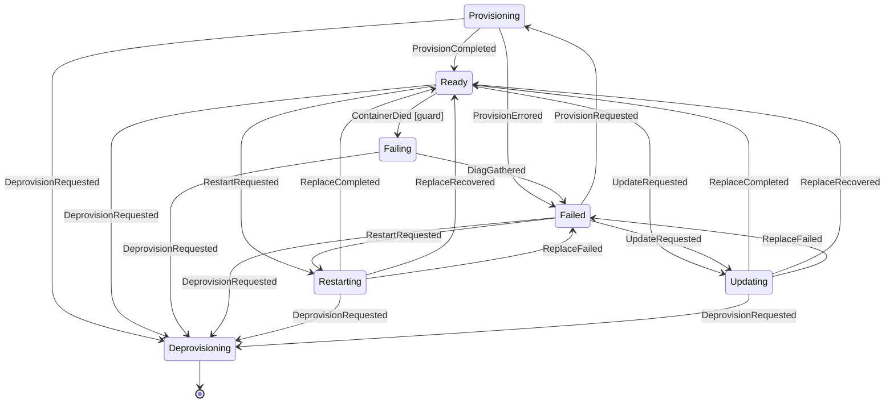

# Docker Backend

The Docker backend provisions ephemeral containers for tenant workloads. It receives provision requests from Fred, manages the full container lifecycle (pull, create, start, verify, deprovision), enforces SKU-based resource limits, and reports results via HMAC-signed callbacks.

## Configuration Reference

All fields are set in the backend's YAML config block. Defaults come from `DefaultConfig()`.

### Core

| Field | YAML Key | Type | Default | Description |
|---|---|---|---|---|
| Name | `name` | string | `"docker"` | Backend identifier |
| ListenAddr | `listen_addr` | string | `":9001"` | HTTP server listen address |
| DockerHost | `docker_host` | string | `"unix:///var/run/docker.sock"` | Docker daemon socket path or URL |
| HostAddress | `host_address` | string | *(required)* | External IP/hostname for port mappings. Must be a valid IP or hostname, not a URL |
| HostBindIP | `host_bind_ip` | string | `"0.0.0.0"` | IP address to bind container ports to |
| LogLevel | `log_level` | string | `"info"` | Log verbosity: `debug`, `info`, `warn`, `error`. Not set in `DefaultConfig()`; defaults to `"info"` at startup via `cmp.Or` |
| ProductionMode | `production_mode` | bool | `false` | Tightens startup checks beyond basic validation. When true, `Validate` rejects dev-only insecure toggles — currently `callback_insecure_skip_verify`. Mirrors providerd's `production_mode` |
| MaxRequestBodySize | `max_request_body_size` | int64 | `2097152` (2 MiB) | Caps inbound HTTP request body size (bytes). Falls back to `DefaultMaxRequestBodySize` (2 MiB) when unset or non-positive. Also settable via env `DOCKER_BACKEND_MAX_REQUEST_BODY_SIZE` (ENG-448) |

### TLS & mTLS (ENG-103)

| Field | YAML Key | Type | Default | Description |
|---|---|---|---|---|
| TLSCertFile | `tls_cert_file` | string | *(empty)* | Server certificate. When set together with `tls_key_file`, the listener serves HTTPS; otherwise plaintext HTTP (default). Loaded once at startup — rotation requires a restart (ENG-294) |
| TLSKeyFile | `tls_key_file` | string | *(empty)* | Server private key. Must be set together with `tls_cert_file` |
| TLSClientCAFile | `tls_client_ca_file` | string | *(empty)* | Enables mutual TLS: the listener requires and verifies a client certificate signed by this CA. Requires `tls_cert_file` + `tls_key_file` |
| TLSClientAllowedNames | `tls_client_allowed_names` | []string | *(empty)* | Optionally pins the mTLS client identity — the presented cert's CommonName or a DNS SAN must be in this list. Empty accepts any cert signed by `tls_client_ca_file`. Requires `tls_client_ca_file` |

### Resources

| Field | YAML Key | Type | Default | Description |
|---|---|---|---|---|
| TotalCPUCores | `total_cpu_cores` | float64 | `8.0` | Total CPU cores in the resource pool |
| TotalMemoryMB | `total_memory_mb` | int64 | `16384` | Total memory available (MB) |
| TotalDiskMB | `total_disk_mb` | int64 | `102400` | Total disk space available (MB) |

### SKU Management

| Field | YAML Key | Type | Default | Description |
|---|---|---|---|---|
| SKUMapping | `sku_mapping` | map[string]string | *(empty)* | Maps on-chain SKU UUIDs to profile names |
| SKUProfiles | `sku_profiles` | map[string]SKUProfile | *(required, non-empty)* | Maps profile names to resource limits. Operator-declared; no defaults |

`sku_profiles` is required and authoritative — `DefaultConfig()` deliberately does not seed it, because yaml.v3 merges map keys during Unmarshal and a partial operator config would silently inherit defaults (see ENG-238). Validate rejects an empty map with `"at least one SKU profile is required"`.

Recommended starter profiles (copy these into your config if you want the previous four-tier shape):

| Profile | CPU Cores | Memory MB | Disk MB |
|---|---|---|---|
| `docker-micro` | 0.25 | 256 | 512 |
| `docker-small` | 0.5 | 512 | 1024 |
| `docker-medium` | 1.0 | 1024 | 2048 |
| `docker-large` | 2.0 | 2048 | 4096 |

SKU resolution: the backend first checks `SKUMapping` for a UUID-to-name translation, then looks up the name in `SKUProfiles`. This allows on-chain UUIDs to map to human-readable profile names.

### Image Security

| Field | YAML Key | Type | Default | Description |
|---|---|---|---|---|
| AllowedRegistries | `allowed_registries` | []string | `["docker.io", "ghcr.io"]` | Registries from which images may be pulled |

Images are validated before pull. The registry is extracted from the image reference (e.g., `ghcr.io/org/app:v1` -> `ghcr.io`). Bare names like `nginx` resolve to `docker.io`.

### Callbacks

| Field | YAML Key | Type | Default | Description |
|---|---|---|---|---|
| CallbackSecret | `callback_secret` | string | *(required, min 32 chars)* | HMAC-SHA256 secret for signing callbacks |
| CallbackInsecureSkipVerify | `callback_insecure_skip_verify` | bool | `false` | Skip TLS verification for callbacks (dev only) |
| CallbackDBPath | `callback_db_path` | string | `"callbacks.db"` | Path to bbolt database for persisting pending callbacks |
| CallbackMaxAge | `callback_max_age` | duration | `24h` | Maximum age of persisted callback entries before cleanup |

### Diagnostics

| Field | YAML Key | Type | Default | Description |
|---|---|---|---|---|
| DiagnosticsDBPath | `diagnostics_db_path` | string | `"diagnostics.db"` | Path to bbolt database for persisting failure diagnostics |
| DiagnosticsMaxAge | `diagnostics_max_age` | duration | `168h` | Maximum age of persisted diagnostic entries before cleanup (7 days) |

When a provision fails (during provisioning, state recovery, or partial deprovision), the backend persists full failure diagnostics and container logs to a bbolt database. `GET /provisions/{lease_uuid}` and `GET /logs/{lease_uuid}` fall back to this store when the provision is no longer in memory (e.g., after deprovision or restart), returning the persisted error and logs with a 7-day default retention.

### Releases

| Field | YAML Key | Type | Default | Description |
|---|---|---|---|---|
| ReleasesDBPath | `releases_db_path` | string | `"releases.db"` | Path to bbolt database for persisting release history |
| ReleasesMaxAge | `releases_max_age` | duration | `2160h` | Maximum age of persisted release entries before cleanup (90 days) |

### Soft-delete & Retention

| Field | YAML Key | Type | Default | Description |
|---|---|---|---|---|
| RetainOnClose | `retain_on_close` | bool | `false` | When true, managed volumes are renamed into a `fred-retained-` namespace on lease close/expire instead of being destroyed. Tenants can restore data into a new lease via `POST /v1/leases/{new_lease_uuid}/restore`. |
| RetentionDBPath | `retention_db_path` | string | `"retention.db"` | Path to bbolt database tracking retained lease records |
| RetentionMaxAge | `retention_max_age` | duration | `2160h` (90 days) | How long retained volumes are kept before the grace reaper destroys them. When `> 0` it also gates restore eligibility — a retained record older than this is no longer restorable. Set to `0` to disable age-based reaping **and** the age gate: retained volumes are then kept **indefinitely** and stay restorable until evicted, unless a per-tenant cap (`max_retained_leases_per_tenant > 0`) is configured to evict them. |
| RetentionReapInterval | `retention_reap_interval` | duration | `1h` | Cadence of the background retention sweep, which destroys expired retained volumes and reconciles in-flight restores. If set to `0` it falls back to `retention_max_age`, then to a hard-coded `1h`. The sweep still runs (to reconcile restores) when `retain_on_close` is set even with `retention_max_age: 0`. |
| MaxRetainedLeasesPerTenant | `max_retained_leases_per_tenant` | int | `0` (unlimited) | Maximum number of retained leases kept per tenant. When a soft-delete would exceed the cap, the tenant's oldest retained lease(s) are **evicted (hard-deleted)** at close time — oldest-first until `cap-1` remain (so a single close can drop multiple old leases). Never touches other tenants and never evicts a record being restored. `0` means no cap. |
| RetentionOrphanConfirmations | `retention_orphan_confirmations` | int | `3` | Number of consecutive retention sweeps a soft-deleted record must be observed with **all** its retained volumes missing before the record is pruned (ENG-370). Catches records orphaned when their backing volumes vanish out-of-band (host/docker churn, `docker volume prune`, data-root reset) so they don't linger for the full grace window. Fail-safe: a sweep that cannot enumerate volumes, or finds the volume root absent/unreadable, skips rather than pruning. This is a **sweep count**, not a duration — the effective confirmation window is `N × retention_reap_interval` (≈3h at the 1h default). `0` disables orphan pruning entirely (kill-switch). |
| MaxRetainedDiskMB | `max_retained_disk_mb` | int64 | `0` (unlimited) | Per-provider cap on the aggregate retained-volume disk footprint (MB) across all tenants. When retaining a closing lease would exceed this cap, the lease is destroyed immediately instead of retained (existing in-grace data is never evicted). `0` means no cap. When set, must be ≤ `total_disk_mb` **and** ≥ the largest stateful SKU's `disk_mb` (a smaller cap would make an otherwise-legal lease impossible to retain). |

> **Writable-path-only reclaim (ENG-406):** even with `retain_on_close: true`, a closing lease's volumes that hold only ephemeral `_wp/` writable-path scaffolding (no declared-`VOLUME` durable data) are **destroyed (reclaimed)** at close instead of retained — restore reseeds `_wp` from the image regardless, so retaining them preserves nothing restorable. The detector is conservative toward RETAIN (it never destroys a stateful volume). Counted by `fred_docker_backend_retention_writable_path_reclaimed_total`.

> **Duration syntax:** `retention_max_age` and `retention_reap_interval` use Go duration syntax — valid units are `h`, `m`, `s` (e.g. `2160h` for 90 days, `336h` for 14 days). The units `d` (days) and `w` (weeks) are **not** valid and will fail config validation.

### Tenant Quotas

| Field | YAML Key | Type | Default | Description |
|---|---|---|---|---|
| TenantQuota | `tenant_quota` | object | *(none)* | Per-tenant resource limits (optional) |
| TenantQuota.MaxCPUCores | `tenant_quota.max_cpu_cores` | float64 | - | Maximum CPU cores per tenant |
| TenantQuota.MaxMemoryMB | `tenant_quota.max_memory_mb` | int64 | - | Maximum memory per tenant (MB) |
| TenantQuota.MaxDiskMB | `tenant_quota.max_disk_mb` | int64 | - | Maximum disk per tenant (MB) |

When `tenant_quota` is configured, no single tenant can consume more than the specified limits, even if the resource pool has capacity available. Quota values cannot exceed the total pool capacity.

### Timeouts

| Field | YAML Key | Type | Default | Description |
|---|---|---|---|---|
| ImagePullTimeout | `image_pull_timeout` | duration | `5m` | Timeout for pulling images |
| ContainerCreateTimeout | `container_create_timeout` | duration | `30s` | Timeout for creating containers |
| ContainerStartTimeout | `container_start_timeout` | duration | `30s` | Timeout for starting containers |
| ProvisionTimeout | `provision_timeout` | duration | `10m` | Maximum time for the entire provisioning operation. Validated as positive — must be `> 0`. |
| ReconcileInterval | `reconcile_interval` | duration | `5m` | How often to reconcile state with Docker |
| StartupVerifyDuration | `startup_verify_duration` | duration | `5s` | Grace period after start before verifying containers are still running |
| ContainerStopTimeout | `container_stop_timeout` | duration | `30s` | Grace period before SIGKILL when stopping containers |
| MigrationReadyTimeout | `migration_ready_timeout` | duration | `90s` | Caps how long a recover-time migration waits for the new stack-form container to reach `healthy` (or `running` when no health check is declared) before declaring the migration failed for that lease |
| MigrationGracePeriod | `migration_grace_period` | duration | `1m` | How long the renamed `-prev` legacy container lingers after a successful recover-time migration before forced removal (preserves rollback potential) |

### Container Hardening

| Field | YAML Key | Type | Default | Description |
|---|---|---|---|---|
| NetworkIsolation | `network_isolation` | *bool | `true` | Per-tenant Docker network isolation |
| ContainerReadonlyRootfs | `container_readonly_rootfs` | *bool | `true` | Read-only root filesystem |
| ContainerPidsLimit | `container_pids_limit` | *int64 | `256` | Maximum PIDs per container |
| ContainerTmpfsSizeMB | `container_tmpfs_size_mb` | int | `64` | Tmpfs size (MB) for `/tmp` and `/run` when readonly rootfs is enabled |

### Ingress (Traefik Integration)

| Field | YAML Key | Type | Default | Description |
|---|---|---|---|---|
| Ingress.Enabled | `ingress.enabled` | bool | `false` | Enable reverse proxy label generation |
| Ingress.WildcardDomain | `ingress.wildcard_domain` | string | *(required when enabled)* | Base domain for tenant subdomains (e.g., `apps.example.com`) |
| Ingress.Entrypoint | `ingress.entrypoint` | string | *(required when enabled)* | Traefik entrypoint name (e.g., `websecure`) |
| Ingress.CustomDomainCertResolver | `ingress.custom_domain_cert_resolver` | string | `"http01"` | Traefik certresolver name used for per-tenant custom domains (HTTP-01 by default) |
| Ingress.CustomDomainMiddlewares | `ingress.custom_domain_middlewares` | string[] | `["security-headers@file"]` | Traefik middleware references applied to the secondary custom-domain router |
| Ingress.CustomDomainDNSResolvers | `ingress.custom_domain_dns_resolvers` | string[] | `["1.1.1.1:53","8.8.8.8:53","9.9.9.9:53"]` | Public DNS servers (`host:port`) fred queries to confirm a tenant custom domain resolves to this host before emitting its HTTP-01 router (ENG-266) |
| Ingress.CustomDomainDNSQuorum | `ingress.custom_domain_dns_quorum` | int | `0` (majority) | How many resolvers must independently see the domain at this host before the readiness gate opens. `0` = majority; clamped to `[1, len(resolvers)]` |
| Ingress.CustomDomainDNSCheckDisabled | `ingress.custom_domain_dns_check_disabled` | bool | `false` | Turns OFF the custom-domain DNS readiness gate, emitting the custom-domain router immediately (ENG-266) |

When enabled, containers with routable TCP ports receive Traefik Docker labels for automatic HTTPS routing. Each container gets a unique subdomain under `wildcard_domain` derived from lease UUID and service metadata (guaranteed ≤63 chars per RFC 1035). Port selection: explicit manifest `ingress` hint > 80 > 8080 > lowest TCP port. Requires `network_isolation` to be enabled — Traefik routes traffic via the per-tenant Docker network.

Routers are generated with `tls=true` but no `certresolver`. The wildcard certificate for `wildcard_domain` must be provisioned at the Traefik level — typically via a DNS-01 ACME resolver with `domains` set in Traefik's static config, or via a default certificate in `tls.stores`. Fred does not drive per-domain ACME challenges.

Example:
```yaml
ingress:
  enabled: true
  wildcard_domain: "apps.example.com"
  entrypoint: "websecure"
```

### Volume Management

| Field | YAML Key | Type | Default | Description |
|---|---|---|---|---|
| VolumeDataPath | `volume_data_path` | string | *(empty)* | Host directory for managed volumes. Required when any SKU has `disk_mb > 0` |
| VolumeFilesystem | `volume_filesystem` | string | *(auto-detected)* | Filesystem type: `btrfs`, `xfs`, or `zfs`. Auto-detected from `volume_data_path` if empty |

When any SKU profile has `disk_mb > 0`, the backend manages quota-enforced host directories that are bind-mounted into containers at their Dockerfile VOLUME paths.

#### Supported Filesystems

| Filesystem | Mechanism | Requirements |
|---|---|---|
| **btrfs** | Subvolumes with qgroup quotas | `btrfs quota enable` on the filesystem; daemon `CAP_SYS_ADMIN` |
| **xfs** | Project quotas | `pquota` mount option, `xfs_quota` binary; daemon `CAP_SYS_ADMIN` |
| **zfs** | Child datasets with quota property | Parent dataset exists, `zfs` binary (exempt from `CAP_SYS_ADMIN` via `zfs allow` delegation) |

> **Capability requirement (xfs/btrfs):** setting a volume's block-quota limit is a privileged operation, so the docker-backend must hold `CAP_SYS_ADMIN` on an xfs or btrfs backend. The daemon **fails fast at startup** if it lacks it (`internal/backend/docker/capability.go`) rather than provisioning with silently-unenforced disk caps. The startup backfill that re-tags pre-existing tenant-owned volumes additionally needs `CAP_FOWNER`. Grant them ambiently — `AmbientCapabilities=CAP_SYS_ADMIN CAP_FOWNER` on the systemd unit; a plain `setcap cap_sys_admin+ep` on the binary does **not** propagate to the exec'd `xfs_quota`/`btrfs` child processes. `zfs` is exempt (`zfs allow` delegation) and `noop` is unaffected. See [DEPLOYMENT.md](../../../DEPLOYMENT.md#xfs-good-for-large-fleets) and its [systemd section](../../../DEPLOYMENT.md#process-management-systemd) for the full setup.

#### Stateful vs Ephemeral Containers

| SKU `disk_mb` | Behavior | Image VOLUME paths |
|---|---|---|
| `> 0` (stateful) | Quota-enforced host directory created per container | Bind-mounted from host directory |
| `0` (ephemeral) | No host directory | Overridden with tmpfs (prevents anonymous volumes) |

All containers have a readonly root filesystem by default (configurable via `container_readonly_rootfs`). Stateful containers write to bind-mounted volumes; ephemeral containers write to tmpfs.

**Example stateful SKU:**

```yaml
volume_data_path: "/var/lib/fred/volumes"
# volume_filesystem: "btrfs"  # optional, auto-detected

sku_profiles:
  docker-redis:
    cpu_cores: 0.5
    memory_mb: 512
    disk_mb: 2048
```

When provisioning `redis:latest` on this SKU:
1. Image inspected — discovers `VOLUME /data`
2. Host directory created: `/var/lib/fred/volumes/fred-<lease>-0/` with 2048 MB quota
3. Subdirectory `data/` bind-mounted to container `/data`
4. Redis writes to `/data` — quota enforced by kernel
5. On deprovision: host directory destroyed, and on XFS the project-quota limit is cleared (`bhard=0 bsoft=0`) so its entry drops out of the quota table

> **XFS quota-table hygiene (ENG-459):** on XFS, `Destroy` clears the volume's project-quota block limit (`bhard=0 bsoft=0`) after removing the directory, so the entry leaves the quota table instead of leaking one stale zero-byte entry per provision (an unbounded table slows every `xfs_quota` scan, degrading provisioning latency as leases churn). The clear is best-effort — a failure is logged and bumps `fred_docker_backend_volume_quota_clear_failed_total` rather than wedging teardown. Entries leaked by pre-ENG-459 daemons persist and need a one-time manual operator cleanup.

### SKU Profile Fields

| Field | YAML Key | Type | Default | Description |
|---|---|---|---|---|
| CPUCores | `cpu_cores` | float64 | — | CPU cores allocated to each container |
| MemoryMB | `memory_mb` | int64 | — | Memory in MB allocated to each container |
| DiskMB | `disk_mb` | int64 | `0` | Disk budget in MB. When `> 0`, a quota-enforced host directory is bind-mounted to image VOLUME paths (requires `volume_data_path`). When `0`, image VOLUME paths are overridden with tmpfs |

## Tenant Manifest Reference

See [Manifest Guide](../../../docs/manifest-guide.md) for the full tenant-facing manifest specification (image, ports, env, health check, tmpfs). A formal [JSON Schema](../../../docs/manifest-schema.json) is also available.

## Soft-delete & Restore

When `retain_on_close: true` is set, the backend performs a **soft-delete** instead of a hard destroy at lease close or auto-expire time:

1. Canonical volumes that are **writable-path-only** — they hold only the ephemeral `_wp/` scaffolding (a read-only-rootfs writable-path mount) and no declared-`VOLUME` durable data — are **destroyed (reclaimed)**, not retained. Restore reseeds `_wp` from the image anyway (the ENG-367 wipe-contract), so retaining such a volume preserves nothing restorable and only pollutes the retention record, a per-tenant slot, the retained-disk budget, and the volume root. The detector (`isWritablePathOnly`) is conservative toward RETAIN — it destroys only *provably* `_wp`-only volumes, never a stateful one (ENG-406). Observable via `fred_docker_backend_retention_writable_path_reclaimed_total`.
2. The remaining managed volumes for the lease are **renamed** from `fred-<lease_uuid>-…` into a `fred-retained-<lease_uuid>-…` namespace and kept on disk.
3. The original containers and resource-pool allocations are still released (the running workload is stopped; resources are freed for new leases).
4. Fred publishes a `retained` status event to any connected tenant WebSocket so the tenant knows their data may be recoverable.
5. Retained volumes are held for up to `retention_max_age` (default 90 days). The grace reaper runs every `retention_reap_interval` (default 1h) and destroys expired retained volumes.
6. If a retained lease's backing volumes disappear **out-of-band** (host/docker churn, `docker volume prune`, a data-root reset on redeploy) while its record survives, the periodic sweep prunes the now-orphaned record after it is observed fully volume-less for `retention_orphan_confirmations` consecutive sweeps (default 3). This keeps dead records from accumulating for the full grace window. The prune is fail-safe — a sweep that errors listing volumes, or finds the volume root absent/unreadable, skips entirely rather than risk pruning a record whose volumes are merely transiently unavailable. Observable via `fred_docker_backend_retention_orphans_pruned_total` and `fred_docker_backend_retention_orphan_skips_total{reason}`.

### Restore flow

To restore data from a closed lease into a new lease:

1. Open a **fresh lease on the same provider** by requesting the **same service names and quantities** as the original closed lease. The new lease UUID (`new_lease_uuid`) will be in `PENDING` state.
2. Call `POST /v1/leases/{new_lease_uuid}/restore` with body `{"from_lease_uuid": "<original_closed_lease_uuid>"}`. Fred validates the request and delegates to the backend.
3. The backend renames the retained volumes into the new lease's namespace (the synchronous **adopt** phase) and re-deploys the **retained manifest** (the exact deployment that was running at close time) onto them. The new lease becomes active with the same data. To change the image or configuration after restore, use the normal update path once the lease is active.

Restore-specific re-deploy behavior worth knowing:

- **Image must already be present on the node.** Restore re-uses the replace machinery, which **inspects** the image but does **not** pull it. If the image was garbage-collected from the node since close, restore fails with an image-inspect error — pre-pull the image (or restore before the node's image GC runs).
- **Image and configuration are fixed.** Restore deploys strictly from the retained `StackManifest` and items; the request carries no manifest. The new lease's requested service names and quantities must shape-match the retained set exactly (otherwise the restore is rejected with a validation error).
- **The SKU tier may change (promote/demote).** Only the item *shape* must match (service names + quantities); the SKU's resource (disk) tier **may** differ from the source lease. A **promote** (same-or-larger `disk_mb` tier) is always allowed and the larger cap is applied. A **demote** (smaller `disk_mb` tier) is allowed only if the retained volume's **measured** data fits the new tier's `disk_mb` cap — the backend runs `checkDemoteFit` before adopting (restoring stateful data into an ephemeral `disk_mb=0` tier is always refused). A refused demote returns HTTP `422` with body `{"code":"demote_exceeds_tier"}` (`backend.ErrDemoteDataExceedsTier`) and is counted by `fred_docker_backend_restore_demote_refused_total{backend,reason}` (`reason` ∈ `measured_exceeds`, `unmeasurable_read_error`, `unmeasurable_backend`, `ephemeral_tier`); it is **not** counted by `restore_total`.
- **Containers are recreated, ownership is not rewritten.** Restore does not force-recreate beyond the normal replace, and the volume chown is non-recursive (it sets ownership on the VOLUME mount point only), so existing files keep their on-disk ownership.

### Limitations

- **Best-effort and capacity-bounded**: retention is not a guarantee. When a per-tenant cap (`max_retained_leases_per_tenant > 0`) is configured, a soft-delete may evict that tenant's oldest retained lease(s) — independent of age — to make room for the newer one. Always restore within the grace window.
- **Same-backend-node only**: a restore can only run on the backend node that physically holds the retained volumes (the rename is local; nothing is copied between nodes). In single-backend deployments this is always satisfied. In multi-node deployments restore routing is automatic: the reconciler queries each backend's `GET /retentions` and records each retained lease's backend in the placement store, so a restore is routed to the node holding the source data (ENG-333). Restore returns `404` if no backend still holds that lease's retained data.
- **Not a backup**: retained data is a single copy on the node's local disk (RAID-backed by the operator). It provides a grace window against accidental lease closure, not protection against node-level data loss. Operators should run separate backup procedures for production data.

### Failure handling & crash recovery

Restore is crash-safe and self-healing. A retention record carries one of three persisted statuses — `active` (awaiting restore or reap), `restoring` (a restore is in flight), and `reaping` (volumes are pending physical destruction) — and the adopt rename is the only on-disk mutation:

The `reaping` status is a finalizer tombstone (ENG-376): when a retained record is reaped (grace-expired, cap-evicted, or abandoned by a deprovision give-up) the record is **not** deleted at the active→reaping transition — it outlives its volumes and is `Delete`d only once every volume is confirmed destroyed. The bytes still sit on disk, so a reaping record keeps counting against the retained footprint while it is no longer restore-claimable. A record that cannot be reclaimed sticks in `reaping` (observable via the `fred_docker_backend_retention_reaping_leases` / `fred_docker_backend_retention_reaping_bytes` gauges); a failed destroy / give-up / uncommitted revert also bumps `fred_docker_backend_retention_leaked_total`.

- **Restore failure (or worker panic)**: the new lease's compose project is torn down, the adopted volumes are **re-quarantined** back into the `fred-retained-` namespace, pool allocations are released, and the record is reverted `restoring → active`. The original data is preserved and the lease can be restored again. The new lease settles as a `Failed` lease (a failure callback is still emitted), exactly like a failed restart/update.
- **Crash mid-restore**: on the next startup (and on every periodic sweep) the backend reconciles dangling `restoring` records — finalizing those that completed and rolling back (re-quarantining) those that did not, before the orphan-volume reaper runs. A record is written before the rename, so a crash in the narrow window between the two is repaired by re-quarantine rather than data loss.

## Provisioning Lifecycle

1. **Synchronous validation** -- the `Provision` method validates the request before returning:
   - Checks for duplicate lease (returns `ErrAlreadyProvisioned` unless existing provision is failed)
   - Resolves all SKUs to profiles via `SKUMapping` + `SKUProfiles`
   - Parses the JSON manifest and validates image, ports, labels, and health check
   - Validates the image against `AllowedRegistries`
   - Allocates resources for all instances from the resource pool (rolls back on failure)

2. **Asynchronous provisioning** -- runs in a goroutine tracked by a `WaitGroup`:
   - Pulls the image (once, shared across all containers in the lease)
   - Inspects the image to discover Dockerfile `VOLUME` declarations
   - Creates/ensures the per-tenant network (if `NetworkIsolation` is enabled)
   - For each item in the lease (supports multi-SKU), for each unit (supports multi-unit):
     - For stateful SKUs (`disk_mb > 0`): creates a quota-enforced host directory and bind-mounts image VOLUME paths into it
     - For ephemeral SKUs (`disk_mb == 0`): overrides image VOLUME paths with tmpfs to prevent anonymous volumes
     - Creates a container with the appropriate SKU profile, hardening settings, and labels
     - Starts the container
   - Verifies startup (see [Startup Verification](#startup-verification) for the two paths)

3. **Callback** -- on success or failure, sends an HMAC-signed callback to the URL provided in the provision request.

Multi-unit leases create multiple containers from the same manifest. Multi-SKU leases create containers with different resource profiles per SKU. Instance indices are 0-based across all items.

The entire async operation is bounded by `ProvisionTimeout` and is canceled on backend shutdown.

### Stack Provisioning

When lease items carry `service_name` fields (and the payload is a [stack manifest](../../../docs/manifest-guide.md#stack-manifest)), the backend provisions a multi-service stack:

1. **Synchronous validation** — same as single-container, plus:
   - Detects stack vs single mode via `IsStack(items)`
   - Validates 1:1 mapping between manifest service names and lease item service names
   - Validates each per-service manifest independently

2. **Asynchronous provisioning** — Docker Compose-based deployment:
   - Each service's image is pulled and inspected independently (pre-flight, before Compose)
   - Volumes are pre-created for stateful services (`disk_mb > 0` with image `VOLUME`s)
     - Resource allocation ID: `{leaseUUID}-{serviceName}-{instanceIndex}`
     - Volume ID: `fred-{leaseUUID}-{serviceName}-{instanceIndex}`
   - A Compose project is built in-memory from the stack manifest via `buildComposeProject`
   - Service startup ordering is controlled by `depends_on` declarations in the manifest (supports `service_started` and `service_healthy` conditions with cycle detection)
   - `compose.Up` atomically creates, starts, and network-attaches all service containers
   - `compose.PS` discovers the resulting container IDs per service
   - Startup verification runs per-service, each using its own health check config
   - Restart/update uses `compose.Up` with the updated project; on failure, the previous manifest is rebuilt and rolled back via another `compose.Up`
   - Deprovision uses `compose.Down` for atomic cleanup, with fallback to individual container removal

3. **Callback** — single callback for the entire stack (success only when all services are healthy/running).

## Container Hardening

Every container is created with the following security measures:

| Feature | Implementation | Notes |
|---|---|---|
| Drop all capabilities | `CapDrop: ["ALL"]` | No Linux capabilities granted |
| No new privileges | `SecurityOpt: ["no-new-privileges:true"]` | Prevents privilege escalation via setuid/setgid |
| Read-only root filesystem | `ReadonlyRootfs: true` | Configurable via `container_readonly_rootfs` |
| Tmpfs for `/tmp` and `/run` | `Tmpfs: {"/tmp": "size=64M", "/run": "size=64M"}` | Only when readonly rootfs is enabled; size from `container_tmpfs_size_mb`. Tenants may request up to 4 additional tmpfs mounts via manifest, for a maximum of 6 total (384MB at default size). **Note:** On cgroup v1, tmpfs memory is not counted against the container's cgroup memory limit. On cgroup v2 (default on modern systems), it is. |
| PID limit | `PidsLimit: 256` | Configurable via `container_pids_limit` |
| Memory (no swap) | `MemorySwap == Memory` | Prevents swap usage entirely |
| Restart policy disabled | `RestartPolicyDisabled` | Failed containers stay dead for crash detection |
| Network isolation | Per-tenant bridge network | Configurable via `network_isolation` |

## Startup Verification

After all containers in a lease are started, the backend verifies they are ready before sending a success callback. The verification path depends on whether the manifest declares an active health check.

### No health check (fixed-wait path)

When the manifest has no `health_check` (or sets `Test[0]` to `"NONE"`), the backend waits for `StartupVerifyDuration` (default 5s) and then inspects each container. If any container has exited during this window, the entire provision is marked as failed and cleaned up.

This catches containers that crash immediately on startup due to bad configuration, read-only filesystem errors, missing dependencies, or similar issues -- before a success callback is sent and the lease is acknowledged as active on chain.

Note: the runtime uses `cmp.Or` to fall back to 5s when the value is zero, so setting `startup_verify_duration: 0` does not disable verification -- it uses the 5s default.

### With health check (health-aware path)

When the manifest declares an active health check (`health_check` with `Test[0]` of `"CMD"` or `"CMD-SHELL"`), the backend polls every 2s until all containers report `healthy`. The behavior on each poll:

- **`healthy`** -- container passes, removed from the pending set.
- **`unhealthy`** -- provision fails immediately with an error.
- **Container exited** -- provision fails immediately (caught before checking health status).
- **`starting`** -- keep polling.

The polling is bounded by the existing `ProvisionTimeout` context (default 10m). If the timeout fires before all containers are healthy, the provision fails. Operators must ensure `ProvisionTimeout` is compatible with their health check timing (start period + interval * retries).

A health check defined in the Dockerfile but not in the manifest does **not** trigger the health-aware path -- the manifest is the contract.

## Re-provisioning

When a provision has `status=failed` (e.g., a container crashed and was detected by the reconciler), a new `Provision` call for the same lease UUID is allowed. The re-provision flow:

1. The existing `FailCount` is carried over from the failed provision record.
2. Resource allocations are released and old containers are removed. Managed volumes are **kept** — stateful data persists across re-provisions.
3. A new provision record is created with `FailCount` preserved.
4. The full provisioning flow runs again (image pull, image inspect, volume setup via idempotent Create, container create/start, startup verification). Existing volumes are reused with quota updated; only new volumes are created.
5. On failure, `FailCount` is incremented. The `FailCount` is also persisted in the `fred.fail_count` container label. Only newly created volumes are cleaned up; reused volumes are preserved.

## Lease State Machine

**One concept: the lease actor is the scope of atomicity for its messages and its workers.** Everything else falls out of that invariant:

- **Registry atomicity** — the actor registry (`b.actors`) is guarded by a mutex; `routeToLease(uuid, msg)` resolves-or-creates AND enqueues under that mutex, so callers never hold a `*leaseActor` pointer. Stale-pointer races are unreachable by construction.
- **Worker ownership** — every worker goroutine (provision, restart, update, diag) is spawned by the actor and tracked by its per-actor `workers` barrier (a channel-signaled reference counter; see `work_barrier.go`). The actor's exit path selects on `workers.Zero()` BEFORE registry-delete / `done`-close / drain — the actor cannot exit while a worker is in flight, so orphan-worker races are eliminated. The barrier's channel-based wait means `waitForWorkers` spawns no helper goroutine, so a wedged worker adds no leaked waiter on top of itself.
- **Drain-with-handle** — on exit, any message in the inbox is processed via `handle()` (not just closed-and-dropped). Terminal events delivered during the shutdown window still drive their SM transition. Silent drops are gone.
- **Non-blocking routing** — `routeToLease` uses a non-blocking inbox send under the registry mutex. A wedged actor cannot stall the event loop; full-inbox refusals increment `die_event_dropped_total` and the reconciler re-detects within its cycle.

Every lease is owned by a per-lease actor goroutine with a bounded inbox (16 messages). All transitions flow through a state machine, one per actor, which serializes transitions and owns the side effects (callback emission, diagnostics persistence, gauge updates). The SM's initial state is the lease's current `Status` at actor creation — new leases start in `Provisioning`, recovered leases start in whatever state they were in.



The edges above are the complete set of allowed transitions; any event not listed against a source state is either ignored (see below) or rejected as an invalid trigger. The authoritative source is `internal/backend/shared/leasesm/lease_sm.go`.

### Key behaviors

- **`Ready → Failing` guard.** The `ContainerDied` trigger fires only if a Docker `Inspect` confirms the container actually exited. Die events can be duplicated or stale; the guard filters them.
- **Preemption via `OnExit` cancellation + `workers.Zero()`.** `Failing`, `Provisioning`, `Restarting`, and `Updating` each own one async worker goroutine (diag gather, provision, or replace). Every transition out of these states calls the worker's `CancelFunc` via `OnExit`, then `a.waitForWorkers()` selects on the per-actor `workers.Zero()` channel until the goroutine has returned and its terminal `sendTerminal` has landed in the inbox. A preempting `Deprovision` observes post-cleanup state deterministically — no orphan-container race.
- **Defense-in-depth `Ignore` on `Deprovisioning`.** Cancellation is best-effort: a goroutine can race past the cancel signal and fire its completion event anyway. `Deprovisioning` ignores every such event (`DiagGathered`, `ProvisionCompleted`, `ProvisionErrored`, `ReplaceCompleted`, `ReplaceRecovered`, `ReplaceFailed`) so the race is structurally safe.
- **One terminal callback per lease.** Callback emission lives in SM entry actions (`onEnterReadyFromProvision`, `onEnterFailedFromDiag`, `onEnterFailedFromProvision`, `onEnterReadyFromReplaceCompleted`, `onEnterReadyFromReplaceRecovered`, `onEnterFailedFromReplace`), never in goroutines. Combined with the preemption/ignore rules above, this guarantees at most one `success`/`failed`/`deprovisioned` callback per lease per terminal transition.
- **Three `Replace*` events for two terminal states.** `ReplaceCompleted` means restart/update succeeded (→ `Ready`, Success callback). `ReplaceRecovered` means it failed but rollback restored a working lease (→ `Ready`, Failed callback with rollback suffix). `ReplaceFailed` means both the operation and the rollback failed (→ `Failed`, Failed callback).
- **Non-blocking routing, reconciler backstop.** `routeToLease` is non-blocking: a full inbox returns false rather than blocking the caller. `containerEventLoop` and the reconcile die-event dispatch treat refusal as "reconciler will re-detect within its cycle" and increment `die_event_dropped_total`. One wedged actor can no longer stall die-event delivery for other leases.

### Observability

- `fred_docker_backend_lease_sm_transitions_total{from,to,event}` — every transition.
- `fred_docker_backend_lease_actors_created_total` — cumulative actor count; should track distinct leases (recycled UUIDs after Deprovision produce a fresh actor, so this counter grows faster than the live-actor count).
- `fred_docker_backend_lease_actor_stuck_seconds` — age of the oldest in-flight actor handler. Alert threshold should exceed the longest legitimate operation (Deprovision can hold an actor for minutes during container/volume cleanup).
- `fred_docker_backend_lease_actor_inbox_depth` — histogram of per-actor inbox depth; p99 near 0 is healthy.
- `fred_docker_backend_lease_actor_panics_total` — counts panics recovered inside actor handlers. Any non-zero is a bug; the actor survives and keeps processing, but the message that panicked did not drive its transition.
- `fred_docker_backend_lease_terminal_event_dropped_total{event}` — worker terminal sends refused because the actor had exited (pathological `waitForWorkers` timeout). Should be zero in normal operation.
- `fred_docker_backend_die_event_dropped_total{source}` — container-death events refused because the actor's inbox was full or the backend was shutting down. `source` is `event_loop` or `reconcile`. Not data loss — the reconciler re-detects — but a sustained non-zero value flags a wedged actor or chronic burst.

## State Recovery

On startup, at each `ReconcileInterval`, and on every reconciler cycle (via `RefreshState`), `recoverState` rebuilds in-memory state from Docker:

1. **List managed containers** -- filters by `fred.managed=true` label.
2. **Group by lease UUID** -- containers are grouped into provision records. The highest `FailCount` across containers in a lease is used (handles partial re-provisions).
3. **Detect ready-to-failed transitions** -- if a provision was in-memory as `ready` but Docker shows the container as exited/dead, the provision is marked `failed`, its `FailCount` is incremented, and a failure callback is sent.
4. **Cold-start FailCount correction** -- provisions recovered as `failed` with no prior in-memory state have their `FailCount` incremented by 1. The label value was written at creation time (before the crash), so the increment accounts for the observed failure.
5. **Preserve in-flight provisions** -- provisions with `status=provisioning` that have no containers yet are kept to avoid dropping active async work.
6. **Reset resource pool** -- `pool.Reset()` clears all allocations and rebuilds them from the recovered containers' SKU profiles.
7. **Orphaned network cleanup** -- if `NetworkIsolation` is enabled, removes any managed networks whose tenant has no active provisions and no connected containers.

After state recovery, the backend also runs **orphaned volume cleanup**: lists all `fred-` prefixed directories in `volume_data_path`, compares against expected volumes from recovered provisions, and destroys any that have no matching provision. This catches volumes leaked by crashes between volume creation and container creation, or between container removal and volume destruction.

## Callback Protocol

Callbacks notify Fred of provisioning results.

### Signing

Each callback carries an `X-Fred-Signature` header in the format:

```
t=<unix-timestamp>,sha256=<hex-encoded-hmac>
```

The HMAC-SHA256 is computed over the canonical string
`<timestamp>\n<METHOD>\n<canonical-URI>\n<hex(sha256(body))>` using the
configured `CallbackSecret`. Binding the method and URI prevents
cross-endpoint replay of captured signatures; hashing the body keeps the
canonical string binary-safe. See `internal/hmacauth` for the reference
implementation.

### Error Message Sanitization

Callback error messages use hardcoded, deterministic strings and never include container logs or runtime-specific data. This prevents secrets, API keys, or other sensitive data from being permanently recorded on-chain as rejection reasons.

Full diagnostics (exit codes, OOM status, container logs) are available via the HMAC-authenticated `GET /provisions/{lease_uuid}` and `GET /logs/{lease_uuid}` endpoints.

### Payload

```json
{
  "lease_uuid": "...",
  "status": "success" | "failed" | "deprovisioned",
  "error": "",
  "backend": "docker",
  "retained": false
}
```

`backend` and `retained` are both `omitempty`. `retained` is only meaningful on a `deprovisioned` callback: it is `true` when the backend actually soft-deleted (retained) the lease's volumes, and is the best-effort ground truth (the queryable `/retentions` status is the durable backstop).

### Retry Strategy

- **3 attempts** with backoff delays of 0s, 1s, 5s.
- Each attempt has a 10s HTTP timeout.
- Retries abort immediately if the backend is shutting down (`stopCtx` is canceled).
- A 2xx response is considered success; any other status triggers a retry.

## HTTP API

All authenticated endpoints require an `X-Fred-Signature` HMAC-SHA256 header (see [Signing](#signing)). Request bodies are limited to 2 MiB by default (`DefaultMaxRequestBodySize`), configurable via `max_request_body_size` (env `DOCKER_BACKEND_MAX_REQUEST_BODY_SIZE`). All JSON responses use `Content-Type: application/json`. Errors return `{"error": "message"}`.

### `POST /provision` (authenticated)

Starts async container provisioning. Pre-flight validation (SKU, manifest, image allowlist, resources) is synchronous; the actual container lifecycle runs in a background goroutine with results delivered via callback.

**Request (single-container):**

```json
{
  "lease_uuid": "abc-123",
  "tenant": "manifest1...",
  "provider_uuid": "prov-1",
  "items": [
    { "sku": "docker-small", "quantity": 2 }
  ],
  "callback_url": "https://fred-host/api/v1/backend/callback",
  "payload": "<base64-encoded manifest JSON>"
}
```

**Request (stack):**

```json
{
  "lease_uuid": "abc-123",
  "tenant": "manifest1...",
  "provider_uuid": "prov-1",
  "items": [
    { "sku": "docker-small", "quantity": 1, "service_name": "web" },
    { "sku": "docker-medium", "quantity": 1, "service_name": "db" }
  ],
  "callback_url": "https://fred-host/api/v1/backend/callback",
  "payload": "<base64-encoded stack manifest JSON>"
}
```

**Response (`202 Accepted`):**

```json
{
  "provision_id": "abc-123"
}
```

**Errors:** `400` (validation), `409` (already provisioned), `503` (insufficient resources).

### `POST /deprovision` (authenticated)

Removes all containers and managed volumes for a lease and releases resources. Idempotent — deprovisioning a nonexistent lease returns success.

**Request:**

```json
{
  "lease_uuid": "abc-123"
}
```

**Response (`200`):**

```json
{
  "status": "ok"
}
```

### `GET /info/{lease_uuid}` (authenticated)

Returns connection details for a running lease. Only available when the provision status is `ready` — returns `404` otherwise.

**Response (`200`, single-container):**

```json
{
  "host": "192.168.1.100",
  "instances": [
    {
      "instance_index": 0,
      "container_id": "abcdefghijkl",
      "image": "nginx:latest",
      "status": "running",
      "ports": {
        "80/tcp": { "host_ip": "0.0.0.0", "host_port": "32768" }
      }
    }
  ]
}
```

**Response (`200`, stack):**

For stack provisions, instances are grouped by service name under a `"services"` map. Each service value is an object with an `"instances"` key:

```json
{
  "host": "192.168.1.100",
  "services": {
    "web": {
      "instances": [
        {
          "instance_index": 0,
          "container_id": "abcdefghijkl",
          "image": "ghcr.io/myorg/webapp:v2.1.0",
          "status": "running",
          "ports": {
            "8080/tcp": { "host_ip": "0.0.0.0", "host_port": "32768" }
          }
        }
      ]
    },
    "db": {
      "instances": [
        {
          "instance_index": 0,
          "container_id": "mnopqrstuvwx",
          "image": "postgres:16",
          "status": "running",
          "ports": {
            "5432/tcp": { "host_ip": "0.0.0.0", "host_port": "32769" }
          }
        }
      ]
    }
  }
}
```

### `GET /logs/{lease_uuid}` (authenticated)

Returns container stdout/stderr. For single-container provisions, logs are keyed by instance index. For stack provisions, logs use `"serviceName/instanceIndex"` keys (e.g., `"web/0"`, `"db/0"`). Works for any provision status (provisioning, ready, or failed).

**Query parameters:** `tail` — number of lines (default 100, max 10000).

**Response (`200`, single-container):**

```json
{
  "0": "2025-01-15T10:00:00Z Starting server...\n...",
  "1": "2025-01-15T10:00:00Z Worker ready\n..."
}
```

**Response (`200`, stack):**

```json
{
  "web/0": "2025-01-15T10:00:00Z Listening on :8080\n...",
  "db/0": "2025-01-15T10:00:00Z database system is ready to accept connections\n..."
}
```

If log retrieval fails for a specific instance, its value contains `<error: ...>` instead.

### `GET /provisions/{lease_uuid}` (authenticated)

Returns a single provision record. This is the primary endpoint for retrieving full failure diagnostics after a sanitized callback.

**Response (`200`):**

```json
{
  "lease_uuid": "abc-123",
  "provider_uuid": "prov-1",
  "status": "failed",
  "created_at": "2025-01-15T10:00:00Z",
  "fail_count": 2,
  "last_error": "container 0 exited during startup (status: exited): exit_code=1; logs:\nError: config file not found"
}
```

`status` is one of: `provisioning`, `ready`, `failing`, `failed`, `unknown`, `restarting`, `updating`, `deprovisioning`. `failing` marks the brief window between container-death detection and the Failed callback being emitted; a concurrent Deprovision arriving in this window transitions the lease straight to `deprovisioning` without ever reaching `failed`, preventing a stale Failed callback. `last_error` is only present on failure and contains full diagnostics (exit codes, OOM status, container logs).

### `GET /provisions` (authenticated)

Returns provision records. `GET /provisions` is keyset-paginated. Query params: `limit` (max page size) and `continue` (a lease UUID — the `continue` cursor returned by the previous page). The JSON response carries a top-level `continue` field set to the last record's lease UUID, omitted once the list is exhausted. An invalid `limit` or a non-UUID `continue` returns 400, as does a `continue` cursor supplied without a positive `limit`. A `limit` above the server maximum (5000) is coerced down to it rather than rejected. With no params it returns the full list unpaginated (back-compat). One or more `lease_uuid` query params return just those records. (ENG-380)

**Response (`200`):**

```json
{
  "provisions": [
    {
      "lease_uuid": "abc-123",
      "provider_uuid": "prov-1",
      "status": "ready",
      "created_at": "2025-01-15T10:00:00Z",
      "fail_count": 0
    },
    {
      "lease_uuid": "def-456",
      "provider_uuid": "prov-1",
      "status": "failed",
      "created_at": "2025-01-15T10:05:00Z",
      "fail_count": 3,
      "last_error": "container exited unexpectedly: exit_code=137, oom_killed=true; logs:\nKilled"
    }
  ],
  "continue": "def-456"
}
```

The `continue` field is present only on a full page with more records remaining; it is omitted once the list is exhausted.

### `POST /restart` (authenticated)

Restarts a lease's containers in place (same image, same configuration). Async — the result is delivered via callback. Returns `202` (`{"status": "restarting"}`), `404` if not provisioned, `409` for an invalid state.

### `POST /update` (authenticated)

Re-deploys a lease with a new manifest (image/config change). The `payload` field carries the new base64-encoded manifest. Async — result via callback. On failure the previous manifest is rolled back. Returns `202` (`{"status": "updating"}`), `400` (validation), `404`, `409`.

### `POST /restore` (authenticated)

Restores a closed lease's retained volumes into a fresh lease. Body carries `from_lease_uuid` (the original closed lease) and `callback_url`. Async — result via callback. Returns `202` (`{"status": "restoring"}`). `422` is **overloaded**: a **bare** `422` (no `code`) means no retained data exists (`ErrNotRetained`), while `422` with body `{"code":"demote_exceeds_tier"}` means the retained data exceeds the requested smaller SKU tier (`ErrDemoteDataExceedsTier`, see [Restore flow](#restore-flow)). Also `409` for invalid state / already provisioned, `400` (validation), `503` (insufficient resources). See [Soft-delete & Restore](#soft-delete--restore).

### `GET /retentions` (authenticated)

Lists this backend's retained (soft-deleted) leases. Used by the reconciler to route restores to the node physically holding each lease's retained volumes (ENG-333).

`GET /retentions` is keyset-paginated, mirroring [`GET /provisions`](#get-provisions-authenticated): it accepts `limit` (max page size) and `continue` (a lease UUID — the cursor returned by the previous page) query params and returns a top-level `continue` field set to the last record's lease UUID, omitted once the list is exhausted. Fred's client pages at `RetentionsPageLimit` (default 1000), fail-closing each page body at 1 MiB (ENG-451). With no params it returns the full list unpaginated (back-compat).

**Response (`200`):** `{"retentions": [ ... ], "continue": "<lease-uuid>"}` (`retentions` serialized as `[]` when empty; `continue` omitted once the list is exhausted).

### `GET /releases/{lease_uuid}` (authenticated)

Returns the persisted release (deployment) history for a lease, retained for `releases_max_age` (default 90 days).

### `POST /reconcile_custom_domain` (authenticated)

Reconciles a lease's custom-domain ingress labels to match the supplied items. Body carries `lease_uuid` and `items`. Returns `204 No Content`; `404` if not provisioned, `409` for an invalid state.

### `GET /health` (unauthenticated)

Docker daemon reachability check. Also probes the callback, diagnostics, release, and retention bbolt stores — a locked, corrupt, or read-only store surfaces as unhealthy instead of the backend reporting healthy while soft-delete/restore silently fail (ENG-448).

**Response (`200`):**

```json
{
  "status": "healthy"
}
```

Returns `503` if the Docker daemon is unreachable **or** any of those stores is unhealthy.

### `GET /stats` (unauthenticated)

Resource pool usage.

**Response (`200`):**

```json
{
  "total_cpu_cores": 8.0,
  "total_memory_mb": 16384,
  "total_disk_mb": 102400,
  "allocated_cpu_cores": 2.5,
  "allocated_memory_mb": 4096,
  "allocated_disk_mb": 10240,
  "available_cpu_cores": 5.5,
  "available_memory_mb": 12288,
  "available_disk_mb": 92160,
  "active_containers": 5
}
```

### `GET /metrics` (unauthenticated)

Prometheus metrics in exposition format. Served by `promhttp.Handler()`.

## Resource Pool

The resource pool tracks CPU, memory, and disk allocations.

- **Allocation IDs** are per-instance: `<lease-uuid>-<instance-index>` for single-container leases (e.g., `abc123-0`, `abc123-1`), or `<lease-uuid>-<service-name>-<instance-index>` for stack leases (e.g., `abc123-web-0`, `abc123-db-0`).
- **TryAllocate** atomically checks capacity and reserves resources for a SKU. On insufficient resources, returns an error and the caller rolls back any partial allocations.
- **Release** is idempotent -- releasing a non-existent allocation is a no-op.
- **Stats** returns total, allocated, and available CPU/memory/disk.
- **Reset** clears all allocations and rebuilds from a provided list. Used during state recovery to synchronize with Docker's actual state.

## Tenant Network Isolation

When `network_isolation` is enabled (default), each tenant's containers are placed in a dedicated Docker bridge network. This provides:

- **Same-tenant communication**: containers on the same tenant bridge can reach each other directly.
- **Cross-tenant isolation**: Docker's `DOCKER-ISOLATION` iptables chains DROP forwarded traffic between different bridge networks. Containers from different tenants cannot communicate directly.
- **Outbound internet**: containers can reach the internet (required for port bindings).
- **Port bindings**: inbound traffic to published ports works normally. Cross-tenant communication is only possible through public-facing endpoints (published ports on the host).

> **Prerequisite**: Docker must have iptables enabled (the default). If the daemon runs with `--iptables=false`, cross-tenant isolation is lost. Fred logs daemon warnings at startup to help detect this.

> **Why not `Internal: true`?** Docker's `Internal` network flag prevents port publishing entirely ([moby#36174](https://github.com/moby/moby/issues/36174)), which would make tenant services unreachable.

### Network lifecycle

- **Naming**: `fred-tenant-<hex(sha256(tenant)[:8])>` -- first 8 bytes of the SHA-256 hash, hex-encoded to 16 characters. Deterministic, derived from the tenant address.
- **Creation**: `EnsureTenantNetwork` creates the network on first use, or returns the existing one.
- **Removal**: `RemoveTenantNetworkIfEmpty` removes the network when no containers are connected. Called during deprovision.
- **Orphan cleanup**: during state recovery, managed networks with no active provisions and no connected containers are removed.
- Networks carry `fred.managed=true` and `fred.tenant` labels.

## Container Labels

All managed containers and networks carry labels in the `fred.*` namespace.

| Label | Value | Description |
|---|---|---|
| `fred.managed` | `"true"` | Marks the container/network as managed by Fred |
| `fred.lease_uuid` | lease UUID | Associates the container with a lease |
| `fred.tenant` | tenant address | Tenant that owns the container/network |
| `fred.provider_uuid` | provider UUID | Provider that fulfills the lease |
| `fred.sku` | SKU identifier | SKU profile used for resource limits |
| `fred.created_at` | RFC 3339 timestamp | When the container was created |
| `fred.instance_index` | integer string | 0-based index within a multi-unit lease |
| `fred.fail_count` | integer string | Number of provision failures for this lease at creation time |
| `fred.callback_url` | URL string | Callback URL for provision results; persisted so failure callbacks survive backend restarts |
| `fred.service_name` | service name string | Service name within a stack (stack provisions only) |
| `fred.backend_name` | backend name string | Name of the backend managing the container; set on every managed container |
| `fred.fqdn` | FQDN string | Assigned ingress FQDN; set on the ingress / custom-domain path |
| `fred.custom_domain` | domain string | Tenant custom domain; set on the custom-domain path |

User-provided labels in the manifest are also applied, but may not use the `fred.*` or `traefik.*` prefixes (`traefik.*` is reserved to prevent cross-tenant ingress-router hijack, ENG-497).

## Bandwidth Limiting

Network bandwidth limiting is an operational concern handled outside of the docker-backend process. Operators can use Linux `tc` (traffic control) to rate-limit container network traffic on the host.

### Identifying container interfaces

Each Docker container gets a veth pair. The host-side interface can be found by inspecting the container's network namespace:

```bash
# Get the container's PID
PID=$(docker inspect --format '{{.State.Pid}}' <container_id>)

# Get the veth peer index from inside the container's namespace
PEER_IDX=$(nsenter -t $PID -n ip link show eth0 | grep -oP '(?<=@if)\d+')

# Find the host-side veth interface by index
HOST_VETH=$(ip link | grep "^${PEER_IDX}:" | awk '{print $2}' | tr -d ':@')
```

### Applying rate limits with tc

Use `tc` to set ingress and egress limits on the host-side veth interface:

```bash
# Egress (container → network): limit to 10 Mbit/s with 32KB burst
tc qdisc add dev $HOST_VETH root tbf rate 10mbit burst 32kbit latency 50ms

# Ingress (network → container): use an IFB (intermediate functional block) device
modprobe ifb
ip link set dev ifb0 up
tc qdisc add dev $HOST_VETH ingress
tc filter add dev $HOST_VETH parent ffff: protocol ip u32 match u32 0 0 \
    action mirred egress redirect dev ifb0
tc qdisc add dev ifb0 root tbf rate 10mbit burst 32kbit latency 50ms
```

### Automation

For production use, integrate `tc` rules into a container lifecycle hook or a script triggered by Docker events (`docker events --filter event=start`). The docker-backend does not manage bandwidth limits directly to keep the provisioning path simple and avoid requiring `CAP_NET_ADMIN`.
