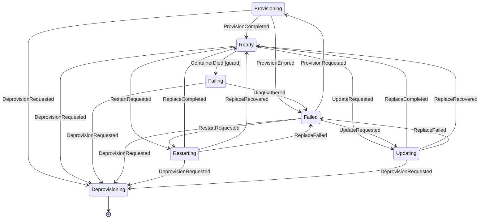

# Docker Backend

The Docker backend provisions ephemeral containers for tenant workloads. It receives provision requests from Fred, manages the full container lifecycle (pull, create, start, verify, deprovision), enforces SKU-based resource limits, and reports results via HMAC-signed callbacks.

## Configuration Reference

All fields are set in the backend's YAML config block. Defaults come from `DefaultConfig()`.

### Core

| Field | YAML Key | Type | Default | Description |
|---|---|---|---|---|
| Name | `name` | string | `"docker"` | Backend identifier |
| ListenAddr | `listen_addr` | string | `":9001"` | HTTP server listen address |
| DockerHost | `docker_host` | string | `"unix:///var/run/docker.sock"` | Docker daemon socket path or URL |
| HostAddress | `host_address` | string | *(required)* | External IP/hostname for port mappings. Must be a valid IP or hostname, not a URL |
| HostBindIP | `host_bind_ip` | string | `"0.0.0.0"` | IP address to bind container ports to |
| LogLevel | `log_level` | string | `"info"` | Log verbosity: `debug`, `info`, `warn`, `error`. Not set in `DefaultConfig()`; defaults to `"info"` at startup via `cmp.Or` |

### Resources

| Field | YAML Key | Type | Default | Description |
|---|---|---|---|---|
| TotalCPUCores | `total_cpu_cores` | float64 | `8.0` | Total CPU cores in the resource pool |
| TotalMemoryMB | `total_memory_mb` | int64 | `16384` | Total memory available (MB) |
| TotalDiskMB | `total_disk_mb` | int64 | `102400` | Total disk space available (MB) |

### SKU Management

| Field | YAML Key | Type | Default | Description |
|---|---|---|---|---|
| SKUMapping | `sku_mapping` | map[string]string | *(empty)* | Maps on-chain SKU UUIDs to profile names |
| SKUProfiles | `sku_profiles` | map[string]SKUProfile | *(see below)* | Maps profile names to resource limits |

Default SKU profiles:

| Profile | CPU Cores | Memory MB | Disk MB |
|---|---|---|---|
| `docker-micro` | 0.25 | 256 | 512 |
| `docker-small` | 0.5 | 512 | 1024 |
| `docker-medium` | 1.0 | 1024 | 2048 |
| `docker-large` | 2.0 | 2048 | 4096 |

SKU resolution: the backend first checks `SKUMapping` for a UUID-to-name translation, then looks up the name in `SKUProfiles`. This allows on-chain UUIDs to map to human-readable profile names.

### Image Security

| Field | YAML Key | Type | Default | Description |
|---|---|---|---|---|
| AllowedRegistries | `allowed_registries` | []string | `["docker.io", "ghcr.io"]` | Registries from which images may be pulled |

Images are validated before pull. The registry is extracted from the image reference (e.g., `ghcr.io/org/app:v1` -> `ghcr.io`). Bare names like `nginx` resolve to `docker.io`.

### Callbacks

| Field | YAML Key | Type | Default | Description |
|---|---|---|---|---|
| CallbackSecret | `callback_secret` | string | *(required, min 32 chars)* | HMAC-SHA256 secret for signing callbacks |
| CallbackInsecureSkipVerify | `callback_insecure_skip_verify` | bool | `false` | Skip TLS verification for callbacks (dev only) |
| CallbackDBPath | `callback_db_path` | string | `"callbacks.db"` | Path to bbolt database for persisting pending callbacks |
| CallbackMaxAge | `callback_max_age` | duration | `24h` | Maximum age of persisted callback entries before cleanup |

### Diagnostics

| Field | YAML Key | Type | Default | Description |
|---|---|---|---|---|
| DiagnosticsDBPath | `diagnostics_db_path` | string | `"diagnostics.db"` | Path to bbolt database for persisting failure diagnostics |
| DiagnosticsMaxAge | `diagnostics_max_age` | duration | `168h` | Maximum age of persisted diagnostic entries before cleanup (7 days) |

When a provision fails (during provisioning, state recovery, or partial deprovision), the backend persists full failure diagnostics and container logs to a bbolt database. `GET /provisions/{lease_uuid}` and `GET /logs/{lease_uuid}` fall back to this store when the provision is no longer in memory (e.g., after deprovision or restart), returning the persisted error and logs with a 7-day default retention.

### Releases

| Field | YAML Key | Type | Default | Description |
|---|---|---|---|---|
| ReleasesDBPath | `releases_db_path` | string | `"releases.db"` | Path to bbolt database for persisting release history |
| ReleasesMaxAge | `releases_max_age` | duration | `2160h` | Maximum age of persisted release entries before cleanup (90 days) |

### Tenant Quotas

| Field | YAML Key | Type | Default | Description |
|---|---|---|---|---|
| TenantQuota | `tenant_quota` | object | *(none)* | Per-tenant resource limits (optional) |
| TenantQuota.MaxCPUCores | `tenant_quota.max_cpu_cores` | float64 | - | Maximum CPU cores per tenant |
| TenantQuota.MaxMemoryMB | `tenant_quota.max_memory_mb` | int64 | - | Maximum memory per tenant (MB) |
| TenantQuota.MaxDiskMB | `tenant_quota.max_disk_mb` | int64 | - | Maximum disk per tenant (MB) |

When `tenant_quota` is configured, no single tenant can consume more than the specified limits, even if the resource pool has capacity available. Quota values cannot exceed the total pool capacity.

### Timeouts

| Field | YAML Key | Type | Default | Description |
|---|---|---|---|---|
| ImagePullTimeout | `image_pull_timeout` | duration | `5m` | Timeout for pulling images |
| ContainerCreateTimeout | `container_create_timeout` | duration | `30s` | Timeout for creating containers |
| ContainerStartTimeout | `container_start_timeout` | duration | `30s` | Timeout for starting containers |
| ProvisionTimeout | `provision_timeout` | duration | `10m` | Maximum time for the entire provisioning operation. Setting to `0` uses the default (10m) via `cmp.Or` |
| ReconcileInterval | `reconcile_interval` | duration | `5m` | How often to reconcile state with Docker |
| StartupVerifyDuration | `startup_verify_duration` | duration | `5s` | Grace period after start before verifying containers are still running |
| ContainerStopTimeout | `container_stop_timeout` | duration | `30s` | Grace period before SIGKILL when stopping containers |

### Container Hardening

| Field | YAML Key | Type | Default | Description |
|---|---|---|---|---|
| NetworkIsolation | `network_isolation` | *bool | `true` | Per-tenant Docker network isolation |
| ContainerReadonlyRootfs | `container_readonly_rootfs` | *bool | `true` | Read-only root filesystem |
| ContainerPidsLimit | `container_pids_limit` | *int64 | `256` | Maximum PIDs per container |
| ContainerTmpfsSizeMB | `container_tmpfs_size_mb` | int | `64` | Tmpfs size (MB) for `/tmp` and `/run` when readonly rootfs is enabled |

### Ingress (Traefik Integration)

| Field | YAML Key | Type | Default | Description |
|---|---|---|---|---|
| Ingress.Enabled | `ingress.enabled` | bool | `false` | Enable reverse proxy label generation |
| Ingress.WildcardDomain | `ingress.wildcard_domain` | string | *(required when enabled)* | Base domain for tenant subdomains (e.g., `apps.example.com`) |
| Ingress.Entrypoint | `ingress.entrypoint` | string | *(required when enabled)* | Traefik entrypoint name (e.g., `websecure`) |

When enabled, containers with routable TCP ports receive Traefik Docker labels for automatic HTTPS routing. Each container gets a unique subdomain under `wildcard_domain` derived from lease UUID and service metadata (guaranteed ≤63 chars per RFC 1035). Port selection: 80 > 8080 > lowest TCP port. Requires `network_isolation` to be enabled — Traefik routes traffic via the per-tenant Docker network.

Routers are generated with `tls=true` but no `certresolver`. The wildcard certificate for `wildcard_domain` must be provisioned at the Traefik level — typically via a DNS-01 ACME resolver with `domains` set in Traefik's static config, or via a default certificate in `tls.stores`. Fred does not drive per-domain ACME challenges.

Example:
```yaml
ingress:
  enabled: true
  wildcard_domain: "apps.example.com"
  entrypoint: "websecure"
```

### Volume Management

| Field | YAML Key | Type | Default | Description |
|---|---|---|---|---|
| VolumeDataPath | `volume_data_path` | string | *(empty)* | Host directory for managed volumes. Required when any SKU has `disk_mb > 0` |
| VolumeFilesystem | `volume_filesystem` | string | *(auto-detected)* | Filesystem type: `btrfs`, `xfs`, or `zfs`. Auto-detected from `volume_data_path` if empty |

When any SKU profile has `disk_mb > 0`, the backend manages quota-enforced host directories that are bind-mounted into containers at their Dockerfile VOLUME paths.

#### Supported Filesystems

| Filesystem | Mechanism | Requirements |
|---|---|---|
| **btrfs** | Subvolumes with qgroup quotas | `btrfs quota enable` on the filesystem |
| **xfs** | Project quotas | `pquota` mount option, `xfs_quota` binary |
| **zfs** | Child datasets with quota property | Parent dataset exists, `zfs` binary |

#### Stateful vs Ephemeral Containers

| SKU `disk_mb` | Behavior | Image VOLUME paths |
|---|---|---|
| `> 0` (stateful) | Quota-enforced host directory created per container | Bind-mounted from host directory |
| `0` (ephemeral) | No host directory | Overridden with tmpfs (prevents anonymous volumes) |

All containers always have a readonly root filesystem. Stateful containers write to bind-mounted volumes; ephemeral containers write to tmpfs.

**Example stateful SKU:**

```yaml
volume_data_path: "/var/lib/fred/volumes"
# volume_filesystem: "btrfs"  # optional, auto-detected

sku_profiles:
  docker-redis:
    cpu_cores: 0.5
    memory_mb: 512
    disk_mb: 2048
```

When provisioning `redis:latest` on this SKU:
1. Image inspected — discovers `VOLUME /data`
2. Host directory created: `/var/lib/fred/volumes/fred-<lease>-0/` with 2048 MB quota
3. Subdirectory `data/` bind-mounted to container `/data`
4. Redis writes to `/data` — quota enforced by kernel
5. On deprovision: host directory destroyed

### SKU Profile Fields

| Field | YAML Key | Type | Default | Description |
|---|---|---|---|---|
| CPUCores | `cpu_cores` | float64 | — | CPU cores allocated to each container |
| MemoryMB | `memory_mb` | int64 | — | Memory in MB allocated to each container |
| DiskMB | `disk_mb` | int64 | `0` | Disk budget in MB. When `> 0`, a quota-enforced host directory is bind-mounted to image VOLUME paths (requires `volume_data_path`). When `0`, image VOLUME paths are overridden with tmpfs |

## Tenant Manifest Reference

See [Manifest Guide](../../../docs/manifest-guide.md) for the full tenant-facing manifest specification (image, ports, env, health check, tmpfs). A formal [JSON Schema](../../../docs/manifest-schema.json) is also available.

## Provisioning Lifecycle

1. **Synchronous validation** -- the `Provision` method validates the request before returning:
   - Checks for duplicate lease (returns `ErrAlreadyProvisioned` unless existing provision is failed)
   - Resolves all SKUs to profiles via `SKUMapping` + `SKUProfiles`
   - Parses the JSON manifest and validates image, ports, labels, and health check
   - Validates the image against `AllowedRegistries`
   - Allocates resources for all instances from the resource pool (rolls back on failure)

2. **Asynchronous provisioning** -- runs in a goroutine tracked by a `WaitGroup`:
   - Pulls the image (once, shared across all containers in the lease)
   - Inspects the image to discover Dockerfile `VOLUME` declarations
   - Creates/ensures the per-tenant network (if `NetworkIsolation` is enabled)
   - For each item in the lease (supports multi-SKU), for each unit (supports multi-unit):
     - For stateful SKUs (`disk_mb > 0`): creates a quota-enforced host directory and bind-mounts image VOLUME paths into it
     - For ephemeral SKUs (`disk_mb == 0`): overrides image VOLUME paths with tmpfs to prevent anonymous volumes
     - Creates a container with the appropriate SKU profile, hardening settings, and labels
     - Starts the container
   - Verifies startup (see [Startup Verification](#startup-verification) for the two paths)

3. **Callback** -- on success or failure, sends an HMAC-signed callback to the URL provided in the provision request.

Multi-unit leases create multiple containers from the same manifest. Multi-SKU leases create containers with different resource profiles per SKU. Instance indices are 0-based across all items.

The entire async operation is bounded by `ProvisionTimeout` and is canceled on backend shutdown.

### Stack Provisioning

When lease items carry `service_name` fields (and the payload is a [stack manifest](../../../docs/manifest-guide.md#stack-manifest)), the backend provisions a multi-service stack:

1. **Synchronous validation** — same as single-container, plus:
   - Detects stack vs single mode via `IsStack(items)`
   - Validates 1:1 mapping between manifest service names and lease item service names
   - Validates each per-service manifest independently

2. **Asynchronous provisioning** — Docker Compose-based deployment:
   - Each service's image is pulled and inspected independently (pre-flight, before Compose)
   - Volumes are pre-created for stateful services (`disk_mb > 0` with image `VOLUME`s)
     - Resource allocation ID: `{leaseUUID}-{serviceName}-{instanceIndex}`
     - Volume ID: `fred-{leaseUUID}-{serviceName}-{instanceIndex}`
   - A Compose project is built in-memory from the stack manifest via `buildComposeProject`
   - Service startup ordering is controlled by `depends_on` declarations in the manifest (supports `service_started` and `service_healthy` conditions with cycle detection)
   - `compose.Up` atomically creates, starts, and network-attaches all service containers
   - `compose.PS` discovers the resulting container IDs per service
   - Startup verification runs per-service, each using its own health check config
   - Restart/update uses `compose.Up` with the updated project; on failure, the previous manifest is rebuilt and rolled back via another `compose.Up`
   - Deprovision uses `compose.Down` for atomic cleanup, with fallback to individual container removal

3. **Callback** — single callback for the entire stack (success only when all services are healthy/running).

## Container Hardening

Every container is created with the following security measures:

| Feature | Implementation | Notes |
|---|---|---|
| Drop all capabilities | `CapDrop: ["ALL"]` | No Linux capabilities granted |
| No new privileges | `SecurityOpt: ["no-new-privileges:true"]` | Prevents privilege escalation via setuid/setgid |
| Read-only root filesystem | `ReadonlyRootfs: true` | Configurable via `container_readonly_rootfs` |
| Tmpfs for `/tmp` and `/run` | `Tmpfs: {"/tmp": "size=64M", "/run": "size=64M"}` | Only when readonly rootfs is enabled; size from `container_tmpfs_size_mb`. Tenants may request up to 4 additional tmpfs mounts via manifest, for a maximum of 6 total (384MB at default size). **Note:** On cgroup v1, tmpfs memory is not counted against the container's cgroup memory limit. On cgroup v2 (default on modern systems), it is. |
| PID limit | `PidsLimit: 256` | Configurable via `container_pids_limit` |
| Memory (no swap) | `MemorySwap == Memory` | Prevents swap usage entirely |
| Restart policy disabled | `RestartPolicyDisabled` | Failed containers stay dead for crash detection |
| Network isolation | Per-tenant bridge network | Configurable via `network_isolation` |

## Startup Verification

After all containers in a lease are started, the backend verifies they are ready before sending a success callback. The verification path depends on whether the manifest declares an active health check.

### No health check (fixed-wait path)

When the manifest has no `health_check` (or sets `Test[0]` to `"NONE"`), the backend waits for `StartupVerifyDuration` (default 5s) and then inspects each container. If any container has exited during this window, the entire provision is marked as failed and cleaned up.

This catches containers that crash immediately on startup due to bad configuration, read-only filesystem errors, missing dependencies, or similar issues -- before a success callback is sent and the lease is acknowledged as active on chain.

Note: the runtime uses `cmp.Or` to fall back to 5s when the value is zero, so setting `startup_verify_duration: 0` does not disable verification -- it uses the 5s default.

### With health check (health-aware path)

When the manifest declares an active health check (`health_check` with `Test[0]` of `"CMD"` or `"CMD-SHELL"`), the backend polls every 2s until all containers report `healthy`. The behavior on each poll:

- **`healthy`** -- container passes, removed from the pending set.
- **`unhealthy`** -- provision fails immediately with an error.
- **Container exited** -- provision fails immediately (caught before checking health status).
- **`starting`** -- keep polling.

The polling is bounded by the existing `ProvisionTimeout` context (default 10m). If the timeout fires before all containers are healthy, the provision fails. Operators must ensure `ProvisionTimeout` is compatible with their health check timing (start period + interval * retries).

A health check defined in the Dockerfile but not in the manifest does **not** trigger the health-aware path -- the manifest is the contract.

## Re-provisioning

When a provision has `status=failed` (e.g., a container crashed and was detected by the reconciler), a new `Provision` call for the same lease UUID is allowed. The re-provision flow:

1. The existing `FailCount` is carried over from the failed provision record.
2. Resource allocations are released and old containers are removed. Managed volumes are **kept** — stateful data persists across re-provisions.
3. A new provision record is created with `FailCount` preserved.
4. The full provisioning flow runs again (image pull, image inspect, volume setup via idempotent Create, container create/start, startup verification). Existing volumes are reused with quota updated; only new volumes are created.
5. On failure, `FailCount` is incremented. The `FailCount` is also persisted in the `fred.fail_count` container label. Only newly created volumes are cleaned up; reused volumes are preserved.

## Lease State Machine

Every lease is owned by a per-lease actor goroutine with a bounded inbox (16 messages). All transitions flow through a state machine, one per actor, which serializes transitions and owns the side effects (callback emission, diagnostics persistence, gauge updates). The SM's initial state is the lease's current `Status` at actor creation — new leases start in `Provisioning`, recovered leases start in whatever state they were in.



The edges above are the complete set of allowed transitions; any event not listed against a source state is either ignored (see below) or rejected as an invalid trigger. The authoritative source is `lease_sm.go`.

### Key behaviors

- **`Ready → Failing` guard.** The `ContainerDied` trigger fires only if a Docker `Inspect` confirms the container actually exited. Die events can be duplicated or stale; the guard filters them.
- **Preemption via `OnExit` cancellation.** `Failing`, `Provisioning`, `Restarting`, and `Updating` each run an async goroutine (diag gather, provision work, or container replacement). Every transition out of these states cancels the goroutine's context via the state's `OnExit` action. The goroutine's I/O respects `ctx`, returns early, and never fires its "completed" event — suppressing stale terminal callbacks when a `Deprovision` preempts.
- **Defense-in-depth `Ignore` on `Deprovisioning`.** Cancellation is best-effort: a goroutine can race past the cancel signal and fire its completion event anyway. `Deprovisioning` ignores every such event (`DiagGathered`, `ProvisionCompleted`, `ProvisionErrored`, `ReplaceCompleted`, `ReplaceRecovered`, `ReplaceFailed`) so the race is structurally safe.
- **One terminal callback per lease.** Callback emission lives in SM entry actions (`onEnterReadyFromProvision`, `onEnterFailedFromDiag`, `onEnterFailedFromProvision`, `onEnterReadyFromReplaceCompleted`, `onEnterReadyFromReplaceRecovered`, `onEnterFailedFromReplace`), never in goroutines. Combined with the preemption/ignore rules above, this guarantees at most one `success`/`failed`/`deprovisioned` callback per lease per terminal transition.
- **Three `Replace*` events for two terminal states.** `ReplaceCompleted` means restart/update succeeded (→ `Ready`, Success callback). `ReplaceRecovered` means it failed but rollback restored a working lease (→ `Ready`, Failed callback with rollback suffix). `ReplaceFailed` means both the operation and the rollback failed (→ `Failed`, Failed callback).
- **Back-pressure on burst.** A single lease with many rapid events (e.g. multi-container crash storm) fills its 16-slot inbox and then backpressures senders. Events on distinct leases are fully parallel — actors don't share inboxes.

### Observability

- `fred_docker_backend_lease_sm_transitions_total{from,to,event}` — every transition.
- `fred_docker_backend_lease_actors_created_total` — cumulative actor count; should track distinct leases.
- `fred_docker_backend_lease_actor_stuck_seconds` — age of the oldest in-flight actor handler. Alert threshold should exceed the longest legitimate operation (Deprovision can hold an actor for minutes during container/volume cleanup).
- `fred_docker_backend_lease_actor_inbox_depth` — histogram of per-actor inbox depth; p99 near 0 is healthy.

## State Recovery

On startup, at each `ReconcileInterval`, and on every reconciler cycle (via `RefreshState`), `recoverState` rebuilds in-memory state from Docker:

1. **List managed containers** -- filters by `fred.managed=true` label.
2. **Group by lease UUID** -- containers are grouped into provision records. The highest `FailCount` across containers in a lease is used (handles partial re-provisions).
3. **Detect ready-to-failed transitions** -- if a provision was in-memory as `ready` but Docker shows the container as exited/dead, the provision is marked `failed`, its `FailCount` is incremented, and a failure callback is sent.
4. **Cold-start FailCount correction** -- provisions recovered as `failed` with no prior in-memory state have their `FailCount` incremented by 1. The label value was written at creation time (before the crash), so the increment accounts for the observed failure.
5. **Preserve in-flight provisions** -- provisions with `status=provisioning` that have no containers yet are kept to avoid dropping active async work.
6. **Reset resource pool** -- `pool.Reset()` clears all allocations and rebuilds them from the recovered containers' SKU profiles.
7. **Orphaned network cleanup** -- if `NetworkIsolation` is enabled, removes any managed networks whose tenant has no active provisions and no connected containers.

After state recovery, the backend also runs **orphaned volume cleanup**: lists all `fred-` prefixed directories in `volume_data_path`, compares against expected volumes from recovered provisions, and destroys any that have no matching provision. This catches volumes leaked by crashes between volume creation and container creation, or between container removal and volume destruction.

## Callback Protocol

Callbacks notify Fred of provisioning results.

### Signing

Each callback carries an `X-Fred-Signature` header in the format:

```
t=<unix-timestamp>,sha256=<hex-encoded-hmac>
```

The HMAC-SHA256 is computed over `<timestamp>.<body>` using the configured `CallbackSecret`.

### Error Message Sanitization

Callback error messages use hardcoded, deterministic strings and never include container logs or runtime-specific data. This prevents secrets, API keys, or other sensitive data from being permanently recorded on-chain as rejection reasons.

Full diagnostics (exit codes, OOM status, container logs) are available via the HMAC-authenticated `GET /provisions/{lease_uuid}` and `GET /logs/{lease_uuid}` endpoints.

### Payload

```json
{
  "lease_uuid": "...",
  "status": "success" | "failed",
  "error": ""
}
```

### Retry Strategy

- **3 attempts** with backoff delays of 0s, 1s, 5s.
- Each attempt has a 10s HTTP timeout.
- Retries abort immediately if the backend is shutting down (`stopCtx` is canceled).
- A 2xx response is considered success; any other status triggers a retry.

## HTTP API

All authenticated endpoints require an `X-Fred-Signature` HMAC-SHA256 header (see [Signing](#signing)). Request bodies are limited to 1 MiB. All JSON responses use `Content-Type: application/json`. Errors return `{"error": "message"}`.

### `POST /provision` (authenticated)

Starts async container provisioning. Pre-flight validation (SKU, manifest, image allowlist, resources) is synchronous; the actual container lifecycle runs in a background goroutine with results delivered via callback.

**Request (single-container):**

```json
{
  "lease_uuid": "abc-123",
  "tenant": "manifest1...",
  "provider_uuid": "prov-1",
  "items": [
    { "sku": "docker-small", "quantity": 2 }
  ],
  "callback_url": "https://fred-host/api/v1/backend/callback",
  "payload": "<base64-encoded manifest JSON>"
}
```

**Request (stack):**

```json
{
  "lease_uuid": "abc-123",
  "tenant": "manifest1...",
  "provider_uuid": "prov-1",
  "items": [
    { "sku": "docker-small", "quantity": 1, "service_name": "web" },
    { "sku": "docker-medium", "quantity": 1, "service_name": "db" }
  ],
  "callback_url": "https://fred-host/api/v1/backend/callback",
  "payload": "<base64-encoded stack manifest JSON>"
}
```

**Response (`202 Accepted`):**

```json
{
  "provision_id": "abc-123"
}
```

**Errors:** `400` (validation), `409` (already provisioned), `503` (insufficient resources).

### `POST /deprovision` (authenticated)

Removes all containers and managed volumes for a lease and releases resources. Idempotent — deprovisioning a nonexistent lease returns success.

**Request:**

```json
{
  "lease_uuid": "abc-123"
}
```

**Response (`200`):**

```json
{
  "status": "ok"
}
```

### `GET /info/{lease_uuid}` (authenticated)

Returns connection details for a running lease. Only available when the provision status is `ready` — returns `404` otherwise.

**Response (`200`, single-container):**

```json
{
  "host": "192.168.1.100",
  "instances": [
    {
      "instance_index": 0,
      "container_id": "abcdefghijkl",
      "image": "nginx:latest",
      "status": "running",
      "ports": {
        "80/tcp": { "host_ip": "0.0.0.0", "host_port": "32768" }
      }
    }
  ]
}
```

**Response (`200`, stack):**

For stack provisions, instances are grouped by service name under a `"services"` map. Each service value is an object with an `"instances"` key:

```json
{
  "host": "192.168.1.100",
  "services": {
    "web": {
      "instances": [
        {
          "instance_index": 0,
          "container_id": "abcdefghijkl",
          "image": "ghcr.io/myorg/webapp:v2.1.0",
          "status": "running",
          "ports": {
            "8080/tcp": { "host_ip": "0.0.0.0", "host_port": "32768" }
          }
        }
      ]
    },
    "db": {
      "instances": [
        {
          "instance_index": 0,
          "container_id": "mnopqrstuvwx",
          "image": "postgres:16",
          "status": "running",
          "ports": {
            "5432/tcp": { "host_ip": "0.0.0.0", "host_port": "32769" }
          }
        }
      ]
    }
  }
}
```

### `GET /logs/{lease_uuid}` (authenticated)

Returns container stdout/stderr. For single-container provisions, logs are keyed by instance index. For stack provisions, logs use `"serviceName/instanceIndex"` keys (e.g., `"web/0"`, `"db/0"`). Works for any provision status (provisioning, ready, or failed).

**Query parameters:** `tail` — number of lines (default 100, max 10000).

**Response (`200`, single-container):**

```json
{
  "0": "2025-01-15T10:00:00Z Starting server...\n...",
  "1": "2025-01-15T10:00:00Z Worker ready\n..."
}
```

**Response (`200`, stack):**

```json
{
  "web/0": "2025-01-15T10:00:00Z Listening on :8080\n...",
  "db/0": "2025-01-15T10:00:00Z database system is ready to accept connections\n..."
}
```

If log retrieval fails for a specific instance, its value contains `<error: ...>` instead.

### `GET /provisions/{lease_uuid}` (authenticated)

Returns a single provision record. This is the primary endpoint for retrieving full failure diagnostics after a sanitized callback.

**Response (`200`):**

```json
{
  "lease_uuid": "abc-123",
  "provider_uuid": "prov-1",
  "status": "failed",
  "created_at": "2025-01-15T10:00:00Z",
  "fail_count": 2,
  "last_error": "container 0 exited during startup (status: exited): exit_code=1; logs:\nError: config file not found"
}
```

`status` is one of: `provisioning`, `ready`, `failing`, `failed`, `unknown`, `restarting`, `updating`, `deprovisioning`. `failing` marks the brief window between container-death detection and the Failed callback being emitted; a concurrent Deprovision arriving in this window transitions the lease straight to `deprovisioning` without ever reaching `failed`, preventing a stale Failed callback. `last_error` is only present on failure and contains full diagnostics (exit codes, OOM status, container logs).

### `GET /provisions` (authenticated)

Returns all provision records.

**Response (`200`):**

```json
{
  "provisions": [
    {
      "lease_uuid": "abc-123",
      "provider_uuid": "prov-1",
      "status": "ready",
      "created_at": "2025-01-15T10:00:00Z",
      "fail_count": 0
    },
    {
      "lease_uuid": "def-456",
      "provider_uuid": "prov-1",
      "status": "failed",
      "created_at": "2025-01-15T10:05:00Z",
      "fail_count": 3,
      "last_error": "container exited unexpectedly: exit_code=137, oom_killed=true; logs:\nKilled"
    }
  ]
}
```

### `GET /health` (unauthenticated)

Docker daemon reachability check.

**Response (`200`):**

```json
{
  "status": "healthy"
}
```

Returns `503` if the Docker daemon is unreachable.

### `GET /stats` (unauthenticated)

Resource pool usage.

**Response (`200`):**

```json
{
  "total_cpu_cores": 8.0,
  "total_memory_mb": 16384,
  "total_disk_mb": 102400,
  "allocated_cpu_cores": 2.5,
  "allocated_memory_mb": 4096,
  "allocated_disk_mb": 10240,
  "available_cpu_cores": 5.5,
  "available_memory_mb": 12288,
  "available_disk_mb": 92160,
  "active_containers": 5
}
```

### `GET /metrics` (unauthenticated)

Prometheus metrics in exposition format. Served by `promhttp.Handler()`.

## Resource Pool

The resource pool tracks CPU, memory, and disk allocations.

- **Allocation IDs** are per-instance: `<lease-uuid>-<instance-index>` for single-container leases (e.g., `abc123-0`, `abc123-1`), or `<lease-uuid>-<service-name>-<instance-index>` for stack leases (e.g., `abc123-web-0`, `abc123-db-0`).
- **TryAllocate** atomically checks capacity and reserves resources for a SKU. On insufficient resources, returns an error and the caller rolls back any partial allocations.
- **Release** is idempotent -- releasing a non-existent allocation is a no-op.
- **Stats** returns total, allocated, and available CPU/memory/disk.
- **Reset** clears all allocations and rebuilds from a provided list. Used during state recovery to synchronize with Docker's actual state.

## Tenant Network Isolation

When `network_isolation` is enabled (default), each tenant's containers are placed in a dedicated Docker bridge network. This provides:

- **Same-tenant communication**: containers on the same tenant bridge can reach each other directly.
- **Cross-tenant isolation**: Docker's `DOCKER-ISOLATION` iptables chains DROP forwarded traffic between different bridge networks. Containers from different tenants cannot communicate directly.
- **Outbound internet**: containers can reach the internet (required for port bindings).
- **Port bindings**: inbound traffic to published ports works normally. Cross-tenant communication is only possible through public-facing endpoints (published ports on the host).

> **Prerequisite**: Docker must have iptables enabled (the default). If the daemon runs with `--iptables=false`, cross-tenant isolation is lost. Fred logs daemon warnings at startup to help detect this.

> **Why not `Internal: true`?** Docker's `Internal` network flag prevents port publishing entirely ([moby#36174](https://github.com/moby/moby/issues/36174)), which would make tenant services unreachable.

### Network lifecycle

- **Naming**: `fred-tenant-<hex(sha256(tenant)[:8])>` -- first 8 bytes of the SHA-256 hash, hex-encoded to 16 characters. Deterministic, derived from the tenant address.
- **Creation**: `EnsureTenantNetwork` creates the network on first use, or returns the existing one.
- **Removal**: `RemoveTenantNetworkIfEmpty` removes the network when no containers are connected. Called during deprovision.
- **Orphan cleanup**: during state recovery, managed networks with no active provisions and no connected containers are removed.
- Networks carry `fred.managed=true` and `fred.tenant` labels.

## Container Labels

All managed containers and networks carry labels in the `fred.*` namespace.

| Label | Value | Description |
|---|---|---|
| `fred.managed` | `"true"` | Marks the container/network as managed by Fred |
| `fred.lease_uuid` | lease UUID | Associates the container with a lease |
| `fred.tenant` | tenant address | Tenant that owns the container/network |
| `fred.provider_uuid` | provider UUID | Provider that fulfills the lease |
| `fred.sku` | SKU identifier | SKU profile used for resource limits |
| `fred.created_at` | RFC 3339 timestamp | When the container was created |
| `fred.instance_index` | integer string | 0-based index within a multi-unit lease |
| `fred.fail_count` | integer string | Number of provision failures for this lease at creation time |
| `fred.callback_url` | URL string | Callback URL for provision results; persisted so failure callbacks survive backend restarts |
| `fred.service_name` | service name string | Service name within a stack (stack provisions only) |

User-provided labels in the manifest are also applied, but may not use the `fred.*` prefix.

## Bandwidth Limiting

Network bandwidth limiting is an operational concern handled outside of the docker-backend process. Operators can use Linux `tc` (traffic control) to rate-limit container network traffic on the host.

### Identifying container interfaces

Each Docker container gets a veth pair. The host-side interface can be found by inspecting the container's network namespace:

```bash
# Get the container's PID
PID=$(docker inspect --format '{{.State.Pid}}' <container_id>)

# Get the veth peer index from inside the container's namespace
PEER_IDX=$(nsenter -t $PID -n ip link show eth0 | grep -oP '(?<=@if)\d+')

# Find the host-side veth interface by index
HOST_VETH=$(ip link | grep "^${PEER_IDX}:" | awk '{print $2}' | tr -d ':@')
```

### Applying rate limits with tc

Use `tc` to set ingress and egress limits on the host-side veth interface:

```bash
# Egress (container → network): limit to 10 Mbit/s with 32KB burst
tc qdisc add dev $HOST_VETH root tbf rate 10mbit burst 32kbit latency 50ms

# Ingress (network → container): use an IFB (intermediate functional block) device
modprobe ifb
ip link set dev ifb0 up
tc qdisc add dev $HOST_VETH ingress
tc filter add dev $HOST_VETH parent ffff: protocol ip u32 match u32 0 0 \
    action mirred egress redirect dev ifb0
tc qdisc add dev ifb0 root tbf rate 10mbit burst 32kbit latency 50ms
```

### Automation

For production use, integrate `tc` rules into a container lifecycle hook or a script triggered by Docker events (`docker events --filter event=start`). The docker-backend does not manage bandwidth limits directly to keep the provisioning path simple and avoid requiring `CAP_NET_ADMIN`.
