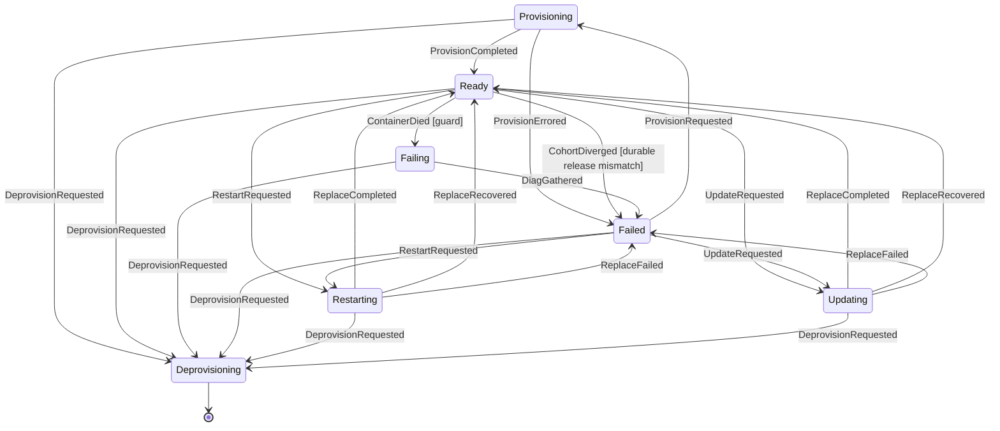

# Docker Backend

The Docker backend provisions ephemeral containers for tenant workloads. It receives provision requests from Fred, manages the full container lifecycle (pull, create, start, verify, deprovision), enforces SKU-based resource limits, and reports results via HMAC-signed callbacks.

## Configuration Reference

All fields are set in the backend's YAML config block. Defaults come from `DefaultConfig()`.

### Core

| Field | YAML Key | Type | Default | Description |
|---|---|---|---|---|
| Name | `name` | string | `"docker"` | Backend identifier |
| ListenAddr | `listen_addr` | string | `":9001"` | HTTP server listen address |
| DockerHost | `docker_host` | string | `"unix:///var/run/docker.sock"` | Docker daemon socket path or URL |
| HostAddress | `host_address` | string | *(required)* | External IP/hostname for port mappings. Must be a valid IP or hostname, not a URL |
| HostBindIP | `host_bind_ip` | string | `"0.0.0.0"` | IP address to bind container ports to |
| LogLevel | `log_level` | string | `"info"` | Log verbosity: `debug`, `info`, `warn`, `error`. Not set in `DefaultConfig()`; defaults to `"info"` at startup via `cmp.Or` |
| ProductionMode | `production_mode` | bool | `false` | Tightens startup checks beyond basic validation. When true, `Validate` rejects dev-only insecure toggles — currently `callback_insecure_skip_verify`. Mirrors providerd's `production_mode` |
| MaxRequestBodySize | `max_request_body_size` | int64 | `2097152` (2 MiB) | Caps inbound HTTP request body size (bytes). Falls back to `DefaultMaxRequestBodySize` (2 MiB) when unset or non-positive. Also settable via env `DOCKER_BACKEND_MAX_REQUEST_BODY_SIZE` (ENG-448) |

### TLS & mTLS (ENG-103)

| Field | YAML Key | Type | Default | Description |
|---|---|---|---|---|
| TLSCertFile | `tls_cert_file` | string | *(empty)* | Server certificate. When set together with `tls_key_file`, the listener serves HTTPS; otherwise plaintext HTTP (default). Loaded once at startup — rotation requires a restart (ENG-294) |
| TLSKeyFile | `tls_key_file` | string | *(empty)* | Server private key. Must be set together with `tls_cert_file` |
| TLSClientCAFile | `tls_client_ca_file` | string | *(empty)* | Enables mutual TLS: the listener requires and verifies a client certificate signed by this CA. Requires `tls_cert_file` + `tls_key_file` |
| TLSClientAllowedNames | `tls_client_allowed_names` | []string | *(empty)* | Optionally pins the mTLS client identity — the presented cert's CommonName or a DNS SAN must be in this list. Empty accepts any cert signed by `tls_client_ca_file`. Requires `tls_client_ca_file` |

### Resources

| Field | YAML Key | Type | Default | Description |
|---|---|---|---|---|
| TotalCPUCores | `total_cpu_cores` | float64 | `8.0` | Total CPU cores in the resource pool; must be finite and positive |
| TotalMemoryMB | `total_memory_mb` | int64 | `16384` | Total memory available (MB) |
| TotalDiskMB | `total_disk_mb` | int64 | `102400` | Total physical disk admission pool (MB): durable SKU disk plus pinned scratch for live diskless instances and retained/reaping durable footprints |

### SKU Management

| Field | YAML Key | Type | Default | Description |
|---|---|---|---|---|
| SKUMapping | `sku_mapping` | map[string]string | *(empty)* | Maps on-chain SKU UUIDs to profile names |
| SKUProfiles | `sku_profiles` | map[string]SKUProfile | *(required, non-empty)* | Maps profile names to resource limits. CPU must be finite and positive, memory positive, and disk non-negative. Operator-declared; no defaults |

`sku_profiles` is required and authoritative when a new generation is admitted — `DefaultConfig()` deliberately does not seed it, because yaml.v3 merges map keys during Unmarshal and a partial operator config would silently inherit defaults (see ENG-238). Validate rejects an empty map with `"at least one SKU profile is required"`. The admitted CPU, memory, and durable disk values are then pinned in durable operation/release authority; a `disk_mb: 0` Docker row additionally pins the current `container_tmpfs_size_mb` as its mutually exclusive scratch allowance. Restart, update, recovery, and close do not continuously reprice that generation from later configuration edits.

Recommended starter profiles (copy these into your config if you want the previous four-tier shape):

| Profile | CPU Cores | Memory MB | Disk MB |
|---|---|---|---|
| `docker-micro` | 0.25 | 256 | 512 |
| `docker-small` | 0.5 | 512 | 1024 |
| `docker-medium` | 1.0 | 1024 | 2048 |
| `docker-large` | 2.0 | 2048 | 4096 |

SKU resolution: the backend first checks `SKUMapping` for a UUID-to-name translation, then looks up the name in `SKUProfiles`. This allows on-chain UUIDs to map to human-readable profile names.

### Image Security

| Field | YAML Key | Type | Default | Description |
|---|---|---|---|---|
| AllowedRegistries | `allowed_registries` | []string | `["docker.io", "ghcr.io"]` | Registries from which images may be pulled |

Images are validated before pull. The registry is extracted from the image reference (e.g., `ghcr.io/org/app:v1` -> `ghcr.io`). Bare names like `nginx` resolve to `docker.io`.

### Callbacks

| Field | YAML Key | Type | Default | Description |
|---|---|---|---|---|
| CallbackSecret | `callback_secret` | string | *(required, min 32 bytes)* | Bidirectional HMAC-SHA256 key; must match this backend's providerd `backends[].hmac_secret` and be unique across backends |
| CallbackInsecureSkipVerify | `callback_insecure_skip_verify` | bool | `false` | Skip TLS verification for callbacks (dev only) |
| CallbackDBPath | `callback_db_path` | string | `"callbacks.db"` | Path to the identity-bound bbolt operation-intent, maintenance-intent, non-expiring close-finalizer, and callback-outbox journals; back it up with `releases.db`, `retention.db`, both storage-identity markers, and the matching substrate |
| CallbackMaxAge | `callback_max_age` | duration | `24h` | Maximum age of legacy callbacks and typed lifecycle observations; operation/maintenance intents, close intents, and exact operation/maintenance completions never expire; must be positive |

Provision and restore requests carry two callback endpoints. The Docker backend
persists the exact operation completion URL as `fred.callback_url` and the
typed observation endpoint as `fred.lifecycle_callback_url`. Initial
provision/restore success or failure uses the exact URL. Restart, update, and
custom-domain completion uses the lifecycle URL but remains an exact,
non-coalescible maintenance delivery; autonomous container-death and deprovision
events are coalescible lifecycle observations.
On upgrade, containers lacking the newer lifecycle label are recovered by
replacing only `operation_id` with `lifecycle_id` in a typed exact URL while
preserving unrelated query fields; an operationless legacy URL stays tokenless.

Every outbound callback is persisted under its own delivery UUID before the
first attempt. Exact operation/maintenance completions and lifecycle events for
one lease therefore remain independently replayable and FIFO ordered;
successful delivery removes only that event. Lifecycle coalescing and age
cleanup never remove an exact completion.
Because maintenance completions share the lease's stable lifecycle URL and do
not carry `maintenance_id` on the wire, Docker refuses the next restart, update,
or custom-domain replacement for that lease while a prior exact maintenance
completion is queued. Successful synchronous callback delivery precisely
removes the row and reopens admission. The resulting `409 Conflict` is
lease-local and retryable; other leases remain available.
When recovery records maintenance Success followed by runtime Failed, both
rows are maintenance-derived exact deliveries; removing only the Success head
does not release the fence.
The legacy v0.13 lease-keyed queue must be empty before upgrade: current startup
and health refuse a nonempty old bucket, and the current sender never invents a
storage identity for an old row. See `DEPLOYMENT.md` for the stopped cutover;
rolling either direction across this callback-store boundary is unsupported.

Provision/restore admission also commits an immutable per-lease operation intent,
including the exact resolved CPU/memory/durable-disk/scratch profiles, before its first
substrate mutation. That snapshot moves unchanged into the live provision and
successful release. Restart/update/custom-domain replacement similarly commits a
separately typed maintenance intent before appending its exact target release or
touching Docker. A store-assigned canonical UUIDv4 identifies that intent, target
release, and every target container. The cancelable pre-append admission and
append-started authority are distinct opaque capabilities; advancing to the
latter invalidates every stale cancellation token before `releases.db` can be
mutated. Deprovision uses the separate
`pending_callback_close_intents` journal described under
[Durable close finalization](#durable-close-finalization). None of these causal
intent classes is governed by `callback_max_age`.

### Diagnostics

| Field | YAML Key | Type | Default | Description |
|---|---|---|---|---|
| DiagnosticsDBPath | `diagnostics_db_path` | string | `"diagnostics.db"` | Path to the recreateable bbolt failure-diagnostics database; it carries no lifecycle authority |
| DiagnosticsMaxAge | `diagnostics_max_age` | duration | `168h` | Maximum age of persisted diagnostic entries before cleanup (7 days) |

When a provision fails (during provisioning, state recovery, or partial deprovision), the backend persists full failure diagnostics and container logs to a bbolt database. `GET /provisions/{lease_uuid}` and `GET /logs/{lease_uuid}` fall back to this store when the provision is no longer in memory (e.g., after deprovision or restart), returning the persisted error and logs with a 7-day default retention.

### Releases

| Field | YAML Key | Type | Default | Description |
|---|---|---|---|---|
| ReleasesDBPath | `releases_db_path` | string | `"releases.db"` | Path to the identity-bound authoritative release-history database; the file is required even when empty |
| ReleasesMaxAge | `releases_max_age` | duration | `2160h` | Maximum age of persisted release entries before cleanup (90 days) |

Every new release persists immutable ordered `Items` and the canonical resource
profile snapshot used for admission. A stack-form v0.13 row has neither field:
recovery derives the complete service/SKU/domain/index cohort from exact Docker
labels, checks it against the active manifest, and freezes `Items` plus every
then-current SKU profile under an exact whole-release compare-and-swap. The
older service-name-less cohort instead runs the stop/rename/recreate migration
before ordinary recovery. A transitional items-only row is backfilled only
under an exact version-and-items compare-and-swap. Keep the deployed v0.13 SKU
mapping, numeric profiles, and `container_tmpfs_size_mb` unchanged through the
first successful upgraded startup. Because v0.13 did not persist desired
quantity in its release row, the mandatory provider-side placement preflight in
`DEPLOYMENT.md` must still compare the exposed frozen `Items` with the
height-pinned chain workload before providerd starts.

Each encoded per-lease history is capped at 32 MiB. Before a provision,
restore, or one-time legacy migration mutates substrate, the backend proves that
the exact terminal release can fit after deterministic compaction. The legacy
proof includes the complete tokenless runtime authority, and the post-health
write commits that authority with the manifest, items, and profiles before
rollback cleanup is scheduled. Compaction always preserves
the index-latest row, most recent active row, and newest legacy-migration row.
It removes expired disposable audit entries first, then the oldest fresh
disposable entries, so capacity pressure may shorten audit history before
`releases_max_age` but cannot discard recovery or rollback-cleanup authority. If
protected authority alone exceeds the cap, admission fails before mutation.

### Authoritative store lineage

Before the first normal start of a genuinely new empty backend, run
`docker-backend -config docker-backend.yaml -initialize-storage-identity new`
once. Normal startup is verification-only and never creates, repairs, or binds a
missing marker or authoritative journal. Existing v0.13 state must use the
stopped-and-drained `adopt` workflow in `DEPLOYMENT.md`.

Before the cutover backup or `adopt`, run the upgraded binary without starting
the service:

```bash
docker-backend -config docker-backend.yaml \
  -preflight-storage-identity-adoption
```

Require exit status zero and the sole stdout line
`ready_for_v0_13_storage_identity_adoption`. This proof is read-only and leaves
both markers absent. It reports unresolved v0.13 restoring records and exact
interrupted deprovision shapes rather than synthesizing the operation authority
those records lack; follow the isolated-v0.13 repair procedure in
`DEPLOYMENT.md`, then stop, preflight, and back up again.
Both this preflight and `-initialize-storage-identity {new|adopt}` accept
`-storage-identity-operation-timeout` (default `10m`). The deadline is shared
across context-aware Docker and filesystem-control-plane probes but is
cooperative: a blocking local open, bbolt operation, or fsync cannot be
interrupted mid-syscall. A timeout is failure, not proof of rollback; keep the
lineage stopped and rerun the same mode against unchanged input.
An active legacy release with neither containers nor a retention finalizer is a
different unresolved-close refusal: never replay deprovision against it, because
that can purge the release while stranding remaining tenant volumes. Restore a
complete pre-close snapshot or follow Deployment's chain-proven manual data
decision procedure.

`ErrV013OrphanRollbackRemnant` is the narrow stopped `-prev` case with no
release, retention, or managed-volume authority. The classifier requires one
dense cohort whose immutable IDs, lease/backend/provider/tenant/SKU/image/domain,
callback pair, names/indexes, and explicit `created`/`exited`/`dead` states are
coherent. Its stderr includes the provider and a bounded, sorted
`immutable_container_ids` JSON array; record those full IDs and never use
reusable names as cleanup handles. The Docker preflight derives the cohort while
the journal parents, managed-volume root, and daemon SystemID are pinned and
re-attested; record that SystemID and require it again during exact-ID
reinspection. Do not delete anything until the stopped provider's separate
read-only `placement-preflight` mode, invoked with
`-prove-terminal-orphan <lease-uuid>` and `-expected-backend <name>`, proves the
exact lease present and terminal in the same provider's complete height-pinned
snapshot and absent from a pristine v0.13 placement database. Require its
printed provider UUID to equal the Docker diagnostic. That verdict is necessary
but not sufficient: follow the exact-ID reinspection/removal procedure in
`DEPLOYMENT.md`, then rerun both proofs and require this Docker adoption
preflight itself to pass before taking the final backup or sealing.

The same preflight recognizes migration crash generations without inventing
their missing authority. A rollback-only original/`-prev` cohort is resumable,
including the exact case where Docker still records the old bind source after
the managed parent was already renamed to its service-aware name. A complete
pre-`RecordMigration` `-prev` cohort plus v0.13's authorityless stack generation
emits a bounded sorted `immutable_stack_container_ids` JSON array and requires
re-inspecting, stopping if needed, and removing without force only those
diagnostic-proven immutable stack IDs from a stopped backup, rerunning the proof,
taking a fresh backup, then letting current startup resume from the rollback
cohort. A post-`RecordMigration` authorityless stack
with partial/full `-prev` cleanup is not repairable from those remnants: restore
a known-good pre-migration snapshot or use a dedicated proof-bearing repair.
Never infer quantity or callback identity from a partial rollback set.

Release adoption likewise normalizes only exact v0.13 writer shapes: the
flat-active/semantically-equal-stack-active pair from `RecordMigration`, and
post-active `deploying` rows whose parsed manifests are semantically identical
to `LatestActive`. A differing environment, command, or other manifest field is
an unresolved update/restart generation and fails without store or marker
mutation. See `DEPLOYMENT.md` for the stopped recovery procedures.

Storage-identity initialization binds the physical parent directories of both
markers and all three authoritative journals (`callbacks.db`, `releases.db`,
and `retention.db`) before it inspects fresh/adoption evidence. Later file
inspection, creation, and publication is relative to those retained directory
descriptors. Renaming, unmounting, or recreating a parent at the same pathname
therefore aborts sealing instead of redirecting authority into replacement
storage.

At runtime, marker/substrate verification and the three journals share one
backend-lifetime terminal authority latch. Identity drift, an outcome-unknown
bbolt commit, or another terminal substrate/store proof failure records its
first cause before canceling the backend; every sibling journal and callback
delivery then refuses with that cause. Journal writes hold the shared gate
through commit and postcheck, so withdrawal waits for an admitted write and
blocks the next one. A readable `releases.db`, for example, cannot advance after
`callbacks.db` has withdrawn the common lineage. Preserve the marker pair, all
three journals, Docker substrate, and managed volumes as one evidence/backup
set.

`TerminalStorageAuthorityFailure` publishes that first runtime cause to the
binary's main loop. The listener closes, HTTP and backend workers drain under
their fixed shutdown bounds, and the process exits status 1 even after a clean
drain so its supervisor launches a fresh `Start`. A persistent fault therefore
crash-loops closed. A failure found during `Start` exits 1 before listener bind;
there is no running server to drain. Library consumers embedding `Backend` must
also consume `TerminalStorageAuthorityFailure`, stop serving, drain, and replace
the entire Backend instance; continuing with the latched instance is unsupported.

An active Release is the durable runtime commit record. Current releases carry
an all-or-nothing typed authority that binds a valid UUIDv4 operation lineage to
the exact tenant, canonical provider UUID, emitted/effective item topology,
pinned resource profiles, manifest, and callback pair. A fully inspected
callback-bearing v0.13 cohort is instead CAS-fenced with a disjoint tokenless
`LegacyRuntimeAuthority`; the authorityless v0.13 row is accepted only as
pre-backfill upgrade input and must be frozen before any operation can remove
its last witness. Restart and Update treat a requested callback base as pending
until the replacement is Ready and that Release activates; failure and rollback
keep the previous active route. Either committed authority class can rebuild a
conservative Failed projection and full allocation with zero survivors, without
minting a replacement Release or guessing from mutable configuration.
An active callbackless pre-label cohort cannot be assigned provider callback
authority safely and is rejected by the mandatory stopped adoption preflight.
Callbackless historical cleanup/close evidence remains readable, but never
authorizes zero-survivor recovery or maintenance.

Runtime callback URLs contain causal capabilities. Treat `releases.db` and every
stopped-process copy or backup as sensitive together with `callbacks.db` and
`retention.db`; do not paste raw Release rows into logs or tickets.

Every bbolt database path uses a no-follow final-component open and requires a
single-link regular file with exact mode `0600`. The three authoritative
journals are additionally storage-identity-bound and continuously re-attested.
`diagnostics.db` carries no authority and may be recreated while stopped; it has
the same open-time shape/mode checks but no continuous lineage re-attestation.

### Soft-delete & Retention

| Field | YAML Key | Type | Default | Description |
|---|---|---|---|---|
| RetainOnClose | `retain_on_close` | bool | `false` | When true, managed volumes are renamed into a `fred-retained-` namespace on lease close/expire instead of being destroyed. Tenants can restore data into a new lease via `POST /v1/leases/{new_lease_uuid}/restore`. |
| RetentionDBPath | `retention_db_path` | string | `"retention.db"` | Path to the identity-bound authoritative retention database; always required even when `retain_on_close` is false |
| RetentionMaxAge | `retention_max_age` | duration | `2160h` (90 days) | How long retained volumes are kept before the grace reaper destroys them. When `> 0` it also gates restore eligibility — a retained record older than this is no longer restorable. Set to `0` to disable age-based reaping **and** the age gate: retained volumes are then kept **indefinitely** and stay restorable until evicted, unless a per-tenant cap (`max_retained_leases_per_tenant > 0`) is configured to evict them. |
| RetentionReapInterval | `retention_reap_interval` | duration | `1h` | Cadence of the background retention sweep, which destroys expired retained volumes and reconciles in-flight restores. If set to `0` it falls back to `retention_max_age`, then to a hard-coded `1h`. The sweep still runs (to reconcile restores) when `retain_on_close` is set even with `retention_max_age: 0`. |
| MaxRetainedLeasesPerTenant | `max_retained_leases_per_tenant` | int | `0` (unlimited) | Maximum number of retained leases kept per tenant. When a soft-delete would exceed the cap, the tenant's oldest retained lease(s) are **evicted (hard-deleted)** at close time — oldest-first until `cap-1` remain (so a single close can drop multiple old leases). Never touches other tenants and never evicts a record being restored. `0` means no cap. |
| RetentionOrphanConfirmations | `retention_orphan_confirmations` | int | `3` | Number of consecutive retention sweeps a soft-deleted record must be observed with **all** its retained volumes missing before the record is pruned (ENG-370). Catches records orphaned when their backing volumes vanish out-of-band (host/docker churn, `docker volume prune`, data-root reset) so they don't linger for the full grace window. Fail-safe: a sweep that cannot enumerate volumes, or finds the volume root absent/unreadable, skips rather than pruning. This is a **sweep count**, not a duration — the effective confirmation window is `N × retention_reap_interval` (≈3h at the 1h default). `0` disables orphan pruning entirely (kill-switch). |
| MaxRetainedDiskMB | `max_retained_disk_mb` | int64 | `0` (unlimited) | Per-provider cap on the aggregate retained-volume disk footprint (MB) across all tenants. When retaining a closing lease would exceed this cap, the lease is destroyed immediately instead of retained (existing in-grace data is never evicted). `0` means no cap. When set, must be ≤ `total_disk_mb` **and** ≥ the largest stateful SKU's `disk_mb` (a smaller cap would make an otherwise-legal lease impossible to retain). |

> **Writable-path-only reclaim (ENG-406):** even with `retain_on_close: true`, a closing lease's volumes that hold only ephemeral `_wp/` writable-path scaffolding (no declared-`VOLUME` durable data) are **destroyed (reclaimed)** at close instead of retained — restore reseeds `_wp` from the image regardless, so retaining them preserves nothing restorable. The detector is conservative toward RETAIN (it never destroys a stateful volume). Counted by `fred_docker_backend_retention_writable_path_reclaimed_total`.

> **Duration syntax:** `retention_max_age` and `retention_reap_interval` use Go duration syntax — valid units are `h`, `m`, `s` (e.g. `2160h` for 90 days, `336h` for 14 days). The units `d` (days) and `w` (weeks) are **not** valid and will fail config validation.

### Tenant Quotas

| Field | YAML Key | Type | Default | Description |
|---|---|---|---|---|
| TenantQuota | `tenant_quota` | object | *(none)* | Per-tenant resource limits (optional) |
| TenantQuota.MaxCPUCores | `tenant_quota.max_cpu_cores` | float64 | - | Maximum CPU cores per tenant |
| TenantQuota.MaxMemoryMB | `tenant_quota.max_memory_mb` | int64 | - | Maximum memory per tenant (MB) |
| TenantQuota.MaxDiskMB | `tenant_quota.max_disk_mb` | int64 | - | Maximum physical disk admission per tenant (MB), including pinned scratch for live diskless instances |

When `tenant_quota` is configured, no single tenant can consume more than the specified limits, even if the resource pool has capacity available. Quota values must be positive, CPU must be finite, and no quota may exceed the corresponding total pool capacity. YAML `.nan`, `.inf`, and `-.inf` values are rejected.

### Timeouts

| Field | YAML Key | Type | Default | Description |
|---|---|---|---|---|
| ImagePullTimeout | `image_pull_timeout` | duration | `5m` | Timeout for pulling images |
| ContainerCreateTimeout | `container_create_timeout` | duration | `30s` | Timeout for creating containers |
| ContainerStartTimeout | `container_start_timeout` | duration | `30s` | Timeout for starting containers |
| ProvisionTimeout | `provision_timeout` | duration | `10m` | Maximum time for the entire provisioning operation. Validated as positive — must be `> 0`. |
| ReconcileInterval | `reconcile_interval` | duration | `5m` | How often to reconcile state with Docker |
| StartupVerifyDuration | `startup_verify_duration` | duration | `5s` | Grace period after start before verifying containers are still running |
| ContainerStopTimeout | `container_stop_timeout` | duration | `30s` | Grace period before SIGKILL when stopping containers |
| MigrationReadyTimeout | `migration_ready_timeout` | duration | `90s` | Caps how long a recover-time migration waits for the new stack-form container to reach `healthy` (or `running` when no health check is declared) before declaring the migration failed for that lease |
| MigrationGracePeriod | `migration_grace_period` | duration | `1m` | How long the renamed `-prev` legacy container lingers after a successful recover-time migration before forced removal (preserves rollback potential) |

Configuration loading starts from `DefaultConfig`, so omitted YAML keys receive
the values above. For programmatic configs, zero
`container_stop_timeout`, `migration_ready_timeout`, and
`migration_grace_period` values select those same defaults; negative values are
rejected. `startup_verify_duration: 0` likewise selects 5s rather than disabling
verification. Image pull, container create/start, provision, and reconcile
durations must remain positive. Durations use Go syntax (`h`, `m`, `s`); `d` and
`w` are not valid units.

### Container Hardening

| Field | YAML Key | Type | Default | Description |
|---|---|---|---|---|
| NetworkIsolation | `network_isolation` | *bool | `true` | Per-tenant Docker network isolation |
| ContainerReadonlyRootfs | `container_readonly_rootfs` | *bool | `true` | Read-only root filesystem |
| ContainerPidsLimit | `container_pids_limit` | *int64 | `256` | Maximum PIDs per container |
| ContainerTmpfsSizeMB | `container_tmpfs_size_mb` | int | `64` | Size (MB) for each `/tmp`/`/run`/image-`VOLUME` tmpfs and, separately, the conservative on-disk scratch allowance pinned for every `disk_mb: 0` instance. Tenant-declared tmpfs uses the same per-mount ceiling; memory tmpfs is not charged as disk |

### Ingress (Traefik Integration)

| Field | YAML Key | Type | Default | Description |
|---|---|---|---|---|
| Ingress.Enabled | `ingress.enabled` | bool | `false` | Enable reverse proxy label generation |
| Ingress.WildcardDomain | `ingress.wildcard_domain` | string | *(required when enabled)* | Base domain for tenant subdomains (e.g., `apps.example.com`) |
| Ingress.Entrypoint | `ingress.entrypoint` | string | *(required when enabled)* | Traefik entrypoint name (e.g., `websecure`) |
| Ingress.CustomDomainCertResolver | `ingress.custom_domain_cert_resolver` | string | `"http01"` | Traefik certresolver name used for per-tenant custom domains (HTTP-01 by default) |
| Ingress.CustomDomainMiddlewares | `ingress.custom_domain_middlewares` | string[] | `["security-headers@file"]` | Traefik middleware references applied to the secondary custom-domain router |
| Ingress.CustomDomainDNSResolvers | `ingress.custom_domain_dns_resolvers` | string[] | `["1.1.1.1:53","8.8.8.8:53","9.9.9.9:53"]` | Public DNS servers (`host:port`) fred queries to confirm a tenant custom domain resolves to this host before emitting its HTTP-01 router (ENG-266) |
| Ingress.CustomDomainDNSQuorum | `ingress.custom_domain_dns_quorum` | int | `0` (majority) | How many resolvers must independently see the domain at this host before the readiness gate opens. `0` = majority; clamped to `[1, len(resolvers)]` |
| Ingress.CustomDomainDNSCheckDisabled | `ingress.custom_domain_dns_check_disabled` | bool | `false` | Turns OFF the custom-domain DNS readiness gate, emitting the custom-domain router immediately (ENG-266) |

When enabled, containers with routable TCP ports receive Traefik Docker labels for automatic HTTPS routing. Each container gets a unique subdomain under `wildcard_domain` derived from lease UUID and service metadata (guaranteed ≤63 chars per RFC 1035). Port selection: explicit manifest `ingress` hint > 80 > 8080 > lowest TCP port. Requires `network_isolation` to be enabled — Traefik routes traffic via the per-tenant Docker network.

Routers are generated with `tls=true` but no `certresolver`. The wildcard certificate for `wildcard_domain` must be provisioned at the Traefik level — typically via a DNS-01 ACME resolver with `domains` set in Traefik's static config, or via a default certificate in `tls.stores`. Fred does not drive per-domain ACME challenges.

Example:
```yaml
ingress:
  enabled: true
  wildcard_domain: "apps.example.com"
  entrypoint: "websecure"
```

### Volume Management

| Field | YAML Key | Type | Default | Description |
|---|---|---|---|---|
| VolumeDataPath | `volume_data_path` | string | *(empty)* | Host directory for managed durable and writable-path scratch volumes. Required when any SKU has `disk_mb > 0`; optional on an all-diskless host |
| VolumeMountPath | `volume_mount_path` | string | *(empty)* | Operator-declared active mount containing `volume_data_path`. Required and runtime-verified whenever `volume_data_path` is set, including an all-diskless managed-scratch deployment |
| VolumeFilesystem | `volume_filesystem` | string | *(auto-detected)* | Filesystem type: `btrfs`, `xfs`, or `zfs`. Auto-detected from `volume_data_path` if empty. **Only `xfs` is validated in production** — see [Supported Filesystems](#supported-filesystems) |
| MinAvgFileBytes | `min_avg_file_bytes` | int64 | 1024 | Smallest avg file size before the per-volume inode ceiling binds. On XFS, derives the `ihard` quota (disk_mb × 1 MiB / min_avg_file_bytes, floored at 262144 inodes); the same value also caps tar-extraction entry count during writable-path image seeding on any backend. |

When any SKU profile has `disk_mb > 0`, the backend manages quota-enforced host
directories that are bind-mounted into containers at their Dockerfile `VOLUME`
paths. A diskless image may also receive a managed directory only for
auto-detected non-`VOLUME` writable paths under a read-only rootfs. That scratch
directory is quota-capped at the generation's pinned `container_tmpfs_size_mb`
and is non-retainable. If no volume root is configured, scratch creation/seeding
is best-effort and skipped, while the conservative pool reservation remains.

#### Supported Filesystems

| Filesystem | Mechanism | Requirements | Production status |
|---|---|---|---|
| **xfs** | Project quotas | `pquota` mount option, `xfs_quota` binary; daemon `CAP_SYS_ADMIN` | **Validated — use this in production** |
| **btrfs** | Subvolumes with qgroup quotas | `btrfs quota enable` on the filesystem; daemon `CAP_SYS_ADMIN` | Experimental — automated tests, not production-validated or deployed |
| **zfs** | Child datasets with quota property | Parent dataset exists, `zfs` binary (exempt from `CAP_SYS_ADMIN` via `zfs allow` delegation) | Experimental — automated tests, not production-validated or deployed |

> **Production support:** **`xfs` is the only filesystem validated and used in production.** All mainnet and Morpheus backends run XFS with `pquota`, and per-volume disk *and* inode (`ihard`) quotas are exercised only on XFS. The **`btrfs`** and **`zfs`** backends have automated coverage but are **not production-validated and not used in any deployment** — treat them as experimental. In particular, the inode-exhaustion backstops that XFS enforces via kernel project quotas have no equivalent production evidence on btrfs/zfs. Use `xfs` for any production deployment.

> **Capability requirement (xfs/btrfs):** setting a volume's block-quota limit is a privileged operation, so the docker-backend must hold `CAP_SYS_ADMIN` on an xfs or btrfs backend. The daemon **fails fast at startup** if it lacks it (`internal/backend/docker/capability.go`) rather than provisioning with silently-unenforced disk caps. The startup backfill that re-tags pre-existing tenant-owned volumes additionally needs `CAP_FOWNER`. Grant them ambiently — `AmbientCapabilities=CAP_SYS_ADMIN CAP_FOWNER` on the systemd unit; a plain `setcap cap_sys_admin+ep` on the binary does **not** propagate to the exec'd `xfs_quota`/`btrfs` child processes. `zfs` is exempt (`zfs allow` delegation) and `noop` is unaffected. See [DEPLOYMENT.md](../../../DEPLOYMENT.md#xfs-good-for-large-fleets) and its [systemd section](../../../DEPLOYMENT.md#process-management-systemd) for the full setup.

Startup quota backfill uses each generation's immutable effective authority:
durable `disk_mb` for stateful volumes and pinned scratch for a physically
present diskless writable-path volume. Mutable config is consulted only for a
true v0.13 row whose entire profile snapshot is absent, then the result is
persisted once. Scratch remains excluded from retention caps; an exact scratch
name conservatively present in a retention row stays physically counted and
re-capped only until it is destroyed.

#### Stateful vs Ephemeral Containers

| SKU `disk_mb` | Behavior | Image VOLUME paths |
|---|---|---|
| `> 0` (stateful) | Quota-enforced host directory created per container | Bind-mounted from host directory |
| `0` (ephemeral) | Pins one scratch allowance per instance; creates a quota-enforced host directory only when a writable path is detected and managed volumes are configured | Overridden with tmpfs (prevents anonymous volumes); never bind-mounted as durable data |

All containers have a readonly root filesystem by default (configurable via
`container_readonly_rootfs`). Stateful containers write durable data to
bind-mounted volumes. Ephemeral containers use memory tmpfs for `VOLUME`, `/tmp`,
`/run`, and tenant tmpfs mounts; only auto-detected writable-path scaffolding may
use the separate host scratch described above.

**Example stateful SKU:**

```yaml
volume_data_path: "/var/lib/fred/volumes"
volume_mount_path: "/var/lib/fred/volumes"
# volume_filesystem: "xfs"  # optional, auto-detected (xfs is the only production-validated backend)

sku_profiles:
  docker-redis:
    cpu_cores: 0.5
    memory_mb: 512
    disk_mb: 2048
```

When provisioning `redis:latest` on this SKU:
1. Image inspected — discovers `VOLUME /data`
2. Host directory created: `/var/lib/fred/volumes/fred-<lease>-0/` with 2048 MB quota
3. Subdirectory `data/` bind-mounted to container `/data`
4. Redis writes to `/data` — quota enforced by kernel
5. On deprovision: an XFS delete authority is synced first, the host directory
   is removed in place, block and inode usage are proved zero, and all
   project-quota limits are cleared (`bhard=0 bsoft=0 ihard=0 isoft=0`) before
   the authority is removed

> **XFS quota-table hygiene and crash recovery (ENG-459/ENG-632):** before
> removing any final-volume bytes, `Destroy` creates an empty, project-zero,
> parent-synced
> `.fred-xfs-delete-<project-id>-<managed-volume>` sibling. The final name stays
> in place while deletion progresses. After its absence is synced, Fred proves
> both block and inode usage are zero, strictly clears all four limits, then
> removes and syncs the authority. An open-but-unlinked file therefore blocks
> completion. Any failure retains the authority, fail-stops the current backend
> instance, and blocks recreation under the same final name. The daemon closes
> its listener, drains, and exits status 1 so its supervisor launches a fresh
> `Start`; an unrepaired fault crash-loops closed. Recovery must complete before
> readiness; this is not a best-effort current-generation cleanup. Entries
> leaked by pre-ENG-459 daemons
> without a typed authority still require the one-time manual operator cleanup.

### SKU Profile Fields

| Field | YAML Key | Type | Default | Description |
|---|---|---|---|---|
| CPUCores | `cpu_cores` | float64 | — | CPU cores allocated to each container |
| MemoryMB | `memory_mb` | int64 | — | Memory in MB allocated to each container |
| DiskMB | `disk_mb` | int64 | `0` | Durable, retainable disk budget in MB. When `> 0`, a quota-enforced host directory is bind-mounted to image `VOLUME` paths (requires `volume_data_path`). When `0`, image `VOLUME` paths are overridden with tmpfs and the backend pins `container_tmpfs_size_mb` separately as non-retainable scratch admission |

## Tenant Manifest Reference

See [Manifest Guide](../../../docs/manifest-guide.md) for the full tenant-facing manifest specification (image, ports, env, health check, tmpfs). A formal [JSON Schema](../../../docs/manifest-schema.json) is also available.

## Soft-delete & Restore

When `retain_on_close: true` is set, the backend performs a **soft-delete** instead of a hard destroy at lease close or auto-expire time:

1. Canonical volumes that are **writable-path-only** — they hold only the ephemeral `_wp/` scaffolding (a read-only-rootfs writable-path mount) and no declared-`VOLUME` durable data — are **destroyed (reclaimed)**, not retained. Restore reseeds `_wp` from the image anyway (the ENG-367 wipe-contract), so retaining such a volume preserves nothing restorable and only pollutes the retention record, a per-tenant slot, the retained-disk budget, and the volume root. The detector (`isWritablePathOnly`) is conservative toward RETAIN — it destroys only *provably* `_wp`-only volumes, never a stateful one (ENG-406). If uncertainty nevertheless leaves an exact diskless scratch name in a retention row, its pinned allowance stays in physical pool accounting and quota backfill until destruction; that fail-closed exception is not retention entitlement. Observable via `fred_docker_backend_retention_writable_path_reclaimed_total`.
2. The remaining managed volumes for the lease are **renamed** from `fred-<lease_uuid>-…` into a `fred-retained-<lease_uuid>-…` namespace and kept on disk.
3. The original containers and resource-pool allocations are still released (the running workload is stopped; resources are freed for new leases).
4. Fred publishes a `retained` status event to any connected tenant WebSocket so the tenant knows their data may be recoverable.
5. Retained volumes are held for up to `retention_max_age` (default 90 days). The grace reaper runs every `retention_reap_interval` (default 1h) and destroys expired retained volumes.
6. If a retained lease's backing volumes disappear **out-of-band** (host/docker churn, `docker volume prune`, a data-root reset on redeploy) while its record survives, the periodic sweep prunes the now-orphaned record after it is observed fully volume-less for `retention_orphan_confirmations` consecutive sweeps (default 3). This keeps dead records from accumulating for the full grace window. The prune is fail-safe — a sweep that errors listing volumes, or finds the volume root absent/unreadable, skips entirely rather than risk pruning a record whose volumes are merely transiently unavailable. Observable via `fred_docker_backend_retention_orphans_pruned_total` and `fred_docker_backend_retention_orphan_skips_total{reason}`.

### Restore flow

To restore data from a closed lease into a new lease:

1. Open a **fresh lease on the same provider** by requesting the **same service names and quantities** as the original closed lease. The new lease UUID (`new_lease_uuid`) will be in `PENDING` state.
2. Call `POST /v1/leases/{new_lease_uuid}/restore` with body `{"from_lease_uuid": "<original_closed_lease_uuid>"}`. Fred validates the request and delegates to the backend.
3. The backend renames the retained volumes into the new lease's namespace (the synchronous **adopt** phase) and re-deploys the **retained manifest** (the exact deployment that was running at close time) onto them. The new lease becomes active with the same data. To change the image or configuration after restore, use the normal update path once the lease is active.

Restore-specific re-deploy behavior worth knowing:

- **Image must already be present on the node.** Restore re-uses the replace machinery, which **inspects** the image but does **not** pull it. If the image was garbage-collected from the node since close, restore fails with an image-inspect error — pre-pull the image (or restore before the node's image GC runs).
- **Image and configuration are fixed.** Restore deploys strictly from the retained `StackManifest` and items; the request carries no manifest. The new lease's requested service names and quantities must shape-match the retained set exactly (otherwise the restore is rejected with a validation error).
- **The SKU tier may change (promote/demote).** Only the item *shape* must match (service names + quantities); the SKU's resource (disk) tier **may** differ from the source lease. A **promote** (same-or-larger `disk_mb` tier) is admitted only when its aggregate growth above the retained footprint fits disk capacity, then the larger cap is applied. A **demote** (smaller `disk_mb` tier) is allowed only if the retained volume's **measured** data fits the new tier's `disk_mb` cap — the backend runs `checkDemoteFit` before adopting (restoring durable stateful data into an ephemeral `disk_mb=0` tier is always refused). The conservative exact-name exception above may restore scratch only into another diskless row, after measuring it against that destination's pinned scratch allowance. A refused demote returns HTTP `422` with body `{"code":"demote_exceeds_tier"}` (`backend.ErrDemoteDataExceedsTier`) and is counted by `fred_docker_backend_restore_demote_refused_total{backend,reason}` (`reason` ∈ `measured_exceeds`, `unmeasurable_read_error`, `unmeasurable_backend`, `ephemeral_tier`); it is **not** counted by `restore_total`.
- **Containers are recreated, ownership is not rewritten.** Restore does not force-recreate beyond the normal replace, and the volume chown is non-recursive (it sets ownership on the VOLUME mount point only), so existing files keep their on-disk ownership.

### Limitations

- **Best-effort and capacity-bounded**: retention is not a guarantee. When a per-tenant cap (`max_retained_leases_per_tenant > 0`) is configured, a soft-delete may evict that tenant's oldest retained lease(s) — independent of age — to make room for the newer one. Always restore within the grace window.
- **Same-backend-node only**: a restore can only run on the backend node that physically holds the retained volumes (the rename is local; nothing is copied between nodes). In single-backend deployments this is always satisfied. In multi-node deployments restore routing is automatic: the reconciler queries each backend's `GET /retentions` and records each retained lease's backend in the placement store, so a restore is routed to the node holding the source data (ENG-333). Restore returns `404` if no backend still holds that lease's retained data.
- **Not a backup**: retained data is a single copy on the node's local disk (RAID-backed by the operator). It provides a grace window against accidental lease closure, not protection against node-level data loss. Operators should run separate backup procedures for production data.

### Failure handling & crash recovery

Restore is crash-safe and self-healing. A retention record carries one of three persisted statuses — `active` (awaiting restore or reap), `restoring` (a restore is in flight), and `reaping` (volumes are pending physical destruction). Adoption renames volumes and applies the destination filesystem quota; rollback must reverse both mutations safely:

The `reaping` status is a finalizer tombstone (ENG-376): when a retained record is reaped (grace-expired, cap-evicted, or abandoned by a deprovision give-up) the record is **not** deleted at the active→reaping transition — it outlives its volumes and is `Delete`d only once every volume is confirmed destroyed. The bytes still sit on disk, so a reaping record keeps counting against the retained footprint while it is no longer restore-claimable. A record that cannot be reclaimed sticks in `reaping` (observable via the `fred_docker_backend_retention_reaping_leases` / `fred_docker_backend_retention_reaping_bytes` gauges); a failed destroy / give-up / uncommitted revert also bumps `fred_docker_backend_retention_leaked_total`.

A tombstone is a *name-keyed* scheduled destroy — it carries strings, not proof
of ownership — and while a restore is in flight the original lease's data wears
the new lease's canonical name, so the finalizer re-checks ownership **at destroy
time**, not just when the record was written (ENG-659). A name owned by a restore
source finalizer is skipped and the record is kept. The next sweep retries after
that restore either rolls back and re-quarantines the name or proves commit from
an exact active destination Release. In the committed case the destination's
release/provision authority continues to claim the bytes; the source row may
remain as identity for a zero-survivor Failed destination until a plain Restart
reaches Ready and finalizer reconciliation consumes it, or close hands it off.
Finalizer deletion is never permission for the old tombstone to destroy those
bytes. An unreadable retention store likewise means nothing is destroyed that
pass. Both cases are counted on
`fred_docker_backend_retention_reap_skips_total{reason}` and are deliberately
**not** counted as leaks—nothing is abandoned, and the footprint keeps counting
while the record stays `reaping`.

- **Restore failure before commit:** the new lease's compose project is torn down
  and adopted volumes are **re-quarantined**. The backend proves/reapplies the
  immutable source quota and settles the exact failed operation before it
  pre-counts the retained footprint, CAS-reactivates the source, and releases
  destination allocations. After actor acceptance, physical rollback parks the
  row `restoring` until the actor has durably settled its Failed callback; the
  periodic sweep completes the handback. Any uncertainty remains `restoring`
  and live-counted.
- **Committed restore followed by failure:** an exact active destination Release
  is the durable commit marker. It is retained even if the destination is now
  Failed or absent; a matching pending intent is settled as success. With zero
  survivors, recovery publishes a conservative Failed destination, keeps its
  exact allocation, and retains the source finalizer as tenant/provider identity
  across repeated restarts. Once the exact restore intent is settled, a plain
  Restart may repair the destination; reaching Ready lets reconciliation consume
  that row. Close first commits a complete close intent and then deletes it
  before teardown.
  This is a post-commit runtime failure, never source rollback.
- **Destination mutation fence:** while the source row remains `restoring`, new
  Provision and Restore operations for its destination are rejected. Before
  commit, maintenance is rejected too. After an exact active Release proves
  commit and the exact restore intent settles, a plain Restart may recover a
  committed Failed destination. Update and custom-domain redeploys remain fenced
  until that Restart reaches Ready and finalizer reconciliation consumes the
  row. The volatile provision map alone cannot release that fence.
- **Crash mid-restore**: on the next startup (and on every periodic sweep) the backend reconciles dangling `restoring` records — recognizing exact committed Releases and rolling back only pre-commit generations before the orphan-volume reaper runs. The complete decision and mutation hold the destination lease's command fence, so a stale failed snapshot cannot race a restart to Ready. A record is written before the rename, so a crash in the narrow window between the two is repaired by re-quarantine rather than data loss.

## Provisioning Lifecycle

1. **Synchronous validation** -- the `Provision` method validates the request before returning:
   - Checks for duplicate lease (returns `ErrAlreadyProvisioned` unless existing provision is failed)
   - Resolves all SKUs to profiles via `SKUMapping` + `SKUProfiles`
   - Parses the JSON manifest and validates image, ports, labels, and health check
   - Validates the image against `AllowedRegistries`
   - Freezes immutable resource profiles and allocates all instances from the
     resource pool (rolls back on failure). A diskless instance reserves its
     pinned scratch allowance before image inspection, whether or not a host
     scratch directory is later required

2. **Asynchronous provisioning** -- runs in a goroutine tracked by a `WaitGroup`:
   - Pulls the image (once, shared across all containers in the lease)
   - Inspects the image to discover Dockerfile `VOLUME` declarations
   - Creates/ensures the per-tenant network (if `NetworkIsolation` is enabled)
   - For each item in the lease (supports multi-SKU), for each unit (supports multi-unit):
     - For stateful SKUs (`disk_mb > 0`): creates a quota-enforced host directory and bind-mounts image VOLUME paths into it
     - For ephemeral SKUs (`disk_mb == 0`): overrides image `VOLUME` paths with
       tmpfs; when managed volumes are configured and a non-`VOLUME` writable
       path is detected, creates a quota-capped scratch bind instead
     - Creates a container with the appropriate SKU profile, hardening settings, and labels
     - Starts the container
   - Verifies startup (see [Startup Verification](#startup-verification) for the two paths)

3. **Callback** -- on success or failure, sends an HMAC-signed callback to the URL provided in the provision request.

Multi-unit leases create multiple containers from the same manifest. Multi-SKU leases create containers with different resource profiles per SKU. Instance indices are 0-based across all items.

The entire async operation is bounded by `ProvisionTimeout` and is canceled on backend shutdown.

### Stack Provisioning

When lease items carry `service_name` fields (and the payload is a [stack manifest](../../../docs/manifest-guide.md#stack-manifest)), the backend provisions a multi-service stack:

1. **Synchronous validation** — same as single-container, plus:
   - Detects stack vs single mode via `IsStack(items)`
   - Validates 1:1 mapping between manifest service names and lease item service names
   - Proves that quantity expansion produces unique Compose keys (for example,
     `web` quantity 2 cannot coexist with an unscaled `web-0`); Compose PS output
     is attributed through that exact key map rather than numeric-prefix parsing
   - Validates each per-service manifest independently

2. **Asynchronous provisioning** — Docker Compose-based deployment:
   - Each service's image is pulled and inspected independently (pre-flight, before Compose)
   - Volumes are pre-created for stateful services (`disk_mb > 0` with image
     `VOLUME`s) and for detected writable-path scratch when available
     - Resource allocation ID: `{leaseUUID}-{serviceName}-{instanceIndex}`
     - Volume ID: `fred-{leaseUUID}-{serviceName}-{instanceIndex}`
   - A Compose project is built in-memory from the stack manifest via `buildComposeProject`
   - Service startup ordering is controlled by `depends_on` declarations in the manifest (supports `service_started` and `service_healthy` conditions with cycle detection)
   - `compose.Up` atomically creates, starts, and network-attaches all service containers
   - `compose.PS` discovers the resulting container IDs per service
   - Startup verification runs per-service, each using its own health check config
   - Restart/update uses `compose.Up` with the updated project; on failure, the previous manifest is rebuilt and rolled back via another `compose.Up`
   - Deprovision uses `compose.Down` for atomic cleanup, with fallback to individual container removal

3. **Callback** — single callback for the entire stack (success only when all services are healthy/running).

## Container Hardening

Every container is created with the following security measures:

| Feature | Implementation | Notes |
|---|---|---|
| Drop all capabilities | `CapDrop: ["ALL"]` | No Linux capabilities granted |
| No new privileges | `SecurityOpt: ["no-new-privileges:true"]` | Prevents privilege escalation via setuid/setgid |
| Read-only root filesystem | `ReadonlyRootfs: true` | Configurable via `container_readonly_rootfs` |
| Tmpfs for `/tmp` and `/run` | `Tmpfs: {"/tmp": "size=64M", "/run": "size=64M"}` | Only when readonly rootfs is enabled; size from `container_tmpfs_size_mb`. Tenants may request up to 4 additional tmpfs mounts via manifest, for a maximum of 6 total (384MB at default size). **Note:** On cgroup v1, tmpfs memory is not counted against the container's cgroup memory limit. On cgroup v2 (default on modern systems), it is. |
| PID limit | `PidsLimit: 256` | Configurable via `container_pids_limit` |
| Memory (no swap) | `MemorySwap == Memory` | Prevents swap usage entirely |
| Restart policy disabled | `RestartPolicyDisabled` | Failed containers stay dead for crash detection |
| Network isolation | Per-tenant bridge network | Configurable via `network_isolation` |

## Startup Verification

After all containers in a lease are started, the backend verifies they are ready before sending a success callback. The verification path depends on whether the manifest declares an active health check.

### No health check (fixed-wait path)

When the manifest has no `health_check` (or sets `Test[0]` to `"NONE"`), the backend waits for `StartupVerifyDuration` (default 5s) and then inspects each container. If any container has exited during this window, the entire provision is marked as failed and cleaned up.

This catches containers that crash immediately on startup due to bad configuration, read-only filesystem errors, missing dependencies, or similar issues -- before a success callback is sent and the lease is acknowledged as active on chain.

Note: the runtime uses `cmp.Or` to fall back to 5s when the value is zero, so setting `startup_verify_duration: 0` does not disable verification -- it uses the 5s default.

### With health check (health-aware path)

When the manifest declares an active health check (`health_check` with `Test[0]` of `"CMD"` or `"CMD-SHELL"`), the backend polls every 2s until all containers report `healthy`. The behavior on each poll:

- **`healthy`** -- container passes, removed from the pending set.
- **`unhealthy`** -- provision fails immediately with an error.
- **Container exited** -- provision fails immediately (caught before checking health status).
- **`starting`** -- keep polling.

The polling is bounded by the existing `ProvisionTimeout` context (default 10m). If the timeout fires before all containers are healthy, the provision fails. Operators must ensure `ProvisionTimeout` is compatible with their health check timing (start period + interval * retries).

A health check defined in the Dockerfile but not in the manifest does **not** trigger the health-aware path -- the manifest is the contract.

## Re-provisioning

When a provision has `status=failed` (e.g., a container crashed and was detected by the reconciler), a new `Provision` call for the same lease UUID is allowed. The re-provision flow:

1. The existing `FailCount` is carried over from the failed provision record.
2. Resource allocations are released and old containers are removed. Managed volumes are **kept** — stateful data persists across re-provisions.
3. A new provision record is created with `FailCount` preserved.
4. The full provisioning flow runs again (image pull, image inspect, volume setup via idempotent Create, container create/start, startup verification). Existing volumes are reused with quota updated; only new volumes are created.
5. On failure, `FailCount` is incremented. The `FailCount` is also persisted in the `fred.fail_count` container label. Only newly created volumes are cleaned up; reused volumes are preserved.

## Lease State Machine

**One concept: the lease actor is the scope of atomicity for its messages and its workers.** Everything else falls out of that invariant:

- **Registry atomicity** — the actor registry (`b.actors`) is guarded by a mutex; `routeToLease(uuid, msg)` resolves-or-creates AND enqueues under that mutex, so callers never hold a `*leaseActor` pointer. Stale-pointer races are unreachable by construction.
- **Worker ownership** — every worker goroutine (provision, restart, update, diag) is spawned by the actor and tracked by its per-actor `workers` barrier (a channel-signaled reference counter; see `work_barrier.go`). Normal actor exit waits for `workers.Zero()` before registry deletion and inbox drain. The wait is bounded: a stuck worker aborts a preempting state transition (so deprovision cannot tear down underneath it), while shutdown eventually returns `ErrShutdownDrainTimeout`, leaves dependencies open, and makes the process exit non-zero. The barrier's channel-based wait means a wedged worker adds no leaked waiter on top of itself.
- **Drain-with-handle** — on exit, any message in the inbox is processed via `handle()` (not just closed-and-dropped). Terminal events delivered during the shutdown window still drive their SM transition. Silent drops are gone.
- **Non-blocking routing** — `routeToLease` uses a non-blocking inbox send under the registry mutex. A wedged actor cannot stall the event loop; full-inbox refusals increment `die_event_dropped_total` and the reconciler re-detects within its cycle.

Every lease is owned by a per-lease actor goroutine with a bounded inbox (16 messages). All transitions flow through a state machine, one per actor, which serializes transitions and owns the side effects (callback emission, diagnostics persistence, gauge updates). The SM's initial state is the lease's current `Status` at actor creation — new leases start in `Provisioning`, recovered leases start in whatever state they were in.


```mermaid
stateDiagram-v2
    Provisioning --> Ready: ProvisionCompleted
    Provisioning --> Failed: ProvisionErrored
    Provisioning --> Deprovisioning: DeprovisionRequested

    Ready --> Failing: ContainerDied [guard]
    Ready --> Failed: CohortDiverged [durable release mismatch]
    Ready --> Deprovisioning: DeprovisionRequested
    Ready --> Restarting: RestartRequested
    Ready --> Updating: UpdateRequested

    Failing --> Failed: DiagGathered
    Failing --> Deprovisioning: DeprovisionRequested

    Failed --> Provisioning: ProvisionRequested
    Failed --> Restarting: RestartRequested
    Failed --> Updating: UpdateRequested
    Failed --> Deprovisioning: DeprovisionRequested

    Restarting --> Ready: ReplaceCompleted
    Restarting --> Ready: ReplaceRecovered
    Restarting --> Failed: ReplaceFailed
    Restarting --> Deprovisioning: DeprovisionRequested

    Updating --> Ready: ReplaceCompleted
    Updating --> Ready: ReplaceRecovered
    Updating --> Failed: ReplaceFailed
    Updating --> Deprovisioning: DeprovisionRequested

    Deprovisioning --> [*]
```

The edges above are the complete set of allowed transitions; any event not listed against a source state is either ignored (see below) or rejected as an invalid trigger. The authoritative source is `internal/backend/shared/leasesm/lease_sm.go`.

### Key behaviors

- **`Ready → Failing` guard.** The `ContainerDied` trigger fires only if a Docker `Inspect` confirms the container actually exited. Die events can be duplicated or stale; the guard filters them.
- **Preemption via `OnExit` cancellation + `workers.Zero()`.** `Failing`, `Provisioning`, `Restarting`, and `Updating` each own one async worker goroutine (diag gather, provision, or replace). Every transition out of these states calls the worker's `CancelFunc` via `OnExit`, then `a.waitForWorkers()` selects on the per-actor `workers.Zero()` channel until the goroutine has returned and its terminal `sendTerminal` has landed in the inbox. If that bounded wait expires, the state transition fails and `Deprovision` refuses substrate teardown; a retry can proceed once the worker actually drains. This preserves the rule that a canceled worker cannot recreate containers after close.
- **Durable cohort divergence.** Recovery compares the exact service/SKU/index/domain/image set observed from Docker with the active release's durable `Items`. A mismatch is a typed `Ready → Failed` transition (or a directly materialized cold-start failure), not a fabricated container-death event. True v0.13 live rows are upgraded by startup migration, which writes ordered items and canonical resource profiles before ordinary recovery; transitional items-only rows are version-and-items CAS-backfilled.
- **Exact-key command fence.** A zero-value-ready, ref-counted keyed mutex serializes mutation admission, complete restore reconciliation, and teardown for one lease. Unrelated leases never share a stripe, idle entries are removed, and durable journals—not the mutex—remain crash-recovery authority.
- **Defense-in-depth `Ignore` on `Deprovisioning`.** Cancellation is best-effort: a goroutine can race past the cancel signal and fire its completion event anyway. `Deprovisioning` ignores every such event (`DiagGathered`, `ProvisionCompleted`, `ProvisionErrored`, `ReplaceCompleted`, `ReplaceRecovered`, `ReplaceFailed`) so the race is structurally safe.
- **One terminal decision per transition.** Provision, failure, and replace callback decisions live in SM entry actions (`onEnterReadyFromProvision`, `onEnterFailedFromDiag`, `onEnterFailedFromProvision`, `onEnterReadyFromReplaceCompleted`, `onEnterReadyFromReplaceRecovered`, `onEnterFailedFromReplace`), never in workers. Deprovision settlement is instead owned by the durable close finalizer: its precise resolution atomically removes the close capability and enqueues one lifecycle result. Worker preemption, ignored late events, and the durable claim together prevent a second logical settlement; HTTP redelivery of the one outbox entry remains expected.
- **Three `Replace*` events for two terminal states.** `ReplaceCompleted` means restart/update succeeded (→ `Ready`, Success callback). `ReplaceRecovered` means it failed but rollback restored a working lease (→ `Ready`, Failed callback with rollback suffix). `ReplaceFailed` means both the operation and the rollback failed (→ `Failed`, Failed callback).
- **Non-blocking routing, reconciler backstop.** `routeToLease` is non-blocking: a full inbox returns false rather than blocking the caller. `containerEventLoop` and the reconcile die-event dispatch treat refusal as "reconciler will re-detect within its cycle" and increment `die_event_dropped_total`. One wedged actor can no longer stall die-event delivery for other leases.

### Observability

- `fred_docker_backend_lease_sm_transitions_total{from,to,event}` — every transition.
- `fred_docker_backend_lease_actors_created_total` — cumulative actor count; should track distinct leases (recycled UUIDs after Deprovision produce a fresh actor, so this counter grows faster than the live-actor count).
- `fred_docker_backend_lease_actor_stuck_seconds` — age of the oldest in-flight actor handler. Alert threshold should exceed the longest legitimate operation (Deprovision can hold an actor for minutes during container/volume cleanup).
- `fred_docker_backend_lease_actor_inbox_depth` — histogram of per-actor inbox depth; p99 near 0 is healthy.
- `fred_docker_backend_lease_actor_panics_total` — counts panics recovered inside actor handlers. Any non-zero is a bug; the actor survives and keeps processing, but the message that panicked did not drive its transition.
- `fred_docker_backend_lease_terminal_event_dropped_total{event}` — worker terminal sends refused because the actor had exited (pathological `waitForWorkers` timeout). Should be zero in normal operation.
- `fred_docker_backend_die_event_dropped_total{source}` — container-death events refused because the actor's inbox was full or the backend was shutting down. `source` is `event_loop` or `reconcile`. Not data loss — the reconciler re-detects — but a sustained non-zero value flags a wedged actor or chronic burst.
- `fred_docker_backend_pending_close_intents` and `fred_docker_backend_oldest_close_intent_age_seconds` — unlabeled aggregate count and oldest age for the non-expiring destructive-close journal. A brief non-zero value is normal while a close runs; sustained age means a finalizer dependency is unavailable. Use the lease-scoped recovery log to identify the row without introducing an unbounded lease label.
- `fred_docker_backend_reconciliation_total{outcome}` and `fred_docker_backend_reconciliation_last_success_timestamp_seconds` — the runtime signal for `recoverState`, including maintenance-WAL convergence. A valid but semantically indeterminate maintenance row can make a pass report `outcome="error"` and leave last-success stale while `/health` remains green and `callback_store_errors_total` remains unchanged; those latter signals validate structural store access, not every substrate classification. During startup the equivalent failure exits before the periodic loop starts and appears as `failed to recover state` with the lease-scoped nested error.
- `fred_docker_backend_retention_sweep_total{outcome}` — one increment per periodic retention-sweep pass, `success` or `error`. The sum across outcomes is a liveness heartbeat (it advances every tick regardless of result); `{outcome="error"}` means a sweep stage failed — usually an unenumerable retention store, but the orphan stage reports a failed volume-root enumeration here too, so the joined stage error is what identifies the actual failing dependency. Every stage runs on every pass and the stage errors are joined, so the log line names all of them rather than only the first.
- `fred_docker_backend_retention_accounting_refresh_failed_total` — the retained-disk projection could not be recomputed and the previous value was kept. Safe (a zeroed projection would over-admit) but it means the five retention gauges and the pool's retained input are stale while this rises.

## State Recovery

On startup and at each backend `ReconcileInterval`, `recoverState` rebuilds
in-memory state from Docker. Direct in-process callers may also invoke
`RefreshState`. In the standard separate-process deployment, providerd's HTTP
backend client's `RefreshState` is intentionally a no-op: a providerd reconcile
sweep reads the last backend projection and does not force an extra Docker
recovery pass. Runtime WAL retry cadence is therefore the docker-backend's own
`reconcile_interval` (default `5m`), not providerd's sweep interval.

The bounds are nested and aggregate where cardinality matters:

- `New` allows 30 seconds for construction-time substrate/storage-identity
  attestation. Library callers that need a different construction budget use
  `NewWithContext`, which adds no fallback deadline; pass a finite context. The
  context is not retained after construction.
- `Start` shares the shorter of its caller context and 30 seconds across initial
  identity/connectivity reads, then uses the backend lifecycle context with one
  30-minute overall crash-recovery budget.
- Within that overall budget, interrupted-volume recovery and its
  clean-inventory proof each use a fixed two-minute filesystem-only child
  deadline; `container_stop_timeout` cannot inflate them.
- Later startup phases each use one aggregate
  `max(2m, container_stop_timeout)` budget. A longer configured stop grace is
  therefore honored for one container without multiplying that grace per lease.
- Ordinary recovery Docker list/inspect boundaries are capped at 30 seconds.
  Cold-start diagnostics share one 30-second context across every failed lease,
  and orphan-network cleanup shares one across the whole network set.

A timeout fails that recovery boundary closed (and preserves exact operation,
maintenance, and close authority) instead of wedging a Docker/CLI boundary.
Local filesystem deadlines are cooperative: one blocking kernel call cannot be
forcibly interrupted, and a very large recursive top-level removal can cross
the nominal budget. Recovery checks cancellation between top-level entries and
phases and makes no further mutations afterward.
These bounds are independent of the longer `migration_ready_timeout` used to
observe a legacy replacement becoming ready. They are internal safety bounds,
not YAML keys; zero-valued internal fields select these production defaults.

`recoverState` proceeds in this order:

1. **Classify maintenance WALs lease by lease** -- decode the complete maintenance-intent journal, then re-read and classify each exact row under that lease's command fence. A live actor that owns the same `maintenance_id` remains the serial owner. Otherwise recovery joins the exact source/target Release with a fresh bounded strict Docker inventory; it never relies on one fleet-wide point-in-time snapshot and never reruns Compose. An indeterminate row returns before ordinary projection can reinterpret a mixed source/target cohort. Partial-target cleanup revalidates and removes immutable Docker IDs individually, so an error on a later sibling may leave safe idempotent progress while the WAL remains for the next pass; reusable names are never cleanup authority.
2. **List managed containers** -- filters by `fred.managed=true` label for the ordinary projection.
3. **Stabilize close authority** -- the ordinary managed-container inventory and close-intent read run under the same backend-local recovery guard used by live Deprovision. Load every close intent before ordinary callback-label or release-cohort validation. Containers owned by a close are deliberately excluded from those exact-cohort checks because teardown may already have removed some or all siblings; unrelated Provision and Restore commands remain available.
4. **Resume an unfinished legacy migration** -- a pre-commit original/`-prev` cohort is converged idempotently. Once `RecordMigration` has persisted exact `Items` and resource profiles, remaining `-prev` containers are cleanup-only: recovery validates the complete live Compose cohort first and never infers topology from a partially cleaned rollback set. When exact stopped adoption proved a v0.13 committed-migration cohort whose row omitted those current fields, recovery writes `Items`, profiles, and the migration marker in one transaction so an immediately admitted close captures the rollback containers' immutable IDs before it may retire release history.
5. **Validate ordinary callback and release cohorts** -- every sibling must carry one coherent callback pair. Current releases must carry complete matching typed runtime authority. A complete callback-bearing v0.13 cohort is CAS-fenced with a distinct `LegacyRuntimeAuthority` that freezes its canonical principal and tokenless pair without manufacturing an operation ID; an active callbackless pre-label cohort is rejected by mandatory stopped adoption because provider callback authority cannot be minted safely. Either authority's exact `Items` and resource profiles must match the observed service/SKU/index/domain/image set; a mismatch fails the lease closed. With no survivors, it reconstructs the exact identity, callback route, topology, and conservative allocation as Failed. A still-unbackfilled v0.13 stack row is derived only from a complete, identity-consistent, dense cohort and exact active manifest, then receives the whole-release and legacy-runtime backfills before any operation may erase its last container. The first and every subsequent restart, update, or custom-domain replacement stays legacy/tokenless; its independent UUIDv4 `maintenance_id` is exact replacement WAL/cohort identity, not provider callback authority. Only a later genuine provision or restore rotates callback authority to typed. A pending operation intent owns its own generation transition and resource snapshot and is classified separately during startup.
6. **Group by lease UUID** -- ordinary containers are grouped into provision records. The highest `FailCount` across containers in a lease is used (handles partial re-provisions).
7. **Rebuild close owners** -- a full close publishes a conservative `deprovisioning` projection and full resource reservation solely from its immutable journal snapshot, even with zero survivors. Cleanup-only closes reserve their durable topology without publishing a tenant provision.
8. **Rebuild restore destination authority** -- a source `restoring` finalizer
   supplies exact destination operation ID, items, manifest, profiles, callback
   pair, and allocation. Without
   a matching active Release it remains pre-commit rollback authority and does
   not create a restartable projection. An exact matching Release is committed
   authority: retain the Release, recover zero survivors as a conservative
   Failed destination with its allocation held, and let the later startup
   operation-intent phase settle a matching surviving intent as success. Retain
   the source finalizer as identity until a
   successful plain Restart reaches Ready and reconciliation consumes it, or
   close persists a full intent and takes ownership. Update and custom-domain
   redeploys stay fenced until finalizer consumption.
9. **Detect ready-to-failed transitions** -- if a provision was in-memory as `ready` but Docker shows a container as exited/dead, or if its exact durable cohort diverges, the typed state-machine transition marks it `failed`, increments `FailCount`, and emits the lifecycle callback.
10. **Cold-start FailCount correction** -- provisions recovered as `failed` with no prior in-memory state have their `FailCount` incremented by 1. The label value was written at creation time (before the crash), so the increment accounts for the observed failure.
11. **Preserve in-flight provisions** -- in-flight operation state and its resource reservation survive an inventory rebuild. A pending operation intent remains excluded from ordinary inference and is settled by the later startup operation-intent phase.
12. **Reset resource accounting** -- allocations are rebuilt atomically from operation-intent, active-release, restore-finalizer, and close snapshots while reservations for every still-tracked lease are preserved. Docker uses durable `disk_mb` or its mutually exclusive pinned scratch allowance; mutable configuration is used only while explicitly upgrading supported legacy evidence.
13. **Resume admitted closes** -- after conservative projections and reservations are visible, retry every close while the recovery guard still excludes a concurrent live Deprovision. Transient failures retain the journal and durable cleanup-attempt count for the next level-triggered pass.
14. **Orphaned network cleanup** -- if `NetworkIsolation` is enabled, removes any managed networks whose tenant has no active provisions and no connected containers.

During `Start`, the next phases preflight operation intents against that
projection, reconcile restore/retention finalizers, settle exact operation
intents, and only then run quota backfill, orphan-volume cleanup, and retention
reaping. Periodic `recoverState` retries maintenance and close convergence; a
crash-surviving operation intent is a startup boundary rather than a
providerd-triggered remote refresh.

### Durable close finalization

Deprovision never begins destructive work from volatile provision state alone.
It first commits an opaque UUIDv4 capability under
`pending_callback_close_intents`, with an immutable snapshot of:

- lease, backend/storage, tenant, and provider identity;
- ordered items and the complete manifest;
- exact operation/lifecycle callback pair and the close-time retention policy;
- exact per-SKU CPU, memory, durable disk, and scratch profiles used by the lease;
- selected release version plus SHA-256 digest; and
- exact immutable Docker IDs of legacy migration rollback containers (names are
  retained only for audit/identity checking and are never deletion authority).

Validation bounds aggregate quantities and target count, rejects partial
callback pairs or divergent manifest topology, and verifies the row on every
mutation through an opaque digest-bearing claim. The release fence prevents a
delayed close from deleting a newer deployment. Immutable Docker IDs prevent a
delayed rollback cleanup from deleting a replacement that reused an old name.
If release history is already absent, retirement is idempotently complete: the
close row itself carries the bounded cleanup snapshot and prevents any newer
operation from creating a release for that lease.

Close recovery and any retained/reaping record produced from that close use the
captured resource profiles, never the current `sku_profiles`. Resizing or
removing a SKU therefore cannot undercount an already-owned footprint. Retention
rows written by older versions remain readable and fall back to current config;
startup fails closed if such a row references an unavailable SKU.

Close admission and operation preemption are one bbolt transaction. If a
provision/restore intent exists, that transaction enqueues its exact failed
operation callback before removing it and publishing the close. Operation
intent admission checks the close journal, while the deprovisioning actor (or an
absent cleanup-only projection) rejects maintenance. A later worker therefore
cannot start for the same lease while teardown owns it.

The normal completion order is mandatory:

1. Finish container, rollback-container, retention, and volume work; persist each
   failed volume-cleanup attempt (and every cleanup-only failure) in the close
   row.
2. Delete release history only if its selected generation still matches the
   stored version/digest fence. An already-absent key is an idempotent retired
   state, including after history-store loss; a changed history is a conflict and
   remains intact. Cleanup authority stays in the close row, not in the release
   key.
3. In one `callbacks.db` transaction, enqueue the terminal lifecycle callback
   and delete the precise close row. Callbackless legacy/cleanup-only work
   deletes only the row. Then send a non-blocking, coalescing notification to the
   tracked callback replay loop; the durable row, not the notification, owns
   delivery.
4. Delete the volatile provision projection only after steps 2 and 3 commit.

A crash at any earlier boundary leaves the close row as the retry owner. The
callback sender may fail after step 3 without reopening teardown: no HTTP runs in
the lease actor or startup recovery, the durable outbox owns delivery, and its
periodic 30-second sweep backs up the immediate wake. A full close persists its
cleanup-attempt count across restart and applies the existing terminal give-up
policy; a cleanup-only close
cannot safely retain or create a tenant/reaping tombstone, so it never gives up
after an arbitrary attempt count and keeps retrying until cleanup is definitive.
The log `durable close recovery remains pending` includes the lease UUID and
durable attempt count. Corrupt rows or simultaneous close/operation rows make
callback-store health fail closed; pending but valid close work is reported in
logs rather than an unbounded lease-labeled metric.

### Legacy migration crash boundaries

A legacy-to-Compose migration initiated by this version is restart-safe at
every boundary. An already-interrupted v0.13 migration first passes the stopped
adoption classifications above; v0.13's Compose writer omitted backend,
provider, and callback labels, so mixed/committed authorityless generations are
not silently treated as current writer output.

1. Before stop/rename, the original containers and volumes remain authoritative;
   the next boot replans normally.
2. After any container has been renamed to its exact `-prev` name, the planner
   rediscovers that rollback generation. Container and volume renames are
   idempotent, and Compose converges the complete lease cohort.
3. After Compose succeeds, the backend durably records the wrapped manifest and
   exact ordered `Items` cohort **before** scheduling any `-prev` removal. A
   release-store failure aborts startup and preserves both generations for the
   next recovery attempt.
4. After that release commit, exact `-prev` containers are cleanup-only. A
   restart first validates the complete live Compose cohort against durable
   `Items`, then reschedules the remaining tracked cleanup. It never infers the
   desired instance count from whichever rollback containers happen to survive
   a partially completed cleanup.

Consequently, operators should not manually rename a migration-created
`-prev` container merely because the daemon restarted mid-migration. Preserve
the release store with the Docker substrate and let recovery resume when the
preflight identifies a rollback-only cohort or current writer generation. If it
reports an authorityless v0.13 stack, partial rollback cleanup, or divergent
evidence, keep the backend stopped and follow the exact backup/immutable-ID
procedure in `DEPLOYMENT.md`; old v0.13 restart does not manufacture the omitted
authority.

After state recovery, the backend also runs **orphaned volume cleanup**: lists all `fred-` prefixed directories in `volume_data_path` and destroys the ones **nothing claims**. This catches volumes leaked by crashes between volume creation and container creation, or between container removal and volume destruction.

> **One ownership check, not six (ENG-658).** "Nothing claims it" is not a set this sweep computes for itself — it asks the same owner table every other destroy in this backend asks (`volume_destroy.go`), assembled from the live provision map plus the retention store. That matters because a volume's *name* does not establish ownership: while a restore is in flight the original lease's data wears the new lease's canonical name, so any path that derives a destroy set from a prefix or from `canonicalVolumeName` is, for that window, naming another lease's data. `Destroy` is deliberately absent from the internal `volumeManager` interface so no other call site can reach it, and a store read that fails means the sweep destroys nothing that run rather than guessing. A refused destroy is counted on `fred_docker_backend_volume_destroy_refused_total{site,reason}` and logged with the owning lease.

## Callback Protocol

Callbacks notify Fred of provisioning results.

### Signing

Each callback carries an `X-Fred-Signature` header in the format:

```
t=<unix-timestamp>,sha256=<hex-encoded-hmac>
```

The HMAC-SHA256 is computed over the canonical string
`<timestamp>\n<METHOD>\n<canonical-URI>\n<hex(sha256(body))>` using the
configured `CallbackSecret`. Binding the method and URI prevents
cross-endpoint replay of captured signatures; hashing the body keeps the
canonical string binary-safe. See `internal/hmacauth` for the reference
implementation.

### Error Message Sanitization

Callback error messages use hardcoded, deterministic strings and never include container logs or runtime-specific data. This prevents secrets, API keys, or other sensitive data from being permanently recorded on-chain as rejection reasons.

Full diagnostics (exit codes, OOM status, container logs) are available via the HMAC-authenticated `GET /provisions/{lease_uuid}` and `GET /logs/{lease_uuid}` endpoints.

### Payload

```json
{
  "lease_uuid": "...",
  "status": "deprovisioned",
  "backend": "docker",
  "retained": true
}
```

`lease_uuid` and `status` are always present (`status` is one of `success`, `failed`, or `deprovisioned`). `error`, `backend`, and `retained` are all `omitempty`, so an empty/false value is omitted from the JSON entirely (as with `error` in the example above):

- `error` — the failure reason on a `failed` callback; omitted when empty.
- `backend` — the backend name; omitted by pre-upgrade senders.
- `retained` — only meaningful on a `deprovisioned` callback: `true` when the backend actually soft-deleted (retained) the lease's volumes, and omitted (read as `false`) otherwise. Best-effort ground truth; the queryable `/retentions` status is the durable backstop.

### Retry Strategy

- **3 attempts** with backoff delays of 0s, 1s, 5s.
- One **2m15s total delivery deadline** covers all attempts and their backoff;
  attempts do not receive independent timeouts. The HTTP client deliberately has
  no competing client-wide timeout, so the request context is the sole deadline.
- Fred's callback application budget is 2m. A fresh first attempt therefore
  normally leaves 15s for Fred to serialize a retryable 503; later attempts use
  only the shared deadline's remainder.
- Retries abort immediately if the backend is shutting down (`stopCtx` is canceled).
- A 2xx response is considered success; any other status triggers a retry.
- Operation, maintenance, and lifecycle completion paths atomically enqueue the
  durable result and send a non-blocking, coalescing wake to the tracked replay
  loop. Only that loop performs HTTP retry I/O, so a slow callback cannot extend
  a lease actor, API handler, or startup-recovery critical section. The 30s sweep
  is the fallback when a wake is lost, already pending, or sent before the loop
  starts.
- Exhaustion or cancellation keeps the same durable FIFO head for a later replay.
  One slow callback can occupy one replay worker and its per-lease FIFO lock for
  up to 2m15s, but it cannot block another lease or backend node.

This reverse callback budget is independent of providerd's
`backends[].timeout`. That setting bounds Fred-to-backend requests; changing it
does not shorten or extend backend-to-Fred callback delivery.

## HTTP API

All authenticated endpoints require an `X-Fred-Signature` HMAC-SHA256 header (see [Signing](#signing)). Request bodies are limited to 2 MiB by default (`DefaultMaxRequestBodySize`), configurable via `max_request_body_size` (env `DOCKER_BACKEND_MAX_REQUEST_BODY_SIZE`). All JSON responses use `Content-Type: application/json`. Errors return `{"error": "message"}`.

### `POST /provision` (authenticated)

Starts async container provisioning. Pre-flight validation (SKU, manifest, image allowlist, resources) is synchronous; the actual container lifecycle runs in a background goroutine with results delivered via callback.

**Request (single-container):**

```json
{
  "lease_uuid": "abc-123",
  "tenant": "manifest1...",
  "provider_uuid": "prov-1",
  "items": [
    { "sku": "docker-small", "quantity": 2 }
  ],
  "callback_url": "https://fred-host/api/v1/backend/callback",
  "payload": "<base64-encoded manifest JSON>"
}
```

**Request (stack):**

```json
{
  "lease_uuid": "abc-123",
  "tenant": "manifest1...",
  "provider_uuid": "prov-1",
  "items": [
    { "sku": "docker-small", "quantity": 1, "service_name": "web" },
    { "sku": "docker-medium", "quantity": 1, "service_name": "db" }
  ],
  "callback_url": "https://fred-host/api/v1/backend/callback",
  "payload": "<base64-encoded stack manifest JSON>"
}
```

**Response (`202 Accepted`):**

```json
{
  "provision_id": "abc-123"
}
```

**Errors:** `400` (validation), `409` (already provisioned), `503` (insufficient resources). A capacity refusal carries `{"error":"...","code":"insufficient_resources"}` so, under the configured transport's trust boundary, providerd can classify the matching write-ahead attempt as clearable; an uncoded 503 remains ambiguous for compatibility. Backend responses are not HMAC-authenticated, so the code is a protocol-contract signal rather than cryptographic proof of authorship.

### `POST /deprovision` (authenticated)

Removes all containers and managed volumes for a lease and releases resources.
Admission is write-ahead: the durable close intent commits before teardown and
is an idempotency/finalizer owner across retries and restarts. A truly
nonexistent lease with no projection, release, or substrate authority returns
success; an absent projection with a fenced release enters cleanup-only recovery
instead of treating container absence as proof that cleanup finished.

**Request:**

```json
{
  "lease_uuid": "abc-123"
}
```

**Response (`200`):**

```json
{
  "status": "ok"
}
```

### `GET /info/{lease_uuid}` (authenticated)

Returns connection details for a running lease. Only available when the provision status is `ready` — returns `404` otherwise.

**Response (`200`, single-container):**

```json
{
  "host": "192.168.1.100",
  "instances": [
    {
      "instance_index": 0,
      "container_id": "abcdefghijkl",
      "image": "nginx:latest",
      "status": "running",
      "ports": {
        "80/tcp": { "host_ip": "0.0.0.0", "host_port": "32768" }
      }
    }
  ]
}
```

**Response (`200`, stack):**

For stack provisions, instances are grouped by service name under a `"services"` map. Each service value is an object with an `"instances"` key:

```json
{
  "host": "192.168.1.100",
  "services": {
    "web": {
      "instances": [
        {
          "instance_index": 0,
          "container_id": "abcdefghijkl",
          "image": "ghcr.io/myorg/webapp:v2.1.0",
          "status": "running",
          "ports": {
            "8080/tcp": { "host_ip": "0.0.0.0", "host_port": "32768" }
          }
        }
      ]
    },
    "db": {
      "instances": [
        {
          "instance_index": 0,
          "container_id": "mnopqrstuvwx",
          "image": "postgres:16",
          "status": "running",
          "ports": {
            "5432/tcp": { "host_ip": "0.0.0.0", "host_port": "32769" }
          }
        }
      ]
    }
  }
}
```

### `GET /logs/{lease_uuid}` (authenticated)

Returns container stdout/stderr. For single-container provisions, logs are keyed by instance index. For stack provisions, logs use `"serviceName/instanceIndex"` keys (e.g., `"web/0"`, `"db/0"`). Works for any provision status (provisioning, ready, or failed).

**Query parameters:** `tail` — number of lines (default 100, max 10000).

**Response (`200`, single-container):**

```json
{
  "0": "2025-01-15T10:00:00Z Starting server...\n...",
  "1": "2025-01-15T10:00:00Z Worker ready\n..."
}
```

**Response (`200`, stack):**

```json
{
  "web/0": "2025-01-15T10:00:00Z Listening on :8080\n...",
  "db/0": "2025-01-15T10:00:00Z database system is ready to accept connections\n..."
}
```

If log retrieval fails for a specific instance, its value is the placeholder `<log unavailable>` (the underlying error is logged operator-side, never returned).

### `GET /provisions/{lease_uuid}` (authenticated)

Returns a single provision record. This is the primary endpoint for retrieving full failure diagnostics after a sanitized callback.

**Response (`200`):**

```json
{
  "lease_uuid": "abc-123",
  "provider_uuid": "prov-1",
  "status": "failed",
  "created_at": "2025-01-15T10:00:00Z",
  "fail_count": 2,
  "reason": "ContainerExited",
  "message": "container exited unexpectedly"
}
```

`status` is one of: `provisioning`, `ready`, `failing`, `failed`, `unknown`, `restarting`, `updating`, `deprovisioning`. `failing` marks the brief window between container-death detection and the Failed callback being emitted; a concurrent Deprovision arriving in this window transitions the lease straight to `deprovisioning` without ever reaching `failed`, preventing a stale Failed callback. On failure, `reason` (a stable machine code, e.g. `ContainerExited`) and `message` (a curated human summary) are present; the verbose diagnostics (exit codes, OOM status, container logs) stay operator-side in the diagnostics store and structured logs — they are never included in this response (ENG-508).

### `GET /provisions` (authenticated)

Returns provision records. `GET /provisions` is keyset-paginated. Query params: `limit` (max page size) and `continue` (a lease UUID — the `continue` cursor returned by the previous page). The JSON response carries a top-level `continue` field set to the last record's lease UUID, omitted once the list is exhausted. An invalid `limit` or a non-UUID `continue` returns 400, as does a `continue` cursor supplied without a positive `limit`. A `limit` above the server maximum (5000) is coerced down to it rather than rejected. With no params it returns the full list unpaginated (back-compat). One or more `lease_uuid` query params return just those records. (ENG-380)

**Response (`200`):**

```json
{
  "provisions": [
    {
      "lease_uuid": "abc-123",
      "provider_uuid": "prov-1",
      "status": "ready",
      "created_at": "2025-01-15T10:00:00Z",
      "fail_count": 0
    },
    {
      "lease_uuid": "def-456",
      "provider_uuid": "prov-1",
      "status": "failed",
      "created_at": "2025-01-15T10:05:00Z",
      "fail_count": 3,
      "reason": "ContainerExited",
      "message": "container exited unexpectedly"
    }
  ],
  "continue": "def-456"
}
```

The `continue` field is present only on a full page with more records remaining; it is omitted once the list is exhausted.

### `POST /restart` (authenticated)

Restarts a lease's containers in place (same image, same configuration). Async — the result is delivered via callback. Returns `202` (`{"status": "restarting"}`), `404` if not provisioned, `409` for an invalid state.

### `POST /update` (authenticated)

Re-deploys a lease with a new manifest (image/config change). The `payload` field carries the new base64-encoded manifest. Async — result via callback. On failure the previous manifest is rolled back. Returns `202` (`{"status": "updating"}`), `400` (validation), `404`, `409`.

### `POST /restore` (authenticated)

Restores a closed lease's retained volumes into a fresh lease. Body carries `from_lease_uuid` (the original closed lease), the exact operation `callback_url`, and the typed `lifecycle_callback_url`. Async — result via callback. Returns `202` (`{"status": "restoring"}`). `422` is **overloaded**: a **bare** `422` (no `code`) means no retained data exists (`ErrNotRetained`), while `422` with body `{"code":"demote_exceeds_tier"}` means the retained data exceeds the requested smaller SKU tier (`ErrDemoteDataExceedsTier`, see [Restore flow](#restore-flow)). Also `409` for invalid state / already provisioned, `400` (validation), and `503` with `code="insufficient_resources"` for a synchronous capacity refusal. Under the configured transport trust boundary the coded response makes the exact attempt clearable; it is not an HMAC-authenticated backend response. See [Soft-delete & Restore](#soft-delete--restore).

### `GET /retentions` (authenticated)

Lists this backend's retained (soft-deleted) leases. Used by the reconciler to route restores to the node physically holding each lease's retained volumes (ENG-333).

`GET /retentions` is keyset-paginated, mirroring [`GET /provisions`](#get-provisions-authenticated): it accepts `limit` (max page size) and `continue` (a lease UUID — the cursor returned by the previous page) query params and returns a top-level `continue` field set to the last record's lease UUID, omitted once the list is exhausted. Fred's client pages at `RetentionsPageLimit` (default 1000), fail-closing each page body at 1 MiB (ENG-451). With no params it returns the full list unpaginated (back-compat).

**Response (`200`):** `{"retentions": [ ... ], "continue": "<lease-uuid>"}` (`retentions` serialized as `[]` when empty; `continue` omitted once the list is exhausted).

### `GET /releases/{lease_uuid}` (authenticated)

Returns the persisted release (deployment) history for a lease. Entries are
retained for up to `releases_max_age` (default 90 days), but disposable audit
rows may be compacted sooner to keep the encoded per-lease history within
32 MiB. The client accepts up to 48 MiB because response projection can add a
default failure reason that was absent from the stored representation.

### `POST /reconcile_custom_domain` (authenticated)

Reconciles a lease's custom-domain ingress labels to match the supplied items. Body carries `lease_uuid` and `items`. Returns `204 No Content`; `404` if not provisioned, `409` for an invalid state.

### `GET /health` (unauthenticated)

Docker daemon reachability check. Also probes the callback, diagnostics, release, and retention bbolt stores — a locked, corrupt, or read-only store surfaces as unhealthy instead of the backend reporting healthy while soft-delete/restore silently fail (ENG-448).

**Response (`200`):**

```json
{
  "status": "healthy"
}
```

Returns `503` if the Docker daemon is unreachable **or** any of those stores is unhealthy.

### `GET /stats` (unauthenticated)

Resource pool usage.

Disk values are effective physical admission values. A stateful instance
contributes its durable `disk_mb`; a diskless instance contributes its immutable
`scratch_disk_mb` pinned from `container_tmpfs_size_mb`, even if no managed
writable-path directory was ultimately needed. Retained caps remain durable-data
policy; an exact scratch-volume name retained conservatively remains in physical
pool accounting until it is destroyed.

**Response (`200`):**

```json
{
  "total_cpu_cores": 8.0,
  "total_memory_mb": 16384,
  "total_disk_mb": 102400,
  "allocated_cpu_cores": 2.5,
  "allocated_memory_mb": 4096,
  "allocated_disk_mb": 10240,
  "available_cpu_cores": 5.5,
  "available_memory_mb": 12288,
  "available_disk_mb": 92160,
  "active_containers": 5
}
```

### `GET /metrics` (unauthenticated)

Prometheus metrics in exposition format. Served by `promhttp.Handler()`.

## Resource Pool

The resource pool tracks CPU, memory, and effective physical disk allocations.

- **Allocation IDs** are per-instance: `<lease-uuid>-<instance-index>` for single-container leases (e.g., `abc123-0`, `abc123-1`), or `<lease-uuid>-<service-name>-<instance-index>` for stack leases (e.g., `abc123-web-0`, `abc123-db-0`).
- **TryAllocate** atomically checks capacity and reserves resources for a SKU. Durable workflows use the exact profile already captured by their intent/release/restore-finalizer/close snapshot, so accounting and substrate limits cannot resolve different values. Docker effective disk is `disk_mb + scratch_disk_mb`, with validation making the two mutually exclusive. On insufficient resources, it returns an error and the caller rolls back any partial allocations.
- **Release** is idempotent -- releasing a non-existent allocation is a no-op.
- **Stats** returns total, allocated, and available CPU/memory/effective disk.
- **Reset** atomically validates and replaces all allocations from durable intent, active-release, and close snapshots during recovery. Invalid or overflowing input returns an error without changing the previous projection.

## Tenant Network Isolation

When `network_isolation` is enabled (default), each tenant's containers are placed in a dedicated Docker bridge network. This provides:

- **Same-tenant communication**: containers on the same tenant bridge can reach each other directly.
- **Cross-tenant isolation**: Docker's `DOCKER-ISOLATION` iptables chains DROP forwarded traffic between different bridge networks. Containers from different tenants cannot communicate directly.
- **Outbound internet**: containers can reach the internet (required for port bindings).
- **Port bindings**: inbound traffic to published ports works normally. Cross-tenant communication is only possible through public-facing endpoints (published ports on the host).

> **Prerequisite**: Docker must have iptables enabled (the default). If the daemon runs with `--iptables=false`, cross-tenant isolation is lost. Fred logs daemon warnings at startup to help detect this.

> **Why not `Internal: true`?** Docker's `Internal` network flag prevents port publishing entirely ([moby#36174](https://github.com/moby/moby/issues/36174)), which would make tenant services unreachable.

### Network lifecycle

- **Naming**: `fred-tenant-<hex(sha256(tenant)[:8])>` -- first 8 bytes of the SHA-256 hash, hex-encoded to 16 characters. Deterministic, derived from the tenant address.
- **Creation**: `EnsureTenantNetwork` creates the network on first use, or returns the existing one.
- **Removal**: `RemoveTenantNetworkIfEmpty` removes the network when no containers are connected. Called during deprovision.
- **Orphan cleanup**: during state recovery, managed networks with no active provisions and no connected containers are removed.
- Networks carry `fred.managed=true` and `fred.tenant` labels.

## Container Labels

All managed containers and networks carry labels in the `fred.*` namespace.

| Label | Value | Description |
|---|---|---|
| `fred.managed` | `"true"` | Marks the container/network as managed by Fred |
| `fred.lease_uuid` | lease UUID | Associates the container with a lease |
| `fred.tenant` | tenant address | Tenant that owns the container/network |
| `fred.provider_uuid` | provider UUID | Provider that fulfills the lease |
| `fred.sku` | SKU identifier | SKU profile used for resource limits |
| `fred.created_at` | RFC 3339 timestamp | When the container was created |
| `fred.instance_index` | integer string | 0-based index within a multi-unit lease |
| `fred.fail_count` | integer string | Number of provision failures for this lease at creation time |
| `fred.callback_url` | URL string | Exact provision/restore completion URL; may contain an operation capability |
| `fred.lifecycle_callback_url` | URL string | Typed endpoint for later maintenance, runtime-failure, and deprovision observations; persisted across backend restarts |
| `fred.service_name` | service name string | Service name within a stack (stack provisions only) |
| `fred.backend_name` | backend name string | Name of the backend managing the container; set on every managed container |
| `fred.fqdn` | FQDN string | Assigned ingress FQDN; set on the ingress / custom-domain path |
| `fred.custom_domain` | domain string | Tenant custom domain; set on the custom-domain path |

User-provided labels in the manifest are also applied, but may not use the `fred.*` or `traefik.*` prefixes (`traefik.*` is reserved to prevent cross-tenant ingress-router hijack, ENG-497).

## Bandwidth Limiting

Network bandwidth limiting is an operational concern handled outside of the docker-backend process. Operators can use Linux `tc` (traffic control) to rate-limit container network traffic on the host.

### Identifying container interfaces

Each Docker container gets a veth pair. The host-side interface can be found by inspecting the container's network namespace:

```bash
# Get the container's PID
PID=$(docker inspect --format '{{.State.Pid}}' <container_id>)

# Get the veth peer index from inside the container's namespace
PEER_IDX=$(nsenter -t $PID -n ip link show eth0 | grep -oP '(?<=@if)\d+')

# Find the host-side veth interface by index
HOST_VETH=$(ip link | grep "^${PEER_IDX}:" | awk '{print $2}' | tr -d ':@')
```

### Applying rate limits with tc

Use `tc` to set ingress and egress limits on the host-side veth interface:

```bash
# Egress (container → network): limit to 10 Mbit/s with 32KB burst
tc qdisc add dev $HOST_VETH root tbf rate 10mbit burst 32kbit latency 50ms

# Ingress (network → container): use an IFB (intermediate functional block) device
modprobe ifb
ip link set dev ifb0 up
tc qdisc add dev $HOST_VETH ingress
tc filter add dev $HOST_VETH parent ffff: protocol ip u32 match u32 0 0 \
    action mirred egress redirect dev ifb0
tc qdisc add dev ifb0 root tbf rate 10mbit burst 32kbit latency 50ms
```

### Automation

For production use, integrate `tc` rules into a container lifecycle hook or a script triggered by Docker events (`docker events --filter event=start`). The docker-backend does not manage bandwidth limits directly to keep the provisioning path simple and avoid requiring `CAP_NET_ADMIN`.
